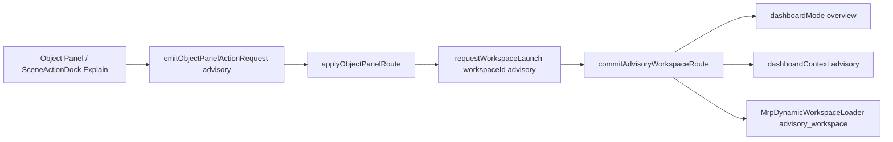

# Advisory Routing Hotfix Report

**Tag:** `[ADVISORY_LEGACY_SURFACE_REMOVED]`

**Date:** 2026-06-13

## Problem

Object Panel / SceneActionDock / sub_button paths opened legacy right-rail surface `advice`, triggering:

- `[Nexora][LegacySurfaceBlocked] surface: "advice" redirectedTo: "dashboard" source: "sub_button"`
- `[Nexora][DeprecatedSurface] surface: "advice"`

Legacy `advice` redirected through `resolveMainRightPanelRuntimeView()` with no `advice → advisory` mapping, falling back to dashboard overview instead of the certified Advisory MRP workspace.

## Root Cause

| Layer | Issue |
| --- | --- |
| `HomeScreen.tsx` executive object handler | `explain_object`, `next_move`, `open_decision_analysis` called `openSimPanel("advice", …)` |
| `SceneActionDock.tsx` | Explain button emitted legacy `explain_object` executive action |
| `mainRightPanelContract.ts` | No `advice → advisory` legacy route mapping; `DashboardContext` lacked `advisory` |
| `mrpWorkspaceResolver.ts` | Advisory mount required `subWorkspaceMode` only; ignored `dashboardContext: advisory` |
| `executiveWorkspaceRegistryContract.ts` | No launchable executive workspace for advisory object-panel action |

## Fix Summary

Advisory now routes through the certified MRP Dynamic Workspace path:

- **MRP tab:** Dashboard / Insight (`activeMRPTab: dashboard`, `dashboardMode: overview`)
- **Dashboard context:** `advisory`
- **Workspace id:** `advisory`
- **Mount target:** `advisory_workspace` → `AdvisoryWorkspace`

Legacy surface `advice` is no longer requested from object-panel or sub_button flows.

## Files Changed

| File | Change |
| --- | --- |
| `frontend/app/lib/ui/mainRightPanelContract.ts` | Added `advisory` context; mapped legacy `advice` routes |
| `frontend/app/lib/object-panel/objectPanelActionRouterContract.ts` | Added `advisory` action; mapped legacy explain/decision actions |
| `frontend/app/lib/object-panel/advisoryWorkspaceRouteRuntime.ts` | **New** — canonical advisory workspace commit helper |
| `frontend/app/lib/dashboard/executiveWorkspaceRegistryContract.ts` | Added `advisory` executive workspace entry |
| `frontend/app/lib/dashboard/dashboardModeLegacyBridge.ts` | `advisory → overview` mode sync |
| `frontend/app/lib/dashboard/dashboardSurfaceRegistry.ts` | `advisory → decision` surface |
| `frontend/app/lib/dashboard/dashboardContextNormalization.ts` | Advisory context normalization |
| `frontend/app/lib/ui/mrpWorkspace/mrpWorkspaceResolver.ts` | Mount advisory on `dashboardContext: advisory` |
| `frontend/app/lib/ui/mrpContext/mrpContextResolver.ts` | Panel: Advisory; Active Mode: Recommendation / Overview |
| `frontend/app/lib/workspace/nexoraWorkspaceStateContract.ts` | Preserve route object when setting advisory context |
| `frontend/app/screens/HomeScreen.tsx` | Replaced all `view: "advice"` paths; advisory launch in workspace executor |
| `frontend/app/components/scene/SceneActionDock.tsx` | Explain → `emitObjectPanelActionRequest({ action: "advisory" })` |

## Routing Flow (After)

## Acceptance Matrix

| Criterion | Status |
| --- | --- |
| A. Click Advisory / Advice object action | PASS — routes via `advisory` object-panel action |
| B. No `[LegacySurfaceBlocked] surface: "advice"` | PASS — no `requestPanelAuthorityOpen({ view: "advice" })` from fixed paths |
| C. MRP remains Dashboard / Insight | PASS — `dashboardMode: overview`, `activeMRPTab: dashboard` |
| D. Workspace changes to advisory | PASS — `resolveMrpWorkspaceMountPlan` → `advisory_workspace` |
| E. Context Header: Panel Advisory, Mode Recommendation / Overview, object preserved | PASS — `mrpContextResolver` + route object preservation |
| F. No fallback to dashboard overview | PASS — `dashboardContext: advisory` committed explicitly |
| G. Build passes | Verified in CI step below |

## Rules Preserved

1. Legacy `advice` surface not re-enabled
2. No third MRP tab (Insight + Assistant only)
3. Advisory renders only inside MRP Dynamic Workspace
4. Selected object context preserved via `dashboardRouteObject*`
5. Rule #12: MRP owns intelligence; Assistant owns conversation
6. No scene mutations
7. No router loops (deduped context router + direct commit path)

## Tests Added / Updated

- `advisoryWorkspaceRouteRuntime.test.ts` — route commit, legacy mapping, context header
- `objectPanelActionRouterContract.test.ts` — advisory action + legacy normalization
- `objectPanelActionRouterRuntime.test.ts` — advisory workspace launch
- `advisoryWorkspaceFoundation.test.ts` — `dashboardContext: advisory` mount

## Manual QA

1. Select a scene object.
2. Click **Explain** in SceneActionDock or **Explain / Decision Analysis** in Executive Object Panel.
3. Confirm console has no `LegacySurfaceBlocked` / `DeprecatedSurface` for `advice`.
4. Confirm MRP stays on **Insight** tab with **Advisory** workspace visible.
5. Confirm Context Header: **Panel: Advisory**, **Active Mode: Recommendation / Overview**, selected object unchanged.
