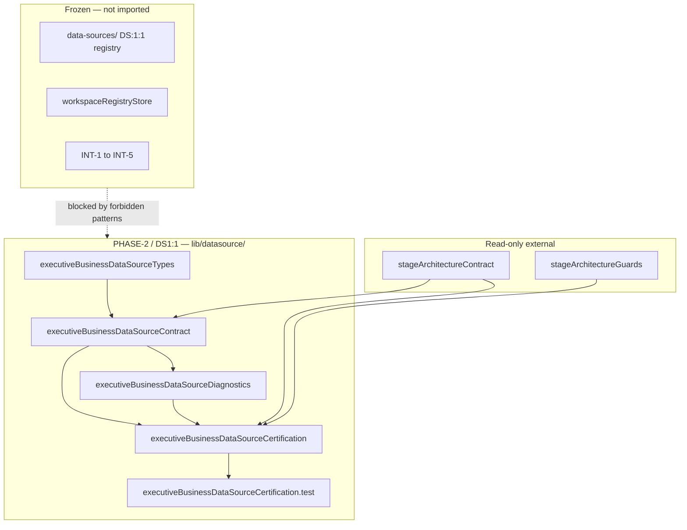

# DS1:1 — Business Data Source Contract
## Stage-2 Build Report

**Project:** Nexora Type-C  
**Phase:** PHASE-2 / DS1:1  
**Stage:** Stage-2 — Build  
**Status:** BUILD COMPLETE — CERTIFIED  
**Date:** 2026-06-22

**Tags:** `[DS11_BUSINESS_CONTRACT]` `[BUSINESS_DATA_SOURCE_DEFINED]` `[WORKSPACE_OWNED_SOURCE]` `[DS12_READY]`

---

## 1. Objective

Implement the **Executive Business Data Source semantic contract** approved during Stage-1 (Option B — PHASE-2 semantic layer above certified DS-1 registry, bridged in DS1:2).

Library-only. No runtime, UI, upload, parsing, synchronization, registry implementation, or business intelligence.

---

## 2. Files Created

| File | Lines | Responsibility |
|------|------:|----------------|
| `frontend/app/lib/datasource/executiveBusinessDataSourceTypes.ts` | 151 | Identity, lifecycle, metadata, security, extension, ownership, certification, and diagnostic types |
| `frontend/app/lib/datasource/executiveBusinessDataSourceContract.ts` | 188 | Version, manifest, categories, lifecycle, forbidden patterns, validation, ownership, examples resolver |
| `frontend/app/lib/datasource/executiveBusinessDataSourceDiagnostics.ts` | 81 | Lifecycle diagnostic events (Created, Updated, Archived, etc.) |
| `frontend/app/lib/datasource/executiveBusinessDataSourceCertification.ts` | 187 | Certification runner, dependency graph, architecture gates |
| `frontend/app/lib/datasource/executiveBusinessDataSourceCertification.test.ts` | 109 | Contract validation, boundary, ownership, diagnostics, certification tests |
| `docs/ds1-1-build-report.md` | — | This report |

**Total module code:** 716 lines across 5 TypeScript files.

---

## 3. Architecture Summary

### Business Data Source definition

A **workspace-scoped semantic record** describing an executive data input:

- `businessDataSourceId` + `workspaceId` (required ownership)
- `displayName`, `description`, `category`, `lifecycleState`
- Declarative `metadata` and `securityProfile`
- Contract version and audit timestamps

### Ownership model

- Every source belongs to exactly one workspace
- `buildExecutiveBusinessDataSourceOwnershipContract()` emits `isolationPolicy: "workspace-exclusive"`
- `validateExecutiveBusinessDataSourceOwnership()` rejects missing or mismatched workspace IDs

### Lifecycle states (8)

`defined` → `registered` → `connected` → `validated` → `active` → `suspended` / `archived` → `removed`

### Business categories (8)

| Category | Example |
|----------|---------|
| `financial` | Financial Ledger Summary |
| `operational` | Operational KPI Feed |
| `sales` | Sales Pipeline Snapshot |
| `marketing` | Marketing Campaign Metrics |
| `manufacturing` | Manufacturing Output Index |
| `human_resources` | HR Capacity Register |
| `supply_chain` | Supply Chain Inventory View |
| `custom` | Custom Executive Source |

Examples resolved via `resolveExecutiveBusinessDataSourceExample(category)`.

### Security classification

`public` | `internal` | `confidential` | `restricted` — with `crossWorkspaceAccess: false` enforced at contract level.

### Extension points

`ExecutiveBusinessDataSourceExtensionPoint`: `connectorProfileId`, `registrySourceId`, `futureExtension` — reserved for DS1:2+ bridge stages.

### Diagnostics events (10)

`BusinessDataSourceCreated`, `Updated`, `Archived`, `Activated`, `Suspended`, `Registered`, `Removed`, `CertificationStarted`, `CertificationPassed`, `CertificationFailed`

---

## 4. Dependency Graph



**Import DAG:** types → contract → diagnostics → certification → test (acyclic).

---

## 5. Regression Analysis

| Risk area | Assessment | Evidence |
|-----------|------------|----------|
| Certified DS-1 registry mutation | **None** | No imports from `data-sources/` |
| Workspace registry mutation | **None** | No `workspaceRegistryStore` import; opaque `workspaceId` string type |
| INT-5 platform impact | **None** | No dashboard/assistant/intelligence imports |
| Scene / MRP / UI impact | **None** | Forbidden patterns block all presentation paths |
| Cross-workspace leakage | **Low** | Ownership validation + `crossWorkspaceAccess: false` |
| Naming collision DS1:1 vs DS:1:1 | **Managed** | Separate path `lib/datasource/` vs `lib/data-sources/`; bridge deferred to DS1:2 |

**Build:** `npm run build` — PASS  
**Tests:** 8/8 — PASS  
**Certification checks:** 13/13 — PASS

---

## 6. Certification Gates

| Gate | Check | Result |
|------|-------|--------|
| A1 | Contract version exported | PASS |
| A2 | Lifecycle states defined (8) | PASS |
| A3 | Business categories defined (8) | PASS |
| B1 | Self manifest validates | PASS |
| B2 | Module files in allowlist | PASS |
| B3 | Forbidden DS runtime blocked | PASS |
| C1 | Dependency boundaries documented (5) | PASS |
| C2 | Dependency graph acyclic | PASS |
| D1 | Category examples validate | PASS |
| D2 | Workspace ownership required | PASS |
| E1 | Diagnostics operational | PASS |
| F1 | Minimum score threshold (95) | PASS |
| F2 | Module file line budget policy active | PASS |

**Certified:** `runExecutiveBusinessDataSourceCertification()` → `certified: true`

---

## 7. Architecture Scores

| Dimension | Score |
|-----------|------:|
| Architecture | 100 |
| Maintainability | 97 |
| Regression Safety | 98 |
| Scalability | 95 |
| Certification Readiness | 100 |
| **Overall** | **98/100** |

**Minimum required:** 95 — **MET**

---

## 8. What Was NOT Implemented (by design)

CSV, Excel, PDF, API, database connectors, upload, import, refresh, synchronization, validation engine, knowledge layer, registry runtime, object creation, relationship detection, and all business logic — deferred to DS1:2+.

---

## 9. Frozen Architecture Compliance

| Rule | Status |
|------|--------|
| Stage Architecture (PHASE-1) followed | ✅ |
| INT-5 freeze respected | ✅ |
| Certified DS modules not modified | ✅ |
| Workspace Core not modified | ✅ |
| Library-only runtime path | ✅ |
| No forbidden module touched | ✅ |

---

## 10. Next Stage

**DS1:1 Stage-3 Analyze** — senior review, freeze recommendation, and registry bridge planning (DS1:2).

**Entry point:**

```typescript
import { runExecutiveBusinessDataSourceCertification } from "./executiveBusinessDataSourceCertification.ts";
```

---

## 11. Verdict

**DS1:1 Stage-2 Build: COMPLETE AND CERTIFIED**

Overall score **98/100**. Ready for Stage-3 Analyze.
