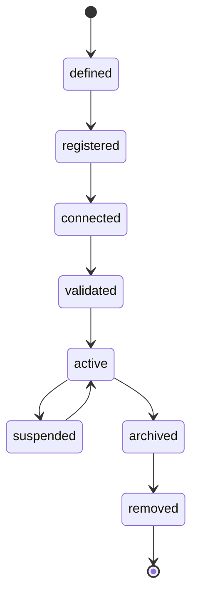
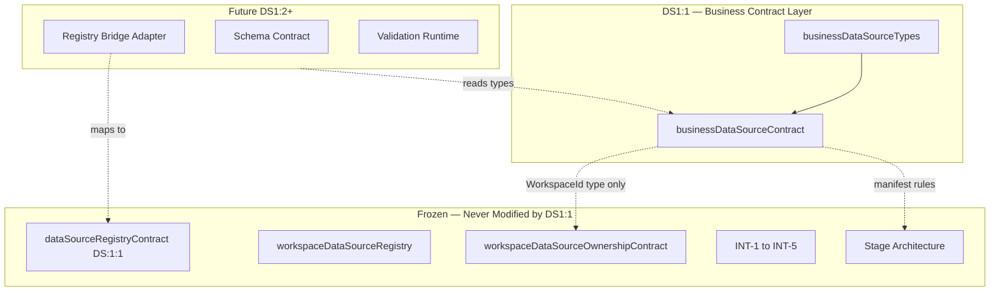

# DS1:1 — Business Data Source Contract
## Stage-1 Understanding Report

**Project:** Nexora Type-C  
**Phase:** PHASE-2 / DS1:1  
**Title:** Business Data Source Contract  
**Stage:** Stage-1 — Understand  
**Status:** UNDERSTANDING COMPLETE — **APPROVAL REQUIRED BEFORE STAGE-2**

**Tags (proposed):** `[DS11_BUSINESS_CONTRACT]` `[BUSINESS_DATA_SOURCE_DEFINED]` `[WORKSPACE_OWNED_SOURCE]` `[DS12_READY]`

---

## 0. Approval Gate — Naming & Layer Position

### Conflict identified (non-blocking for understanding, blocking for Stage-2 without approval)

Nexora already has a **certified DS-1 foundation** using the identifier **DS:1:1**:

| Existing (frozen) | New (proposed) |
|-------------------|----------------|
| `PHASE-1 / DS-1` track | `PHASE-2 / DS1:1` track |
| `frontend/app/lib/data-sources/dataSourceRegistryContract.ts` | `frontend/app/lib/datasource/businessDataSourceContract.ts` |
| Runtime registry (`sourceId`, `registerDataSource()`) | Library-only semantic contract |
| Tag `[DS:1:1_DATA_SOURCE_REGISTRY]` | Tag `[DS11_BUSINESS_CONTRACT]` |

These are **different layers** but share the **DS1:1 label**, which creates documentation and routing ambiguity.

### Recommended resolution (choose one before Stage-2)

| Option | Description |
|--------|-------------|
| **A (Recommended)** | Rename new track to **`DS2:1`** or **`BDS-1:1`** (Business Data Source) while keeping `lib/datasource/` path |
| **B** | Keep `DS1:1` but document as **PHASE-2 semantic layer** that **wraps** certified registry via future adapter — never replaces it |
| **C** | Merge concepts into certified registry ( **REJECTED** — violates forbidden-files rule ) |

**STOP for Stage-2 until option A or B is approved.**

No conflict with INT-5, Stage Architecture, Scene, or Workspace Core **if** the new layer remains library-only in `lib/datasource/` and does not import or mutate certified modules.

---

## 1. Purpose

Define what a **Business Data Source** is in Nexora before any implementation:

- Executive-facing **semantic identity** of a data input belonging to a workspace
- Stable contract for **all future DS modules** (schema, upload, sync, object creation) to reference
- **Not** a registry, parser, sync engine, UI panel, or database layer

This stage answers: *What is the thing? Who owns it? What states can it be in? What boundaries apply?*

---

## 2. Definition — Business Data Source

A **Business Data Source** is a **workspace-scoped, immutable-identified executive input** representing structured or unstructured business data that may later feed object discovery, relationships, KPIs, and intelligence — but **does not itself perform ingestion or analysis**.

### Core identity (contract fields — Stage-2)

| Field | Type | Responsibility |
|-------|------|----------------|
| `businessDataSourceId` | string | Stable unique id within workspace |
| `workspaceId` | WorkspaceId | Owning workspace (required) |
| `displayName` | string | Executive label |
| `description` | string \| null | Optional business context |
| `category` | BusinessDataSourceCategory | Semantic classification |
| `lifecycleState` | BusinessDataSourceLifecycleState | Contract state only |
| `metadata` | BusinessDataSourceMetadata | Declarative metadata bag |
| `securityProfile` | BusinessDataSourceSecurityProfile | Access boundary declaration |
| `contractVersion` | string | Schema version |
| `createdAt` / `updatedAt` | ISO string | Audit timestamps |
| `source` | const | `"phase-2-business-data-source"` |

### What it is NOT

- Not a file parser, CSV reader, or upload handler  
- Not a sync runtime or database connection  
- Not a workspace registry entry or scene object  
- Not an intelligence consumer or DS engine profile  

---

## 3. Ownership Model

```
Workspace (authoritative owner)
        │
        └── Business Data Source (1..N per workspace)
                    │
                    └── Future: registry adapter link (DS1:2+)
                    └── Future: schema profile (DS1:3+)
                    └── Future: object pipeline (DS-1:5+ via adapter)
```

### Rules

1. **Every Business Data Source belongs to exactly one Workspace.**  
2. **No global/orphan sources** — `workspaceId` is required at creation.  
3. **Workspace isolation** — sources in Workspace A are invisible to Workspace B at contract level.  
4. **Ownership verification** is declarative in contract; enforcement delegates to existing `workspaceDataSourceOwnershipContract` at runtime bridge stages — **not modified in DS1:1**.  
5. **Certified registry** (`dataSourceRegistryContract`) remains the **runtime persistence layer**; Business Data Source is the **semantic layer above it** (Option B).

---

## 4. Lifecycle

Contract states only — no transitions implemented in DS1:1.



| State | Meaning |
|-------|---------|
| `defined` | Contract record created, no runtime binding |
| `registered` | Acknowledged in platform, awaiting connection |
| `connected` | Bound to an input channel (future stages) |
| `validated` | Passed contract validation (future) |
| `active` | Available for downstream DS consumption |
| `suspended` | Temporarily unavailable, preserved |
| `archived` | Read-only historical |
| `removed` | Soft-delete contract state |

**Consumers never infer lifecycle** — state is set by authorized DS stages only.

---

## 5. Supported Source Categories

Business-semantic categories (distinct from file-type `DataSourceType` in certified registry):

| Category | Description |
|----------|-------------|
| `operational` | Day-to-day operations data |
| `financial` | Finance / accounting inputs |
| `supply_chain` | Logistics, inventory, suppliers |
| `human_resources` | People, org, capacity |
| `customer` | CRM, accounts, demand |
| `external_api` | Third-party API (future connector) |
| `manual` | Executive manual entry |
| `document` | Unstructured documents (metadata only) |
| `reserved` | Extension placeholder |

**File formats** (`csv`, `excel`, `json`) belong in **metadata / future connector profile**, not as primary category — avoids duplicating certified `DataSourceType`.

---

## 6. Metadata Model

Declarative only — no parsing in DS1:1.

```typescript
// Conceptual — Stage-2 types file
BusinessDataSourceMetadata = {
  businessDomain?: string | null;      // e.g. "logistics"
  tags?: readonly string[];            // executive labels
  recordCountEstimate?: number | null; // optional, not computed here
  columnCountEstimate?: number | null;
  connectorProfileId?: string | null;  // future API connector
  registrySourceId?: string | null;    // future link to DS:1:1 registry
  futureExtension?: Record<string, unknown>;
}
```

---

## 7. Workspace Isolation

| Rule | Enforcement layer |
|------|-------------------|
| `workspaceId` required | Contract validation (DS1:1) |
| Cross-workspace read forbidden | Contract + future guards |
| Active workspace context | Future runtime bridge — not DS1:1 |
| Certified isolation guard | Existing `workspaceDataSourceIsolationGuard` — **read-only reference, not modified** |

---

## 8. Dependency Rules

### Internal (DS1:1 Stage-2)

```
businessDataSourceTypes.ts
        ↑
businessDataSourceContract.ts
```

### External (reference only — Stage-2 may import types, not stores)

| Dependency | Class | Usage |
|------------|-------|-------|
| `WorkspaceId` | external | Type reference from `workspaceRegistryContract.ts` |
| Stage Architecture | external | Manifest validation via stage guards |
| Certified DS-1 registry | external | Documented bridge target — **no import in DS1:1** |
| INT-5 platform | external | No direct relationship |

### Future consumers

| Consumer | Relationship |
|----------|--------------|
| DS1:2 Registry Bridge | Maps `BusinessDataSource` ↔ `DataSourceRegistryEntry` |
| DS1:3 Schema Contract | Reads `businessDataSourceId` |
| DS-1:5 Object Pipeline | Via adapter — never direct contract mutation |
| UI / Input Center | Read-only display of contract fields |
| INT / Dashboard | Never import business datasource directly |

### Forbidden imports (DS1:1)

- `data-sources/*` runtime  
- `workspaceRegistryStore`  
- `workspaceDataSourceRegistry`  
- All INT modules  
- Scene, MRP, Dashboard, Assistant runtime  

---

## 9. Validation Boundary

DS1:1 validation is **contract-shape only**:

| Validates | Does NOT validate |
|-----------|-------------------|
| Required fields present | File contents |
| `workspaceId` non-empty | CSV structure |
| Category ∈ allowed set | Database connectivity |
| Lifecycle ∈ allowed states | Sync success |
| ISO timestamp format | Object creation eligibility |
| Metadata JSON-serializable | Executive intelligence routing |

Validation functions live in contract file (Stage-2) — pure functions, no I/O.

---

## 10. Security Boundary

| Boundary | Rule |
|----------|------|
| Scope | Workspace-scoped identity only |
| Cross-tenant | Forbidden at contract level |
| PII handling | Declared in `securityProfile.classification` — not enforced here |
| Direct DS access | Presentation layers must not import DS engines (INT-5 rule) |
| Mutation | Only authorized DS stages may transition lifecycle |

```typescript
// Conceptual
BusinessDataSourceSecurityProfile = {
  classification: "public" | "internal" | "confidential" | "restricted";
  crossWorkspaceAccess: false;  // always false in v1
}
```

---

## 11. Extension Model

| Extension point | Purpose |
|-----------------|---------|
| `metadata.futureExtension` | Arbitrary forward-compatible fields |
| `category: "reserved"` | New categories without breaking contract |
| `connectorProfileId` | Future API/database connectors |
| `registrySourceId` | Link to certified registry without merging models |
| Contract version bump | `DS2:1`, `DS2:2` additive fields |

**Frozen after DS1:3 certification** (proposed) — changes require new architecture phase.

---

## 12. Future Compatibility

| Track | How DS1:1 connects |
|-------|-------------------|
| **DS Phase 2 modules** | Import contract types; implement bridges |
| **Certified DS-1** | Adapter maps semantic → registry — no registry rewrite |
| **DS-2..DS-8 engines** | Consume workspace objects derived from sources — not raw contract |
| **INT-1..INT-5** | No direct import; intelligence via dashboard runtime |
| **APP / UI** | Read-only binding to contract + normalized summaries |
| **MRP** | Display counts/metadata only |

---

## 13. Dependency Map



---

## 14. Risk Analysis

| Risk | Likelihood | Impact | Mitigation |
|------|:----------:|:------:|------------|
| DS1:1 vs DS:1:1 naming collision | High | High | Approve Option A or B before Stage-2 |
| Duplicate registry models | Medium | High | Semantic vs runtime separation; adapter only |
| Accidental import of certified runtime | Low | Critical | Stage guards + forbidden import list |
| WorkspaceId coupling | Low | Medium | Type-only import from contract file |
| Category drift vs DataSourceType | Medium | Low | Document mapping table in DS1:2 |
| Contract bloat before use | Low | Medium | Keep DS1:1 under 150 lines per file |

---

## 15. Expected File List

### Stage-1 (this stage)

| File | Status |
|------|--------|
| `docs/ds1-1-understanding-report.md` | Created |

### Stage-2 (Build — after approval)

| File | Est. lines | Responsibility |
|------|----------:|----------------|
| `businessDataSourceTypes.ts` | ~90 | Categories, lifecycle, metadata, security types |
| `businessDataSourceContract.ts` | ~120 | Version, tags, validation, normalization |

### Stage-3 (Analyze)

| File | Responsibility |
|------|----------------|
| `docs/ds1-1-analysis-report.md` | Senior review + freeze recommendation |

### Future (not DS1:1)

| File | Phase |
|------|-------|
| `businessDataSourceGuards.ts` | DS1:2 |
| `businessDataSourceDiagnostics.ts` | DS1:2 |
| `businessDataSourceRegistryBridge.ts` | DS1:2 |
| `businessDataSourceCertification.ts` | DS1:3 |

---

## 16. Certification Strategy

### DS1:1 Stage-3 gates (proposed)

| Gate | Validation |
|------|------------|
| A | Contract version and tags exported |
| B | Lifecycle states defined (8 states) |
| C | Categories defined (9 categories) |
| D | Workspace ownership required on manifest |
| E | No imports from `data-sources/`, workspace stores, INT |
| F | Validation rejects missing workspaceId |
| G | Stage manifest passes `validateStageManifest()` |
| H | TypeScript build passes |
| I | Tests pass (contract validation only) |
| J | No file exceeds 150 lines |

### Prerequisites

- `[STAGE_ARCHITECTURE_FROZEN]`  
- `[PHASE_1_COMPLETE]`  
- Approval of naming/layer position (Section 0)

---

## 17. Stage Readiness Report

### Prerequisites

| Prerequisite | Status |
|--------------|--------|
| Stage Architecture frozen | ✅ |
| INT-5 frozen | ✅ |
| DS-1 foundation certified | ✅ (coexists — adapter required) |
| No certified module mutation in Stage-1 | ✅ (documentation only) |

### Scores

| Dimension | Score | Notes |
|-----------|------:|-------|
| Architecture Understanding | 93 | Clear semantic layer; naming collision pending approval |
| Complexity | 20 | Two small contract files planned |
| Regression Risk | 15 | Isolated path; zero runtime touch in Stage-1 |
| Maintainability | 94 | SRP, lightweight files |
| Scalability | 92 | Extension model + adapter pattern |
| Certification Readiness | 88 | Strategy defined; gates pending Stage-2 build |
| **Overall (weighted)** | **91/100** | Stage-1 understanding target met |

Stage-2 implementation target: **≥ 95/100** after build + analyze.

---

## 18. Stage Contract Proposal (Stage-2 manifest preview)

```typescript
// For validateStageManifest() in Stage-2
{
  stageId: "PHASE-2/DS1:1",
  title: "Business Data Source Contract",
  goal: "Library-only semantic contract for workspace-owned business data sources.",
  lifecycle: "build",
  allowedFiles: [
    "frontend/app/lib/datasource/businessDataSourceTypes.ts",
    "frontend/app/lib/datasource/businessDataSourceContract.ts",
  ],
  forbiddenPatterns: [
    ...STAGE_GLOBAL_FORBIDDEN_PATTERNS,
    "data-sources/",
    "workspaceRegistryStore",
    "workspaceDataSourceRegistry",
  ],
  prerequisites: ["STAGE-ARCH-3", "INT-5"],
  runtimePath: "library-only",
  tags: ["[DS11_BUSINESS_CONTRACT]", "[DS12_READY]"],
}
```

---

## 19. Verdict

**Stage-1 Understanding: COMPLETE**

**Stage-2 Build: BLOCKED pending approval of Section 0** (naming/layer position vs certified `DS:1:1` registry).

Reply with:
- **Option A** — rename to `DS2:1` / `BDS-1:1`, or  
- **Option B** — keep `DS1:1` as PHASE-2 semantic layer with registry adapter in DS1:2  

Then proceed to **DS1:1 Stage-2 Build**.
