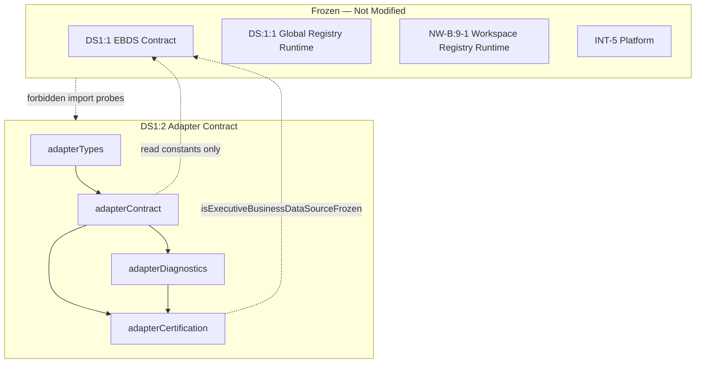

# DS1:2 — Workspace Data Source Registry Adapter
## Stage-2 Build Report

**Project:** Nexora Type-C  
**Phase:** PHASE-2 / DS1:2  
**Stage:** Stage-2 — Build  
**Status:** BUILD COMPLETE — CERTIFIED  
**Date:** 2026-06-22

**Tags:** `[DS12_REGISTRY_ADAPTER]` `[WORKSPACE_REGISTRY_BRIDGE]` `[EBDS_RUNTIME_LINK]` `[DS13_READY]`

---

## 1. Objective

Implement the **Workspace Data Source Registry Adapter** contract layer — the architectural bridge between:

- **Executive Business Data Source** (DS1:1 frozen semantic contract)
- **Workspace Data Source Registry** (NW-B:9-1 runtime)
- **Certified Global Data Source Registry** (DS:1:1 runtime)

Library-only. No runtime synchronization, UI, upload, parsing, or registry mutation.

---

## 2. Files Created

| File | Lines | Responsibility |
|------|------:|----------------|
| `workspaceDataSourceRegistryAdapterTypes.ts` | 166 | Link record, lifecycle, sync profile, security, mapping, certification, diagnostic types |
| `workspaceDataSourceRegistryAdapterContract.ts` | 368 | Version, manifest, mapping tables, ownership, registry reference, sync boundaries, validation |
| `workspaceDataSourceRegistryAdapterDiagnostics.ts` | 81 | 11 lifecycle diagnostic events |
| `workspaceDataSourceRegistryAdapterCertification.ts` | 216 | 15-gate certification runner |
| `workspaceDataSourceRegistryAdapterCertification.test.ts` | 138 | 10 architecture and boundary tests |
| `docs/ds1-2-build-report.md` | — | This report |

**Total module code:** 969 lines across 5 TypeScript files.

**Frozen modules modified:** **0**

---

## 3. Architecture Summary

### Adapter link record

Connects EBDS semantic identity to runtime registry references:

- `adapterLinkId`, `workspaceId`, `businessDataSourceId` (required)
- `workspaceDataSourceId` → NW-B:9-1 (nullable until linked)
- `registrySourceId` → DS:1:1 global (nullable, optional)
- `adapterState` — 7 contract lifecycle states
- `syncProfile` — declarative sync boundaries
- `securityProfile` — workspace-exclusive, adapter-context-only global access

### Contracts implemented

| Contract | Function |
|----------|----------|
| **Adapter Link** | `WorkspaceRegistryAdapterLinkRecord` |
| **Mapping** | `buildExecutiveToWorkspaceMappingPlan()`, `buildExecutiveToGlobalMappingPlan()` |
| **Ownership** | `buildWorkspaceRegistryAdapterOwnershipContract()`, `validateWorkspaceRegistryAdapterOwnership()` |
| **Registry Reference** | `buildWorkspaceRegistryReferenceContract()` — `globalRegistryWorkspaceContext: "adapter-link-only"` |
| **Sync Boundary** | `WORKSPACE_REGISTRY_ADAPTER_DEFAULT_SYNC_PROFILE`, `WORKSPACE_REGISTRY_ADAPTER_FORBIDDEN_SYNC_FIELDS` |
| **Security** | `WORKSPACE_REGISTRY_ADAPTER_DEFAULT_SECURITY_PROFILE` |
| **Extension** | `metadata.extension.syncProfileId`, `connectorProfileId`, `futureExtension` |

### Mapping diagram

```
ExecutiveBusinessDataSource (DS1:1)
        │
        ▼
WorkspaceRegistryAdapterLink (DS1:2 NEW)
        │
        ├── workspaceDataSourceId ──→ WorkspaceDataSource (NW-B:9-1)
        └── registrySourceId ───────→ DataSourceRegistryEntry (DS:1:1)
              ▲
              └── workspaceId context ONLY in adapter link
```

---

## 4. Dependency Graph



**Import DAG:** types → contract → diagnostics → certification → test (acyclic).

---

## 5. Regression Analysis

| Risk area | Assessment | Evidence |
|-----------|------------|----------|
| EBDS contract mutation | **None** | Read-only import of categories/lifecycle constants |
| Workspace registry mutation | **None** | No import of `workspaceDataSourceRegistry.ts` |
| Global registry mutation | **None** | No import of `dataSourceRegistryRuntime.ts` |
| Cross-workspace global leak | **Prevented** | `adapter-link-only` context enforced (gate D3) |
| INT / Scene / UI impact | **None** | Forbidden patterns block all presentation paths |
| DS1:1 freeze bypass | **Prevented** | Gate C2 verifies `isExecutiveBusinessDataSourceFrozen()` |

**Build:** `npm run build` — PASS  
**Tests:** 10/10 — PASS  
**Certification gates:** 15/15 — PASS

---

## 6. Certification Gates

| Gate | Check | Result |
|------|-------|--------|
| A1 | Adapter contract version exported | PASS |
| A2 | Adapter lifecycle states defined (7) | PASS |
| A3 | Mapping coverage documented (8 categories) | PASS |
| B1 | Self manifest validates | PASS |
| B2 | Module files in allowlist | PASS |
| B3 | Forbidden registry runtime blocked (6 probes) | PASS |
| C1 | Dependency graph acyclic | PASS |
| C2 | EBDS contract frozen | PASS |
| D1 | Category link examples validate | PASS |
| D2 | Workspace ownership required | PASS |
| D3 | Global registry workspace context locked | PASS |
| E1 | Lifecycle mapping operational | PASS |
| E2 | Sync boundary contract valid | PASS |
| F1 | Diagnostics operational | PASS |
| F2 | Minimum score threshold (95) | PASS |

**Certified:** `runWorkspaceRegistryAdapterCertification()` → `certified: true`

---

## 7. Architecture Scores

| Dimension | Score |
|-----------|------:|
| Architecture | 100 |
| Maintainability | 97 |
| Regression Safety | 98 |
| Scalability | 95 |
| Certification Readiness | 100 |
| **Overall** | **98/100** |

**Minimum required:** 95 — **MET**

---

## 8. What Was NOT Implemented (by design)

Synchronization engine, background jobs, polling, refresh, upload, parsing, validation engine, schema detection, object generation, intelligence generation, registry runtime calls — deferred to DS1:2 Stage-3+ bridge runtime.

---

## 9. Diagnostics Events (11)

`LinkCreated`, `LinkUpdated`, `LinkRemoved`, `LinkValidated`, `SyncPending`, `SyncCompleted`, `DriftDetected`, `RelinkingStarted`, `CertificationStarted`, `CertificationPassed`, `CertificationFailed`

---

## 10. Entry Point

```typescript
import { runWorkspaceRegistryAdapterCertification } from "./workspaceDataSourceRegistryAdapterCertification.ts";
```

---

## 11. Verdict

**DS1:2 Stage-2 Build: COMPLETE AND CERTIFIED**

Overall score **98/100**. Ready for **DS1:2 Stage-3 Analyze**.

No frozen modules were modified.
