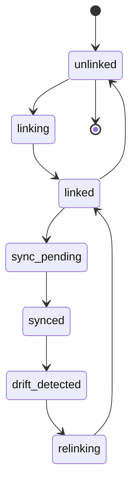
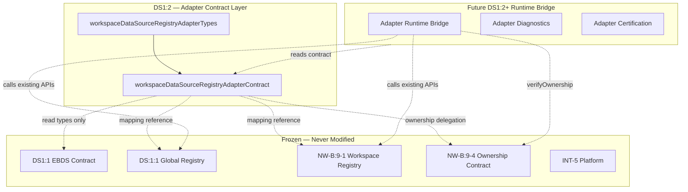

# DS1:2 — Workspace Data Source Registry
## Stage-1 Understanding Report

**Project:** Nexora Type-C  
**Phase:** PHASE-2 / DS1:2  
**Title:** Workspace Data Source Registry Adapter  
**Stage:** Stage-1 — Understand  
**Status:** UNDERSTANDING COMPLETE — **READY FOR STAGE-2 BUILD**

**Tags (proposed):** `[DS12_REGISTRY_ADAPTER]` `[WORKSPACE_REGISTRY_BRIDGE]` `[EBDS_RUNTIME_LINK]` `[DS13_READY]`

---

## 0. Executive Summary

DS1:2 defines a **library-only Workspace Registry Adapter** that connects the frozen **Executive Business Data Source (EBDS) semantic contract** (DS1:1) to Nexora's **existing certified runtime registries** without modifying any frozen module.

The adapter is **not** a new registry runtime. It is an **architecture contract** describing how semantic business sources map to workspace-scoped and global runtime entries, what may synchronize, and what boundaries apply.

**Frozen module modification required:** **NO**  
**STOP triggered:** **NO**  
**Stage-2 Build:** **APPROVED** (additive adapter files only)

---

## 1. Problem Statement

Nexora currently has **three distinct data-source layers** that must coexist:

| Layer | Location | Scope | Role |
|-------|----------|-------|------|
| **EBDS Semantic Contract** | `lib/datasource/executiveBusinessDataSource*` | Workspace-scoped (semantic) | What the business source *means* |
| **Workspace Data Source Registry** | `lib/workspace/workspaceDataSourceRegistry` | Workspace-scoped (runtime) | How workspace stores connected inputs |
| **DS:1:1 Global Registry** | `lib/data-sources/dataSourceRegistry*` | Global (runtime) | Certified DS-1 foundation persistence |

DS1:1 defined semantic identity and reserved `metadata.extension.registrySourceId` for a future bridge. DS1:2 defines **how that bridge works** — as adapter architecture only.

---

## 2. Definition — Workspace Registry Adapter

The **Workspace Registry Adapter** is a **declarative mapping and boundary contract** that:

1. Links an `ExecutiveBusinessDataSourceRecord` to a workspace runtime `WorkspaceDataSource`
2. Optionally links the same EBDS record to a global `DataSourceRegistryEntry` via `registrySourceId`
3. Enforces workspace ownership through existing NW-B:9-4 ownership rules
4. Defines synchronization **boundaries** (not synchronization **implementation**)
5. Never mutates frozen contract or registry modules

### Adapter link identity (Stage-2 types preview)

| Field | Responsibility |
|-------|----------------|
| `adapterLinkId` | Stable adapter record id |
| `workspaceId` | Owning workspace (required) |
| `businessDataSourceId` | EBDS semantic id (required) |
| `workspaceDataSourceId` | Bound workspace registry id (nullable until linked) |
| `registrySourceId` | Bound DS:1:1 global source id (nullable, optional) |
| `adapterState` | Adapter lifecycle state (contract only) |
| `syncProfile` | Declarative sync boundary profile |
| `contractVersion` | Adapter schema version |
| `createdAt` / `updatedAt` | Audit timestamps |

---

## 3. Mapping Architecture

### 3.1 Primary mapping: EBDS → Workspace Registry

```
ExecutiveBusinessDataSourceRecord          WorkspaceDataSource (NW-B:9-1)
─────────────────────────────────          ─────────────────────────────────
businessDataSourceId                  ←→    dataSourceId (via adapter link)
workspaceId                           ←→    workspaceId
displayName                           ←→    name
category (semantic)                   →     type (connector hint only)
lifecycleState                        →     status (mapped)
metadata.recordCountEstimate          ←     metadata.rowCount
metadata.columnCountEstimate          ←     metadata.columnCount
metadata.tags                         →     (adapter metadata overlay)
description                           →     (adapter metadata overlay)
```

### 3.2 Secondary mapping: EBDS → DS:1:1 Global Registry

```
ExecutiveBusinessDataSourceRecord          DataSourceRegistryEntry (DS:1:1)
─────────────────────────────────          ─────────────────────────────────
metadata.extension.registrySourceId   ←→    sourceId
displayName                           →     sourceName
lifecycleState                        →     sourceStatus (mapped)
metadata.recordCountEstimate          →     recordCount
(category — no direct field)          →     sourceType (connector hint only)
```

**Critical constraint:** DS:1:1 registry entries have **no workspaceId**. Workspace context for global registry bindings is carried **only in the adapter link record**, never inferred from the global registry alone.

### 3.3 Category → runtime type hints (declarative, not automatic)

| EBDS Category | Workspace Type Hint | DS:1:1 Type Hint |
|---------------|--------------------|--------------------|
| `financial` | `excel` or `database` | `excel` or `json` |
| `operational` | `csv` or `api` | `csv` or `json` |
| `sales` | `csv` or `api` | `csv` |
| `marketing` | `csv` or `api` | `csv` |
| `manufacturing` | `csv` or `database` | `csv` |
| `human_resources` | `excel` or `database` | `excel` |
| `supply_chain` | `csv` or `api` | `csv` |
| `custom` | `csv` (default hint) | `manual_entry` |

Hints are **adapter defaults for future connector stages** — DS1:2 does not perform type assignment or file parsing.

### 3.4 Lifecycle → runtime status mapping

**EBDS → Workspace status (NW-B:9-1):**

| EBDS Lifecycle | Workspace Status | Notes |
|----------------|------------------|-------|
| `defined` | `empty` | Semantic only, no runtime binding |
| `registered` | `empty` | Acknowledged, awaiting connection |
| `connected` | `connected` | Runtime binding established |
| `validated` | `connected` | Passed validation (future stage) |
| `active` | `connected` | Available for downstream use |
| `suspended` | `connected` | Runtime preserved; adapter marks inactive |
| `archived` | `connected` | Read-only; adapter overlay only |
| `removed` | — | Adapter unlinks; does not mandate runtime delete |

**EBDS → DS:1:1 status:**

| EBDS Lifecycle | DS:1:1 Status |
|----------------|---------------|
| `defined`, `registered` | `registered` |
| `connected`, `validated` | `registered` |
| `active` | `active` |
| `suspended`, `archived` | `inactive` |
| `removed` | — (unlink only) |

Lifecycle transitions remain **declarative** in DS1:2. No transition engine in adapter contract.

---

## 4. Ownership Rules

### 4.1 Authority chain

```
Workspace (authoritative owner)
    └── Executive Business Data Source (DS1:1 semantic)
            └── Adapter Link (DS1:2)
                    ├── Workspace Data Source (NW-B:9-1 runtime)
                    └── DS:1:1 Registry Entry (optional global mirror)
```

### 4.2 Rules

1. **Adapter link inherits workspace ownership** from EBDS `workspaceId` — no orphan links.
2. **One adapter link per (workspaceId, businessDataSourceId)** — unique composite key.
3. **Runtime mutations** must satisfy `verifyWorkspaceDataSourceOwnership()` (NW-B:9-4) — adapter delegates, does not replace.
4. **Cross-workspace binding forbidden** — adapter rejects `workspaceId` mismatch between EBDS and workspace registry target.
5. **Global registrySourceId scoped by adapter** — same `sourceId` must not be shared across workspaces without explicit architecture phase (default: forbidden).
6. **EBDS contract files are read-only** — adapter imports types only; never mutates DS1:1 frozen files.

---

## 5. Workspace Isolation

| Rule | Enforcement |
|------|-------------|
| All adapter links require `workspaceId` | Contract validation (DS1:2) |
| Workspace A links invisible to Workspace B | Adapter link queries scoped by workspace |
| Global registry reads require adapter context | Never infer workspace from DS:1:1 entry alone |
| NW-B:9-4 ownership guard | Runtime bridge (DS1:2 Stage-3+) calls existing guard |
| EBDS `crossWorkspaceAccess: false` | Preserved; adapter never overrides |

---

## 6. Adapter Lifecycle

Contract states only — no implementation in DS1:2 Stage-1/2 contract layer.



| State | Meaning |
|-------|---------|
| `unlinked` | EBDS exists; no runtime binding |
| `linking` | Adapter resolving workspace/global targets |
| `linked` | Both ids bound in adapter record |
| `sync_pending` | Metadata sync requested (future runtime) |
| `synced` | Declarative fields aligned per sync profile |
| `drift_detected` | Semantic vs runtime mismatch flagged |
| `relinking` | Re-binding after drift or registry change |

---

## 7. Registry Synchronization Boundaries

DS1:2 defines **what may sync** — not **how** or **when**.

### Allowed sync directions

| Direction | Fields | Purpose |
|-----------|--------|---------|
| EBDS → Workspace runtime | `displayName` → `name` | Label alignment |
| EBDS → DS:1:1 | `displayName` → `sourceName` | Label alignment |
| Workspace runtime → EBDS | `rowCount` → `recordCountEstimate` | Declarative estimate |
| Workspace runtime → EBDS | `columnCount` → `columnCountEstimate` | Declarative estimate |
| Adapter overlay → both | `tags`, `description` | Executive metadata |

### Forbidden sync (never in adapter)

| Field / Behavior | Reason |
|------------------|--------|
| File contents (`csvText`, parsed rows) | Parsing belongs to DS1:3+ |
| Schema definitions | Schema contract is DS1:3 |
| Object IDs / mappings | DS-1:4+ certified pipeline |
| Intelligence outputs | INT-5 freeze |
| Lifecycle auto-inference | Explicit adapter operations only |
| Bidirectional silent sync | Requires explicit sync profile + future runtime |

### Sync profile (declarative)

```typescript
// Conceptual — Stage-2 types file
WorkspaceDataSourceRegistrySyncProfile = {
  allowLabelSync: true;
  allowEstimateSync: true;
  allowStatusMirror: false;  // status mapping is explicit, not automatic
  allowGlobalRegistryMirror: boolean;
}
```

---

## 8. Registry Metadata

### Adapter metadata overlay (new in DS1:2)

| Field | Purpose |
|-------|---------|
| `lastLinkedAt` | When runtime binding established |
| `lastSyncedAt` | Last declarative sync (future) |
| `driftReason` | Why drift_detected (future) |
| `syncProfileId` | Reference to sync boundary profile |
| `connectorHint` | Category-derived type hint |
| `futureExtension` | Forward-compatible fields |

### Registry metadata boundaries

- **Workspace registry metadata** (`fileName`, `fileSize`, `rowCount`) — owned by NW-B:9-1 runtime; adapter reads estimates only.
- **Global registry metadata** (`recordCount`, `lastSyncAt`) — owned by DS:1:1; adapter reads via existing entry shape.
- **EBDS metadata** — owned by DS1:1 semantic contract; adapter writes estimates only through future authorized bridge.

---

## 9. Extension Points

| Extension | Purpose | Phase |
|-----------|---------|-------|
| `metadata.extension.registrySourceId` | DS:1:1 global link (reserved DS1:1) | DS1:2 contract |
| `adapterLink.workspaceDataSourceId` | Workspace runtime link | DS1:2 contract |
| `syncProfileId` | Configurable sync boundaries | DS1:2 contract |
| `connectorProfileId` | Future API/database connector | DS1:3+ |
| `metadata.futureExtension` | Arbitrary forward fields | DS1:1 (frozen, read-only) |
| `adapterMetadata.futureExtension` | Adapter-specific extensions | DS1:2 contract |

---

## 10. Dependency Rules

### Internal (DS1:2 Stage-2)

```
workspaceDataSourceRegistryAdapterTypes.ts
        ↑
workspaceDataSourceRegistryAdapterContract.ts
```

### External (read-only reference — types/shapes only in contract)

| Dependency | Class | Usage |
|------------|-------|-------|
| DS1:1 EBDS types | external read-only | Import semantic record shapes |
| DS:1:1 registry contract | external read-only | Reference `DataSourceRegistryEntry` field names in mapping docs/types |
| NW-B:9-1 workspace registry | external read-only | Reference `WorkspaceDataSource` shape in mapping |
| NW-B:9-4 ownership contract | external read-only | Document delegation to `verifyWorkspaceDataSourceOwnership` |
| Stage Architecture | external read-only | Manifest validation via stage guards |

### Forbidden imports (DS1:2 contract layer)

- `executiveBusinessDataSourceContract.ts` mutation — **file frozen; import types only**
- `dataSourceRegistryRuntime.ts` — no runtime calls in contract layer
- `workspaceDataSourceRegistry.ts` — no runtime calls in contract layer
- `workspaceRegistryStore.ts` — Workspace Core frozen
- All INT, Scene, Dashboard, Assistant, MRP modules

### Future runtime bridge (DS1:2 Stage-3+, separate allowed files)

May **call** existing `registerDataSource()`, `registerWorkspaceDataSource()` APIs without modifying their source files.

---

## 11. Future Compatibility

| Consumer | Relationship |
|----------|--------------|
| **Business Knowledge Layer** | Reads EBDS semantic metadata + adapter overlay; never reads raw files |
| **Input Center** | Creates EBDS record → adapter links → workspace registry; read-only EBDS display |
| **Wizard** | Guides link establishment; uses adapter lifecycle states |
| **Status Engine** | Consumes adapter `adapterState` + mapped runtime statuses for executive display |
| **DS1:3 Schema Contract** | Reads `businessDataSourceId` via adapter link |
| **DS-1:5 Object Pipeline** | Uses `registrySourceId` when global mirror enabled |

---

## 12. Dependency Map



---

## 13. Risk Analysis

| Risk | Likelihood | Impact | Mitigation |
|------|:----------:|:------:|------------|
| Three-registry confusion | High | High | Adapter link as single mapping authority |
| Global registry workspace leak | Medium | Critical | workspaceId only in adapter link; never infer from DS:1:1 |
| Frozen EBDS mutation pressure | Low | Critical | Types-only import; separate adapter files |
| Duplicate runtime entries | Medium | Medium | Unique (workspaceId, businessDataSourceId) adapter key |
| Status mapping drift | Medium | Low | Explicit mapping tables; drift_detected state |
| Sync scope creep | Medium | High | Sync profile with forbidden field list |
| Naming collision DS1:2 vs DS:1:2 | Medium | Medium | PHASE-2 DS1:2 vs PHASE-1 DS:1:2 (upload) — document track separation |

### PHASE-1 DS:1:2 naming note

Certified **DS:1:2** in PHASE-1 refers to **File Upload Runtime**. **PHASE-2 DS1:2** refers to **Workspace Registry Adapter**. Different tracks, same numeric label — document explicitly in all DS1:2 artifacts.

---

## 14. Frozen Module Modification Verification

| Module | Modification Required? | Verdict |
|--------|:--------------------:|---------|
| DS1:1 EBDS contract files | NO | Read-only type import |
| DS:1:1 `dataSourceRegistryContract/Runtime` | NO | Call existing APIs from future bridge |
| NW-B:9-1 `workspaceDataSourceRegistry` | NO | Call existing APIs from future bridge |
| NW-B:9-4 `workspaceDataSourceOwnershipContract` | NO | Delegate verification |
| Workspace Core / registry store | NO | Opaque workspaceId string |
| INT-5 platform | NO | No relationship |
| Scene / MRP / Dashboard | NO | Forbidden |

**STOP not required.** Adapter design is fully additive.

---

## 15. Expected File List

### Stage-1 (this stage)

| File | Status |
|------|--------|
| `docs/ds1-2-understanding-report.md` | Created |

### Stage-2 (Build — contract only)

| File | Est. lines | Responsibility |
|------|----------:|----------------|
| `workspaceDataSourceRegistryAdapterTypes.ts` | ~110 | Link record, lifecycle, sync profile, mapping types |
| `workspaceDataSourceRegistryAdapterContract.ts` | ~140 | Version, manifest, mapping tables, validation, boundaries |

### Stage-3 (Analyze + bridge runtime — future phase)

| File | Responsibility |
|------|----------------|
| `workspaceDataSourceRegistryAdapterDiagnostics.ts` | Link/sync diagnostic events |
| `workspaceDataSourceRegistryAdapterBridge.ts` | Calls existing registry APIs (new file, not mutation) |
| `workspaceDataSourceRegistryAdapterCertification.ts` | Certification + freeze |
| `workspaceDataSourceRegistryAdapterCertification.test.ts` | Tests |
| `docs/ds1-2-analysis-report.md` | Senior review |
| `docs/ds1-2-freeze-report.md` | Freeze declaration |

---

## 16. Certification Strategy

### DS1:2 Stage-3 gates (proposed)

| Gate | Validation |
|------|------------|
| A | Adapter contract version and tags exported |
| B | Mapping tables defined (EBDS → workspace + global) |
| C | Adapter lifecycle states defined (7 states) |
| D | Sync boundary profile defined with forbidden fields |
| E | Workspace ownership required on adapter link |
| F | No imports from registry runtime or workspace store |
| G | EBDS frozen files not modified (import types only) |
| H | Stage manifest passes `validateStageManifest()` |
| I | TypeScript build passes |
| J | Tests pass |
| K | DS1:1 freeze respected (`isExecutiveBusinessDataSourceFrozen()`) |

### Prerequisites

- `[EXECUTIVE_BUSINESS_DATASOURCE_CONTRACT_FROZEN]`
- `[STAGE_ARCHITECTURE_FROZEN]`
- `[INT5_COMPLETE]`

---

## 17. Stage Readiness Report

### Prerequisites

| Prerequisite | Status |
|--------------|--------|
| DS1:1 frozen | ✅ |
| Stage Architecture frozen | ✅ |
| INT-5 frozen | ✅ |
| DS-1 foundation certified | ✅ |
| No frozen module mutation required | ✅ |
| Stage-1 documentation only | ✅ |

### Scores

| Dimension | Score | Notes |
|-----------|------:|-------|
| Architecture Understanding | 94 | Three-registry model documented; naming collision noted |
| Complexity | 28 | Two contract files + future bridge |
| Regression Risk | 12 | Additive only; zero runtime touch in Stage-1 |
| Maintainability | 93 | Clear adapter link as mapping authority |
| Scalability | 92 | Extension model + optional global mirror |
| Certification Readiness | 90 | Strategy defined; gates pending Stage-2 build |
| **Overall (weighted)** | **92/100** | Stage-1 understanding target met |

Stage-2 implementation target: **≥ 95/100**

---

## 18. Stage Contract Proposal (Stage-2 manifest preview)

```typescript
{
  stageId: "PHASE-2/DS1:2",
  title: "Workspace Data Source Registry Adapter",
  goal: "Library-only adapter contract linking EBDS semantic records to certified runtime registries.",
  lifecycle: "build",
  allowedFiles: [
    "frontend/app/lib/datasource/workspaceDataSourceRegistryAdapterTypes.ts",
    "frontend/app/lib/datasource/workspaceDataSourceRegistryAdapterContract.ts",
  ],
  forbiddenPatterns: [
    ...STAGE_GLOBAL_FORBIDDEN_PATTERNS,
    "dataSourceRegistryRuntime",
    "workspaceDataSourceRegistry.ts",
    "workspaceRegistryStore",
  ],
  prerequisites: ["DS1:1", "STAGE-ARCH-3", "INT-5"],
  runtimePath: "library-only",
  tags: ["[DS12_REGISTRY_ADAPTER]", "[DS13_READY]"],
}
```

---

## 19. Verdict

**Stage-1 Understanding: COMPLETE**

**Frozen module modification: NOT REQUIRED**

**Stage-2 Build: APPROVED**

Proceed to **DS1:2 Stage-2 Build** — implement `workspaceDataSourceRegistryAdapterTypes.ts` and `workspaceDataSourceRegistryAdapterContract.ts` only.

No STOP. No approval gate blocking Stage-2.
