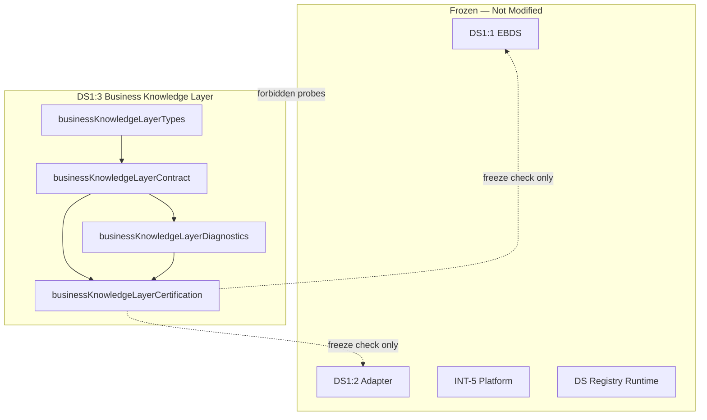

# DS1:3 — Business Knowledge Layer
## Stage-2 Build Report

**Project:** Nexora Type-C  
**Phase:** PHASE-2 / DS1:3  
**Stage:** Stage-2 — Build  
**Status:** BUILD COMPLETE — CERTIFIED  
**Date:** 2026-06-22

**Tags:** `[DS13_BUSINESS_KNOWLEDGE]` `[SEMANTIC_VOCABULARY_DEFINED]` `[WORKSPACE_KNOWLEDGE_OWNED]` `[DS14_READY]`

---

## 1. Objective

Implement the **Business Knowledge Layer (BKL)** semantic contract — workspace-scoped business vocabulary that explains what data *means*, without AI, calculations, parsing, synchronization, or registry operations.

---

## 2. Files Created

| File | Lines | Responsibility |
|------|------:|----------------|
| `businessKnowledgeLayerTypes.ts` | 182 | Concept types, lifecycle, metadata, relationships, ownership, certification types |
| `businessKnowledgeLayerContract.ts` | 345 | Manifest, vocabulary, hierarchy, validation, 12 concept examples |
| `businessKnowledgeLayerDiagnostics.ts` | 81 | 10 lifecycle diagnostic events |
| `businessKnowledgeLayerCertification.ts` | 201 | 18-gate certification runner |
| `businessKnowledgeLayerCertification.test.ts` | 134 | 10 architecture and boundary tests |
| `docs/ds1-3-build-report.md` | — | This report |

**Total module code:** 943 lines across 5 TypeScript files.

**Frozen modules modified:** **0**

---

## 3. Semantic Model

### Knowledge artifact

Each artifact is a **semantic definition only**:

- `knowledgeArtifactId` + `workspaceId` (required ownership)
- `conceptType` — one of 12 vocabulary types
- `knowledgeCategory` — organization / operations / performance / governance / vocabulary / custom
- `displayName` + `description` (required definition text)
- `lifecycleState`, `metadata`, `bindings`, `securityProfile`

### Twelve concept types (definitions only)

| Concept | Category | Example |
|---------|----------|---------|
| `business_domain` | organization | Supply Chain Operations |
| `department` | organization | Logistics Department |
| `business_function` | organization | Demand Planning |
| `process` | operations | Order Fulfillment |
| `activity` | operations | Pick and Pack |
| `kpi_definition` | performance | On-Time Delivery Rate (definition only) |
| `risk_definition` | governance | Supplier Concentration (definition only) |
| `resource` | operations | Warehouse Capacity |
| `stakeholder` | organization | Regional Distribution Manager |
| `business_entity` | vocabulary | Customer Account |
| `business_term` | vocabulary | Lead Time |
| `business_rule` | governance | VP Approval Threshold |

### Semantic relationships (9 types)

`contains` · `part_of` · `measures` · `applies_to` · `defines` · `owned_by` · `references` · `related_to` · `custom`

### Bindings (read-only references)

- `businessDataSourceIds` → DS1:1 EBDS (opaque)
- `adapterLinkIds` → DS1:2 adapter (opaque)
- `primaryBusinessDomain` → aligns with EBDS metadata hint

---

## 4. Concept Hierarchy

```
Business Domain
    ├── Department
    ├── Business Function
    └── Process
            ├── Activity
            ├── KPI Definition
            └── Risk Definition
Business Entity
    └── Business Term
Activity
    ├── Business Rule
    └── Resource
Department
    ├── Stakeholder
    └── Resource
```

Declared in `BUSINESS_KNOWLEDGE_CONCEPT_HIERARCHY` — semantic guidance only, not graph discovery.

---

## 5. Dependency Graph



**Import DAG:** types → contract → diagnostics → certification → test (acyclic).

---

## 6. Architecture Summary

| Contract | Implementation |
|----------|----------------|
| Business Concept | `BusinessKnowledgeArtifactRecord` + 12 concept types |
| Business Vocabulary | `BUSINESS_KNOWLEDGE_CONCEPT_TYPES`, examples per concept |
| Semantic Relationship | `BusinessKnowledgeRelationshipRecord` + 9 types |
| Metadata | `BusinessKnowledgeMetadata` — owner, tags, synonyms, effective dates |
| Ownership | `buildBusinessKnowledgeOwnershipContract()` — workspace-exclusive |
| Lifecycle | 6 states: draft → defined → reviewed → published → deprecated → archived |
| Extension | `metadata.extension.futureExtension`, `vocabularyProfileId` |
| MUST NOT OWN | 13 exclusions documented in `BUSINESS_KNOWLEDGE_MUST_NOT_OWN` |

---

## 7. Regression Analysis

| Risk area | Assessment | Evidence |
|-----------|------------|----------|
| EBDS / Adapter mutation | **None** | No imports of frozen contract files |
| INT engine import | **None** | KPI/risk/scenario/gateway paths blocked |
| Registry runtime mutation | **None** | DS + workspace registry probes blocked |
| Scene / MRP impact | **None** | RelationshipRenderer blocked |
| Calculation creep | **Prevented** | KPI/Risk are definition types only; MUST NOT OWN list |
| DS1:1 + DS1:2 freeze bypass | **Prevented** | Gates C2, C3 verify frozen state |

**Build:** `npm run build` — PASS  
**Tests:** 10/10 — PASS  
**Certification gates:** 18/18 — PASS

---

## 8. Certification Gates

| Gate | Check | Result |
|------|-------|--------|
| A1 | Contract version exported | PASS |
| A2 | 12 concept types defined | PASS |
| A3 | 6 knowledge categories defined | PASS |
| A4 | 6 lifecycle states defined | PASS |
| A5 | 9 relationship types defined | PASS |
| B1 | Self manifest validates | PASS |
| B2 | Module files in allowlist | PASS |
| B3 | Forbidden runtime paths blocked (7 probes) | PASS |
| C1 | Dependency graph acyclic | PASS |
| C2 | EBDS contract frozen | PASS |
| C3 | Adapter contract frozen | PASS |
| D1 | All concept examples validate | PASS |
| D2 | Relationship example validates | PASS |
| D3 | Workspace ownership required | PASS |
| E1 | MUST NOT OWN list documented | PASS |
| E2 | Security boundary locked | PASS |
| F1 | Diagnostics operational | PASS |
| F2 | Minimum score threshold (95) | PASS |

---

## 9. Architecture Scores

| Dimension | Score |
|-----------|------:|
| Architecture | 100 |
| Maintainability | 97 |
| Regression Safety | 98 |
| Scalability | 95 |
| Certification Readiness | 100 |
| **Overall** | **98/100** |

**Minimum required:** 95 — **MET**

---

## 10. Diagnostics Events (10)

`DraftCreated` · `DefinitionUpdated` · `Published` · `Deprecated` · `Archived` · `RelationshipAdded` · `RelationshipRemoved` · `CertificationStarted` · `CertificationPassed` · `CertificationFailed`

---

## 11. What Was NOT Implemented (by design)

AI reasoning · recommendations · KPI/risk calculations · scenario generation · object/relationship discovery · parsing · upload · sync · registry runtime · dashboard · assistant logic

---

## 12. Entry Point

```typescript
import { runBusinessKnowledgeLayerCertification } from "./businessKnowledgeLayerCertification.ts";
```

---

## 13. Verdict

**DS1:3 Stage-2 Build: COMPLETE AND CERTIFIED**

Overall score **98/100**. Ready for **DS1:3 Stage-3 Analyze**.

No frozen modules were modified.
