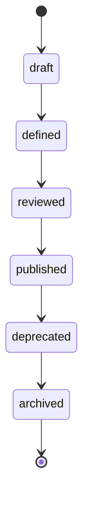
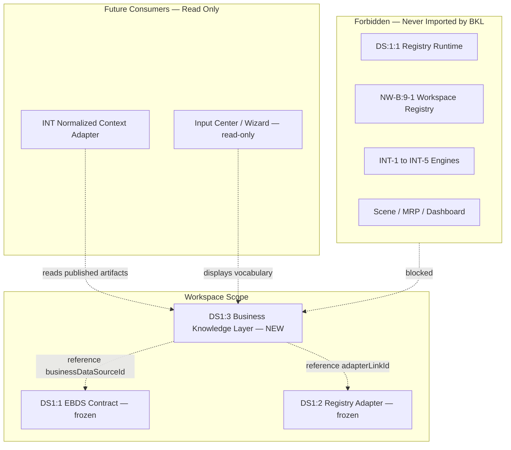

# DS1:3 — Business Knowledge Layer
## Stage-1 Understanding Report

**Project:** Nexora Type-C  
**Phase:** PHASE-2 / DS1:3  
**Title:** Business Knowledge Layer  
**Stage:** Stage-1 — Understand  
**Status:** UNDERSTANDING COMPLETE — **READY FOR STAGE-2 BUILD**

**Tags (proposed):** `[DS13_BUSINESS_KNOWLEDGE]` `[SEMANTIC_VOCABULARY_DEFINED]` `[WORKSPACE_KNOWLEDGE_OWNED]` `[DS14_READY]`

---

## 0. Executive Summary

The **Business Knowledge Layer (BKL)** is a **workspace-scoped semantic vocabulary** that explains what business data *means* — not how it is parsed, stored, calculated, or reasoned about.

BKL sits **above** frozen DS1:1 (Executive Business Data Source) and DS1:2 (Workspace Registry Adapter), providing structured business context (domains, processes, KPI definitions, terms, rules) that future intelligence engines may **consume** — but BKL never performs AI, calculations, synchronization, or registry operations.

**STOP triggered:** **NO**  
**Frozen module modification required:** **NO**  
**Stage-2 Build:** **APPROVED** (additive `lib/businessKnowledge/` contract files only)

---

## 1. Definition — Business Knowledge Layer

The Business Knowledge Layer is a **library-only semantic organization system** that:

1. Defines **what business concepts mean** within a workspace
2. Links concepts to **Business Data Sources** (via read-only references to DS1:1 / DS1:2 identifiers)
3. Exposes **vocabulary, categories, metadata, and relationships** as declarative contracts
4. Remains **independent** from AI engines, parsers, registries, dashboards, and intelligence runtimes

### What BKL is

| Attribute | Description |
|-----------|-------------|
| **Semantic** | Definitions, labels, classifications — no computed values |
| **Workspace-aware** | Every knowledge artifact belongs to exactly one workspace |
| **Lightweight** | Contract types + validation only in DS1:3 |
| **Declarative** | Describes meaning; does not act on data |
| **Consumable** | Future INT/DS engines read BKL summaries through approved adapters |

### What BKL is NOT

| Excluded capability | Belongs to |
|---------------------|------------|
| AI reasoning / recommendations | Assistant / INT (frozen) |
| KPI calculations | INT-3 / workspace KPI engine (forbidden) |
| Risk calculations | DS risk engine (forbidden) |
| Scenario generation | DS scenario engine (forbidden) |
| Object creation | DS-1:5 pipeline (forbidden) |
| Relationship discovery | Relationship intelligence (forbidden) |
| Data parsing / upload / sync | DS runtime (forbidden) |
| Registry mutation | DS:1:1 / NW-B:9-1 (forbidden) |
| Dashboard rendering | MRP / Dashboard (forbidden) |

---

## 2. Architecture Position

```
Workspace
    │
    ├── Executive Business Data Source (DS1:1 — frozen)
    │         └── "what data input exists"
    │
    ├── Registry Adapter Link (DS1:2 — frozen)
    │         └── "how source connects to runtime"
    │
    └── Business Knowledge Layer (DS1:3 — NEW)
              └── "what the data means in business terms"
                        │
                        └── [future] Intelligence Engines (read-only consumers)
```

BKL **does not replace** EBDS metadata (`businessDomain`, `tags`). It **extends** business meaning with a structured vocabulary that can reference one or more `businessDataSourceId` values without owning source lifecycle.

---

## 3. Ownership Model

### Authority chain

```
Workspace (authoritative owner)
    └── Business Knowledge Artifact (1..N per workspace)
              └── optional references ──→ businessDataSourceId (DS1:1)
              └── optional references ──→ adapterLinkId (DS1:2)
```

### Rules

1. **Every knowledge artifact requires `workspaceId`** — no global/orphan knowledge.
2. **Unique identity:** `knowledgeArtifactId` stable within workspace.
3. **Workspace isolation** — artifacts in Workspace A are invisible to Workspace B at contract level.
4. **Reference-only binding to EBDS** — BKL stores `businessDataSourceId` as opaque reference; never mutates EBDS records.
5. **Reference-only binding to adapter** — optional `adapterLinkId` for enriched context; never mutates DS1:2 files.
6. **Ownership verification** delegates to workspace ownership rules at future bridge stages — BKL contract declares policy only.

### Ownership contract (Stage-2 preview)

```typescript
BusinessKnowledgeOwnershipContract = {
  knowledgeArtifactId: string;
  workspaceId: string;
  isolationPolicy: "workspace-exclusive";
}
```

---

## 4. Semantic Vocabulary

BKL organizes **twelve core concept types** — all semantic definitions only:

| Concept | Purpose | Example (definition only) |
|---------|---------|---------------------------|
| **Business Domain** | Top-level business area | "Supply Chain Operations" |
| **Department** | Organizational unit | "Logistics" |
| **Business Function** | Capability area | "Demand Planning" |
| **Process** | End-to-end business process | "Order Fulfillment" |
| **Activity** | Step within a process | "Pick and Pack" |
| **KPI Definition** | What a metric *means* (not its value) | "On-Time Delivery Rate — % orders delivered by promise date" |
| **Risk Definition** | What a risk *means* (not its score) | "Supplier concentration — single-source dependency" |
| **Resource** | Business resource type | "Warehouse Capacity" |
| **Stakeholder** | Role or party | "Regional Distribution Manager" |
| **Business Entity** | Named business object in vocabulary | "Customer Account", "SKU" |
| **Business Term** | Glossary entry | "Lead Time — elapsed time from order to delivery" |
| **Business Rule** | Declarative constraint statement | "Orders over $50K require VP approval" |

**No calculations.** A KPI Definition describes *formula semantics in prose or structured notation* — not computed results.

---

## 5. Business Categories

Knowledge artifacts are classified by **knowledge category** (distinct from EBDS `category`):

| Category | Typical concepts |
|----------|------------------|
| `organization` | Domain, Department, Stakeholder |
| `operations` | Process, Activity, Resource |
| `performance` | KPI Definition |
| `governance` | Business Rule, Risk Definition |
| `vocabulary` | Business Term, Business Entity |
| `custom` | Extension placeholder |

EBDS category (`financial`, `operational`, etc.) remains on the **data source**. BKL category classifies **knowledge artifacts** — cross-reference via bindings, not merge.

---

## 6. Business Entity Model

### Core artifact shape (Stage-2 preview)

| Field | Responsibility |
|-------|----------------|
| `knowledgeArtifactId` | Stable id within workspace |
| `workspaceId` | Owning workspace (required) |
| `conceptType` | One of 12 vocabulary types |
| `knowledgeCategory` | BKL category enum |
| `displayName` | Executive label |
| `description` | Semantic definition |
| `lifecycleState` | Contract state only |
| `metadata` | Declarative metadata bag |
| `bindings` | Optional EBDS / adapter references |
| `relationships` | Semantic links to other artifacts |
| `securityProfile` | Classification + isolation |
| `contractVersion` | Schema version |
| `createdAt` / `updatedAt` | Audit timestamps |
| `source` | `"phase-2-business-knowledge-layer"` |

### Bindings (read-only references)

```typescript
BusinessKnowledgeBindings = {
  businessDataSourceIds?: readonly string[];  // DS1:1 reference
  adapterLinkIds?: readonly string[];       // DS1:2 reference
  primaryBusinessDomain?: string | null;    // aligns with EBDS metadata hint
}
```

Bindings are **declarative**. BKL never resolves or mutates bound sources.

---

## 7. Metadata Model

Declarative only — no computed fields:

```typescript
BusinessKnowledgeMetadata = {
  owner?: string | null;              // steward name/role (text)
  tags?: readonly string[];
  synonyms?: readonly string[];
  relatedTerms?: readonly string[];
  definitionSource?: string | null;   // e.g. "executive workshop"
  effectiveFrom?: string | null;      // ISO date — policy effective date
  effectiveTo?: string | null;
  extension?: BusinessKnowledgeExtensionPoint;
}
```

---

## 8. Knowledge Relationships

BKL supports **semantic relationship declarations** between artifacts — not graph discovery:

| Relationship type | Meaning |
|-------------------|---------|
| `contains` | Domain contains Process |
| `part_of` | Activity part_of Process |
| `measures` | KPI Definition measures Process |
| `applies_to` | Business Rule applies_to Activity |
| `defines` | Business Term defines Business Entity |
| `owned_by` | Process owned_by Department |
| `references` | Artifact references Business Data Source (via binding) |
| `related_to` | General semantic association |
| `custom` | Extension placeholder |

```typescript
BusinessKnowledgeRelationship = {
  relationshipId: string;
  fromArtifactId: string;
  toArtifactId: string;
  relationshipType: BusinessKnowledgeRelationshipType;
  workspaceId: string;  // both artifacts must share workspace
}
```

**Forbidden:** automatic relationship detection, scene sync, object graph mutation.

---

## 9. Lifecycle

Contract states only — no transition engine in DS1:3:



| State | Meaning |
|-------|---------|
| `draft` | Initial semantic entry |
| `defined` | Definition complete |
| `reviewed` | Steward review recorded (metadata flag) |
| `published` | Available for intelligence consumers |
| `deprecated` | Superseded; preserved for reference |
| `archived` | Read-only historical |

---

## 10. Extension Model

| Extension point | Purpose |
|-----------------|----------|
| `metadata.extension.futureExtension` | Forward-compatible fields |
| `conceptType: custom` via category | New concept types without breaking contract |
| `relationshipType: custom` | New relationship semantics |
| `bindings.adapterLinkIds` | DS1:2 context enrichment |
| Contract version bump | Additive DS1:4 fields |

**Frozen after DS1:3 Stage-3 certification** (proposed).

---

## 11. Dependency Rules

### Internal (DS1:3 Stage-2)

```
businessKnowledgeLayerTypes.ts
        ↑
businessKnowledgeLayerContract.ts
```

### External (read-only — types/constants only)

| Dependency | Class | Usage |
|------------|-------|-------|
| DS1:1 EBDS types | external read-only | Optional `businessDataSourceId` reference shape |
| DS1:2 Adapter types | external read-only | Optional `adapterLinkId` reference shape |
| Stage Architecture | external read-only | Manifest validation via stage guards |
| INT-5 platform | external | **No import** — documented consumer boundary only |

### Forbidden imports (DS1:3 contract layer)

- `executiveBusinessDataSourceContract.ts` mutation — frozen; types import only
- `workspaceDataSourceRegistryAdapter*.ts` mutation — frozen; types import only
- `data-sources/*`, `workspaceDataSourceRegistry`, `workspaceRegistryStore`
- All INT modules (`dashboardIntelligence`, KPI/risk/scenario engines)
- Scene, MRP, Dashboard, Assistant runtime
- Input Center, Wizard (Stage-1 forbidden; future read-only UI binding only)

### Consumer direction (future)

```
BKL (semantic) ──read── EBDS / Adapter (frozen)
INT engines ──read── BKL summaries (via future normalized adapter — not DS1:3)
BKL ──✗── INT / DS runtime (never)
```

---

## 12. Integration Points

### DS1:1 Executive Business Data Source

| Integration | Direction | Mechanism |
|-------------|-----------|-----------|
| Source identity | BKL → EBDS (reference) | `bindings.businessDataSourceIds` |
| Category hint | EBDS → BKL (read) | EBDS `category` informs knowledge categorization |
| Domain hint | EBDS → BKL (read) | `metadata.businessDomain` aligns with Business Domain artifact |
| Lifecycle | Independent | BKL lifecycle ≠ EBDS lifecycle |

### DS1:2 Workspace Registry Adapter

| Integration | Direction | Mechanism |
|-------------|-----------|-----------|
| Adapter context | BKL → Adapter (reference) | `bindings.adapterLinkIds` |
| Sync boundaries | No overlap | BKL never triggers adapter sync |
| Global registry | No direct link | BKL never references `registrySourceId` without adapter context |

### Future Intelligence Engines

| Engine | Relationship |
|--------|--------------|
| INT KPI engine | Reads KPI **Definitions** from BKL; performs calculations elsewhere |
| INT Risk engine | Reads Risk **Definitions**; detection elsewhere |
| INT Scenario engine | Reads Process/Activity context; simulation elsewhere |
| Assistant | Reads published vocabulary summaries; no BKL import from Assistant |
| Dashboard | Displays normalized BKL labels via INT gateway — no direct BKL import in Dashboard |

**INT-5 rule preserved:** Presentation layers must not import DS engines directly; BKL follows the same boundary — intelligence consumes **normalized summaries**, not raw BKL internals from UI.

---

## 13. Architecture Diagram



---

## 14. Dependency Map

| Module | Depends On | Provides To |
|--------|------------|-------------|
| `businessKnowledgeLayerTypes.ts` | — | Contract, future diagnostics |
| `businessKnowledgeLayerContract.ts` | types, stage guards | Future cert, INT adapter |
| DS1:1 EBDS | — | Id reference target for bindings |
| DS1:2 Adapter | — | Link reference target for bindings |
| INT engines (future) | BKL summaries | Executive insights (outside BKL) |

---

## 15. Risk Analysis

| Risk | Likelihood | Impact | Mitigation |
|------|:----------:|:------:|------------|
| BKL becomes calculation engine | Medium | Critical | Explicit MUST NOT OWN list; certification gates |
| BKL imports INT/DS runtime | Low | Critical | Forbidden patterns + import probes |
| Vocabulary drift vs EBDS category | Medium | Low | Separate category enums; binding cross-reference |
| Knowledge graph scope creep | Medium | High | Semantic relationships only; no discovery engine |
| Workspace knowledge leak | Low | High | Required workspaceId + isolation policy |
| Path naming: `businessKnowledge` vs `BusinessKnowledge` | Medium | Low | Use allowed path `lib/businessKnowledge/`; update probe paths in DS1:4 if needed |
| BKL bloat before consumers exist | Low | Medium | Keep DS1:3 under 150 lines per file target |

---

## 16. STOP Rule Verification

| Prohibited introduction | Present in proposal? | Verdict |
|-------------------------|:--------------------:|---------|
| AI logic | NO | PASS |
| Business calculations | NO | PASS |
| Runtime synchronization | NO | PASS |
| Registry mutation | NO | PASS |
| Workspace mutation | NO | PASS |
| Intelligence logic | NO | PASS |

**No STOP required.** Architecture remains semantic, lightweight, workspace-aware, and runtime/AI-independent.

---

## 17. Frozen Module Modification Verification

| Module | Modification Required? | Verdict |
|--------|:--------------------:|---------|
| DS1:1 EBDS contract | NO | Read-only type reference |
| DS1:2 Adapter contract | NO | Read-only type reference |
| DS:1:1 / NW-B:9-1 registry runtime | NO | Not imported |
| INT-5 platform | NO | Consumer boundary only |
| Workspace Core | NO | Opaque workspaceId string |
| Scene / MRP / Dashboard | NO | Forbidden |

---

## 18. Expected File List

### Stage-1 (this stage)

| File | Status |
|------|--------|
| `docs/ds1-3-understanding-report.md` | Created |

### Stage-2 (Build — after approval)

| File | Est. lines | Responsibility |
|------|----------:|----------------|
| `businessKnowledgeLayerTypes.ts` | ~130 | Vocabulary types, lifecycle, metadata, relationships, ownership |
| `businessKnowledgeLayerContract.ts` | ~150 | Version, manifest, validation, vocabulary constants, examples |

### Stage-3 (Analyze — future)

| File | Responsibility |
|------|----------------|
| `businessKnowledgeLayerDiagnostics.ts` | Knowledge lifecycle events |
| `businessKnowledgeLayerCertification.ts` | Certification + freeze |
| `businessKnowledgeLayerCertification.test.ts` | Architecture tests |
| `docs/ds1-3-analysis-report.md` | Senior review |
| `docs/ds1-3-freeze-report.md` | Freeze declaration |

---

## 19. Certification Strategy

### DS1:3 Stage-3 gates (proposed)

| Gate | Validation |
|------|------------|
| A | Contract version and tags exported |
| B | Twelve concept types defined |
| C | Six knowledge categories defined |
| D | Lifecycle states defined (6 states) |
| E | Workspace ownership required |
| F | Semantic relationships defined (9 types) |
| G | No imports from INT, DS runtime, registry, Scene |
| H | EBDS + Adapter frozen (`isExecutiveBusinessDataSourceFrozen`, `isWorkspaceRegistryAdapterFrozen`) |
| I | MUST NOT OWN list enforced in manifest forbidden patterns |
| J | Stage manifest validates |
| K | TypeScript build + tests pass |

### Prerequisites

- `[EXECUTIVE_BUSINESS_DATASOURCE_CONTRACT_FROZEN]`
- `[WORKSPACE_DATASOURCE_REGISTRY_ADAPTER_FROZEN]`
- `[STAGE_ARCHITECTURE_FROZEN]`
- `[INT5_COMPLETE]`

---

## 20. Stage Readiness Report

### Prerequisites

| Prerequisite | Status |
|--------------|--------|
| DS1:1 frozen | ✅ |
| DS1:2 frozen | ✅ |
| Stage Architecture frozen | ✅ |
| INT-5 frozen | ✅ |
| No frozen module mutation in Stage-1 | ✅ |
| STOP rule clear | ✅ |

### Scores

| Dimension | Score | Notes |
|-----------|------:|-------|
| Architecture Understanding | 95 | Clear semantic layer; vocabulary scoped |
| Complexity | 30 | Two contract files planned for Stage-2 |
| Regression Risk | 10 | Additive path; zero runtime in Stage-1 |
| Maintainability | 94 | SRP; separate from EBDS and adapter |
| Scalability | 93 | Extension model + relationship types |
| Certification Readiness | 91 | Strategy defined; gates pending Stage-2 |
| **Overall (weighted)** | **93/100** | Stage-1 understanding target met |

Stage-2 implementation target: **≥ 95/100**

---

## 21. Stage Contract Proposal (Stage-2 manifest preview)

```typescript
{
  stageId: "PHASE-2/DS1:3",
  title: "Business Knowledge Layer",
  goal: "Library-only semantic vocabulary explaining business meaning of data sources.",
  lifecycle: "build",
  allowedFiles: [
    "frontend/app/lib/businessKnowledge/businessKnowledgeLayerTypes.ts",
    "frontend/app/lib/businessKnowledge/businessKnowledgeLayerContract.ts",
  ],
  forbiddenPatterns: [
    ...STAGE_GLOBAL_FORBIDDEN_PATTERNS,
    "data-sources/",
    "dataSourceRegistryRuntime",
    "workspaceDataSourceRegistry",
    "workspaceRegistryStore",
    "dashboardIntelligence/",
    "executiveIntelligencePlatform/",
    "workspaceKpiCalculationEngine",
    "workspaceRiskDetectionEngine",
    "workspaceScenarioSimulationEngine",
    "executiveBusinessDataSourceContract.ts",
    "workspaceDataSourceRegistryAdapterContract.ts",
  ],
  prerequisites: ["DS1:1", "DS1:2", "STAGE-ARCH-3", "INT-5"],
  runtimePath: "library-only",
  tags: ["[DS13_BUSINESS_KNOWLEDGE]", "[DS14_READY]"],
}
```

---

## 22. Verdict

**Stage-1 Understanding: COMPLETE**

**Frozen module modification: NOT REQUIRED**

**STOP: NOT TRIGGERED**

**Stage-2 Build: APPROVED**

Proceed to **DS1:3 Stage-2 Build** — implement `businessKnowledgeLayerTypes.ts` and `businessKnowledgeLayerContract.ts` only.

No approval gate blocking Stage-2.
