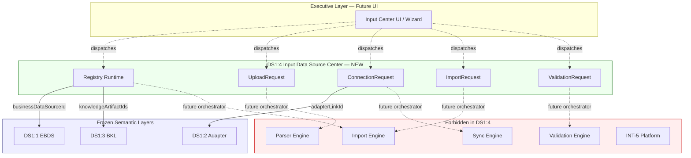
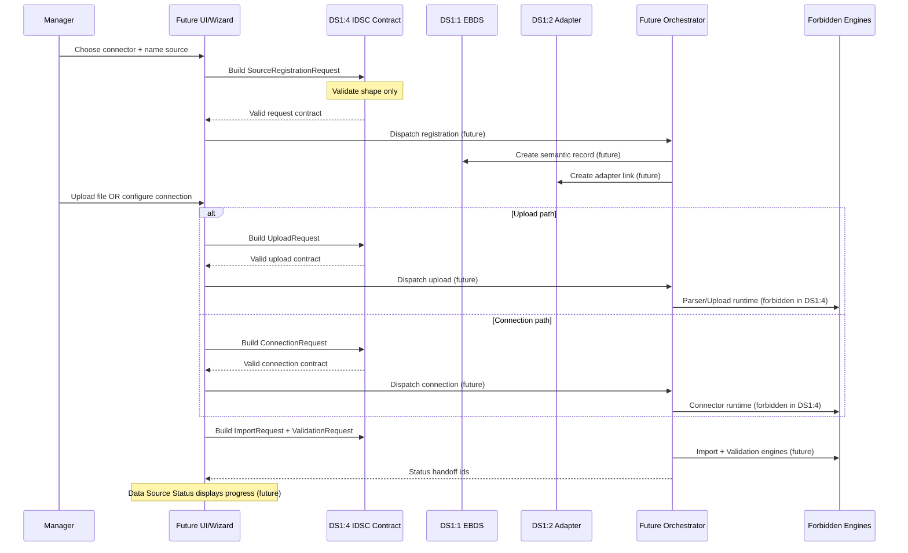

# DS1:4 — Input / Data Source Center
## Stage-1 Understanding Report

**Project:** Nexora Type-C  
**Phase:** PHASE-2 / DS1:4  
**Title:** Input / Data Source Center  
**Stage:** Stage-1 — Understand  
**Status:** UNDERSTANDING COMPLETE — **READY FOR STAGE-2 BUILD**

**Tags (proposed):** `[DS14_INPUT_CENTER]` `[EXECUTIVE_DATA_INTAKE]` `[WORKSPACE_SOURCE_COORDINATION]` `[DS15_READY]`

---

## 0. Executive Summary

The **Input / Data Source Center (IDSC)** is the **single executive coordination contract** through which managers introduce and manage business data sources within a workspace.

IDSC defines **how intake is requested** — registration, upload, connection, import, and validation — as declarative, workspace-scoped request shapes. It **coordinates** downstream work; it never parses files, opens database connections, synchronizes data, validates content, mutates registries, renders dashboards, or performs AI reasoning.

IDSC sits **below** future UI/Wizard surfaces and **above** frozen DS1:1 (EBDS), DS1:2 (Registry Adapter), and DS1:3 (Business Knowledge Layer), binding to those layers via **opaque read-only identifiers**.

**STOP triggered:** **NO**  
**Frozen module modification required:** **NO**  
**Stage-2 Build:** **APPROVED** (additive `lib/inputCenter/` contract files only)

---

## 1. Input Center Purpose

### What IDSC is

| Attribute | Description |
|-----------|-------------|
| **Executive entry point (contract)** | Canonical architecture for how managers connect data to Nexora |
| **Request coordinator** | Emits structured intake requests; does not execute them |
| **Workspace-scoped** | Every request and session belongs to exactly one workspace |
| **Connector-typed** | Declares supported source formats/channels as contract enums |
| **UI-independent** | No React, events, or panel logic in DS1:4 files |
| **Frozen-layer consumer** | References EBDS, adapter, and BKL ids without mutating frozen modules |

### What IDSC is NOT

| Excluded capability | Belongs to |
|---------------------|------------|
| File parsing (CSV, Excel, PDF, JSON, XML) | Future Parser Engine (forbidden in DS1:4) |
| Database drivers / connection pools | Future Connection Runtime (forbidden) |
| REST/GraphQL client execution | Future Connector Runtime (forbidden) |
| Data validation / schema inference | Future Validation Engine (forbidden) |
| Import / ETL execution | Future Import Engine (forbidden) |
| Synchronization | Future Sync Engine + DS1:2 bridge runtime (forbidden) |
| Registry mutation | DS:1:1 / NW-B:9-1 runtime (forbidden) |
| Business Knowledge semantics | DS1:3 BKL (frozen — read-only reference) |
| AI reasoning / intelligence | INT-5 platform (forbidden) |
| Dashboard rendering | MRP / Dashboard (forbidden) |
| Assistant logic | Assistant runtime (forbidden) |
| Wizard UI steps | Future Wizard Runtime (forbidden) |

### Distinction from existing product surfaces

| Surface | Role | Relationship to DS1:4 |
|---------|------|------------------------|
| `SourceControlPanel` (UI) | Legacy decision-intake / analyze overlay | **Not canonical** — future UI may bridge via events; DS1:4 does not import it |
| `sourceManagementContract` | Dashboard context for source list/health display | **Consumer** — reads status; DS1:4 does not replace it |
| EBDS (DS1:1) | Semantic identity of a business source | **Upstream reference** — IDSC requests create/reference EBDS shapes |
| Adapter (DS1:2) | Registry bridge link | **Upstream reference** — connection requests reference adapter link ids |
| BKL (DS1:3) | Business vocabulary | **Optional overlay** — knowledge artifact ids in request metadata |

---

## 2. Architecture Position

```
┌─────────────────────────────────────────────────────────────────┐
│  Future: Executive UI / Wizard (not DS1:4)                      │
│  Renders intake flows; dispatches IDSC request contracts        │
└────────────────────────────┬────────────────────────────────────┘
                             │ read-only request shapes
                             ▼
┌─────────────────────────────────────────────────────────────────┐
│  DS1:4 Input / Data Source Center (NEW — coordination only)   │
│  Registration · Upload · Connection · Import · Validation       │
│  REQUEST contracts — no execution                               │
└──────┬──────────────────┬──────────────────┬────────────────────┘
       │ opaque refs       │ opaque refs      │ optional refs
       ▼                   ▼                  ▼
┌──────────────┐   ┌──────────────┐   ┌──────────────────┐
│ DS1:1 EBDS   │   │ DS1:2 Adapter│   │ DS1:3 BKL        │
│ (frozen)     │   │ (frozen)     │   │ (frozen)         │
└──────────────┘   └──────────────┘   └──────────────────┘
       │                   │
       │ future bridge     │ future bridge (NOT in DS1:4)
       ▼                   ▼
┌─────────────────────────────────────────────────────────────────┐
│  Forbidden in DS1:4: Registry Runtime · Parser · Import · Sync  │
└─────────────────────────────────────────────────────────────────┘
```

IDSC is the **coordination vocabulary** for executive data intake. Frozen layers define **identity and meaning**. Future runtimes define **execution**.

---

## 3. Workspace Ownership

### Authority chain

```
Workspace (authoritative owner)
    └── Input Center Session (1..N per workspace, contract only)
              └── Intake Request (register | upload | connect | import | validate)
                        └── references ──→ businessDataSourceId (DS1:1)
                        └── references ──→ adapterLinkId (DS1:2, optional)
                        └── references ──→ knowledgeArtifactIds (DS1:3, optional)
```

### Rules

1. **Every intake request requires `workspaceId`** — no global/orphan requests.
2. **Session scope:** `inputCenterSessionId` stable within workspace for multi-step wizard flows (contract id only — no session store in DS1:4).
3. **Workspace isolation** — requests in Workspace A cannot reference sources in Workspace B.
4. **Ownership verification** delegates to workspace ownership rules at future bridge runtime — IDSC declares policy only.
5. **Cross-workspace access forbidden** — `crossWorkspaceAccess: false` locked in security profile.

### Ownership contract (Stage-2 preview)

```typescript
InputCenterOwnershipContract = {
  requestId: string;
  workspaceId: string;
  isolationPolicy: "workspace-exclusive";
}
```

---

## 4. Supported Source Categories

IDSC distinguishes **connector types** (how data enters) from **EBDS business categories** (what the data means — DS1:1).

### Connector types (DS1:4 — intake channel contracts)

| Connector Type | Intake Mode | Contract Declares | Does NOT Declare |
|----------------|-------------|-------------------|------------------|
| `csv` | upload | MIME hint, file descriptor shape | CSV parsing rules |
| `excel` | upload | Sheet selection intent (metadata) | XLSX reader |
| `pdf` | upload | Document descriptor | PDF extraction |
| `json` | upload \| connection | Schema hint (optional) | JSON parser |
| `xml` | upload \| connection | Schema hint (optional) | XML parser |
| `database` | connection | Connection request params (declarative) | JDBC/ODBC driver |
| `rest_api` | connection | Endpoint + auth profile id | HTTP client |
| `graphql_api` | connection | Endpoint + auth profile id | GraphQL client |
| `manual_entry` | manual | Field map intent | Form renderer |
| `future_connector` | extension | `connectorProfileId` | Connector implementation |

All eleven types are **contract enums only** — no parser, driver, or client code in DS1:4.

### Mapping to EBDS category (declarative hint, not automatic)

Executives select a **business category** (DS1:1) separately from **connector type** (DS1:4):

| Connector Type | Suggested EBDS Category Hint |
|----------------|------------------------------|
| `csv`, `excel`, `json`, `xml` | `operational` (default) |
| `database` | `operational` or `financial` |
| `rest_api`, `graphql_api` | `external_api` |
| `pdf` | `document` |
| `manual_entry` | `manual` |
| `future_connector` | `custom` |

Hints are **registration metadata** for future Wizard stages — DS1:4 does not assign categories automatically.

---

## 5. Input Workflow (Registration Flow)

High-level executive flow — **contract stages only**, no runtime:


### Stage descriptions

| Step | Request Type | Outcome (future runtime) | DS1:4 owns |
|------|--------------|--------------------------|------------|
| 1 | — | User selects connector type | Enum definition |
| 2 | — | User names source, picks EBDS category | Registration request shape |
| 3 | `SourceRegistrationRequest` | EBDS record created (future) | Request contract |
| 4a | `UploadRequest` | File staged (future) | Descriptor + intent |
| 4b | `ConnectionRequest` | Connector configured (future) | Params + auth profile id |
| 5 | `ImportRequest` | Import job queued (future) | Job request shape |
| 6 | `ValidationRequest` | Validation job queued (future) | Validation intent |
| 7 | — | Status surfaced via Data Source Status (future) | Handoff reference ids |

DS1:4 defines **request record shapes** and **validation of those shapes** — not step execution.

---

## 6. Upload Contract

Declarative upload request — **no file I/O in DS1:4**.

```typescript
// Conceptual — Stage-2 types preview
UploadRequest = {
  requestId: string;
  workspaceId: string;
  inputCenterSessionId: string;
  businessDataSourceId: string;       // DS1:1 opaque ref
  connectorType: "csv" | "excel" | "pdf" | "json" | "xml";
  fileDescriptor: {
    fileName: string;
    mimeType: string | null;
    byteSizeEstimate: number | null;  // declarative, not measured here
    checksumHint: string | null;      // optional client-provided hash
  };
  uploadIntent: "initial" | "replace" | "append";
  requestedAt: string;                // ISO
  source: "phase-2-input-data-source-center";
}
```

**Boundary:** `fileDescriptor` describes intent. Reading bytes, virus scan, and storage belong to future Upload Runtime.

---

## 7. Connection Contract

Declarative connection request — **no network I/O in DS1:4**.

```typescript
// Conceptual — Stage-2 types preview
ConnectionRequest = {
  requestId: string;
  workspaceId: string;
  inputCenterSessionId: string;
  businessDataSourceId: string;
  adapterLinkId: string | null;       // DS1:2 opaque ref
  connectorType: "database" | "rest_api" | "graphql_api" | "future_connector";
  connectionProfile: {
    connectorProfileId: string;       // future credential vault key
    endpointHint: string | null;      // URL or host — no secrets here
    authMethod: "none" | "api_key" | "oauth" | "basic" | "custom";
  };
  connectionIntent: "initial" | "reconnect" | "test_only";
  requestedAt: string;
  source: "phase-2-input-data-source-center";
}
```

**Security:** Secrets never appear in DS1:4 contracts. Only `connectorProfileId` references a future credential store.

---

## 8. Import Request Contract

```typescript
// Conceptual
ImportRequest = {
  requestId: string;
  workspaceId: string;
  businessDataSourceId: string;
  adapterLinkId: string | null;
  importMode: "full" | "incremental" | "preview";
  targetScope: "records" | "schema_only" | "metadata_only";
  priority: "normal" | "high";
  requestedAt: string;
  source: "phase-2-input-data-source-center";
}
```

Import execution, scheduling, and progress tracking belong to **Future Import Engine** — IDSC emits the request shape only.

---

## 9. Validation Request Contract

```typescript
// Conceptual
ValidationRequest = {
  requestId: string;
  workspaceId: string;
  businessDataSourceId: string;
  validationScope: "schema" | "connectivity" | "sample_records" | "full";
  validationIntent: "pre_import" | "post_import" | "health_check";
  requestedAt: string;
  source: "phase-2-input-data-source-center";
}
```

Validation rules, record sampling, and connectivity probes belong to **Future Validation Engine**.

---

## 10. Security Boundary

| Boundary | Rule |
|----------|------|
| Scope | Workspace-scoped requests only |
| Cross-tenant | Forbidden at contract level |
| Credentials | Never stored in IDSC contracts — profile id references only |
| PII | Declared in `securityProfile.classification` — not enforced here |
| Registry access | IDSC never calls registry APIs |
| Intelligence access | IDSC never imports INT modules |
| File content | Never embedded in request records |

```typescript
// Conceptual
InputCenterSecurityProfile = {
  classification: "public" | "internal" | "confidential" | "restricted";
  crossWorkspaceAccess: false;  // always false in v1
}
```

---

## 11. Extension Model

| Extension point | Purpose |
|-----------------|---------|
| `connectorProfileId` | Future credential / connector configuration vault |
| `metadata.futureExtension` | Forward-compatible request metadata |
| `future_connector` type | Open-ended connector enum slot |
| `inputCenterSessionId` | Multi-step wizard correlation (contract id only) |
| `knowledgeArtifactIds` | Optional BKL overlay during registration |

---

## 12. Integration with Frozen Layers

### DS1:1 — Executive Business Data Source

| Integration | Direction | Mechanism |
|-------------|-----------|-----------|
| Source identity | IDSC → EBDS (future runtime) | `businessDataSourceId` on every request |
| Registration | `SourceRegistrationRequest` carries EBDS-compatible field hints | Shape alignment, no EBDS file import |
| Lifecycle alignment | Registration moves EBDS toward `registered` → `connected` (future) | Documented intent only |
| Category | Registration request includes `executiveCategory` hint | Maps to EBDS categories |

**Constraint:** DS1:4 files must not import `executiveBusinessDataSourceContract.ts` (frozen — blocked by forbidden patterns). Stage-2 uses parallel type definitions with documented field alignment.

### DS1:2 — Workspace Registry Adapter

| Integration | Direction | Mechanism |
|-------------|-----------|-----------|
| Registry bridge | Connection/Import requests reference `adapterLinkId` | Opaque string |
| Link establishment | Future bridge creates adapter link after registration | Not in DS1:4 |
| Sync boundaries | IDSC respects DS1:2 sync profile conceptually | No sync implementation |

### DS1:3 — Business Knowledge Layer

| Integration | Direction | Mechanism |
|-------------|-----------|-----------|
| Semantic overlay | Registration may include `knowledgeArtifactIds[]` | Optional opaque refs |
| Vocabulary guidance | Future Wizard reads BKL for labels | IDSC stores ids only |
| Meaning | IDSC does not define business concepts | BKL owns semantics |

---

## 13. Future Compatibility

### Wizard (future runtime)

| Concern | IDSC provision |
|---------|----------------|
| Multi-step flows | `inputCenterSessionId` correlates requests |
| Step ordering | Documented workflow enum — not enforced in DS1:4 |
| Connector picker | `INPUT_CENTER_CONNECTOR_TYPES` constant |
| Handoff | Wizard dispatches IDSC request shapes to future orchestrator |

### Data Source Status (future)

| Concern | IDSC provision |
|---------|----------------|
| Status display | Requests carry `businessDataSourceId` + `adapterLinkId` for status lookup |
| Progress | Import/Validation requests include `requestId` for correlation |
| Health checks | `ValidationRequest` with `validationIntent: "health_check"` |

### Intelligence Engines (future)

| Concern | IDSC provision |
|---------|----------------|
| Grounding | Engines consume EBDS/BKL via existing frozen layers — not via IDSC directly |
| No AI in intake | MUST NOT OWN list blocks reasoning |
| Post-intake | Active sources (EBDS `active`) become INT inputs — outside IDSC scope |

---

## 14. Architecture Diagram



---

## 15. Data-Flow Diagram



**Key invariant:** IDSC validates **request shape** only. All I/O crosses the orchestrator boundary into forbidden engines — never into DS1:4 files.

---

## 16. Dependency Map

### Internal (Stage-2)

```
inputDataSourceCenterTypes.ts
        ↑
inputDataSourceCenterContract.ts
```

### External references (Stage-2)

| Dependency | Class | Usage |
|------------|-------|-------|
| Stage Architecture | external | Manifest validation via stage guards |
| DS1:1 freeze check | external read-only | Certification prerequisite — `isExecutiveBusinessDataSourceFrozen()` |
| DS1:2 freeze check | external read-only | Certification prerequisite — `isWorkspaceRegistryAdapterFrozen()` |
| DS1:3 freeze check | external read-only | Certification prerequisite — `isBusinessKnowledgeLayerFrozen()` |
| WorkspaceId | external type | Opaque string — no workspace store import |

### Forbidden imports (DS1:4)

| Target | Reason |
|--------|--------|
| `data-sources/*` | DS Registry Runtime frozen |
| `workspaceDataSourceRegistry` | Registry Runtime frozen |
| `workspaceRegistryStore` | Workspace Runtime frozen |
| `executiveBusinessDataSourceContract.ts` | DS1:1 frozen |
| `workspaceDataSourceRegistryAdapterContract.ts` | DS1:2 frozen |
| `businessKnowledgeLayerContract.ts` | DS1:3 frozen |
| `dashboardIntelligence/` | Dashboard frozen |
| `executiveIntelligencePlatform/` | INT frozen |
| `assistantRuntime` | Assistant frozen |
| `RelationshipRenderer` | Scene frozen |
| Parser / Import / Validation / Sync engines | Execution forbidden |
| `SourceControlPanel` | UI — not a library dependency |

### Future consumers

| Consumer | Relationship |
|----------|--------------|
| Wizard Runtime | Dispatches IDSC request shapes |
| Input Center UI | Renders flows; validates via IDSC contract |
| Orchestrator (DS1:5+) | Executes requests; mutates EBDS/adapter at runtime layer |
| Data Source Status | Correlates requests by id |
| sourceManagementContract | Displays connected source health (read-only) |

---

## 17. Risk Analysis

| Risk | Likelihood | Impact | Mitigation |
|------|:----------:|:------:|------------|
| IDSC becomes parser/upload runtime | Medium | Critical | MUST NOT OWN list + forbidden engine paths in certification |
| Registry mutation in contract files | Medium | Critical | No registry imports; orchestrator owns mutation |
| Credential leakage in connection requests | Medium | Critical | `connectorProfileId` only — no secrets in contract |
| Confusion with legacy SourceControlPanel | High | Medium | Document distinction; DS1:4 is library-only coordination |
| Duplication of `sourceManagementContract` types | Medium | Medium | IDSC uses PHASE-2 request shapes; dashboard contract unchanged |
| EBDS category vs connector type conflation | Medium | Medium | Separate enums; mapping hints documented |
| Wizard logic embedded in DS1:4 | Low | High | Session id is correlation only — no step engine |
| Cross-workspace request forgery | Low | Critical | Required `workspaceId` + isolation policy |
| AI reasoning in intake flow | Low | Critical | MUST NOT OWN + INT paths blocked |
| Frozen layer import creep | Low | Critical | Forbidden patterns block DS1:1/2/3 contract files |

**No critical unmitigated risks.**

---

## 18. Architecture Smells (pre-build review)

| Smell | Severity | Notes |
|-------|----------|-------|
| Parallel type definitions vs EBDS fields | Low | Required — frozen files cannot be imported; alignment documented |
| Eleven connector types in one enum | Low | `future_connector` extension slot covers growth |
| Request proliferation (5 request types) | Low | Each maps to distinct downstream engine boundary |
| Overlap with certified `DataSourceType` | Medium | DS1:4 connector types are intake-channel; registry types remain in DS:1:1 |

**No STOP-triggering smells.**

---

## 19. STOP Rule Verification

| Proposed architecture requires | Present? | Verdict |
|--------------------------------|:--------:|---------|
| Parser implementation | NO | PASS |
| Runtime registry mutation | NO | PASS |
| AI logic | NO | PASS |
| Synchronization | NO | PASS |
| Dashboard coupling | NO | PASS |
| Assistant coupling | NO | PASS |

### Independence verification

| Property | Verdict | Evidence |
|----------|---------|----------|
| Workspace-aware | **PASS** | Required `workspaceId` on all requests |
| UI-independent | **PASS** | Library-only; no React/event imports |
| Parser-independent | **PASS** | Upload descriptor only; no byte I/O |
| Intelligence-independent | **PASS** | No INT imports; MUST NOT OWN |
| Registry-independent | **PASS** | Opaque adapter/source ids; no registry APIs |

**No STOP required.**

---

## 20. Frozen Module Modification Verification

| Module | Modification Required? | Verdict |
|--------|:--------------------:|---------|
| DS1:1 EBDS contract | NO | Parallel field alignment |
| DS1:2 Adapter contract | NO | Opaque `adapterLinkId` reference |
| DS1:3 BKL contract | NO | Optional `knowledgeArtifactIds` |
| DS:1:1 / NW-B:9-1 registry runtime | NO | Not imported |
| INT-5 platform | NO | Consumer boundary only |
| Workspace Core | NO | Opaque `workspaceId` string |
| Scene / MRP / Dashboard / Assistant | NO | Forbidden |
| SourceControlPanel (UI) | NO | Not modified |

---

## 21. Expected File List

### Stage-1 (this stage)

| File | Status |
|------|--------|
| `docs/ds1-4-understanding-report.md` | Created |

### Stage-2 (Build — after approval)

| File | Est. lines | Responsibility |
|------|----------:|----------------|
| `inputDataSourceCenterTypes.ts` | ~200 | Request types, connector enums, ownership, session, certification types |
| `inputDataSourceCenterContract.ts` | ~280 | Version, manifest, validation, connector constants, request examples |

### Stage-3 (Analyze — future)

| File | Responsibility |
|------|----------------|
| `inputDataSourceCenterDiagnostics.ts` | Intake lifecycle events |
| `inputDataSourceCenterCertification.ts` | Certification + freeze |
| `inputDataSourceCenterCertification.test.ts` | Architecture tests |
| `docs/ds1-4-analysis-report.md` | Senior review |
| `docs/ds1-4-freeze-report.md` | Freeze declaration |

**Total Stage-2 estimate:** ~480 lines across 2 TypeScript files.

---

## 22. Certification Strategy

### DS1:4 Stage-3 gates (proposed)

| Gate | Validation |
|------|------------|
| A1 | Contract version and tags exported |
| A2 | Eleven connector types defined (+ `future_connector`) |
| A3 | Five request types defined (register, upload, connect, import, validate) |
| A4 | Workspace ownership required on all requests |
| B1 | Self manifest validates |
| B2 | Module files in allowlist |
| B3 | Forbidden runtime paths blocked (parser, import, validation, sync, registry, INT, Scene, assistant) |
| C1 | Dependency graph acyclic |
| C2 | EBDS frozen (`isExecutiveBusinessDataSourceFrozen`) |
| C3 | Adapter frozen (`isWorkspaceRegistryAdapterFrozen`) |
| C4 | BKL frozen (`isBusinessKnowledgeLayerFrozen`) |
| D1 | All request examples validate |
| D2 | Upload descriptor has no embedded content |
| D3 | Connection request has no secrets |
| E1 | MUST NOT OWN list documented (≥ 10 exclusions) |
| E2 | Security boundary locked (`crossWorkspaceAccess: false`) |
| F1 | Diagnostics operational |
| F2 | Minimum score threshold (95) |
| G1–G4 | Analysis freeze gates (match DS1:1/2/3 pattern) |

### Prerequisites

- `[EXECUTIVE_BUSINESS_DATASOURCE_CONTRACT_FROZEN]`
- `[WORKSPACE_DATASOURCE_REGISTRY_ADAPTER_FROZEN]`
- `[BUSINESS_KNOWLEDGE_LAYER_FROZEN]`
- `[STAGE_ARCHITECTURE_FROZEN]`
- `[INT5_COMPLETE]`

### MUST NOT OWN list (proposed)

```
file_parsing, database_drivers, synchronization, data_validation,
business_knowledge, ai_reasoning, intelligence, dashboard_rendering,
assistant_logic, registry_runtime, import_execution, wizard_ui
```

---

## 23. Stage Readiness Report

### Prerequisites

| Prerequisite | Status |
|--------------|--------|
| DS1:1 frozen | ✅ |
| DS1:2 frozen | ✅ |
| DS1:3 frozen | ✅ |
| Stage Architecture frozen | ✅ |
| INT-5 frozen | ✅ |
| No frozen module mutation in Stage-1 | ✅ |
| STOP rule clear | ✅ |
| No code written in Stage-1 | ✅ |

### Scores

| Dimension | Score | Notes |
|-----------|------:|-------|
| Architecture Understanding | 96 | Clear coordination layer; request-only boundary |
| Complexity | 45 | Five request types + eleven connectors; still library-only |
| Regression Risk | 8 | Additive path; zero runtime in Stage-1 |
| Maintainability | 93 | SRP; separate from EBDS/adapter/BKL |
| Scalability | 94 | Extension model + future_connector slot |
| Certification Readiness | 92 | Strategy defined; gates pending Stage-2 |
| **Overall (weighted)** | **94/100** | Stage-1 understanding target met |

Stage-2 implementation target: **≥ 95/100**

---

## 24. Stage Contract Proposal (Stage-2 manifest preview)

```typescript
{
  stageId: "PHASE-2/DS1:4",
  title: "Input / Data Source Center",
  goal: "Library-only coordination contract for executive data source intake requests.",
  lifecycle: "build",
  allowedFiles: [
    "frontend/app/lib/inputCenter/inputDataSourceCenterTypes.ts",
    "frontend/app/lib/inputCenter/inputDataSourceCenterContract.ts",
  ],
  forbiddenPatterns: [
    ...STAGE_GLOBAL_FORBIDDEN_PATTERNS,
    "data-sources/",
    "dataSourceRegistryRuntime",
    "workspace/workspaceDataSourceRegistry.ts",
    "workspaceRegistryStore",
    "dashboardIntelligence/",
    "executiveIntelligencePlatform/",
    "workspaceKpiCalculationEngine",
    "workspaceRiskDetectionEngine",
    "workspaceScenarioSimulationEngine",
    "assistantRuntime",
    "RelationshipRenderer",
    "executiveBusinessDataSourceContract.ts",
    "workspaceDataSourceRegistryAdapterContract.ts",
    "businessKnowledgeLayerContract.ts",
    "ParserEngine",
    "ImportEngine",
    "ValidationEngine",
    "SynchronizationEngine",
  ],
  prerequisites: ["DS1:1", "DS1:2", "DS1:3", "STAGE-ARCH-3", "INT-5"],
  runtimePath: "library-only",
  tags: ["[DS14_INPUT_CENTER]", "[DS15_READY]"],
}
```

---

## 25. Verdict

**Stage-1 Understanding: COMPLETE**

**Frozen module modification: NOT REQUIRED**

**STOP: NOT TRIGGERED**

**Stage-2 Build: APPROVED**

Proceed to **DS1:4 Stage-2 Build** — implement `inputDataSourceCenterTypes.ts` and `inputDataSourceCenterContract.ts` only.

No approval gate blocking Stage-2.
