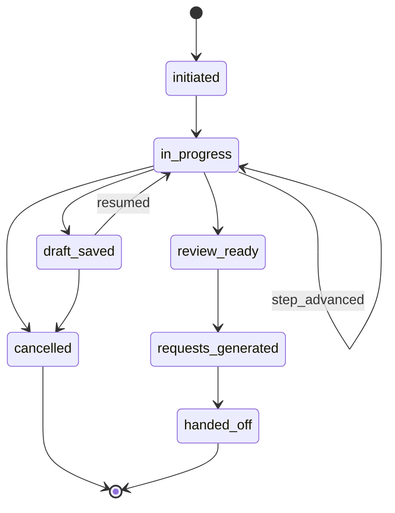
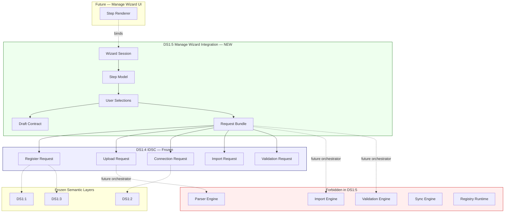
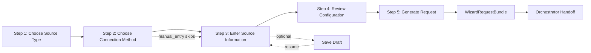
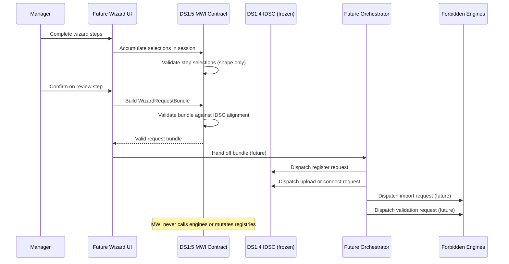

# DS1:5 — Manage Wizard Integration
## Stage-1 Understanding Report

**Project:** Nexora Type-C  
**Phase:** PHASE-2 / DS1:5  
**Title:** Manage Wizard Integration  
**Stage:** Stage-1 — Understand  
**Status:** UNDERSTANDING COMPLETE — **READY FOR STAGE-2 BUILD**

**Tags (proposed):** `[DS15_MANAGE_WIZARD]` `[WIZARD_IDSC_INTEGRATION]` `[WORKSPACE_WIZARD_OWNED]` `[DS16_READY]`

---

## 0. Executive Summary

The **Manage Wizard Integration (MWI)** is a **library-only architecture contract** that defines how the Workspace Manage Wizard guides executives through data source setup and produces **valid Input / Data Source Center (IDSC) request shapes**.

MWI collects manager selections across a declarative step model, maintains wizard session state as a **contract record** (not a runtime store), and emits an ordered **request bundle** for handoff to IDSC — without upload execution, parsing, validation, synchronization, registry mutation, UI rendering, or AI reasoning.

MWI sits **above** frozen DS1:4 (IDSC) as the **request authoring layer**, and **below** future UI surfaces that render wizard steps.

**STOP triggered:** **NO**  
**Frozen module modification required:** **NO**  
**Stage-2 Build:** **APPROVED** (additive `lib/manageWizard/` contract files only)

---

## 1. Wizard Purpose

### What MWI is

| Attribute | Description |
|-----------|-------------|
| **Guided intake authoring** | Step model that collects manager inputs for data source setup |
| **Request producer** | Transforms selections into IDSC-compatible request contracts |
| **Session coordinator** | Correlates multi-step flow via `wizardSessionId` → `inputCenterSessionId` |
| **Workspace-scoped** | Every wizard session belongs to exactly one workspace |
| **UI-independent** | No React, DOM, events, or panel logic in DS1:5 files |
| **Draft contract only** | Declares draft persistence shape — no storage implementation |

### What MWI is NOT

| Excluded capability | Belongs to |
|---------------------|------------|
| Wizard UI rendering | Future UI layer (forbidden in DS1:5) |
| Upload execution | Future Upload Runtime (forbidden) |
| File parsing | Future Parser Engine (forbidden) |
| Import execution | Future Import Engine (forbidden) |
| Validation execution | Future Validation Engine (forbidden) |
| Synchronization | Future Sync Engine (forbidden) |
| Registry mutation | DS:1:1 / NW-B:9-1 runtime (forbidden) |
| IDSC request dispatch | Future Orchestrator (forbidden in DS1:5) |
| Business Knowledge semantics | DS1:3 BKL (frozen — read-only reference) |
| AI reasoning / intelligence | INT-5 platform (forbidden) |
| Dashboard rendering | MRP / Dashboard (forbidden) |
| Assistant logic | Assistant runtime (forbidden) |

### Distinction from related surfaces

| Surface | Role | Relationship to DS1:5 |
|---------|------|------------------------|
| **DS1:4 IDSC (frozen)** | Request coordination vocabulary | **Downstream target** — MWI produces aligned request shapes |
| **Future Wizard UI** | Renders steps, binds form fields | **Upstream consumer** — reads MWI step/session contracts |
| **Future Orchestrator** | Dispatches IDSC requests to engines | **Downstream executor** — receives MWI request bundle |
| `SourceControlPanel` (legacy UI) | Decision-intake overlay | **Unrelated** — not canonical manage wizard |
| `sourceManagementContract` | Dashboard source health display | **Consumer** — reads status after orchestration |

---

## 2. Architecture Position

```
┌─────────────────────────────────────────────────────────────────┐
│  Future: Manage Wizard UI (not DS1:5)                           │
│  Renders steps; binds user input to MWI session contract        │
└────────────────────────────┬────────────────────────────────────┘
                             │ reads/writes session contract
                             ▼
┌─────────────────────────────────────────────────────────────────┐
│  DS1:5 Manage Wizard Integration (NEW — request authoring)      │
│  Step model · Session · Selections · Draft · Request bundle     │
└────────────────────────────┬────────────────────────────────────┘
                             │ produces aligned request shapes
                             ▼
┌─────────────────────────────────────────────────────────────────┐
│  DS1:4 Input / Data Source Center (frozen)                      │
│  Register · Upload · Connect · Import · Validate requests       │
└──────┬──────────────────┬──────────────────┬────────────────────┘
       │ opaque refs       │ opaque refs      │ optional refs
       ▼                   ▼                  ▼
┌──────────────┐   ┌──────────────┐   ┌──────────────────┐
│ DS1:1 EBDS   │   │ DS1:2 Adapter│   │ DS1:3 BKL        │
│ (frozen)     │   │ (frozen)     │   │ (frozen)         │
└──────────────┘   └──────────────┘   └──────────────────┘
       │
       │ future orchestrator (NOT in DS1:5)
       ▼
┌─────────────────────────────────────────────────────────────────┐
│  Forbidden: Parser · Import · Validation · Sync · Registry      │
└─────────────────────────────────────────────────────────────────┘
```

MWI is the **guided authoring vocabulary**. IDSC is the **request coordination vocabulary**. Future engines perform **execution**.

---

## 3. Wizard Lifecycle

Contract states only — no transitions implemented in DS1:5.



| State | Meaning |
|-------|---------|
| `initiated` | Session created; no steps completed |
| `in_progress` | Manager advancing through steps |
| `draft_saved` | Selections persisted per draft contract (future store) |
| `review_ready` | All required steps complete; review step unlocked |
| `requests_generated` | Request bundle built and validated |
| `handed_off` | Bundle marked ready for orchestrator dispatch |
| `cancelled` | Session abandoned; no requests dispatched |

**Consumers never infer lifecycle** — state is set by authorized wizard bridge stages only.

---

## 4. Wizard Session

### Session identity

```typescript
// Conceptual — Stage-2 types preview
ManageWizardSessionRecord = {
  contractVersion: string;
  wizardSessionId: string;           // stable within workspace
  workspaceId: string;               // required
  initiatedBy: string;             // executive actor id
  lifecycleState: ManageWizardLifecycleState;
  currentStepId: ManageWizardStepId;
  inputCenterSessionId: string;      // correlates to IDSC metadata.inputCenterSessionId
  createdAt: string;
  updatedAt: string;
  source: "phase-2-manage-wizard-integration";
}
```

### Rules

1. **Every session requires `workspaceId`** — no global/orphan sessions.
2. **`wizardSessionId` is stable** within workspace for draft resume.
3. **`inputCenterSessionId` is set at initiation** and copied into every generated IDSC request's metadata.
4. **Workspace isolation** — sessions in Workspace A cannot reference sources in Workspace B.
5. **One active intake flow per session** — a session produces one request bundle for one source setup.

---

## 5. Wizard Step Model

Five conceptual steps — **contract definitions only**, no UI:

| Step ID | Title | Collects | Produces |
|---------|-------|----------|----------|
| `choose_source_type` | Choose Source Type | `connectorType` (IDSC enum) | `WizardSourceTypeSelection` |
| `choose_connection_method` | Choose Connection Method | Intake path based on connector | `WizardConnectionMethodSelection` |
| `enter_source_information` | Enter Source Information | Name, description, category hint, optional BKL refs | `WizardSourceInformationSelection` |
| `review_configuration` | Review Configuration | Confirmation only | `WizardReviewSnapshot` |
| `generate_request` | Generate Input Center Request | Final approval | `WizardRequestBundle` |

### Step progression rules

| Rule | Description |
|------|-------------|
| Linear default | Steps 1 → 2 → 3 → 4 → 5 in order |
| Skip guard | Step 2 skipped when `manual_entry` selected (method implied) |
| Back navigation | Allowed in UI; MWI contract records `currentStepId` only |
| Validation gate | Step 5 blocked until steps 1–3 selections validate |

### Connection method mapping (Step 2)

Derived from DS1:4 `INPUT_CENTER_CONNECTOR_INTAKE_MODES` — documented alignment, not imported:

| Intake Mode | Step 2 Options | Downstream IDSC Request |
|-------------|----------------|------------------------|
| `upload` | File upload path | `UploadRequest` |
| `connection` | API / database path | `ConnectionRequest` |
| `manual` | Manual entry path | `SourceRegistrationRequest` only (+ optional validate) |
| `extension` | Future connector path | `ConnectionRequest` with `future_connector` |

---

## 6. User Selections

```typescript
// Conceptual
WizardUserSelections = {
  connectorType: InputCenterConnectorType;     // aligned with DS1:4 enum
  connectionMethod: "upload" | "connection" | "manual" | "extension";
  displayName: string;
  description: string | null;
  executiveCategoryHint: string | null;        // aligns with DS1:1 categories
  knowledgeArtifactIds: readonly string[];     // optional DS1:3 opaque refs
  fileDescriptor: InputCenterFileDescriptor | null;   // metadata only
  connectionProfile: InputCenterConnectionProfile | null; // no secrets
  connectorProfileId: string | null;
}
```

**Boundary:** Selections are **declarative inputs**. MWI validates shape only. No file bytes, credentials, or registry writes.

---

## 7. Workspace Ownership

### Authority chain

```
Workspace (authoritative owner)
    └── Manage Wizard Session (1..N per workspace)
              └── User Selections (accumulated per step)
                        └── Request Bundle (1 per completed session)
                                  └── IDSC Requests (register → upload|connect → import → validate)
```

### Ownership contract (Stage-2 preview)

```typescript
ManageWizardOwnershipContract = {
  wizardSessionId: string;
  workspaceId: string;
  isolationPolicy: "workspace-exclusive";
}
```

### Rules

1. **`workspaceId` required** on session, draft, and every generated request.
2. **`initiatedBy` required** — maps to IDSC `requestedBy`.
3. **Cross-workspace access forbidden** — `crossWorkspaceAccess: false` in security profile.
4. **Ownership verification** delegates to workspace rules at future bridge runtime.

---

## 8. Request Generation

When Step 5 completes, MWI produces a **`WizardRequestBundle`** — an ordered, validated set of IDSC-aligned request shapes:

```typescript
// Conceptual
WizardRequestBundle = {
  bundleId: string;
  wizardSessionId: string;
  workspaceId: string;
  inputCenterSessionId: string;
  generatedAt: string;
  requests: readonly [
    SourceRegistrationRequest,          // always first
    UploadRequest | ConnectionRequest,  // based on intake mode (optional for manual)
    ImportRequest?,                     // optional handoff
    ValidationRequest?,                 // optional handoff
  ];
  handoffTargets: readonly WizardHandoffTarget[];
}
```

### Generation rules

| Order | Request | Condition |
|------:|---------|-----------|
| 1 | `SourceRegistrationRequest` | Always — establishes semantic source intent |
| 2a | `UploadRequest` | When intake mode is `upload` |
| 2b | `ConnectionRequest` | When intake mode is `connection` or `extension` |
| 3 | `ImportRequest` | When manager opts into import (default: yes for upload/connection) |
| 4 | `ValidationRequest` | When manager opts into pre-import validation (default: yes) |

**MWI validates bundle shape** against parallel IDSC field alignment. MWI does **not dispatch** requests — the future orchestrator does.

All generated requests include DS1:4 mandatory fields: `requestId`, `workspaceId`, `requestedBy`, `createdAt`, `requestType`, `sourceDescriptor`, `status`, `metadata`.

---

## 9. Draft Persistence Contract

Declarative draft record — **no storage implementation in DS1:5**.

```typescript
// Conceptual
ManageWizardDraftRecord = {
  draftId: string;
  wizardSessionId: string;
  workspaceId: string;
  lifecycleState: "draft_saved";
  currentStepId: ManageWizardStepId;
  selections: WizardUserSelections;
  savedAt: string;
  savedBy: string;
  source: "phase-2-manage-wizard-integration";
}
```

| Attribute | Rule |
|-----------|------|
| Scope | Workspace-scoped only |
| Content | Selections + step position — no file content |
| Resume | Future UI loads draft → restores session contract |
| Storage | Future draft store (outside DS1:5) |

---

## 10. Validation Request Handoff

```typescript
// Conceptual
WizardHandoffTarget = {
  target: "validation_engine";
  requestType: "validate";
  requestId: string;              // from generated ValidationRequest
  wizardSessionId: string;
  inputCenterSessionId: string;
  handoffIntent: "pre_import" | "post_import" | "health_check";
}
```

MWI marks the validation request as **ready for handoff** in the bundle. The Validation Engine (future) receives the IDSC `ValidationRequest` from the orchestrator — MWI never executes validation.

---

## 11. Import Request Handoff

```typescript
// Conceptual — handoff entry in bundle
WizardHandoffTarget = {
  target: "import_engine";
  requestType: "import";
  requestId: string;              // from generated ImportRequest
  wizardSessionId: string;
  inputCenterSessionId: string;
  handoffIntent: "full" | "incremental" | "preview";
}
```

Same pattern: MWI produces the request shape; orchestrator dispatches to Import Engine.

---

## 12. Integration with Frozen Layers

### DS1:4 — Input / Data Source Center

| Integration | Direction | Mechanism |
|-------------|-----------|-----------|
| Request output | MWI → IDSC | `WizardRequestBundle.requests[]` aligned to frozen IDSC shapes |
| Session correlation | MWI → IDSC | `inputCenterSessionId` in metadata |
| Connector types | MWI reads enum alignment | Parallel type definitions — no import of frozen `inputDataSourceCenterContract.ts` |
| Validation | MWI uses parallel validators | Field alignment documented; freeze check via `isInputDataSourceCenterFrozen()` |

### DS1:1 — Executive Business Data Source

| Integration | Direction | Mechanism |
|-------------|-----------|-----------|
| Category hint | MWI selections → registration request | `executiveCategoryHint` in metadata |
| Source identity | Registration request | `displayName`, `description` align with EBDS fields |
| Lifecycle intent | Registration moves toward `registered` | Documented intent only — orchestrator executes |

### DS1:2 — Workspace Registry Adapter

| Integration | Direction | Mechanism |
|-------------|-----------|-----------|
| Adapter link | Connection request | `adapterLinkId: null` until orchestrator creates link |
| Bridge timing | Post-registration | Wizard does not create adapter links |

### DS1:3 — Business Knowledge Layer

| Integration | Direction | Mechanism |
|-------------|-----------|-----------|
| Semantic overlay | Step 3 optional selection | `knowledgeArtifactIds[]` in request metadata |
| Vocabulary labels | Future UI reads BKL for display | MWI stores opaque ids only |

---

## 13. Future Compatibility

### Data Source Status

| Concern | MWI provision |
|---------|---------------|
| Progress tracking | Bundle carries `requestId` per handoff target |
| Session correlation | `wizardSessionId` + `inputCenterSessionId` |
| Status display | Status engine reads orchestrator state — not MWI directly |

### Parser / Import / Validation Engines

| Engine | MWI relationship |
|--------|------------------|
| Parser Engine | Receives `UploadRequest` from orchestrator — MWI produces descriptor only |
| Import Engine | Receives `ImportRequest` via handoff target |
| Validation Engine | Receives `ValidationRequest` via handoff target |

MWI never imports engine modules.

---

## 14. Architecture Diagram



---

## 15. Wizard Flow Diagram



---

## 16. Request Flow Diagram



---

## 17. Dependency Map

### Internal (Stage-2)

```
manageWizardIntegrationTypes.ts
        ↑
manageWizardIntegrationContract.ts
```

### External references (Stage-2)

| Dependency | Class | Usage |
|------------|-------|-------|
| Stage Architecture | external | Manifest validation via stage guards |
| DS1:4 freeze check | external read-only | `isInputDataSourceCenterFrozen()` |
| DS1:3 freeze check | external read-only | `isBusinessKnowledgeLayerFrozen()` |
| DS1:2 freeze check | external read-only | `isWorkspaceRegistryAdapterFrozen()` |
| DS1:1 freeze check | external read-only | `isExecutiveBusinessDataSourceFrozen()` |
| WorkspaceId | external type | Opaque string — no workspace store import |

### Forbidden imports (DS1:5)

| Target | Reason |
|--------|--------|
| `inputDataSourceCenterContract.ts` | DS1:4 frozen — parallel alignment only |
| `executiveBusinessDataSourceContract.ts` | DS1:1 frozen |
| `workspaceDataSourceRegistryAdapterContract.ts` | DS1:2 frozen |
| `businessKnowledgeLayerContract.ts` | DS1:3 frozen |
| `data-sources/*` | DS Registry Runtime frozen |
| `workspaceDataSourceRegistry` | Registry Runtime frozen |
| Parser / Import / Validation / Sync engines | Execution forbidden |
| `dashboardIntelligence/` | Dashboard frozen |
| `assistantRuntime` | Assistant frozen |
| `RelationshipRenderer` | Scene frozen |

### Future consumers

| Consumer | Relationship |
|----------|--------------|
| Manage Wizard UI | Renders steps; reads/writes session and draft contracts |
| Intake Orchestrator | Receives `WizardRequestBundle`; dispatches IDSC requests |
| Data Source Status | Correlates handoff targets by `requestId` |
| Draft Store (future) | Persists `ManageWizardDraftRecord` externally |

---

## 18. Risk Analysis

| Risk | Likelihood | Impact | Mitigation |
|------|:----------:|:------:|------------|
| MWI becomes upload/parser runtime | Medium | Critical | MUST NOT OWN + engine path probes in certification |
| Direct import of frozen IDSC contract | Medium | Critical | Forbidden pattern blocks `inputDataSourceCenterContract.ts` |
| Credential leakage in wizard selections | Medium | Critical | Parallel IDSC rule — profile id only, no secrets |
| File content in draft records | Medium | Critical | Draft contract excludes file bytes |
| Wizard embeds registry mutation | Low | Critical | Registry paths blocked; orchestrator owns mutation |
| Step model drift from IDSC connectors | Medium | Medium | Documented intake mode mapping table |
| UI logic in contract files | Low | High | UI-independent manifest + forbidden React paths |
| Cross-workspace session leak | Low | Critical | Required `workspaceId` + isolation policy |
| AI reasoning in wizard flow | Low | Critical | MUST NOT OWN + INT paths blocked |
| Duplicate orchestrator in MWI | Medium | High | Handoff targets declare intent; MWI does not dispatch |

**No critical unmitigated risks.**

---

## 19. Architecture Smells (pre-build review)

| Smell | Severity | Notes |
|-------|----------|-------|
| Parallel type definitions vs IDSC | Low | Required — DS1:4 frozen; alignment documented |
| Five steps hardcoded | Low | Extension via `future_connector` + step skip rules |
| Request bundle ordering complexity | Low | Fixed order documented; orchestrator validates |
| Overlap with IDSC session id | None | By design — wizard owns session; IDSC receives correlation id |

**No STOP-triggering smells.**

---

## 20. STOP Rule Verification

| Proposed architecture requires | Present? | Verdict |
|----------------------------------|:--------:|---------|
| Upload execution | NO | PASS |
| Parser implementation | NO | PASS |
| Registry mutation | NO | PASS |
| AI reasoning | NO | PASS |
| Synchronization | NO | PASS |
| Dashboard coupling | NO | PASS |
| Assistant coupling | NO | PASS |

### Independence verification

| Property | Verdict | Evidence |
|----------|---------|----------|
| Workspace-aware | **PASS** | Required `workspaceId` on session, draft, bundle |
| UI-independent | **PASS** | Library-only; no React/event imports |
| Parser-independent | **PASS** | File descriptor metadata only |
| Registry-independent | **PASS** | No registry APIs; handoff to orchestrator |
| Intelligence-independent | **PASS** | No INT imports; MUST NOT OWN |
| Coordinator-compatible | **PASS** | Produces IDSC-aligned requests; does not replace IDSC |

**No STOP required.**

---

## 21. Frozen Module Modification Verification

| Module | Modification Required? | Verdict |
|--------|:--------------------:|---------|
| DS1:1 EBDS contract | NO | Parallel field alignment |
| DS1:2 Adapter contract | NO | Handoff timing documented |
| DS1:3 BKL contract | NO | Optional opaque refs |
| DS1:4 IDSC contract | NO | Parallel request alignment |
| DS:1:1 / NW-B:9-1 registry runtime | NO | Not imported |
| INT-5 platform | NO | Consumer boundary only |
| Workspace Core | NO | Opaque `workspaceId` string |
| Scene / MRP / Dashboard / Assistant | NO | Forbidden |

---

## 22. Expected File List

### Stage-1 (this stage)

| File | Status |
|------|--------|
| `docs/ds1-5-understanding-report.md` | Created |

### Stage-2 (Build — after approval)

| File | Est. lines | Responsibility |
|------|----------:|----------------|
| `manageWizardIntegrationTypes.ts` | ~220 | Session, step, selection, draft, bundle, handoff types |
| `manageWizardIntegrationContract.ts` | ~320 | Version, manifest, step model, validation, bundle builder, examples |

### Stage-3 (Analyze — future)

| File | Responsibility |
|------|----------------|
| `manageWizardIntegrationDiagnostics.ts` | Wizard lifecycle events |
| `manageWizardIntegrationCertification.ts` | Certification + freeze |
| `manageWizardIntegrationCertification.test.ts` | Architecture tests |
| `docs/ds1-5-analysis-report.md` | Senior review |
| `docs/ds1-5-freeze-report.md` | Freeze declaration |

**Total Stage-2 estimate:** ~540 lines across 2 TypeScript files.

---

## 23. Certification Strategy

### DS1:5 Stage-3 gates (proposed)

| Gate | Validation |
|------|------------|
| A1 | Contract version and tags exported |
| A2 | Five wizard steps defined |
| A3 | Seven lifecycle states defined |
| A4 | Request bundle structure defined |
| B1 | Self manifest validates |
| B2 | Module files in allowlist |
| B3 | Forbidden runtime paths blocked (IDSC contract, engines, registry, INT, Scene) |
| C1 | Dependency graph acyclic |
| C2 | EBDS frozen |
| C3 | Adapter frozen |
| C4 | BKL frozen |
| C5 | IDSC frozen (`isInputDataSourceCenterFrozen`) |
| D1 | Step selections validate |
| D2 | Request bundle validates against IDSC alignment |
| D3 | Draft record has no embedded content |
| D4 | Generated requests include mandatory IDSC fields |
| E1 | MUST NOT OWN list documented (≥ 10 exclusions) |
| E2 | Security boundary locked |
| E3 | Wizard-only boundary locked (no execution ownership) |
| F1 | Diagnostics operational |
| F2 | Minimum score threshold (95) |
| G1–G5 | Analysis freeze gates (match DS1:1–4 pattern) |

### Prerequisites

- `[EXECUTIVE_BUSINESS_DATASOURCE_CONTRACT_FROZEN]`
- `[WORKSPACE_DATASOURCE_REGISTRY_ADAPTER_FROZEN]`
- `[BUSINESS_KNOWLEDGE_LAYER_FROZEN]`
- `[INPUT_DATASOURCE_CENTER_FROZEN]`
- `[STAGE_ARCHITECTURE_FROZEN]`
- `[INT5_COMPLETE]`

### MUST NOT OWN list (proposed)

```
file_parsing, upload_execution, import_execution, validation_execution,
synchronization, registry_runtime, business_knowledge, ai_reasoning,
intelligence, dashboard_rendering, assistant_logic, wizard_ui_rendering
```

---

## 24. Stage Readiness Report

### Prerequisites

| Prerequisite | Status |
|--------------|--------|
| DS1:1 frozen | ✅ |
| DS1:2 frozen | ✅ |
| DS1:3 frozen | ✅ |
| DS1:4 frozen | ✅ |
| Stage Architecture frozen | ✅ |
| INT-5 frozen | ✅ |
| No frozen module mutation in Stage-1 | ✅ |
| STOP rule clear | ✅ |
| No code written in Stage-1 | ✅ |

### Scores

| Dimension | Score | Notes |
|-----------|------:|-------|
| Architecture Understanding | 96 | Clear authoring layer above IDSC |
| Complexity | 50 | Five steps + bundle generation; still library-only |
| Regression Risk | 7 | Additive path; zero runtime in Stage-1 |
| Maintainability | 93 | SRP; separate from IDSC and frozen layers |
| Scalability | 94 | Extension model + connector skip rules |
| Certification Readiness | 92 | Strategy defined; gates pending Stage-2 |
| **Overall (weighted)** | **94/100** | Stage-1 understanding target met |

Stage-2 implementation target: **≥ 95/100**

---

## 25. Stage Contract Proposal (Stage-2 manifest preview)

```typescript
{
  stageId: "PHASE-2/DS1:5",
  title: "Manage Wizard Integration",
  goal: "Library-only contract for guided data source setup producing IDSC request bundles.",
  lifecycle: "build",
  allowedFiles: [
    "frontend/app/lib/manageWizard/manageWizardIntegrationTypes.ts",
    "frontend/app/lib/manageWizard/manageWizardIntegrationContract.ts",
  ],
  forbiddenPatterns: [
    ...STAGE_GLOBAL_FORBIDDEN_PATTERNS,
    "data-sources/",
    "dataSourceRegistryRuntime",
    "workspace/workspaceDataSourceRegistry.ts",
    "workspaceRegistryStore",
    "dashboardIntelligence/",
    "executiveIntelligencePlatform/",
    "assistantRuntime",
    "RelationshipRenderer",
    "executiveBusinessDataSourceContract.ts",
    "workspaceDataSourceRegistryAdapterContract.ts",
    "businessKnowledgeLayerContract.ts",
    "inputDataSourceCenterContract.ts",
    "ParserEngine",
    "ImportEngine",
    "ValidationEngine",
    "SynchronizationEngine",
  ],
  prerequisites: ["DS1:1", "DS1:2", "DS1:3", "DS1:4", "STAGE-ARCH-3", "INT-5"],
  runtimePath: "library-only",
  tags: ["[DS15_MANAGE_WIZARD]", "[DS16_READY]"],
}
```

---

## 26. Verdict

**Stage-1 Understanding: COMPLETE**

**Frozen module modification: NOT REQUIRED**

**STOP: NOT TRIGGERED**

**Stage-2 Build: APPROVED**

Proceed to **DS1:5 Stage-2 Build** — implement `manageWizardIntegrationTypes.ts` and `manageWizardIntegrationContract.ts` only.

No approval gate blocking Stage-2.
