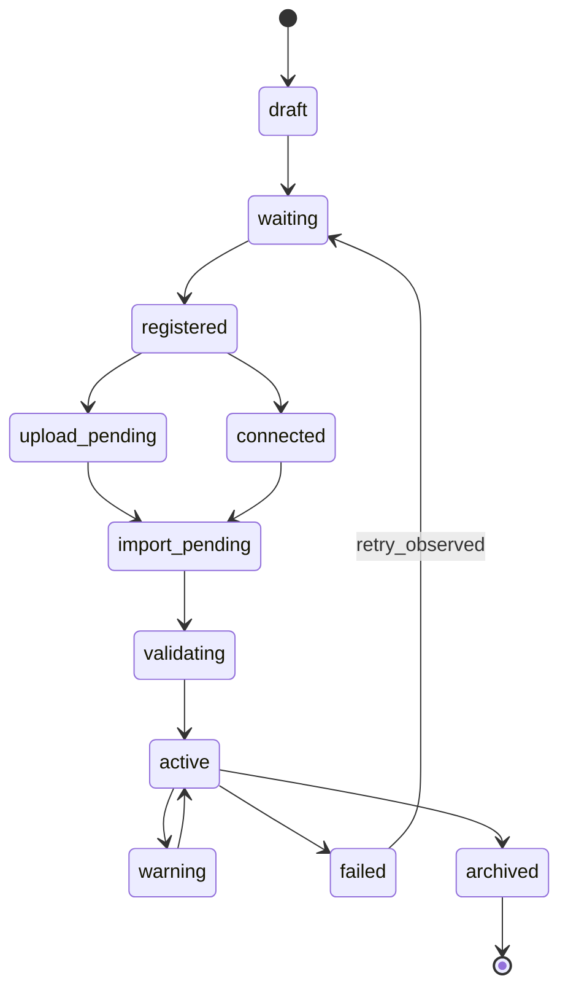
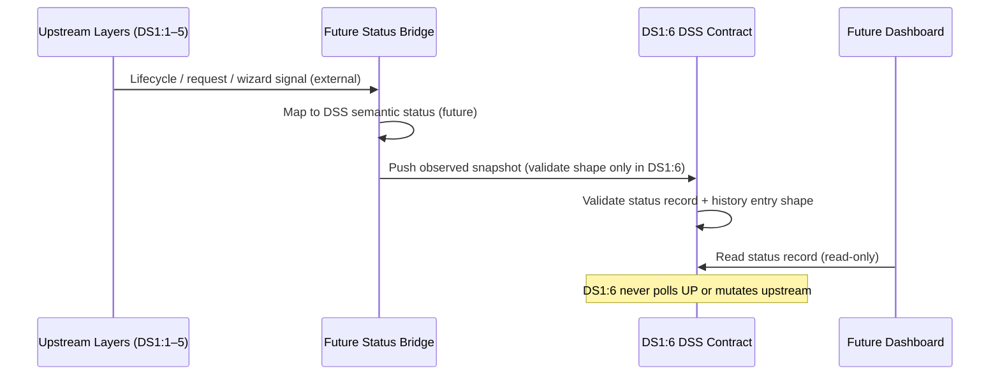

# DS1:6 — Data Source Status
## Stage-1 Understanding Report

**Project:** Nexora Type-C  
**Phase:** PHASE-2 / DS1:6  
**Title:** Data Source Status  
**Stage:** Stage-1 — Understand  
**Status:** UNDERSTANDING COMPLETE — **READY FOR STAGE-2 BUILD**

**Tags (proposed):** `[DS16_DATA_SOURCE_STATUS]` `[STATUS_OBSERVATION_LAYER]` `[WORKSPACE_STATUS_OWNED]` `[DS17_READY]`

---

## 0. Executive Summary

The **Data Source Status (DSS)** layer is a **library-only observation contract** that provides a unified, **read-only** view of the lifecycle and health of every Business Data Source intake flow within a workspace.

DSS **observes and reports** status derived from frozen upstream contracts — it never executes uploads, imports, validation, synchronization, registry mutation, polling, background work, UI rendering, or AI reasoning.

DSS sits **above** frozen DS1:1–DS1:5 layers as the **status vocabulary**, and **below** future Dashboard, Assistant, and Executive Timeline consumers that display observed status.

**STOP triggered:** **NO**  
**Frozen module modification required:** **NO**  
**Stage-2 Build:** **APPROVED** (additive `lib/dataSourceStatus/` contract files only)

---

## 1. Data Source Status Purpose

### What DSS is

| Attribute | Description |
|-----------|-------------|
| **Observation layer** | Read-only aggregation of source lifecycle and request progress |
| **Executive status vocabulary** | Semantic states managers understand (Active, Warning, Failed, etc.) |
| **Workspace-scoped** | Every status record belongs to exactly one workspace |
| **Request-correlated** | Links status to `businessDataSourceId`, `requestId`, wizard session ids |
| **History-capable** | Declares status history entries — no storage runtime in DS1:6 |
| **UI-independent** | No React, polling, workers, or dashboard logic in DS1:6 files |

### What DSS is NOT

| Excluded capability | Belongs to |
|---------------------|------------|
| Upload / import / validation execution | Future engines (forbidden) |
| Synchronization | Future Sync Engine (forbidden) |
| Registry mutation | DS:1:1 / NW-B:9-1 runtime (forbidden) |
| Polling / background jobs | Future status bridge runtime (forbidden) |
| Status inference via AI | INT-5 platform (forbidden) |
| Dashboard rendering | MRP / Dashboard (forbidden) |
| Assistant logic | Assistant runtime (forbidden) |
| Business Knowledge semantics | DS1:3 BKL (frozen — optional opaque ref only) |
| Request dispatch | Future Orchestrator (forbidden) |

### Distinction from existing surfaces

| Surface | Role | Relationship to DS1:6 |
|---------|------|------------------------|
| `sourceManagementContract` | Legacy dashboard source list (`disconnected` / `connected` / `error`) | **Parallel consumer** — DSS does not replace it; PHASE-2 status is richer |
| **DS1:1 EBDS** | Semantic source lifecycle | **Upstream signal** — `lifecycleState` observed read-only |
| **DS1:2 Adapter** | Registry bridge link state | **Upstream signal** — `adapterState` observed read-only |
| **DS1:4 IDSC** | Request coordination status | **Upstream signal** — `requestId` + request `status` observed |
| **DS1:5 MWI** | Wizard session + handoff targets | **Upstream signal** — wizard lifecycle + handoff ids observed |
| **Future Dashboard** | Displays status to executives | **Downstream consumer** — reads DSS records only |

---

## 2. Architecture Position

```
┌─────────────────────────────────────────────────────────────────┐
│  Future: Dashboard · Assistant · Executive Timeline (not DS1:6) │
│  Renders observed status — read-only consumers                  │
└────────────────────────────┬────────────────────────────────────┘
                             │ read-only status records
                             ▼
┌─────────────────────────────────────────────────────────────────┐
│  DS1:6 Data Source Status (NEW — observation only)            │
│  Aggregation · Health · Progress · Errors · Warnings · History  │
└──────┬──────────┬──────────┬──────────┬────────────────────────┘
       │ observe   │ observe  │ observe  │ observe
       ▼           ▼          ▼          ▼
┌──────────┐ ┌──────────┐ ┌──────────┐ ┌──────────┐
│ DS1:1    │ │ DS1:2    │ │ DS1:4    │ │ DS1:5    │
│ EBDS     │ │ Adapter  │ │ IDSC     │ │ MWI      │
│ (frozen) │ │ (frozen) │ │ (frozen) │ │ (frozen) │
└──────────┘ └──────────┘ └──────────┘ └──────────┘
       │
       │ future status bridge (NOT in DS1:6) — push observed snapshots
       ▼
┌─────────────────────────────────────────────────────────────────┐
│  Forbidden: Sync · Import · Parser · Validation · Registry I/O  │
└─────────────────────────────────────────────────────────────────┘
```

DSS is the **status observation vocabulary**. Frozen layers emit **signals**. Future bridge runtime **pushes snapshots** into DSS-shaped records. DSS **never pulls or mutates** upstream layers.

---

## 3. Status Ownership

### Authority chain

```
Workspace (authoritative owner)
    └── Data Source Status Record (1..N per workspace)
              └── correlates ──→ businessDataSourceId (DS1:1)
              └── correlates ──→ adapterLinkId (DS1:2, optional)
              └── correlates ──→ requestId(s) (DS1:4)
              └── correlates ──→ wizardSessionId (DS1:5, optional)
              └── history ──→ DataSourceStatusHistoryEntry[]
```

### Rules

1. **Every status record requires `workspaceId`** — no global/orphan status.
2. **`statusRecordId` stable** within workspace.
3. **Workspace isolation** — status in Workspace A invisible to Workspace B at contract level.
4. **Read-only toward upstream** — DSS stores opaque ids and observed snapshot fields only; never mutates EBDS, adapter, IDSC, or MWI.
5. **Observation source declared** — each record declares which upstream contract supplied the snapshot (`observationSource`).

### Ownership contract (Stage-2 preview)

```typescript
DataSourceStatusOwnershipContract = {
  statusRecordId: string;
  workspaceId: string;
  isolationPolicy: "workspace-exclusive";
}
```

---

## 4. Status Lifecycle

DSS defines **eleven executive semantic states** — distinct from but mappable to upstream lifecycles:

| DSS Status | Meaning | Typical upstream signals |
|------------|---------|--------------------------|
| `draft` | Intake not submitted | MWI `draft_saved`; IDSC request `draft` |
| `waiting` | Awaiting orchestrator action | IDSC request `pending` |
| `registered` | Semantic source acknowledged | EBDS `registered` |
| `upload_pending` | Upload requested, not complete | IDSC upload request `queued` / `in_progress` |
| `connected` | Connection channel established | EBDS `connected`; adapter `linked` |
| `import_pending` | Import requested, not complete | IDSC import request `queued` |
| `validating` | Validation in progress | IDSC validate request `in_progress` |
| `active` | Source available for downstream use | EBDS `active` |
| `warning` | Operational concern, not failed | Health indicator `degraded` |
| `failed` | Terminal failure | IDSC request `failed`; EBDS `suspended` |
| `archived` | Read-only historical | EBDS `archived` |



**Contract only** — no transition logic in DS1:6. Future bridge runtime maps upstream snapshots to DSS states.

---

## 5. Status Aggregation Model

DSS aggregates **multiple upstream signals** into one executive status view per source:

```typescript
// Conceptual
DataSourceStatusAggregation = {
  statusRecordId: string;
  workspaceId: string;
  businessDataSourceId: string;
  primaryStatus: DataSourceExecutiveStatus;     // one of 11 semantic states
  contributingSignals: readonly DataSourceStatusSignal[];
  aggregatedAt: string;                         // ISO — when snapshot was composed
  aggregationPolicy: "most_restrictive";        // contract declaration only
}
```

### Signal sources (read-only references)

| Signal Source | Observed Fields |
|---------------|-----------------|
| DS1:1 EBDS | `businessDataSourceId`, `lifecycleState` |
| DS1:2 Adapter | `adapterLinkId`, `adapterState` |
| DS1:4 IDSC | `requestId`, `requestType`, `status` |
| DS1:5 MWI | `wizardSessionId`, `lifecycleState`, handoff `requestId` |

### Aggregation policy (declarative)

| Priority | Rule |
|----------|------|
| 1 | Any `failed` signal → primary `failed` |
| 2 | Any `warning` health → primary `warning` (unless failed) |
| 3 | Most advanced in-progress state wins (validating > import_pending > connected > registered) |
| 4 | Default `waiting` when only pending requests exist |

DS1:6 defines **policy constants and validation** — not runtime aggregation execution.

---

## 6. Status Metadata

```typescript
// Conceptual
DataSourceStatusMetadata = {
  displayName: string | null;              // copied from observed EBDS hint
  connectorType: string | null;            // from IDSC sourceDescriptor hint
  executiveCategoryHint: string | null;
  lastObservedAt: string;                  // ISO
  observationSource: readonly string[];    // e.g. ["DS1:1", "DS1:4"]
  tags?: readonly string[];
  extension?: DataSourceStatusExtensionPoint;
}
```

---

## 7. Health Indicator Model

Health is **observed classification** — not computed by DSS:

```typescript
// Conceptual
DataSourceHealthIndicator = {
  healthState: "healthy" | "degraded" | "unhealthy" | "unknown";
  healthScoreHint: number | null;          // 0–100 declarative hint from bridge — not calculated here
  lastHealthCheckAt: string | null;
  healthSource: "observed";                  // always observed in v1
}
```

| Health State | Maps to DSS Status |
|--------------|-------------------|
| `healthy` | `active` or in-progress states |
| `degraded` | `warning` |
| `unhealthy` | `failed` |
| `unknown` | `waiting` or `draft` |

---

## 8. Progress Model

Progress is **declarative phase tracking** — not execution:

```typescript
// Conceptual
DataSourceProgressIndicator = {
  progressPhase:
    | "registration"
    | "upload"
    | "connection"
    | "import"
    | "validation"
    | "activation"
    | "complete";
  progressPercentHint: number | null;       // 0–100 — supplied by bridge, not computed in DS1:6
  activeRequestId: string | null;           // DS1:4 opaque ref
  progressLabel: string | null;             // e.g. "Validating schema"
}
```

No polling. Bridge pushes updated progress snapshots when upstream state changes.

---

## 9. Error Reporting Contract

```typescript
// Conceptual — read-only error observation
DataSourceStatusError = {
  errorId: string;
  statusRecordId: string;
  workspaceId: string;
  errorCode: string;
  errorMessage: string;                     // human-readable, no stack traces required
  relatedRequestId: string | null;
  observedAt: string;
  severity: "critical" | "error";
  source: "phase-2-data-source-status";
}
```

DSS records **observed errors** — it does not throw, retry, or remediate.

---

## 10. Warning Reporting Contract

```typescript
// Conceptual
DataSourceStatusWarning = {
  warningId: string;
  statusRecordId: string;
  workspaceId: string;
  warningCode: string;
  warningMessage: string;
  relatedRequestId: string | null;
  observedAt: string;
  severity: "low" | "medium" | "high";
  source: "phase-2-data-source-status";
}
```

Warnings elevate health to `degraded` and may map primary status to `warning`.

---

## 11. Status History Contract

```typescript
// Conceptual
DataSourceStatusHistoryEntry = {
  historyEntryId: string;
  statusRecordId: string;
  workspaceId: string;
  previousStatus: DataSourceExecutiveStatus | null;
  newStatus: DataSourceExecutiveStatus;
  triggerSource: "DS1:1" | "DS1:2" | "DS1:4" | "DS1:5" | "bridge";
  triggerReferenceId: string | null;        // opaque upstream id
  observedAt: string;
  source: "phase-2-data-source-status";
}
```

History is **append-only observation log shape** — no storage implementation in DS1:6.

---

## 12. Read-Only Integration with Frozen Layers

### DS1:1 — Executive Business Data Source

| Integration | Direction | Mechanism |
|-------------|-----------|-----------|
| Source identity | DSS ← EBDS | `businessDataSourceId` opaque ref |
| Lifecycle signal | DSS ← EBDS | `lifecycleState` mapped to DSS status |
| Display hint | DSS ← EBDS | `displayName` in metadata |

### DS1:2 — Workspace Registry Adapter

| Integration | Direction | Mechanism |
|-------------|-----------|-----------|
| Link state | DSS ← Adapter | `adapterLinkId` + `adapterState` observed |
| Bridge timing | Adapter `linked` → DSS `connected` hint | Mapping table in contract |

### DS1:4 — Input / Data Source Center

| Integration | Direction | Mechanism |
|-------------|-----------|-----------|
| Request progress | DSS ← IDSC | `requestId`, `requestType`, `status` |
| Phase tracking | IDSC status → progress phase | Declarative mapping table |
| Failure | IDSC `failed` → DSS `failed` | Direct mapping |

### DS1:5 — Manage Wizard Integration

| Integration | Direction | Mechanism |
|-------------|-----------|-----------|
| Wizard correlation | DSS ← MWI | `wizardSessionId`, `inputCenterSessionId` |
| Handoff tracking | DSS ← MWI | handoff `requestId` in contributing signals |
| Draft state | MWI `draft_saved` → DSS `draft` | Mapping hint |

**Constraint:** DS1:6 files must not import frozen contract files. Stage-2 uses parallel type definitions with documented field alignment and freeze-check prerequisites.

---

## 13. Future Compatibility

### Dashboard

| Concern | DSS provision |
|---------|---------------|
| Source list health | `DataSourceStatusRecord` + `healthIndicator` |
| Connection status | Primary status + progress phase |
| Error/warning display | Error and warning contracts |

### Assistant

| Concern | DSS provision |
|---------|---------------|
| Discussion context | Read-only status summary fields |
| No AI in DSS | MUST NOT OWN blocks reasoning |

### Executive Timeline

| Concern | DSS provision |
|---------|---------------|
| Event stream | `DataSourceStatusHistoryEntry` shape |
| Correlation | `triggerReferenceId` links to upstream ids |

### Import / Validation Engines (future)

| Concern | DSS provision |
|---------|---------------|
| Progress updates | Bridge pushes `import_pending` / `validating` snapshots |
| Failure reporting | Bridge pushes `DataSourceStatusError` records |

---

## 14. Architecture Diagram

```mermaid
flowchart TB
  subgraph consumers [Future Consumers — Read Only]
    DASH[Dashboard]
    ASST[Assistant]
    TIME[Executive Timeline]
  end

  subgraph dss [DS1:6 Data Source Status — NEW]
    REC[Status Record]
    AGG[Aggregation Model]
    HEALTH[Health Indicator]
    PROG[Progress Model]
    ERR[Error Contract]
    WARN[Warning Contract]
    HIST[History Contract]
  end

  subgraph frozen [Frozen Upstream — Observed Only]
    EBDS[DS1:1 EBDS]
    ADP[DS1:2 Adapter]
    IDSC[DS1:4 IDSC]
    MWI[DS1:5 MWI]
  end

  subgraph forbidden [Forbidden in DS1:6]
    SYNC[Synchronization]
    IMP[Import Engine]
    VAL[Validation Engine]
    REG[Registry Runtime]
    POLL[Polling / Workers]
  end

  EBDS -.->|snapshot| AGG
  ADP -.->|snapshot| AGG
  IDSC -.->|snapshot| AGG
  MWI -.->|snapshot| AGG

  AGG --> REC
  REC --> HEALTH
  REC --> PROG
  REC --> ERR
  REC --> WARN
  REC --> HIST

  REC -.-> DASH
  REC -.-> ASST
  HIST -.-> TIME

  forbidden -.x dss

  style forbidden fill:#fee,stroke:#c00
  style dss fill:#efe,stroke:#060
  style frozen fill:#eef,stroke:#006
```

---

## 15. Status Flow Diagram



---

## 16. Dependency Map

### Internal (Stage-2)

```
dataSourceStatusTypes.ts
        ↑
dataSourceStatusContract.ts
```

### External references (Stage-2)

| Dependency | Class | Usage |
|------------|-------|-------|
| Stage Architecture | external | Manifest validation via stage guards |
| DS1:1 freeze check | external read-only | `isExecutiveBusinessDataSourceFrozen()` |
| DS1:2 freeze check | external read-only | `isWorkspaceRegistryAdapterFrozen()` |
| DS1:4 freeze check | external read-only | `isInputDataSourceCenterFrozen()` |
| DS1:5 freeze check | external read-only | `isManageWizardIntegrationFrozen()` |
| WorkspaceId | external type | Opaque string — no workspace store import |

### Forbidden imports (DS1:6)

| Target | Reason |
|--------|--------|
| All frozen DS1:1–DS1:5 contract files | Parallel alignment only |
| `data-sources/*` | DS Registry Runtime frozen |
| `workspaceDataSourceRegistry` | Registry Runtime frozen |
| Parser / Import / Validation / Sync engines | Execution forbidden |
| `dashboardIntelligence/` | Dashboard frozen |
| `assistantRuntime` | Assistant frozen |
| `sourceManagementContract` | Legacy dashboard — not a library dependency |
| `.tsx` | UI forbidden |

### Future consumers

| Consumer | Relationship |
|----------|--------------|
| Status Bridge Runtime | Pushes observed snapshots into DSS record shapes |
| Dashboard | Reads `DataSourceStatusRecord` for display |
| Assistant | Reads status summary for discussion context |
| Executive Timeline | Reads `DataSourceStatusHistoryEntry` stream |

---

## 17. Risk Analysis

| Risk | Likelihood | Impact | Mitigation |
|------|:----------:|:------:|------------|
| DSS becomes polling/sync runtime | Medium | Critical | MUST NOT OWN + no worker imports in certification |
| Registry mutation in status layer | Medium | Critical | Read-only observation; registry paths blocked |
| Status drift from upstream contracts | Medium | High | Mapping tables documented; version alignment constants |
| Duplication with sourceManagementContract | Medium | Medium | DSS is PHASE-2 executive layer; legacy contract unchanged |
| AI inference of status | Low | Critical | MUST NOT OWN + INT paths blocked |
| Dashboard logic in contract files | Low | High | `.tsx` forbidden; dashboard paths blocked |
| Cross-workspace status leak | Low | Critical | Required `workspaceId` + isolation policy |
| Frozen layer import creep | Low | Critical | Forbidden patterns block all DS1:1–5 contracts |
| Polling for live updates | Medium | High | Observation push model; polling in MUST NOT OWN |

**No critical unmitigated risks.**

---

## 18. Architecture Smells (pre-build review)

| Smell | Severity | Notes |
|-------|----------|-------|
| 11 DSS states vs 8 EBDS states | Low | DSS is executive superset; mapping table clarifies |
| Parallel type definitions vs upstream | Low | Required — frozen files cannot be imported |
| Overlap with legacy SourceStatus | Medium | Documented distinction; consumers choose layer |
| Aggregation policy without runtime | None | By design — bridge owns execution |

**No STOP-triggering smells.**

---

## 19. STOP Rule Verification

| Proposed architecture requires | Present? | Verdict |
|--------------------------------|:--------:|---------|
| Polling | NO | PASS |
| Synchronization | NO | PASS |
| Upload execution | NO | PASS |
| Parser implementation | NO | PASS |
| Registry mutation | NO | PASS |
| AI reasoning | NO | PASS |
| Dashboard coupling | NO | PASS |
| Assistant coupling | NO | PASS |

### Independence verification

| Property | Verdict | Evidence |
|----------|---------|----------|
| Workspace-aware | **PASS** | Required `workspaceId` on all records |
| Read-only | **PASS** | Observation-only; no upstream mutation |
| Runtime-independent | **PASS** | No I/O, polling, or workers |
| Parser-independent | **PASS** | No parser imports |
| Intelligence-independent | **PASS** | No INT imports |
| Dashboard-independent | **PASS** | Library-only; dashboard as future consumer |

**No STOP required.**

---

## 20. Frozen Module Modification Verification

| Module | Modification Required? | Verdict |
|--------|:--------------------:|---------|
| DS1:1 EBDS | NO | Read-only signal reference |
| DS1:2 Adapter | NO | Read-only signal reference |
| DS1:3 BKL | NO | Not in primary integration list |
| DS1:4 IDSC | NO | Read-only request status reference |
| DS1:5 MWI | NO | Read-only wizard/handoff reference |
| Registry runtime | NO | Not imported |
| sourceManagementContract | NO | Not modified |
| Scene / MRP / Dashboard / Assistant | NO | Forbidden |

---

## 21. Expected File List

### Stage-1 (this stage)

| File | Status |
|------|--------|
| `docs/ds1-6-understanding-report.md` | Created |

### Stage-2 (Build — after approval)

| File | Est. lines | Responsibility |
|------|----------:|----------------|
| `dataSourceStatusTypes.ts` | ~240 | Status, health, progress, error, warning, history types |
| `dataSourceStatusContract.ts` | ~340 | Version, manifest, mapping tables, validation, examples |

### Stage-3 (Analyze — future)

| File | Responsibility |
|------|----------------|
| `dataSourceStatusDiagnostics.ts` | Status observation lifecycle events |
| `dataSourceStatusCertification.ts` | Certification + freeze |
| `dataSourceStatusCertification.test.ts` | Architecture tests |
| `docs/ds1-6-analysis-report.md` | Senior review |
| `docs/ds1-6-freeze-report.md` | Freeze declaration |

**Total Stage-2 estimate:** ~580 lines across 2 TypeScript files.

---

## 22. Certification Strategy

### DS1:6 Stage-3 gates (proposed)

| Gate | Validation |
|------|------------|
| A1 | Contract version and tags exported |
| A2 | Eleven executive status values defined |
| A3 | Four signal source types defined |
| A4 | Health and progress models defined |
| B1 | Self manifest validates |
| B2 | Module files in allowlist |
| B3 | Forbidden runtime paths blocked (engines, registry, INT, Scene, frozen contracts) |
| C1 | Dependency graph acyclic |
| C2 | EBDS frozen |
| C3 | Adapter frozen |
| C4 | IDSC frozen |
| C5 | MWI frozen |
| D1 | Status record example validates |
| D2 | History entry example validates |
| D3 | Error/warning examples validate |
| D4 | Workspace ownership required |
| E1 | MUST NOT OWN list documented (≥ 10 exclusions) |
| E2 | Read-only boundary locked |
| E3 | No polling/sync in MUST NOT OWN |
| F1 | Diagnostics operational |
| F2 | Minimum score threshold (95) |
| G1–G5 | Analysis freeze gates (match DS1:1–5 pattern) |

### Prerequisites

- `[EXECUTIVE_BUSINESS_DATASOURCE_CONTRACT_FROZEN]`
- `[WORKSPACE_DATASOURCE_REGISTRY_ADAPTER_FROZEN]`
- `[INPUT_DATASOURCE_CENTER_FROZEN]`
- `[MANAGE_WIZARD_INTEGRATION_FROZEN]`
- `[STAGE_ARCHITECTURE_FROZEN]`
- `[INT5_COMPLETE]`

### MUST NOT OWN list (proposed)

```
upload_execution, import_execution, validation_execution, synchronization,
registry_runtime, polling, background_jobs, business_knowledge, ai_reasoning,
intelligence, dashboard_rendering, assistant_logic
```

---

## 23. Stage Readiness Report

### Prerequisites

| Prerequisite | Status |
|--------------|--------|
| DS1:1 frozen | ✅ |
| DS1:2 frozen | ✅ |
| DS1:3 frozen | ✅ |
| DS1:4 frozen | ✅ |
| DS1:5 frozen | ✅ |
| Stage Architecture frozen | ✅ |
| INT-5 frozen | ✅ |
| No frozen module mutation in Stage-1 | ✅ |
| STOP rule clear | ✅ |
| No code written in Stage-1 | ✅ |

### Scores

| Dimension | Score | Notes |
|-----------|------:|-------|
| Architecture Understanding | 96 | Clear observation layer; upstream mapping defined |
| Complexity | 48 | Eleven states + aggregation + history; still library-only |
| Regression Risk | 6 | Additive path; zero runtime in Stage-1 |
| Maintainability | 94 | SRP; separate from upstream frozen layers |
| Scalability | 93 | History + extension model |
| Certification Readiness | 92 | Strategy defined; gates pending Stage-2 |
| **Overall (weighted)** | **94/100** | Stage-1 understanding target met |

Stage-2 implementation target: **≥ 95/100**

---

## 24. Stage Contract Proposal (Stage-2 manifest preview)

```typescript
{
  stageId: "PHASE-2/DS1:6",
  title: "Data Source Status",
  goal: "Library-only read-only observation contract for business data source lifecycle and health.",
  lifecycle: "build",
  allowedFiles: [
    "frontend/app/lib/dataSourceStatus/dataSourceStatusTypes.ts",
    "frontend/app/lib/dataSourceStatus/dataSourceStatusContract.ts",
  ],
  forbiddenPatterns: [
    ...STAGE_GLOBAL_FORBIDDEN_PATTERNS,
    "data-sources/",
    "dataSourceRegistryRuntime",
    "workspace/workspaceDataSourceRegistry.ts",
    "workspaceRegistryStore",
    "dashboardIntelligence/",
    "executiveIntelligencePlatform/",
    "assistantRuntime",
    "RelationshipRenderer",
    "executiveBusinessDataSourceContract.ts",
    "workspaceDataSourceRegistryAdapterContract.ts",
    "inputDataSourceCenterContract.ts",
    "manageWizardIntegrationContract.ts",
    "ParserEngine",
    "ImportEngine",
    "ValidationEngine",
    "SynchronizationEngine",
    ".tsx",
  ],
  prerequisites: ["DS1:1", "DS1:2", "DS1:4", "DS1:5", "STAGE-ARCH-3", "INT-5"],
  runtimePath: "library-only",
  tags: ["[DS16_DATA_SOURCE_STATUS]", "[DS17_READY]"],
}
```

---

## 25. Verdict

**Stage-1 Understanding: COMPLETE**

**Frozen module modification: NOT REQUIRED**

**STOP: NOT TRIGGERED**

**Stage-2 Build: APPROVED**

Proceed to **DS1:6 Stage-2 Build** — implement `dataSourceStatusTypes.ts` and `dataSourceStatusContract.ts` only.

No approval gate blocking Stage-2.
