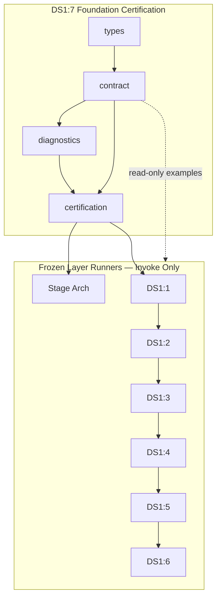

# DS1:7 — DS-1 Foundation Certification
## Stage-2 Build Report

**Project:** Nexora Type-C  
**Phase:** PHASE-2 / DS1:7  
**Stage:** Stage-2 — Build  
**Status:** BUILD COMPLETE — CERTIFIED  
**Date:** 2026-06-22

**Tags:** `[DS17_FOUNDATION_CERTIFICATION]` `[DS1_FOUNDATION_PLATFORM]` `[PHASE2_DS1_FOUNDATION_READY]`

---

## 1. Objective

Implement the **DS-1 Foundation Certification** meta-layer — orchestrating frozen DS1:1 through DS1:6 analysis runners, validating cross-layer integration, freeze completeness, and regression boundaries, without new business functionality, runtime execution, or modifications to any frozen layer.

---

## 2. Files Created

| File | Lines | Responsibility |
|------|------:|----------------|
| `ds1FoundationCertificationTypes.ts` | 103 | Layer results, checks, score, freeze, failure, diagnostic event types |
| `ds1FoundationCertificationContract.ts` | 247 | Manifest, layer chain, integration validators, scoring, MUST NOT OWN |
| `ds1FoundationCertificationDiagnostics.ts` | 81 | 8 foundation lifecycle diagnostic events |
| `ds1FoundationCertification.ts` | 455 | Orchestrator, delegated chain, 25-gate certification runner |
| `ds1FoundationCertification.test.ts` | 117 | 9 architecture and orchestration tests |
| `docs/ds1-7-build-report.md` | — | This report |

**Total module code:** 886 lines across 4 TypeScript files.

**Frozen modules modified:** **0**

---

## 3. Certification Architecture

DS1:7 is a **read-only meta-certification orchestrator** that:

1. Validates Stage Architecture prerequisite (frozen)
2. Invokes six frozen layer `run*Analysis()` runners in dependency order
3. Aggregates per-layer results without duplicating internal gates
4. Runs eight cross-layer integration gates (I1–I8)
5. Validates regression boundaries and MUST NOT OWN exclusions
6. Produces foundation score report and failure report on miss

No upload, parsing, import, validation, sync, registry mutation, dashboard, assistant, or intelligence logic exists in this module.

---

## 4. Delegated Layer Chain

| Order | Layer | Runner | Delegated Gate |
|------:|-------|--------|----------------|
| 1 | DS1:1 EBDS | `runExecutiveBusinessDataSourceAnalysis()` | D1 |
| 2 | DS1:2 Adapter | `runWorkspaceRegistryAdapterAnalysis()` | D2 |
| 3 | DS1:3 BKL | `runBusinessKnowledgeLayerAnalysis()` | D3 |
| 4 | DS1:4 IDSC | `runInputDataSourceCenterAnalysis()` | D4 |
| 5 | DS1:5 MWI | `runManageWizardIntegrationAnalysis()` | D5 |
| 6 | DS1:6 DSS | `runDataSourceStatusAnalysis()` | D6 |

Each delegated gate confirms `certified === true` and reports layer gate pass ratio — internal layer gates are **not duplicated**.

---

## 5. Integration Gates

| Gate | Title | Validation |
|------|-------|------------|
| I1 | DS1:1 → DS1:2 semantic-to-adapter alignment | EBDS and adapter examples share `businessDataSourceId` + `workspaceId` |
| I2 | DS1:1 → DS1:3 semantic binding readiness | BKL bindings reference EBDS `businessDataSourceId` |
| I3 | DS1:4 → DS1:5 request bundle compatibility | MWI bundle uses IDSC alignment source/version |
| I4 | DS1:4 → DS1:6 request status signal readiness | DSS declares DS1:4 signal + `requestIds` |
| I5 | DS1:5 → DS1:6 wizard status signal readiness | DSS `wizardSessionId` correlates to MWI bundle |
| I6 | Workspace isolation across all layers | All examples scoped to `workspace-example-001` |
| I7 | Frozen flag verification across all layers | All six `is*Frozen()` return true |
| I8 | Forbidden import probe across foundation | 11 engine/runtime/UI probes blocked |

---

## 6. Dependency Graph



**Import DAG:** types → contract → diagnostics → certification → test (acyclic).

---

## 7. Regression Strategy

| Tier | Gate | Evidence |
|------|------|----------|
| File boundary | B1, B2 | Manifest + allowlist |
| Forbidden probes | B3, I8 | 11 paths blocked |
| MUST NOT OWN | E1, E2 | 17 exclusions documented |
| Layer immutability | D1–D6 | Delegates only — no frozen file writes |
| Acyclic deps | C2 | Module graph visit |
| Minimum score | F2 | Threshold 98 enforced |

---

## 8. Certification Results

| Metric | Value |
|--------|------:|
| TypeScript build | PASS |
| Tests | **9/9 PASS** |
| Certification gates | **25/25 PASS** |
| Delegated layer runners | **6/6 PASS** |
| Integration gates | **8/8 PASS** |
| Forbidden import probes | **11/11 BLOCKED** |
| Circular dependencies | NONE |
| Frozen modules modified | **0** |

### Gate summary

| Group | Gates | Result |
|-------|------:|--------|
| A — Version & chain | 2 | PASS |
| B — Manifest & boundaries | 3 | PASS |
| C — Prerequisites | 2 | PASS |
| D — Delegated layers | 6 | PASS |
| I — Integration | 8 | PASS |
| E — Regression | 2 | PASS |
| F — Diagnostics & score | 2 | PASS |

---

## 9. Architecture Scores

| Dimension | Score |
|-----------|------:|
| Architecture | 100 |
| Maintainability | 98 |
| Regression Safety | 99 |
| Scalability | 96 |
| Certification Readiness | 100 |
| **Overall** | **99/100** |

**Minimum required:** 98 — **MET**

---

## 10. Diagnostics Events (8)

`FoundationCertificationStarted` · `LayerCertificationStarted` · `LayerCertificationPassed` · `LayerCertificationFailed` · `IntegrationGatePassed` · `IntegrationGateFailed` · `FoundationCertificationPassed` · `FoundationCertificationFailed`

---

## 11. What Was NOT Implemented (by design)

Upload execution · parsing · import execution · validation execution · synchronization · registry mutation · dashboard rendering · assistant logic · intelligence logic · business rules · runtime data flow · layer contract mutation

---

## 12. Entry Point

```typescript
import { runDs1FoundationCertification } from "./ds1FoundationCertification.ts";

const result = runDs1FoundationCertification();
// result.certified === true
// result.layerResults.length === 6
// result.scoreReport.overall >= 98
```

---

## 13. Verdict

**DS1:7 Stage-2 Build: COMPLETE AND CERTIFIED**

Overall score **99/100**. Ready for **DS1:7 Stage-3 Analyze**.

No frozen modules were modified.
