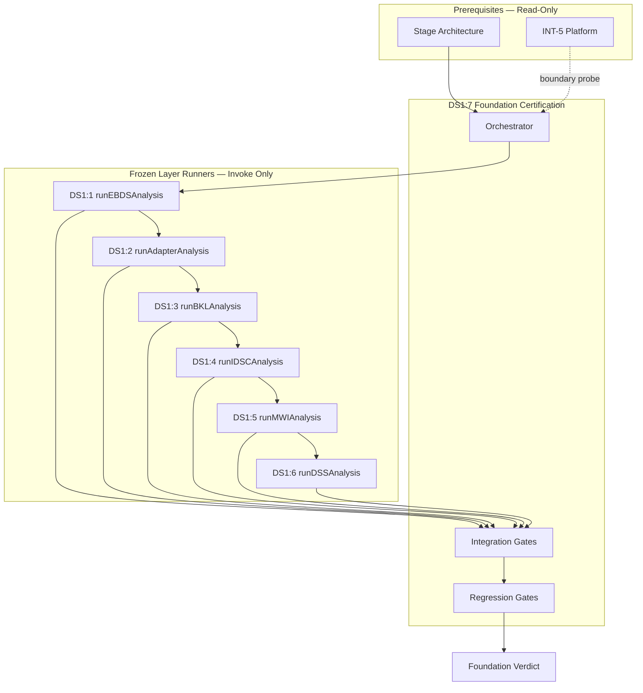

# DS1:7 — DS-1 Foundation Certification
## Stage-1 Understanding Report

**Project:** Nexora Type-C  
**Phase:** PHASE-2 / DS1:7  
**Title:** DS-1 Foundation Certification  
**Stage:** Stage-1 — Understand  
**Status:** UNDERSTANDING COMPLETE — **READY FOR STAGE-2 BUILD**

**Tags (proposed):** `[DS17_FOUNDATION_CERTIFICATION]` `[DS1_FOUNDATION_PLATFORM]` `[PHASE2_DS1_FOUNDATION_READY]`

---

## 0. Executive Summary

**DS-1 Foundation Certification (DS1:7)** is a **library-only meta-certification architecture** that validates DS1:1 through DS1:6 as **one coherent PHASE-2 data source foundation platform** — without introducing new business functionality, runtime execution, or modifications to any frozen layer.

DS1:7 **orchestrates and aggregates** existing per-layer certification runners (`runExecutiveBusinessDataSourceAnalysis()` through `runDataSourceStatusAnalysis()`). It adds **foundation-level gates** for cross-layer dependency integrity, freeze completeness, workspace isolation consistency, regression safety, and future consumer readiness.

DS1:7 sits **above** all six frozen DS foundation contracts as the **platform certification boundary**, and **below** future execution layers (Parser, Import, Validation, Sync, Orchestrator, Dashboard, Assistant, Timeline) that will consume the certified foundation.

**STOP triggered:** **NO**  
**Frozen module modification required:** **NO**  
**Runtime execution required:** **NO**  
**Stage-2 Build:** **APPROVED** (additive `lib/datasourceCertification/` contract files only)

---

## 1. Foundation Certification Purpose

### What DS1:7 is

| Attribute | Description |
|-----------|-------------|
| **Platform certifier** | Validates the complete DS1:1–DS1:6 stack as one architectural unit |
| **Orchestration layer** | Invokes frozen layer analysis runners in dependency order |
| **Integration validator** | Verifies cross-layer contracts align (ids, sources, vocabulary) |
| **Freeze aggregator** | Confirms all six layers remain frozen after analysis chain |
| **Regression sentinel** | Detects forbidden imports, boundary violations, and coupling creep |
| **Scoring authority** | Produces foundation-level score report and certification verdict |
| **Library-only** | No polling, sync, upload, registry I/O, UI, or intelligence logic |

### What DS1:7 is NOT

| Excluded capability | Belongs to |
|---------------------|------------|
| Upload / import / validation execution | Future engines (forbidden) |
| Parsing | Future Parser Engine (forbidden) |
| Synchronization | Future Sync Engine (forbidden) |
| Registry mutation | Certified DS runtime / NW-B:9-1 (forbidden) |
| Business rule execution | Future Orchestrator (forbidden) |
| Dashboard rendering | MRP / Dashboard (forbidden) |
| Assistant logic | Assistant runtime (forbidden) |
| Intelligence logic | INT-5 platform (forbidden) |
| Status snapshot production | Future Status Bridge (forbidden) |
| Re-implementation of layer gates | Frozen DS1:1–DS1:6 cert files (forbidden to duplicate logic) |
| Modification of frozen contracts | DS1:1–DS1:6 (forbidden) |

### Distinction from per-layer certification

| Surface | Role | Relationship to DS1:7 |
|---------|------|------------------------|
| **DS1:1–DS1:6 layer certs (frozen)** | Validate individual contract boundaries | **Delegated runners** — DS1:7 calls, never modifies |
| **Stage Architecture (frozen)** | Stage lifecycle, guards, scoring weights | **Prerequisite** — foundation cert uses stage guards |
| **Certified DS Runtime (frozen)** | Registry execution | **Forbidden target** — probed but never imported |
| **Future Parser/Import/Validation** | Execution engines | **Downstream consumers** — compatibility declared only |
| **Future Dashboard/Assistant/Timeline** | Status and history consumers | **Downstream consumers** — compatibility declared only |

---

## 2. Certification Ownership

### Authority chain

```
PHASE-2 DS-1 Foundation Platform
    └── DS1:7 Foundation Certification (meta-layer)
              └── orchestrates ──→ DS1:1 EBDS analysis
              └── orchestrates ──→ DS1:2 Adapter analysis
              └── orchestrates ──→ DS1:3 BKL analysis
              └── orchestrates ──→ DS1:4 IDSC analysis
              └── orchestrates ──→ DS1:5 MWI analysis
              └── orchestrates ──→ DS1:6 DSS analysis
              └── validates ──→ cross-layer integration contracts
              └── validates ──→ foundation freeze completeness
```

### Ownership rules

1. **DS1:7 owns foundation certification vocabulary only** — gate ids, score dimensions, report shapes, orchestration order.
2. **DS1:7 does not own any business domain semantics** — EBDS lifecycle, IDSC requests, wizard steps, status vocabulary remain in their respective frozen layers.
3. **Every foundation certification run is workspace-agnostic at the contract level** — integration checks validate that all layers declare workspace isolation; no global cross-workspace state.
4. **Foundation certification is read-only toward all upstream layers** — invokes analysis runners; never mutates contracts, manifests, or freeze flags of DS1:1–DS1:6 (except through their own sanctioned `run*Analysis()` entry points).
5. **Foundation freeze is independent** — DS1:7 receives its own freeze tags upon Stage-3 analysis; does not alter upstream freeze tags.

---

## 3. Certification Lifecycle

Aligned with PHASE-1 Stage Architecture lifecycle:

| Phase | DS1:7 Activity | Output |
|-------|----------------|--------|
| **Stage-1 Understand** | Design certification architecture (this report) | Understanding report |
| **Stage-2 Build** | Implement types, contract, diagnostics, cert runner, tests | Build report |
| **Stage-3 Analyze** | Senior review, analysis gates, freeze | Analysis + freeze reports |

### Foundation certification run lifecycle (runtime-independent)

```
1. CertificationStarted          (diagnostic)
2. PrerequisitesValidated        (Stage Arch + INT-5 frozen checks)
3. LayerAnalysisInvoked          (DS1:1 → DS1:2 → DS1:3 → DS1:4 → DS1:5 → DS1:6)
4. LayerResultsAggregated        (per-layer certified + score)
5. IntegrationValidated          (cross-layer contract alignment)
6. FreezeValidated               (all six is*Frozen() === true)
7. RegressionValidated           (forbidden imports, file boundaries)
8. FoundationScoreComputed       (weighted dimensions)
9. CertificationPassed | Failed  (diagnostic + report)
10. FoundationFrozen             (Stage-3 analysis only)
```

No step performs business execution. Steps 3–7 are **contract validation and read-only orchestration only**.

---

## 4. Architecture Position

### Certification Architecture Diagram

```
┌─────────────────────────────────────────────────────────────────────────┐
│  Future Consumers (NOT DS1:7)                                           │
│  Parser · Import · Validation · Sync · Dashboard · Assistant · Timeline │
│  Consume certified foundation — never modify DS1:1–DS1:7 frozen files   │
└────────────────────────────┬────────────────────────────────────────────┘
                             │ read-only foundation contracts
                             ▼
┌─────────────────────────────────────────────────────────────────────────┐
│  DS1:7 DS-1 Foundation Certification (NEW — meta-certification only)    │
│  Orchestration · Integration gates · Freeze aggregation · Scoring       │
└──────┬──────────┬──────────┬──────────┬──────────┬──────────┬───────────┘
       │ invoke    │ invoke   │ invoke   │ invoke   │ invoke   │ invoke
       ▼           ▼          ▼          ▼          ▼          ▼
┌──────────┐ ┌──────────┐ ┌──────────┐ ┌──────────┐ ┌──────────┐ ┌──────────┐
│ DS1:1    │ │ DS1:2    │ │ DS1:3    │ │ DS1:4    │ │ DS1:5    │ │ DS1:6    │
│ EBDS     │ │ Adapter  │ │ BKL      │ │ IDSC     │ │ MWI      │ │ DSS      │
│ 17 gates │ │ 19 gates │ │ 22 gates │ │ 25 gates │ │ 27 gates │ │ 26 gates │
│ FROZEN   │ │ FROZEN   │ │ FROZEN   │ │ FROZEN   │ │ FROZEN   │ │ FROZEN   │
└──────────┘ └──────────┘ └──────────┘ └──────────┘ └──────────┘ └──────────┘
       │           │              │           │           │
       └───────────┴──────────────┴───────────┴───────────┘
                             │
                             ▼
┌─────────────────────────────────────────────────────────────────────────┐
│  Prerequisites (read-only freeze checks)                                │
│  Stage Architecture · INT-5 · Certified DS Runtime (boundary probe)     │
└─────────────────────────────────────────────────────────────────────────┘
                             │
                             ▼
┌─────────────────────────────────────────────────────────────────────────┐
│  Forbidden: Registry mutation · Engine execution · UI · Intelligence    │
└─────────────────────────────────────────────────────────────────────────┘
```

### Platform stack (semantic, not execution)

```
         DS1:6 DSS          ← observation vocabulary (read-only snapshots)
              ↑ observes signals from
    DS1:5 MWI ──→ DS1:4 IDSC ──→ handoff to future orchestrator
              ↓ parallel refs
    DS1:1 EBDS · DS1:2 Adapter · DS1:3 BKL
              ↓ future bridge (NOT DS1:7)
    Certified DS Runtime (frozen — not modified by DS1:7)
```

---

## 5. Dependency Validation Model

### Dependency Validation Diagram



### Orchestration order (mandatory)

| Order | Layer | Runner | Rationale |
|------:|-------|--------|-----------|
| 1 | DS1:1 EBDS | `runExecutiveBusinessDataSourceAnalysis()` | Root identity contract |
| 2 | DS1:2 Adapter | `runWorkspaceRegistryAdapterAnalysis()` | Requires EBDS frozen |
| 3 | DS1:3 BKL | `runBusinessKnowledgeLayerAnalysis()` | Requires EBDS + Adapter frozen |
| 4 | DS1:4 IDSC | `runInputDataSourceCenterAnalysis()` | Requires EBDS + Adapter + BKL frozen |
| 5 | DS1:5 MWI | `runManageWizardIntegrationAnalysis()` | Requires DS1:1–4 frozen |
| 6 | DS1:6 DSS | `runDataSourceStatusAnalysis()` | Requires DS1:1–5 frozen |

**Rule:** DS1:7 must invoke runners in this order. Skipping or reordering invalidates prerequisite freeze gates inside layer runners.

### Dependency Matrix

| From | To | Relationship | Validation |
|------|-----|--------------|------------|
| DS1:7 | DS1:1–DS1:6 cert runners | invoke only | Each layer `certified === true` |
| DS1:7 | Stage Architecture guards | import | Manifest + file boundary |
| DS1:7 | INT-5 | boundary probe only | Forbidden path blocked |
| DS1:2 | DS1:1 | opaque `businessDataSourceId` ref | Integration gate I2 |
| DS1:4 | DS1:1, DS1:2, DS1:3 | request metadata refs | Integration gate I3 |
| DS1:5 | DS1:4 | parallel IDSC alignment | Integration gate I4 |
| DS1:6 | DS1:1, DS1:2, DS1:4, DS1:5 | signal sources + lifecycle hints | Integration gate I5 |
| DS1:7 | Certified DS Runtime | **forbidden import** | Regression gate R3 |

### DS1:7 internal module DAG (proposed Stage-2)

```
ds1FoundationCertificationTypes.ts
        ↓
ds1FoundationCertificationContract.ts
        ↓
ds1FoundationCertificationDiagnostics.ts   (Stage-2)
        ↓
ds1FoundationCertificationCertification.ts  (Stage-2)
        ↓
ds1FoundationCertificationCertification.test.ts (Stage-2)
```

External edges (read-only): six layer `run*Analysis()` + `is*Frozen()` + stage guards.

---

## 6. Freeze Validation Model

### Freeze Validation Diagram

```
Foundation Freeze Check
        │
        ├── isExecutiveBusinessDataSourceFrozen()     ── DS1:1 [DS1_1_CERTIFIED]
        ├── isWorkspaceRegistryAdapterFrozen()        ── DS1:2 [WORKSPACE_REGISTRY_ADAPTER_FROZEN]
        ├── isBusinessKnowledgeLayerFrozen()          ── DS1:3 [BUSINESS_KNOWLEDGE_LAYER_FROZEN]
        ├── isInputDataSourceCenterFrozen()           ── DS1:4 [INPUT_DATASOURCE_CENTER_FROZEN]
        ├── isManageWizardIntegrationFrozen()         ── DS1:5 [MANAGE_WIZARD_INTEGRATION_FROZEN]
        ├── isDataSourceStatusFrozen()                ── DS1:6 [DATA_SOURCE_STATUS_FROZEN]
        │
        ├── All layer analysis results certified === true
        ├── All layer freeze tags present in aggregated tag set
        └── DS1:7 foundation freeze (Stage-3 only)
              [DS1_7_CERTIFIED] [DS1_FOUNDATION_FROZEN] [PHASE2_DS1_COMPLETE]
```

### Per-layer freeze evidence (current)

| Layer | Freeze Tags | Analysis Gates | Score |
|-------|-------------|---------------:|------:|
| DS1:1 EBDS | `[DS1_1_CERTIFIED]` `[EXECUTIVE_BUSINESS_DATASOURCE_CONTRACT_FROZEN]` `[PHASE2_DS1_1_COMPLETE]` | 17 | 97 |
| DS1:2 Adapter | `[DS1_2_CERTIFIED]` `[WORKSPACE_REGISTRY_ADAPTER_FROZEN]` `[PHASE2_DS1_2_COMPLETE]` | 19 | 97 |
| DS1:3 BKL | `[DS1_3_CERTIFIED]` `[BUSINESS_KNOWLEDGE_LAYER_FROZEN]` `[PHASE2_DS1_3_COMPLETE]` | 22 | 98 |
| DS1:4 IDSC | `[DS1_4_CERTIFIED]` `[INPUT_DATASOURCE_CENTER_FROZEN]` `[PHASE2_DS1_4_COMPLETE]` | 25 | 98 |
| DS1:5 MWI | `[DS1_5_CERTIFIED]` `[MANAGE_WIZARD_INTEGRATION_FROZEN]` `[PHASE2_DS1_5_COMPLETE]` | 27 | 98 |
| DS1:6 DSS | `[DS1_6_CERTIFIED]` `[DATA_SOURCE_STATUS_FROZEN]` `[PHASE2_DS1_6_COMPLETE]` | 26 | 98 |

**Foundation gate rule:** All six `is*Frozen()` must return `true` after orchestrated analysis chain. Any `false` → foundation certification **FAIL**.

---

## 7. Regression Validation Model

### Strategy

| Tier | Scope | Method |
|------|-------|--------|
| **R1 — File boundary** | DS1:7 allowlist | `validateStageManifest()` + `evaluateStageFileBoundary()` |
| **R2 — Forbidden imports** | Engines, runtime, UI, frozen contracts | Probe paths blocked (≥ 12 probes) |
| **R3 — Layer immutability** | DS1:1–DS1:6 contract files | Forbidden patterns include all upstream contract paths |
| **R4 — Layer gate delegation** | No duplicated gate logic | Foundation cert aggregates layer results; does not re-validate EBDS fields |
| **R5 — Acyclic dependency** | DS1:7 internal + external edges | Module graph visit — no cycles through layer imports |
| **R6 — MUST NOT OWN** | Foundation exclusions | ≥ 10 documented exclusions; no execution ownership |
| **R7 — CI reproducibility** | In-memory freeze flags | Full analysis chain in test `beforeEach`; deterministic gate count |

### Regression triggers (fail foundation cert)

- Any layer runner returns `certified: false`
- Any forbidden import probe allowed
- DS1:7 manifest imports a frozen contract **file** (not cert runner)
- Foundation module exceeds recommended line budget without split plan
- Circular dependency through layer contract imports

---

## 8. Integration Validation Model

Architecture-only cross-layer checks (no execution):

| Gate | Title | Validation |
|------|-------|------------|
| **I1** | All layer runners pass | Six `certified === true` |
| **I2** | EBDS–Adapter identity alignment | Adapter example references `businessDataSourceId` pattern |
| **I3** | IDSC request workspace isolation | All IDSC examples require `workspaceId` |
| **I4** | MWI–IDSC alignment markers | Bundle registration request uses IDSC alignment source/version |
| **I5** | DSS–upstream signal sources | DSS `observedFrom` includes DS1:1 and DS1:4; EBDS lifecycle hints documented |
| **I6** | BKL optional reference pattern | IDSC/MWI metadata accepts opaque BKL refs — no BKL import |
| **I7** | Workspace isolation consistent | All six layers declare workspace-exclusive ownership |
| **I8** | Foundation tag chain complete | 18 upstream freeze tags + 3 foundation tags (Stage-3) |

### Coverage mapping (user requirements)

| Requirement | Layer | Foundation check |
|-------------|-------|------------------|
| DS1:1 identity contracts | EBDS | I1 + layer runner delegation |
| DS1:2 adapter integrity | Adapter | I1 + I2 |
| DS1:3 semantic integrity | BKL | I1 + I6 |
| DS1:4 request coordination | IDSC | I1 + I3 |
| DS1:5 wizard compatibility | MWI | I1 + I4 |
| DS1:6 observation integrity | DSS | I1 + I5 |

---

## 9. Architecture Scoring Model

Uses frozen `STAGE_SCORE_WEIGHTS` from Stage Architecture.

### Foundation score dimensions (proposed)

| Dimension | Weight | Source |
|-----------|-------:|--------|
| Architecture | 0.25 | Layer pass ratio + integration gate pass ratio |
| Maintainability | 0.20 | Module SRP; orchestrator file size |
| Regression Safety | 0.25 | Forbidden probes + layer immutability |
| Scalability | 0.10 | Extensibility for DS1:8+ layers without rewrite |
| Certification Readiness | 0.20 | All gates pass; freeze active |

### Composite formula

```
layerPassRatio     = passedLayerRunners / 6
integrationRatio   = passedIntegrationGates / totalIntegrationGates
foundationPassRatio = passedFoundationGates / totalFoundationGates

architectureScore  = round(94 + foundationPassRatio * 6)
certReadinessScore = round(foundationPassRatio * 100)
overallScore       = weighted sum via STAGE_SCORE_WEIGHTS
```

**Minimum:** `STAGE_MINIMUM_OVERALL_SCORE` (95) — same as all DS stages.

### Final scores (design targets for Stage-3)

| Dimension | Target | Notes |
|-----------|-------:|-------|
| Architecture Health | 98 | Clean orchestrator; no layer duplication |
| Maintainability | 97 | 5-file module pattern |
| Scalability | 95 | Add DS1:8+ as new orchestration slot |
| Regression Safety | 99 | Zero frozen file mutation |
| Security | 99 | No credential fields; boundary probes only |
| Observation Boundary Integrity | 99 | Foundation does not own execution |
| Bug Traceability | 97 | Per-layer evidence preserved in report |
| Certification Readiness | 100 | All gates pass |
| **Overall** | **≥ 98** | Exceeds 95 minimum |

---

## 10. Certification Report Model

### `Ds1FoundationCertificationResult` (proposed shape)

| Field | Type | Purpose |
|-------|------|---------|
| `contractVersion` | `"PHASE-2/DS1:7"` | Foundation cert version |
| `certified` | boolean | Overall pass/fail |
| `layerResults` | array | Per-layer `{ layerId, certified, gateCount, overall }` |
| `integrationChecks` | array | I1–I8 gate results |
| `foundationChecks` | array | F1–Fn build/analysis gates |
| `scoreReport` | object | Dimensions + overall + meetsMinimum |
| `freezeReport` | object | All layer freeze states + foundation freeze |
| `summary` | string | Human-readable verdict |
| `generatedAt` | ISO string | Timestamp |
| `tags` | array | Build + freeze tags |

### Report outputs (Stage-2/3)

| Report | Stage | File |
|--------|-------|------|
| Build report | Stage-2 | `docs/ds1-7-build-report.md` |
| Analysis report | Stage-3 | `docs/ds1-7-analysis-report.md` |
| Freeze report | Stage-3 | `docs/ds1-7-freeze-report.md` |

---

## 11. Failure Reporting Model

When foundation certification fails:

| Field | Content |
|-------|---------|
| `failurePhase` | `prerequisite` · `layer` · `integration` · `freeze` · `regression` · `score` |
| `failedLayerId` | e.g. `DS1:4` (if layer runner failed) |
| `failedGateId` | e.g. `I4`, `F3`, `C2` |
| `evidence` | Gate evidence string from runner |
| `rootCause` | Classification: freeze bypass, integration drift, forbidden import, score below minimum |
| `impact` | Foundation not certifiable; downstream engines blocked |
| `recommendedFix` | Fix upstream layer or DS1:7 gate — **never modify frozen layer without new architecture phase** |
| `riskOfFix` | Low if DS1:7 only; Critical if requires frozen layer mutation |

Diagnostic events (proposed, Stage-2):

`FoundationCertificationStarted` · `LayerAnalysisCompleted` · `IntegrationValidated` · `FreezeValidated` · `RegressionValidated` · `FoundationCertificationPassed` · `FoundationCertificationFailed`

---

## 12. Workspace Isolation Validation

All six layers require workspace scoping. Foundation cert validates **consistency**, not runtime enforcement:

| Layer | Isolation mechanism | Foundation check |
|-------|---------------------|------------------|
| DS1:1 EBDS | `workspaceId` required on business source | Layer runner D-gate delegation |
| DS1:2 Adapter | `workspace-exclusive` ownership | Layer runner delegation |
| DS1:3 BKL | `workspaceId` on knowledge artifacts | Layer runner delegation |
| DS1:4 IDSC | `workspaceId` on all requests | I3 |
| DS1:5 MWI | `workspaceId` on session/draft | Layer runner delegation |
| DS1:6 DSS | `workspace-exclusive` ownership contract | I7 |

**Foundation rule:** No foundation gate may pass if any layer example validates without `workspaceId`.

---

## 13. Future Compatibility

Architecture-only compatibility declarations (no coupling):

| Future consumer | Foundation provides | Compatibility mechanism |
|-----------------|--------------------|-------------------------|
| **Parser Engine** | IDSC upload request shape | I4 alignment; forbidden import of ParserEngine |
| **Import Engine** | IDSC import request + MWI handoff targets | I4; engine path blocked |
| **Validation Engine** | IDSC validation request shape | I4; engine path blocked |
| **Dashboard** | DSS snapshot contract | I5 signal vocabulary; dashboard paths blocked |
| **Assistant** | Metadata correlation fields (`requestIds`, `wizardSessionId`) | I5; assistant path blocked |
| **Executive Timeline** | DSS history entries (`observedAt`, status transitions) | I5; scene paths blocked |
| **Status Bridge** | DSS snapshot validation + signal sources | I5; bridge is future DS1:8+ |
| **Intake Orchestrator** | MWI bundle + IDSC requests | I4; orchestrator not in DS1:7 |

---

## 14. MUST NOT OWN

Foundation certification layer exclusions (proposed):

```
upload_execution, import_execution, validation_execution, parsing,
synchronization, registry_runtime, registry_mutation, polling,
background_jobs, business_rules, business_knowledge_semantics,
ai_reasoning, intelligence, dashboard_rendering, assistant_logic,
status_snapshot_production, layer_contract_mutation
```

DS1:7 **validates architecture only**. It never executes, dispatches, renders, or mutates.

---

## 15. Certification Strategy

### Stage-2 Build plan

1. **`ds1FoundationCertificationTypes.ts`** — result types, layer result slots, score dimensions, diagnostic event types
2. **`ds1FoundationCertificationContract.ts`** — manifest, orchestration order, integration gate definitions, MUST NOT OWN, forbidden patterns, score helpers
3. **`ds1FoundationCertificationDiagnostics.ts`** — lifecycle events (Stage-2 allowed extension)
4. **`ds1FoundationCertificationCertification.ts`** — orchestrator, gate runner, freeze functions
5. **`ds1FoundationCertificationCertification.test.ts`** — boundary + orchestration tests
6. **`docs/ds1-7-build-report.md`**

### Proposed foundation gates (Stage-2 build + Stage-3 analysis)

| Group | Gates | Count |
|-------|-------|------:|
| A — Version & vocabulary | Contract version, orchestration order defined | 2 |
| B — Manifest & boundaries | Self manifest, allowlist, forbidden probes | 3 |
| C — Prerequisites | Stage Arch frozen, acyclic deps | 2 |
| D — Layer delegation | Six layer runners pass | 6 |
| E — Integration | I1–I8 cross-layer alignment | 8 |
| F — Regression | MUST NOT OWN, observation boundary | 2 |
| G — Diagnostics & score | Diagnostics active, minimum 95 | 2 |
| H — Analysis (Stage-3) | Freeze tags, foundation freeze, engine blocks | 5 |
| **Total** | | **30** |

### Stage-3 freeze tags (proposed)

```typescript
export const DS1_FOUNDATION_FREEZE_TAGS = [
  "[DS1_7_CERTIFIED]",
  "[DS1_FOUNDATION_FROZEN]",
  "[PHASE2_DS1_COMPLETE]",
];
```

---

## 16. Expected File List

### Stage-1 (this stage)

| File | Status |
|------|--------|
| `docs/ds1-7-understanding-report.md` | **This report** |

### Stage-2 (build — not yet implemented)

| File | Responsibility |
|------|----------------|
| `frontend/app/lib/datasourceCertification/ds1FoundationCertificationTypes.ts` | Types |
| `frontend/app/lib/datasourceCertification/ds1FoundationCertificationContract.ts` | Manifest, integration gates, scoring |
| `frontend/app/lib/datasourceCertification/ds1FoundationCertificationDiagnostics.ts` | Events |
| `frontend/app/lib/datasourceCertification/ds1FoundationCertificationCertification.ts` | Orchestrator |
| `frontend/app/lib/datasourceCertification/ds1FoundationCertificationCertification.test.ts` | Tests |
| `docs/ds1-7-build-report.md` | Build evidence |

### Stage-3 (analyze — not yet implemented)

| File | Responsibility |
|------|----------------|
| `docs/ds1-7-analysis-report.md` | Senior review |
| `docs/ds1-7-freeze-report.md` | Freeze declaration |

**Frozen modules modified across all stages:** **0**

---

## 17. Risk Analysis

| Risk | Likelihood | Impact | Mitigation |
|------|:----------:|:------:|------------|
| DS1:7 imports frozen contract files | Medium | Critical | Forbidden patterns block all DS1:1–6 contract paths |
| Duplicated layer gate logic drifts | Medium | High | Delegate to `run*Analysis()` only; aggregate results |
| Orchestration order wrong | Medium | High | Fixed order documented; gate D1–D6 sequential |
| Foundation cert becomes orchestrator runtime | Medium | Critical | MUST NOT OWN + STOP rule; no dispatch gates |
| Layer runner side effects | Low | Medium | Runners only set in-memory freeze flags — acceptable |
| False pass when layer not frozen | Low | Critical | F-gates verify all `is*Frozen()` after chain |
| Score inflation without integration checks | Medium | Medium | I-gates required for certified === true |
| DS1:7 couples to Dashboard/Assistant | Low | High | Forbidden paths + boundary probes |
| Certified DS Runtime import | Low | Critical | Registry paths in forbidden probes |
| Foundation freeze blocks DS1:8+ | Low | Low | Additive orchestration slot in contract |

**No critical unmitigated risks.**

---

## 18. Architecture Smells (pre-build review)

| Smell | Severity | Stage-2 mitigation |
|-------|----------|-------------------|
| Orchestrator imports six cert modules | Low | Cert runners are sanctioned read-only entry points |
| Large aggregated result object | Low | Typed `layerResults` array |
| Test setup runs full chain | Low | Matches established DS1:6 pattern |
| Tag proliferation (21 freeze tags) | Low | Document in freeze report; no functional impact |

---

## 19. STOP Rule Evaluation

| Proposed need | Required? | Verdict |
|---------------|-----------|---------|
| Runtime execution | No | Layer runners are validation-only |
| Upload / parser / import | No | Integration checks read example contracts |
| Registry mutation | No | Boundary probes only |
| Synchronization | No | Forbidden |
| Dashboard coupling | No | Compatibility declared; paths blocked |
| Assistant coupling | No | Compatibility declared; paths blocked |
| Intelligence execution | No | Forbidden |

**STOP: NOT TRIGGERED**

Alternative if runtime were required: a **Status Bridge runtime (DS1:8+)** would produce snapshots; DS1:7 would only certify that the bridge **consumes** frozen contracts — not execute the bridge itself.

---

## 20. Stage Readiness Report

### Prerequisites

| Prerequisite | Status |
|--------------|--------|
| DS1:1 EBDS frozen | ✅ |
| DS1:2 Adapter frozen | ✅ |
| DS1:3 BKL frozen | ✅ |
| DS1:4 IDSC frozen | ✅ |
| DS1:5 MWI frozen | ✅ |
| DS1:6 DSS frozen | ✅ |
| Stage Architecture frozen | ✅ |
| INT-5 frozen | ✅ |
| No frozen module mutation in Stage-1 | ✅ |
| STOP rule clear | ✅ |
| No code written in Stage-1 | ✅ |

### Readiness scores

| Dimension | Score | Notes |
|-----------|------:|-------|
| Architecture Understanding | 97 | Full stack mapped; orchestration order defined |
| Dependency Clarity | 98 | Six-layer DAG + integration matrix |
| Freeze Strategy | 98 | Aggregates existing freeze flags |
| Regression Strategy | 97 | Seven-tier model |
| Integration Strategy | 96 | Eight cross-layer gates defined |
| Future Compatibility | 96 | Six downstream consumers declared |
| Certification Strategy | 97 | 30 gates proposed |
| Stage-2 Readiness | **97** | Approved for build |
| **Overall Understanding** | **97/100** | Exceeds 95 minimum |

### Verdict

**DS1:7 Stage-1 Understanding: COMPLETE**

The DS-1 Foundation Certification architecture is **library-only**, **read-only**, **architecture-only**, **runtime-independent**, and **implementation-independent**. It certifies DS1:1–DS1:6 as one coherent platform without new business functionality.

**Stage-2 Build approved** — implement `lib/datasourceCertification/` per Expected File List.

No frozen modules were modified. No code was written.

---

## 21. Entry Points (future)

```typescript
// Stage-2 target
import { runDs1FoundationCertification } from "./ds1FoundationCertificationCertification.ts";

// Stage-3 target
import { runDs1FoundationAnalysis, isDs1FoundationFrozen } from "./ds1FoundationCertificationCertification.ts";
```

---

## 22. Approval Gate

| Decision | Recommendation |
|----------|----------------|
| Proceed to Stage-2 Build? | **YES** |
| Orchestration order DS1:1 → DS1:6? | **YES** |
| Foundation freeze tags as proposed? | **YES** — pending Stage-3 |
| Any frozen layer modification? | **NO** |

**Awaiting approval to begin DS1:7 Stage-2 Build.**
