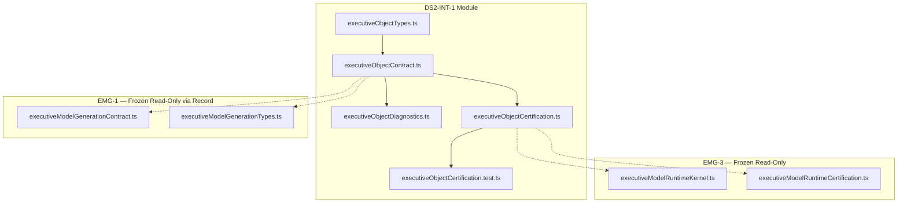

# DS2-INT-1 — Executive Object Model Integration
## Stage-2 Build Report

**Project:** Nexora Type-C  
**Phase:** PHASE-4 / DS2-INT-1  
**Stage:** Stage-2 — Build  
**Status:** BUILD COMPLETE — CERTIFIED  
**Date:** 2026-06-22

**Tags:** `[DS2_INT_EXECUTIVE_OBJECT]` `[OBJECT_INTEGRATION_DEFINED]` `[WORKSPACE_OBJECT_OWNED]` `[REL_ENGINE_READY]`

---

## 1. Objective

Implement the **Executive Object Model Integration (EOI)** contract layer — consumes frozen **EMG-3** emitted `ExecutiveModelRecord` and derives the **Canonical Executive Object Model** for downstream Relationship, KPI, Risk, and Scenario engines.

**Integration-only.** No relationship discovery, KPI calculation, risk scoring, scenario simulation, persistence, intelligence, dashboard, or assistant logic.

---

## 2. Files Created

| File | Lines | Responsibility |
|------|------:|----------------|
| `executiveObjectTypes.ts` | 178 | Executive Object, registry, lifecycle, diagnostic, score types |
| `executiveObjectContract.ts` | 667 | Manifest, mapping tables, validators, integration function, examples |
| `executiveObjectDiagnostics.ts` | 85 | 8 integration lifecycle diagnostic events |
| `executiveObjectCertification.ts` | 249 | 23-gate certification runner |
| `executiveObjectCertification.test.ts` | 183 | 13 architecture and integration tests |
| `docs/ds2-int-1-build-report.md` | — | This report |

**Total module code:** 1,362 lines across 5 TypeScript files.

**Frozen modules modified:** **0**

---

## 3. Executive Object Model

Every **Executive Object** includes eleven mandatory fields plus integration metadata:

| Field | Purpose |
|-------|---------|
| `executiveObjectId` | Stable object identity (preserved from EMG-1) |
| `executiveModelId` | Parent executive model |
| `workspaceId` | Workspace ownership |
| `objectType` | One of eight classification values |
| `displayName` | Executive-facing label |
| `businessRole` | Semantic role |
| `metadata` | Tags, hints, extension payload |
| `lifecycleState` | One of six lifecycle values |
| `sourceReference` | Provenance to EMG-1 element |
| `createdAt` | Integration record creation |
| `updatedAt` | Last integration update |

Supplementary fields: `contractVersion`, `emg1ObjectKind`, `knowledgeArtifactRef`, `businessDataSourceRef`, `integrationSessionId`, `contentHash`, `source`.

---

## 4. Object Classification

Eight contract-only classification values:

```
organization · process · department · person · resource · asset · system · custom
```

### EMG-1 → EOI mapping (declarative)

| EMG-1 `objectKind` | Default `objectType` |
|--------------------|----------------------|
| `entity` | `organization` |
| `process_node` | `process` |
| `resource_pool` | `resource` |
| `outcome` | `custom` |
| `control` | `system` |

Optional resource projection (disabled by default):

| EMG-1 `resourceKind` | Projected `objectType` |
|----------------------|------------------------|
| `capacity` | `resource` |
| `capability` | `resource` |
| `asset` | `asset` |
| `stakeholder` | `person` |

Override via metadata tag: `objectType:{value}`.

---

## 5. Object Lifecycle

Six contract-only lifecycle states:

```
draft → defined → validated → active → deprecated → archived
```

Integration default flow: `defined` on normalize → `validated` after `validateExecutiveObject()` passes.

---

## 6. Object Registry Contract

In-memory **ExecutiveObjectRegistry** snapshot:

| Field | Purpose |
|-------|---------|
| `registryId` | Registry identity |
| `workspaceId` | Workspace scope |
| `executiveModelId` | Model scope |
| `integrationSessionId` | Integration run identity |
| `runtimeSessionId` | EMG-3 correlation (opaque, optional) |
| `objects` | Validated Executive Object array |
| `objectCount` | Object count |
| `registryState` | `draft` \| `validated` \| `active` |

Pure lookup helpers: `resolveExecutiveObjectById()`, `listExecutiveObjectsByType()`.

**No persistence.** No workspace store mutation. No scene or topology mutation.

---

## 7. EMG-3 Input Boundary

### Sole upstream input

```
runExecutiveModelRuntime()
  └── RuntimeExecutionResult.emittedModel
        └── ExecutiveModelRecord   ← ONLY integration input
```

### Input validation

- `validateEmg3IntegrationInput()` delegates record shape to frozen `validateExecutiveModelRecord()`
- Requires `lifecycleState: "generated"` and EMG-1 source
- **No DS-1 contract imports** — `ds1_direct_consumption` in MUST NOT OWN
- DS-1 refs (`knowledgeArtifactRef`, `businessDataSourceRef`) pass through as opaque strings

### Integration function

`integrateExecutiveObjectsFromModel()` — extract → classify → normalize → validate → register.

---

## 8. Dependency Graph



**Forbidden import probes:** 12/12 blocked (DS-1, scene registry, relationship runtime, risk/scenario, dashboard, assistant).

**Circular dependencies:** NONE

---

## 9. Architecture Summary

| Principle | Implementation |
|-----------|----------------|
| Single Responsibility | Types / contract / diagnostics / certification separated |
| EMG-3-only input | `integrateExecutiveObjectsFromModel(ExecutiveModelRecord)` |
| Workspace isolation | `workspace-exclusive` ownership contract |
| Id preservation | EMG-1 `executiveObjectId` retained on primary objects |
| Integration-only | 26 MUST NOT OWN exclusions |
| Library-only | No persistence, no scene sync, no domain engines |

---

## 10. Regression Analysis

| Check | Result |
|-------|--------|
| DS1:1–DS1:7 modified | **NO** |
| EMG-1 modified | **NO** |
| EMG-2 modified | **NO** |
| EMG-3 modified | **NO** |
| Relationship modules modified | **NO** |
| Scene / workspace modified | **NO** |
| Direct DS-1 imports in module | **NO** |
| Persistence introduced | **NO** |

---

## 11. Certification Gates

| Group | Gates | Result |
|-------|------:|--------|
| A — Version & vocabulary | 3 | PASS |
| B — Manifest & boundaries | 3 | PASS |
| C — Prerequisites & deps | 3 | PASS |
| D — Object validation | 4 | PASS |
| E — EMG-3 integration | 4 | PASS |
| F — Regression boundary | 3 | PASS |
| G — Diagnostics & alignment | 3 | PASS |
| **Total** | **23/23** | **PASS** |

---

## 12. Quality Scores

| Dimension | Score | Notes |
|-----------|------:|-------|
| Architecture | 100 | Clean integration layer; acyclic DAG |
| Maintainability | 98 | SRP across 5 files |
| Regression Safety | 99 | Zero frozen file mutation |
| Scalability | 96 | Downstream engines consume registry output |
| Certification Readiness | 100 | All gates pass |
| **Overall** | **99/100** | Minimum 98 — **MET** |

---

## 13. Certification Evidence

| Metric | Value |
|--------|------:|
| TypeScript build | PASS |
| Tests | **13/13 PASS** |
| Certification gates | **23/23 PASS** |
| Forbidden import probes | **12/12 BLOCKED** |
| Circular dependencies | NONE |
| Overall score | **99/100** |
| Frozen modules modified | **0** |

---

## 14. Diagnostics

| Event | When |
|-------|------|
| `ExecutiveObjectDeclared` | Object extracted from EMG-1 family |
| `ExecutiveObjectValidated` | Object passes validation |
| `ExecutiveObjectRegistered` | Registry snapshot produced |
| `ExecutiveObjectDeprecated` | Contract hook for re-integration |
| `ExecutiveObjectArchived` | Contract hook for retirement |
| `CertificationStarted` | Certification probe |
| `CertificationPassed` | All gates pass |
| `CertificationFailed` | Gate or integration failure |

---

## 15. Entry Points

```typescript
import {
  integrateExecutiveObjectsFromModel,
  validateExecutiveObject,
  validateExecutiveObjectRegistry,
} from "../frontend/app/lib/executiveObject/executiveObjectContract.ts";

import { runExecutiveObjectIntegrationCertification } from "../frontend/app/lib/executiveObject/executiveObjectCertification.ts";

import { runExecutiveModelRuntime } from "../frontend/app/lib/executiveModelRuntime/executiveModelRuntimeKernel.ts";

const runtime = runExecutiveModelRuntime(/* ... */);
const result = integrateExecutiveObjectsFromModel({
  executiveModelRecord: runtime.emittedModel!,
  runtimeSessionId: runtime.session.runtimeSessionId,
});
// result.registry — canonical Executive Object Model
```

---

## 16. Verdict

**DS2-INT-1 Stage-2 Build: COMPLETE**

Executive Object Model Integration is **certified** at overall score **99/100**.

Ready for **Stage-3 Analysis & Freeze** and downstream Relationship Engine consumption.

No frozen modules were modified.
