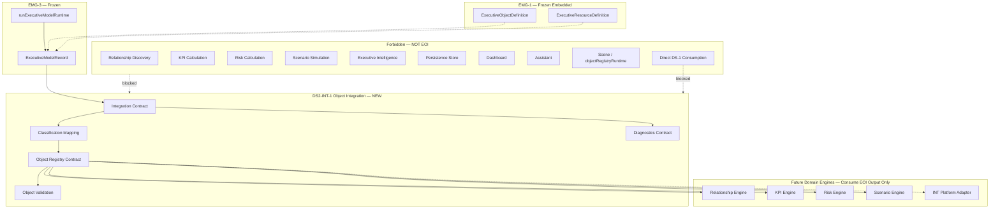
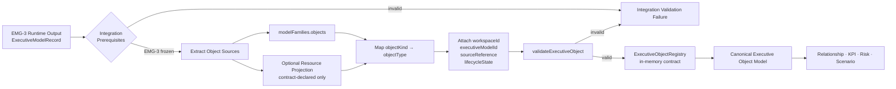
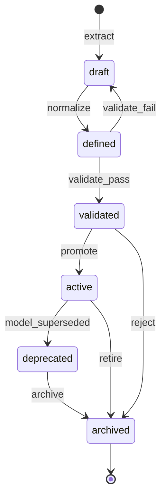
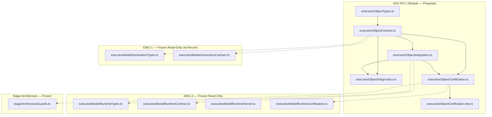
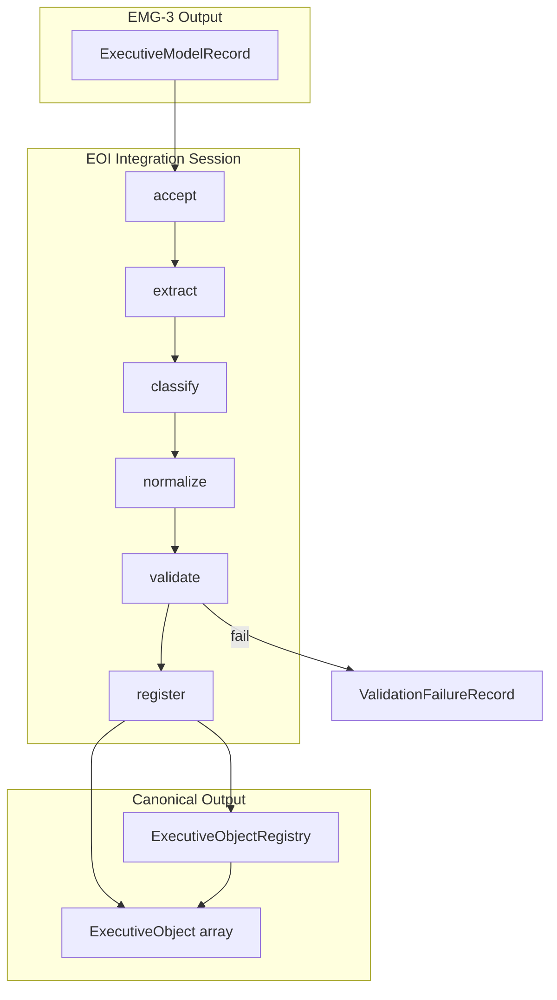

# DS2-INT-1 — Executive Object Model Integration
## Stage-1 Understanding Report

**Project:** Nexora Type-C  
**Phase:** PHASE-4 / DS-2 Integration  
**Stage ID:** DS2-INT-1  
**Title:** Executive Object Model Integration  
**Stage:** Stage-1 — Understand  
**Status:** UNDERSTANDING COMPLETE — **READY FOR STAGE-2 BUILD**

**Tags (proposed):** `[DS2_INT_EXECUTIVE_OBJECT]` `[OBJECT_INTEGRATION_DEFINED]` `[WORKSPACE_OBJECT_OWNED]` `[REL_ENGINE_READY]`

---

## 0. Executive Summary

The **Executive Object Model Integration (EOI)** layer is a **library-only integration contract** that **consumes** the frozen **EMG-3** emitted `ExecutiveModelRecord` and **derives** the **Canonical Executive Object Model** — the normalized object vocabulary downstream **Relationship**, **KPI**, **Risk**, and **Scenario** engines use to anchor definitions, links, and calculations.

EOI is the **first integration layer in PHASE-4**. It transforms EMG-1 object definitions (embedded in the emitted model) into workspace-scoped **Executive Object** records with stable identity, classification, lifecycle, metadata, and source provenance — without relationship discovery, KPI calculation, risk scoring, scenario simulation, intelligence, persistence, dashboard rendering, or assistant logic.

| Layer | Role | Relationship to EOI |
|-------|------|---------------------|
| **DS-1 Foundation (frozen)** | Approved business definitions + source identity | **Not consumed directly** — provenance flows through EMG-3 only |
| **EMG-1 (frozen)** | Canonical model vocabulary | Object definitions embedded in emitted record |
| **EMG-2 (frozen)** | Pipeline orchestration contract | Indirect via EMG-3 session metadata |
| **EMG-3 (frozen)** | Pipeline runtime kernel | **Sole upstream input** — `ExecutiveModelRecord` |
| **EOI (new)** | Object integration contract | Derives canonical Executive Objects |
| **Domain engines (future)** | Relationship / KPI / Risk / Scenario | Consume EOI output — EOI does not invoke them |

**Legacy note:** The certified **DS-2 Relationship Intelligence pipeline** (DS-2:1 through DS-2:6) is a **parallel track** operating on workspace scene objects. **PHASE-4 DS2-INT** is a **new executive-model integration stack** — it does not replace or modify the legacy DS-2 relationship modules.

**STOP triggered:** **NO**  
**Frozen module modification required:** **NO**  
**Stage-2 Build:** **APPROVED** (additive `lib/executiveObject/` contract files only)

---

## 1. Executive Object Integration Purpose

### What EOI is

| Attribute | Description |
|-----------|-------------|
| **Integration vocabulary** | Defines how EMG-3 emitted models become canonical Executive Objects |
| **Definition-only output** | Produces structured object records — not computed values or runtime scene state |
| **Workspace-scoped** | Every Executive Object belongs to exactly one workspace |
| **EMG-dependent** | Reads `ExecutiveModelRecord` only — never DS-1 contracts directly |
| **Registry contract** | Declares in-memory registry shape and validation — no persistence in Stage-2 scope |
| **Engine-ready** | Normalized objects that Relationship / KPI / Risk / Scenario engines consume |

### What EOI is NOT

| Excluded capability | Belongs to |
|---------------------|------------|
| Executive model generation | EMG-1 / EMG-2 / EMG-3 (frozen) |
| DS-1 foundation reads | Forbidden — input is EMG-3 output only |
| Relationship discovery / creation | Relationship Engine (forbidden) |
| KPI calculations / values | KPI Engine (forbidden) |
| Risk calculations / propagation | Risk Engine (forbidden) |
| Scenario simulations | Scenario Engine (forbidden) |
| Executive intelligence / recommendations | INT-5 platform (forbidden) |
| Dashboard rendering | MRP / Dashboard (forbidden) |
| Assistant logic | Assistant runtime (forbidden) |
| Scene mutation / object registry runtime | Scene / objectRegistryRuntime (forbidden) |
| Parsing / upload / sync | Parser / DS runtime (forbidden) |
| Durable persistence | Future persistence layer (forbidden in DS2-INT-1) |

### Distinction across the stack

| Concern | EMG-1 | EMG-3 | EOI |
|---------|-------|-------|-----|
| Object shape | `ExecutiveObjectDefinition` in model family | Emits full `ExecutiveModelRecord` | **Derives** `ExecutiveObject` |
| Classification | `objectKind` (5 kinds) | Pass-through in emission | **`objectType`** (8 types) |
| Lifecycle | Model lifecycle (`generated`, etc.) | Runtime session lifecycle | **Object lifecycle** (6 states) |
| Identity scope | Within executive model | Model + runtime session | Workspace + model + object |
| DS-1 access | Read-only at generation | Read-only at runtime | **Forbidden** |
| Domain engines | — | — | **Forbidden** |

EOI **must not redefine** EMG-1 model families. It **projects** object definitions into a downstream canonical shape.

---

## 2. Object Architecture Diagram



---

## 3. Object Flow Diagram



### Integration stages (contract vocabulary — Stage-2)

| Stage | ID | Responsibility | Runtime in DS2-INT-1 |
|-------|-----|----------------|------------------------|
| **Accept** | `accept` | Verify EMG-3 freeze + valid `ExecutiveModelRecord` shape | Validation only |
| **Extract** | `extract` | Read `modelFamilies.objects`; optional resource projection per contract table | Shape rules only |
| **Classify** | `classify` | Map EMG-1 `objectKind` hints to `objectType` enum | Declarative mapping only |
| **Normalize** | `normalize` | Apply mandatory fields; default lifecycle `defined` | Contract defaults only |
| **Validate** | `validate` | Run object + registry validators | Validation functions |
| **Register** | `register` | Produce in-memory registry snapshot | Example builder only |

**No stage performs relationship discovery, calculation, persistence, or intelligence.**

---

## 4. Object Ownership

### Authority chain

```
Workspace (authoritative owner)
    └── Executive Model Record (from EMG-3 — read-only input)
              └── Integration Session (0..N per model — in-memory)
                        └── derives ──→ Executive Object Registry
                        └── scoped to ──→ workspaceId + executiveModelId
                        └── correlates ──→ runtimeSessionId (EMG-3, opaque)
                        └── audit ──→ integration diagnostics
```

### Rules

1. **Every Executive Object requires `executiveObjectId`, `executiveModelId`, `workspaceId`.**
2. **Workspace isolation** — objects cannot cross workspace boundaries.
3. **EMG-only input** — integration reads `ExecutiveModelRecord`; never imports DS-1 contracts.
4. **Read-only toward EMG-1, EMG-2, EMG-3** — integration consumes frozen output; never mutates upstream.
5. **In-memory only in DS2-INT-1** — no persistence store, no scene registry writes.
6. **Integration source declared** — `source: "phase-4-executive-object-integration"`.
7. **Domain-engine independent** — output is object definitions only; engines consume later.

### Ownership contract (proposed)

| Field | Value |
|-------|-------|
| `isolationPolicy` | `"workspace-exclusive"` |
| `upstreamAuthority` | `"phase-3-executive-model-runtime"` |
| `mutationPolicy` | `"integration-derived-immutable-snapshot"` |

---

## 5. Object Identity

### Identity model

| Identifier | Scope | Stability | Purpose |
|------------|-------|-----------|---------|
| `executiveObjectId` | Within executive model | **Preserved from EMG-1** when sourced from `ExecutiveObjectDefinition` | Primary object key |
| `executiveModelId` | Workspace | From emitted `ExecutiveModelRecord` | Model correlation |
| `workspaceId` | Global workspace | From emitted record | Isolation boundary |
| `integrationRecordId` | Integration session | Generated per integration run | Audit trail |
| `sourceReference` | Object provenance | Opaque upstream ref | Traceability to EMG-1 element |

### Identity rules

1. **Primary objects** retain EMG-1 `executiveObjectId` — downstream engines depend on id stability across EMG → EOI.
2. **Projected objects** (from resources, if enabled by contract) receive deterministic ids: `{executiveModelId}:resource:{executiveResourceId}`.
3. **No scene object ids** — EOI does not assign `objectRegistryRuntime` ids.
4. **No duplicate ids** within a single integration registry snapshot.
5. **`sourceReference`** must identify the originating EMG-1 element:

```typescript
// Proposed shape — contract only
sourceReference: Readonly<{
  sourceLayer: "phase-3-executive-model-generation";
  elementKind: "object" | "resource_projection";
  elementId: string;
  executiveModelId: string;
}>;
```

---

## 6. Object Lifecycle

### Lifecycle states (contract only)

| State | Meaning | Typical entry |
|-------|---------|---------------|
| `draft` | Extracted but not yet validated | Pre-validation extract |
| `defined` | All mandatory fields present | Default after successful normalize |
| `validated` | Passed `validateExecutiveObject()` | Post-validation |
| `active` | Approved for downstream engine consumption | Explicit promotion (contract hook) |
| `deprecated` | Superseded by newer model emission | Model re-emission |
| `archived` | Retained for audit only | Manual contract transition |



### Lifecycle rules

1. **Default on integration:** `defined` after normalize (not `active`) — downstream engines may require explicit promotion.
2. **EMG model lifecycle is separate** — `ExecutiveModelRecord.lifecycleState` does not auto-map to object lifecycle; integration contract documents correlation hints only.
3. **No runtime behavior** — lifecycle transitions are contract vocabulary; execution belongs to DS2-INT-2+ if needed.
4. **Re-integration** from a new EMG-3 emission marks prior objects `deprecated` when `executiveModelId` matches and content hash differs (contract rule — Stage-2 validator).

---

## 7. Object Classification

### Object types (contract only — 8 values)

| `objectType` | Purpose | Typical business examples |
|--------------|---------|---------------------------|
| `organization` | Structural business entity | Company, division, subsidiary |
| `process` | Operational flow or activity node | Order fulfillment, approval workflow |
| `department` | Organizational unit | Finance, Operations, HR |
| `person` | Individual actor or stakeholder | Executive sponsor, team lead |
| `resource` | Capacity or capability pool | Headcount pool, budget envelope |
| `asset` | Physical or financial asset | Warehouse, equipment, inventory |
| `system` | Control or IT system | ERP, monitoring platform |
| `custom` | Unmapped or extension-classified | Catch-all with metadata justification |

**No domain logic.** Classification uses **declarative mapping tables** only.

### EMG-1 → EOI classification mapping (contract hints)

| EMG-1 `objectKind` | Default `objectType` | Override via metadata |
|--------------------|----------------------|------------------------|
| `entity` | `organization` | `department`, `person`, `custom` |
| `process_node` | `process` | `custom` |
| `resource_pool` | `resource` | `asset` |
| `outcome` | `custom` | — |
| `control` | `system` | `custom` |

### Optional resource projection mapping (contract hints)

When contract flag `projectResourcesAsObjects` is enabled (default: `false` in Stage-2):

| EMG-1 `resourceKind` | Projected `objectType` |
|----------------------|------------------------|
| `capacity` | `resource` |
| `capability` | `resource` |
| `asset` | `asset` |
| `stakeholder` | `person` |

Resource projection is **structural id assignment only** — not object creation in scene registry.

---

## 8. Executive Object — Mandatory Fields

Every **Executive Object** must include these fields (contract only — no runtime behavior):

| Field | Type | Responsibility |
|-------|------|----------------|
| `executiveObjectId` | string | Stable object identity |
| `executiveModelId` | string | Parent executive model |
| `workspaceId` | string | Owning workspace |
| `objectType` | enum (8 values) | Canonical classification |
| `displayName` | string | Executive-facing label |
| `businessRole` | string | Semantic role from EMG-1 or projection rule |
| `metadata` | object | Tags, hints, extension payload |
| `lifecycleState` | enum (6 values) | Object lifecycle position |
| `sourceReference` | object | Provenance back to EMG-1 element |
| `createdAt` | ISO string | Integration record creation |
| `updatedAt` | ISO string | Last integration mutation |
| `source` | const | `"phase-4-executive-object-integration"` |

### Proposed supplementary fields (Stage-2 contract)

| Field | Type | Purpose |
|-------|------|---------|
| `contractVersion` | string | `"PHASE-4/DS2-INT-1"` |
| `emg1ObjectKind` | string \| null | Original EMG-1 `objectKind` for traceability |
| `knowledgeArtifactRef` | string \| null | Pass-through from EMG-1 (opaque) |
| `businessDataSourceRef` | string \| null | Pass-through from EMG-1 (opaque) |
| `integrationSessionId` | string | Links to integration run |
| `contentHash` | string | Deterministic hash for re-integration diff |

---

## 9. Object Metadata

| Field | Type | Purpose |
|-------|------|---------|
| `tags` | string[] | Classification tags (pass-through + integration tags) |
| `domainHint` | string \| null | From parent model metadata |
| `executiveCategoryHint` | string \| null | From parent model metadata |
| `classificationOverride` | string \| null | Explicit `objectType` override reason |
| `extension` | object | `futureExtension` opaque payload |

No intelligence metadata, computed scores, dashboard routing, or scene position fields in DS2-INT-1.

---

## 10. Object Registry Contract

The **Executive Object Registry** is an in-memory contract snapshot — not a persistence store or scene registry.

### Registry shape (proposed)

```typescript
// Contract vocabulary only — Stage-2 types file
ExecutiveObjectRegistry = Readonly<{
  contractVersion: string;
  registryId: string;
  workspaceId: string;
  executiveModelId: string;
  integrationSessionId: string;
  runtimeSessionId: string | null;       // EMG-3 correlation (opaque)
  objects: readonly ExecutiveObject[];
  objectCount: number;
  registryState: "draft" | "validated" | "active";
  source: "phase-4-executive-object-integration";
  createdAt: string;
  updatedAt: string;
}>;
```

### Registry rules

1. **One registry snapshot per integration session** — keyed by `integrationSessionId`.
2. **Workspace-exclusive** — `workspaceId` on registry must match all contained objects.
3. **Model-scoped** — all objects share `executiveModelId` from input record.
4. **Immutable snapshot semantics** — registry replacement on re-integration; no in-place mutation across models.
5. **No scene sync** — registry does not write to `objectRegistryRuntime` or scene JSON.
6. **Lookup contract** — `resolveExecutiveObjectById(registry, id)` and `listExecutiveObjectsByType(registry, objectType)` as pure functions (Stage-2).

---

## 11. Object Validation

### Validation functions (proposed — Stage-2 contract)

| Function | Purpose |
|----------|---------|
| `validateExecutiveObject(input)` | Mandatory fields, enum values, id format |
| `validateExecutiveObjectRegistry(input)` | Registry consistency, duplicate id check, workspace alignment |
| `validateObjectClassificationMapping(input)` | Mapping table completeness |
| `validateEmg3IntegrationInput(record)` | Verify input is valid emitted `ExecutiveModelRecord` |
| `validateObjectSourceReference(ref)` | Provenance shape and EMG-1 id correlation |

### Validation issue codes (proposed)

| Code | Meaning |
|------|---------|
| `missing_mandatory_field` | Required field absent |
| `invalid_object_type` | Not one of 8 classification values |
| `invalid_lifecycle_state` | Not one of 6 lifecycle values |
| `duplicate_executive_object_id` | Id collision in registry |
| `workspace_mismatch` | Object workspace ≠ registry workspace |
| `invalid_source_reference` | Provenance broken |
| `emg3_input_invalid` | Upstream record failed shape check |
| `classification_unmapped` | objectKind cannot map without override |

Validation **delegates** EMG-1 record shape checks to frozen `validateExecutiveModelRecord()` — does not duplicate EMG-1 family validators.

---

## 12. Object References

### Reference types (contract only)

| Reference | Direction | Purpose |
|-----------|-----------|---------|
| `sourceReference` | EOI → EMG-1 element | Upstream provenance |
| `executiveModelId` | EOI → EMG-3 output | Model correlation |
| `runtimeSessionId` | EOI → EMG-3 session | Runtime run correlation (opaque) |
| `knowledgeArtifactRef` | Opaque pass-through | BKL artifact id embedded in EMG-1 object |
| `businessDataSourceRef` | Opaque pass-through | EBDS id embedded in EMG-1 object |

### Reference rules

1. **Never resolve DS-1 refs** — EOI treats `knowledgeArtifactRef` and `businessDataSourceRef` as opaque strings from EMG-1.
2. **No relationship refs in object layer** — `fromExecutiveObjectId` / `toExecutiveObjectId` belong to Relationship Engine input from EMG-1 relationships family, not EOI.
3. **No KPI / risk links in object mandatory shape** — `linkedObjectIds` on KPI/risk definitions remain in EMG-1 families; engines cross-reference by `executiveObjectId`.

---

## 13. Extension Points

| Extension | Location | Purpose |
|-----------|----------|---------|
| `metadata.extension.futureExtension` | Executive Object | Opaque consumer payload |
| `registry.metadata.extension` | Object registry | Integration session metadata |
| `classificationOverride` | Object metadata | Explicit type override with audit reason |
| `projectResourcesAsObjects` | Integration config | Enable optional resource projection |
| Custom `objectType` metadata | Object metadata | Justification for `custom` classification |

No extension may introduce relationship edges, KPI values, risk scores, scenario outcomes, or intelligence outputs.

---

## 14. Read-Only EMG-3 Integration

### Sole input boundary

```
EMG-3 runExecutiveModelRuntime()
        └── RuntimeExecutionResult.emittedModel
                └── ExecutiveModelRecord   ← ONLY upstream input
```

### EMG-3 exports consumed (read-only)

| Export | EOI usage |
|--------|-----------|
| `ExecutiveModelRecord` | Primary input type |
| `RuntimeSession.emittedModel` | Integration trigger payload |
| `isExecutiveModelRuntimeFrozen()` | Prerequisite gate |
| `validateStructuralModelEmission()` | Upstream emission proof (certification) |

### EMG-1 embedded data consumed (via record — read-only)

| Embedded family | EOI usage |
|-----------------|-----------|
| `modelFamilies.objects` | Primary object extraction |
| `modelFamilies.resources` | Optional projection only |
| `metadata` | Domain/category hints on objects |
| `workspaceId`, `executiveModelId` | Ownership fields |

### Forbidden upstream paths

| Path | Reason |
|------|--------|
| DS1:1–DS1:7 contracts | DS2-INT receives input only from EMG-3 |
| `dataSourceRegistryRuntime` | DS runtime forbidden |
| Direct BKL artifact resolution | Would bypass EMG boundary |

**Import rule:** EOI imports EMG-3 result types, EMG-1 types embedded in record, freeze probes, and validators — never mutates frozen files.

---

## 15. Future Compatibility

| Future consumer | EOI provides | Compatibility mechanism |
|-----------------|--------------|-------------------------|
| **Relationship Engine** | Stable `executiveObjectId` + `objectType` | Resolves endpoints without rediscovering objects |
| **KPI Engine** | Object registry snapshot | Cross-references `linkedObjectIds` from EMG-1 KPI family |
| **Risk Engine** | Object registry snapshot | Cross-references `linkedObjectIds` from EMG-1 risk family |
| **Scenario Engine** | Object registry + lifecycle | Scenario overlays reference object ids |
| **INT Platform** | Registry metadata + diagnostics | Read-only adapter — no INT import in EOI |
| **Dashboard / Assistant** | Object display names + types | Correlation only — no consumer imports into EOI |
| **Legacy scene object pipeline** | Parallel track | No id collision — separate id namespaces |

---

## 16. Dependency Map



**Forbidden import targets:** objectRegistryRuntime, workspaceSceneSync, RelationshipRenderer, RiskIntelligenceRuntime, ScenarioGenerationRuntime, ParserEngine, dashboardIntelligence, assistantRuntime, ds1Foundation contracts (direct), all `.tsx`.

**Circular dependencies:** None — EOI depends on EMG-3/EMG-1; neither depends on EOI.

---

## 17. Object Lifecycle Diagram



---

## 18. Diagnostics (Proposed — Stage-2)

| Event | When |
|-------|------|
| `IntegrationSessionCreated` | Integration session allocated |
| `IntegrationStarted` | Processing begins |
| `ObjectsExtracted` | Object count from EMG-1 family |
| `ObjectClassified` | Per-object classification applied |
| `ObjectValidated` | Per-object validation result |
| `RegistryValidated` | Full registry validation |
| `IntegrationCompleted` | Registry snapshot produced |
| `IntegrationFailed` | Terminal failure |
| `CertificationStarted` | Certification probe |
| `CertificationPassed` | All gates pass |
| `CertificationFailed` | Gate failure |

---

## 19. Architecture Smells (Pre-Build Review)

| Smell | Severity | Mitigation |
|-------|----------|------------|
| Classification mapping could creep into domain logic | Medium | Declarative tables only; MUST NOT OWN intelligence |
| Resource projection blurs object/resource boundary | Low | Opt-in flag; separate projected ids |
| Duplicate object vocabulary (EMG-1 vs EOI) | Low | Explicit projection contract; preserve EMG-1 ids |
| Registry mistaken for scene object registry | Medium | MUST NOT OWN registry_mutation; forbidden path probes |
| Direct DS-1 import temptation for ref resolution | Medium | EMG-3-only input gate; forbidden DS1 imports |
| Legacy DS-2 naming confusion | Low | Document parallel tracks explicitly |

**No critical smells.** **No STOP conditions triggered.**

---

## 20. Risk Analysis

| Risk | Likelihood | Impact | Mitigation |
|------|:----------:|:------:|------------|
| EOI becomes Relationship Engine | Medium | Critical | MUST NOT OWN relationship_discovery |
| EOI calculates KPIs/risks during integration | Medium | Critical | Definition-only; no numeric fields |
| Direct DS-1 consumption bypasses EMG | Medium | Critical | EMG-3-only input gate; forbidden DS1 imports |
| Persistence creep into registry | Medium | High | persistence in MUST NOT OWN; in-memory only |
| Scene registry mutation | Medium | Critical | objectRegistryRuntime forbidden probe |
| Intelligence coupling | Low | Critical | Forbidden import probes |
| Id instability breaks downstream engines | Low | High | Preserve EMG-1 executiveObjectId |
| Classification mapping ambiguity | Medium | Medium | 8-type enum + custom + override metadata |
| Legacy DS-2 pipeline conflict | Low | Medium | Parallel track documentation |
| Cross-workspace object leak | Low | High | workspaceId on registry + object guards |

---

## 21. Expected File List

### Stage-1 (this stage)

| File | Responsibility |
|------|----------------|
| `docs/ds2-int-1-understanding-report.md` | Architecture understanding — **this document** |

**No code in Stage-1.**

### Stage-2 (build — proposed)

| File | Responsibility |
|------|----------------|
| `executiveObjectTypes.ts` | Executive Object, registry, lifecycle, diagnostic types |
| `executiveObjectContract.ts` | Manifest, mapping tables, validators, examples, MUST NOT OWN |
| `executiveObjectDiagnostics.ts` | 11 integration lifecycle events |
| `executiveObjectIntegration.ts` | Pure integration functions (extract, classify, register) |
| `executiveObjectCertification.ts` | Certification + analysis runner |
| `executiveObjectCertification.test.ts` | Architecture tests |
| `docs/ds2-int-1-build-report.md` | Build report |

### Stage-3 (analyze/freeze — proposed)

| File | Responsibility |
|------|----------------|
| `docs/ds2-int-1-analysis-report.md` | 20-criterion review + scores |
| `docs/ds2-int-1-freeze-report.md` | Freeze declaration |

---

## 22. Certification Strategy (Stage-2 / Stage-3)

### Prerequisites

- PHASE-1 Stage Architecture frozen
- PHASE-2 DS-1 Foundation frozen
- PHASE-3 EMG-1 frozen
- PHASE-3 EMG-2 frozen
- PHASE-3 EMG-3 frozen

### Proposed gate groups

| Group | Focus | Example gates |
|-------|-------|---------------|
| A | Version & vocabulary | Contract version, 8 object types, 6 lifecycle states |
| B | Manifest & boundaries | Allowlist, forbidden paths, file boundary |
| C | Prerequisites & deps | EMG-3 frozen, acyclic deps, no DS1 direct import |
| D | Object validation | Mandatory fields, registry consistency |
| E | EMG-3 integration | Input from emitted model only; id preservation |
| F | Regression boundary | MUST NOT OWN (≥20 exclusions), integration-only |
| G | Diagnostics & mapping | Events operational, classification table complete |
| H | Analysis & freeze | Freeze tags, no persistence, no scene registry |

### Proposed minimum score

`EXECUTIVE_OBJECT_INTEGRATION_MINIMUM_OVERALL_SCORE = 98`

### Test prerequisites (beforeEach)

1. `runDs1FoundationAnalysis()`
2. `runExecutiveModelGenerationAnalysis()`
3. `runExecutiveModelPipelineAnalysis()`
4. `runExecutiveModelRuntimeAnalysis()`

---

## 23. Verification Checklist

| Requirement | Design compliance |
|-------------|-------------------|
| Workspace-aware | PASS — workspaceId on object + registry |
| Library-only | PASS — no runtime engines, no UI |
| Object-definition only | PASS — no calculations or discovery |
| EMG-dependent | PASS — EMG-3 `ExecutiveModelRecord` sole input |
| Intelligence-independent | PASS — excluded in MUST NOT OWN |
| Persistence-independent | PASS — in-memory registry contract |
| Dashboard-independent | PASS — forbidden path probes |
| Assistant-independent | PASS — forbidden path probes |
| No DS-1 direct consumption | PASS — provenance pass-through only |
| No frozen module modification | PASS — additive module only |

---

## 24. STOP Rule Evaluation

| STOP condition | Triggered? | Notes |
|----------------|:----------:|-------|
| Relationship generation required | **NO** | Relationship Engine owns discovery |
| KPI calculation required | **NO** | KPI Engine owns calculation |
| Risk calculation required | **NO** | Risk Engine owns scoring |
| Scenario generation required | **NO** | Scenario Engine owns simulation |
| AI reasoning required | **NO** | INT-5 owns intelligence |
| Dashboard coupling required | **NO** | Read-only consumer pattern |
| Assistant coupling required | **NO** | Read-only consumer pattern |
| Persistence required | **NO** | Deferred to future layer |
| Direct DS-1 consumption required | **NO** | EMG-3 output is sufficient |

**STOP triggered:** **NO**  
**Alternative architecture required:** **NO**

---

## 25. Stage Readiness Report

| Criterion | Status |
|-----------|--------|
| Architecture purpose defined | **COMPLETE** |
| Object identity model defined | **COMPLETE** |
| Object lifecycle defined | **COMPLETE** |
| Object classification defined (8 types) | **COMPLETE** |
| Mandatory object fields defined (11 + source) | **COMPLETE** |
| Registry contract defined | **COMPLETE** |
| Validation strategy defined | **COMPLETE** |
| EMG-3 read-only integration defined | **COMPLETE** |
| Future engine compatibility documented | **COMPLETE** |
| Dependency map documented | **COMPLETE** |
| Risk analysis complete | **COMPLETE** |
| Certification strategy defined | **COMPLETE** |
| Forbidden capabilities excluded | **COMPLETE** |
| Frozen architecture conflicts | **NONE** |
| Code written | **NONE** (Stage-1 rule satisfied) |

### Verdict

**DS2-INT-1 Stage-1 Understanding: COMPLETE**

The Executive Object Model Integration architecture is **safe to build** as an additive `lib/executiveObject/` contract module consuming frozen EMG-3 output only.

**Stage-2 Build: APPROVED**

No frozen modules were modified.

---

## 26. Proposed Entry Points (Stage-2)

```typescript
// Contract vocabulary — not implemented in Stage-1
import {
  validateExecutiveObject,
  validateExecutiveObjectRegistry,
  resolveExecutiveObjectRegistryExample,
} from "../frontend/app/lib/executiveObject/executiveObjectContract.ts";

// Integration — Stage-2
import {
  integrateExecutiveObjectsFromModel,
} from "../frontend/app/lib/executiveObject/executiveObjectIntegration.ts";

// Upstream input — frozen EMG-3
import { runExecutiveModelRuntime } from "../frontend/app/lib/executiveModelRuntime/executiveModelRuntimeKernel.ts";

const runtimeResult = runExecutiveModelRuntime(/* ... */);
const registry = integrateExecutiveObjectsFromModel(runtimeResult.emittedModel);
```
