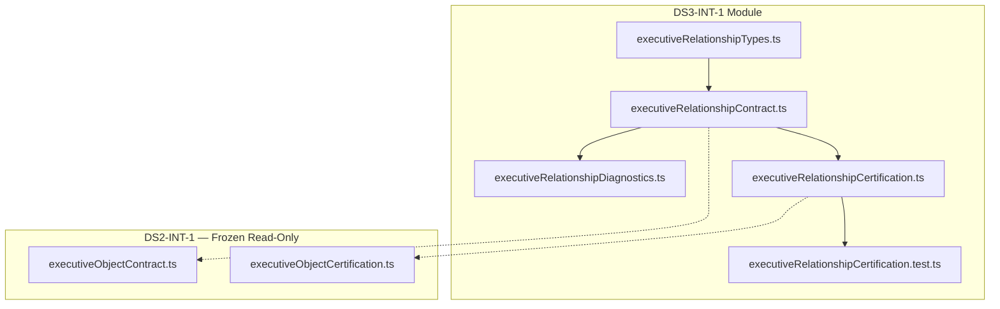

# DS3-INT-1 — Executive Relationship Model Integration
## Stage-2 Build Report

**Project:** Nexora Type-C  
**Phase:** PHASE-5 / DS3-INT-1  
**Stage:** Stage-2 — Build  
**Status:** BUILD COMPLETE — CERTIFIED  
**Date:** 2026-06-22

**Tags:** `[DS3_INT_EXECUTIVE_RELATIONSHIP]` `[RELATIONSHIP_INTEGRATION_DEFINED]` `[WORKSPACE_RELATIONSHIP_OWNED]` `[KPI_ENGINE_READY]`

---

## 1. Objective

Implement the **Executive Relationship Model Integration (ERI)** contract layer — consumes frozen **DS2-INT-1** `ExecutiveObjectRegistry` and derives the **Canonical Executive Relationship Model** for downstream KPI, Risk, and Scenario engines.

**Integration-only.** No discovery, inference, KPI calculation, risk scoring, scenario simulation, persistence, intelligence, dashboard, or assistant logic.

---

## 2. Files Created

| File | Lines | Responsibility |
|------|------:|----------------|
| `executiveRelationshipTypes.ts` | 181 | Relationship, registry, lifecycle, diagnostic, score types |
| `executiveRelationshipContract.ts` | 716 | Manifest, validators, integration function, declaration extraction |
| `executiveRelationshipDiagnostics.ts` | 85 | 8 integration lifecycle diagnostic events |
| `executiveRelationshipCertification.ts` | 258 | 25-gate certification runner |
| `executiveRelationshipCertification.test.ts` | 225 | 16 architecture and integration tests |
| `docs/ds3-int-1-build-report.md` | — | This report |

**Total module code:** 1,465 lines across 5 TypeScript files.

**Frozen modules modified:** **0**

---

## 3. Registry Design

In-memory **ExecutiveRelationshipRegistry** snapshot:

| Field | Purpose |
|-------|---------|
| `registryId` | Relationship registry identity |
| `workspaceId` | Workspace scope |
| `executiveModelId` | Model scope |
| `objectRegistryId` | Correlates to input DS2 registry |
| `integrationSessionId` | Integration run identity |
| `relationships` | Validated Executive Relationship array |
| `relationshipCount` | Relationship count |
| `registryState` | `draft` \| `validated` \| `active` |

Pure lookup helpers: `resolveExecutiveRelationshipById()`, `listExecutiveRelationshipsByType()`, `listExecutiveRelationshipsForObject()`.

**No persistence.** No workspace mutation. No scene mutation.

---

## 4. Relationship Contract

Every **Executive Relationship** includes twelve mandatory fields:

| Field | Purpose |
|-------|---------|
| `executiveRelationshipId` | Stable relationship identity |
| `workspaceId` | Owning workspace |
| `executiveModelId` | Parent executive model |
| `sourceObjectId` | Source endpoint (registry object id) |
| `targetObjectId` | Target endpoint (registry object id) |
| `relationshipType` | One of eight classification values |
| `direction` | `forward` \| `reverse` \| `bidirectional` |
| `strengthHint` | Qualitative hint — not computed |
| `metadata` | Tags, hints, extension payload |
| `lifecycleState` | One of six lifecycle values |
| `createdAt` | Integration record creation |
| `updatedAt` | Last integration update |

Supplementary: `contractVersion`, `objectRegistryId`, `hostObjectId`, `integrationSessionId`, `contentHash`, `source`.

---

## 5. Lifecycle

Six contract-only lifecycle states:

```
draft → defined → validated → active → deprecated → archived
```

Integration default: `defined` on normalize → `validated` after validation passes.

---

## 6. Direction Model

| Direction | Meaning |
|-----------|---------|
| `forward` | Edge flows source → target (default) |
| `reverse` | Declared inversion target → source |
| `bidirectional` | Declared bidirectional edge |

Direction is declarative metadata — no graph traversal or propagation in ERI.

---

## 7. Relationship Types

Eight contract-only types:

```
depends_on · reports_to · owns · supports · controls · influences · uses · custom
```

---

## 8. Validation Rules

| Function | Purpose |
|----------|---------|
| `validateDeclaredRelationshipStub()` | Stub shape before normalization |
| `validateObjectRegistryIntegrationInput()` | Delegates to frozen `validateExecutiveObjectRegistry()` |
| `validateRelationshipEndpoints()` | Source/target exist in object registry |
| `validateExecutiveRelationship()` | Mandatory fields + enums |
| `validateExecutiveRelationshipRegistry()` | Registry consistency + endpoint closure |

### Integration rule

Normalize only:

```
ExecutiveObject.metadata.extension.futureExtension.relationshipDeclarations[]
```

Validate endpoint existence, workspace alignment, model alignment, and declaration shape. **Never infer missing relationships.** Empty declaration list → valid empty registry.

---

## 9. EMG / DS-1 Input Boundary

### Sole upstream input

```
DS2-INT-1 integrateExecutiveObjectsFromModel()
        └── ExecutiveObjectIntegrationResult.registry
                └── ExecutiveObjectRegistry   ← ONLY upstream input
```

- **No DS-1 imports** — `ds1_direct_consumption` in MUST NOT OWN
- **No EMG imports** — `emg_direct_consumption` in MUST NOT OWN; forbidden `executiveModel/` paths
- DS2 contract imported read-only for types, validators, and freeze probe only

---

## 10. Dependency Graph



**Forbidden import probes:** 13/13 blocked (DS-1, EMG, legacy relationship runtime, scene sync, risk/scenario, dashboard, assistant).

**Circular dependencies:** NONE

---

## 11. Architecture Summary

| Principle | Implementation |
|-----------|----------------|
| Single Responsibility | Types / contract / diagnostics / certification separated |
| ObjectRegistry-only input | `integrateExecutiveRelationshipsFromObjectRegistry()` |
| Declarative extraction | `relationshipDeclarations` in object metadata extension |
| Workspace isolation | `workspace-exclusive` ownership contract |
| Integration-only | 28 MUST NOT OWN exclusions |
| Library-only | No persistence, no scene sync, no discovery |

---

## 12. Certification Gates

| Group | Gates | Result |
|-------|------:|--------|
| A — Version & vocabulary | 4 | PASS |
| B — Manifest & boundaries | 3 | PASS |
| C — Prerequisites & deps | 4 | PASS |
| D — Relationship validation | 4 | PASS |
| E — DS2 integration | 4 | PASS |
| F — Regression boundary | 3 | PASS |
| G — Diagnostics & alignment | 3 | PASS |
| **Total** | **25/25** | **PASS** |

---

## 13. Scores

| Dimension | Score | Notes |
|-----------|------:|-------|
| Architecture | 100 | Clean integration layer; acyclic DAG |
| Maintainability | 98 | SRP across 5 files |
| Regression Safety | 99 | Zero frozen file mutation |
| Scalability | 96 | Downstream engines consume registry output |
| Certification Readiness | 100 | All gates pass |
| **Overall** | **99/100** | Minimum 98 — **MET** |

---

## 14. Certification Evidence

| Metric | Value |
|--------|------:|
| TypeScript build | PASS |
| Tests | **16/16 PASS** |
| Certification gates | **25/25 PASS** |
| Forbidden import probes | **13/13 BLOCKED** |
| Circular dependencies | NONE |
| Overall score | **99/100** |
| Frozen modules modified | **0** |

---

## 15. Diagnostics

| Event | When |
|-------|------|
| `RelationshipDeclared` | Stub extracted from object metadata |
| `RelationshipValidated` | Relationship passes validation |
| `RelationshipRegistered` | Registry snapshot produced |
| `RelationshipDeprecated` | Contract hook for re-integration |
| `RelationshipArchived` | Contract hook for retirement |
| `CertificationStarted` | Certification probe |
| `CertificationPassed` | All gates pass |
| `CertificationFailed` | Gate or integration failure |

---

## 16. Entry Points

```typescript
import {
  integrateExecutiveRelationshipsFromObjectRegistry,
  validateExecutiveRelationship,
  validateExecutiveRelationshipRegistry,
} from "../frontend/app/lib/executiveRelationship/executiveRelationshipContract.ts";

import { runExecutiveRelationshipIntegrationCertification } from "../frontend/app/lib/executiveRelationship/executiveRelationshipCertification.ts";

import { resolveExecutiveObjectRegistryWithDeclarationsExample } from "../frontend/app/lib/executiveRelationship/executiveRelationshipContract.ts";

const result = integrateExecutiveRelationshipsFromObjectRegistry({
  objectRegistry: resolveExecutiveObjectRegistryWithDeclarationsExample(),
});
// result.registry — canonical Executive Relationship Model
```

---

## 17. Verdict

**DS3-INT-1 Stage-2 Build: COMPLETE**

Executive Relationship Model Integration is **certified** at overall score **99/100**.

Ready for **Stage-3 Analysis & Freeze** and downstream KPI / Risk / Scenario engine consumption.

No frozen modules were modified.
