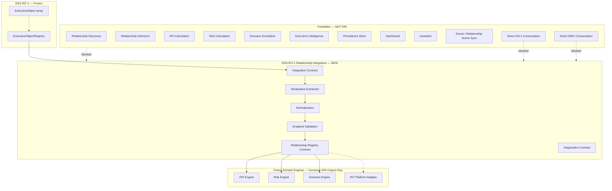
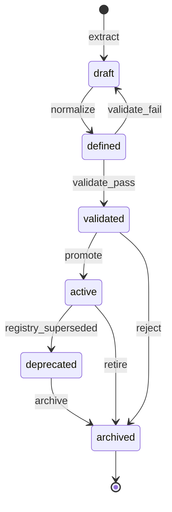
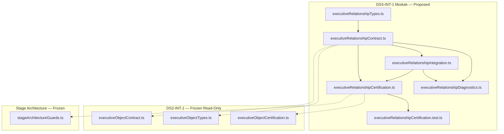
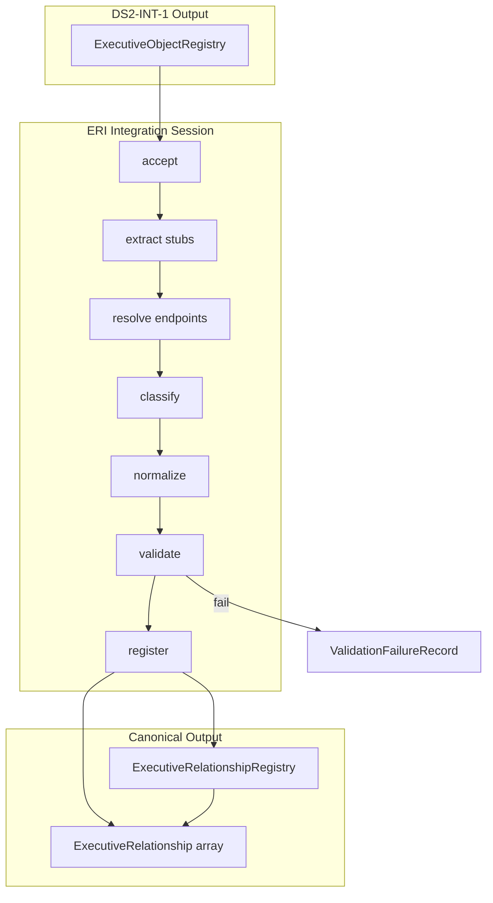

# DS3-INT-1 — Executive Relationship Model Integration
## Stage-1 Understanding Report

**Project:** Nexora Type-C  
**Phase:** PHASE-5 / DS-3 Integration  
**Stage ID:** DS3-INT-1  
**Title:** Executive Relationship Model Integration  
**Stage:** Stage-1 — Understand  
**Status:** UNDERSTANDING COMPLETE — **READY FOR STAGE-2 BUILD**

**Tags (proposed):** `[DS3_INT_EXECUTIVE_RELATIONSHIP]` `[RELATIONSHIP_INTEGRATION_DEFINED]` `[WORKSPACE_RELATIONSHIP_OWNED]` `[KPI_ENGINE_READY]`

---

## 0. Executive Summary

The **Executive Relationship Model Integration (ERI)** layer is a **library-only integration contract** that **consumes** the frozen **DS2-INT-1** `ExecutiveObjectRegistry` and **derives** the **Canonical Executive Relationship Model** — the normalized relationship vocabulary downstream **KPI**, **Risk**, and **Scenario** engines use to anchor cross-object dependencies, governance links, and influence paths.

ERI is the **first integration layer in PHASE-5**. It transforms **declarative relationship stubs** attached to registry objects into workspace-scoped **Executive Relationship** records with stable identity, classification, direction, lifecycle, metadata, and endpoint validation — without relationship discovery algorithms, KPI calculation, risk scoring, scenario simulation, intelligence, persistence, dashboard rendering, or assistant logic.

| Layer | Role | Relationship to ERI |
|-------|------|---------------------|
| **DS-1 Foundation (frozen)** | Approved business definitions | **Not consumed** — no direct access |
| **EMG Stack (frozen)** | Model generation + runtime | **Not consumed** — no direct access |
| **DS2-INT-1 (frozen)** | Object integration | **Sole upstream input** — `ExecutiveObjectRegistry` |
| **ERI (new)** | Relationship integration contract | Derives canonical Executive Relationships |
| **Domain engines (future)** | KPI / Risk / Scenario | Consume ERI output — ERI does not invoke them |

**Legacy note:** The certified **DS-2 Relationship Intelligence pipeline** (DS-2:1 through DS-2:6) and **`relationships/executive/` visualization runtime** are **parallel tracks** operating on workspace scene objects. **PHASE-5 DS3-INT** is a **new executive-model integration stack** in `lib/executiveRelationship/` — it does not replace or modify legacy relationship modules.

**STOP triggered:** **NO**  
**Frozen module modification required:** **NO**  
**Stage-2 Build:** **APPROVED** (additive `lib/executiveRelationship/` contract files only)

---

## 1. Executive Relationship Integration Purpose

### What ERI is

| Attribute | Description |
|-----------|-------------|
| **Integration vocabulary** | Defines how object registry snapshots become canonical Executive Relationships |
| **Definition-only output** | Produces structured relationship records — not computed paths or scene edges |
| **Workspace-scoped** | Every Executive Relationship belongs to exactly one workspace |
| **ObjectRegistry-dependent** | Reads `ExecutiveObjectRegistry` only — never DS-1 or EMG directly |
| **Declarative extraction** | Collects pre-declared relationship stubs — no inference or discovery |
| **Registry contract** | Declares in-memory relationship registry shape — no persistence in Stage-2 scope |
| **Engine-ready** | Normalized relationships that KPI / Risk / Scenario engines consume |

### What ERI is NOT

| Excluded capability | Belongs to |
|---------------------|------------|
| Object integration | DS2-INT-1 (frozen) |
| Executive model generation | EMG stack (frozen) |
| DS-1 foundation reads | Forbidden |
| EMG direct reads | Forbidden |
| Relationship discovery algorithms | Relationship Discovery Engine (forbidden) |
| Relationship inference / scoring | Forbidden |
| KPI calculations / values | KPI Engine (forbidden) |
| Risk calculations / propagation | Risk Engine (forbidden) |
| Scenario simulations | Scenario Engine (forbidden) |
| Executive intelligence / recommendations | INT-5 platform (forbidden) |
| Dashboard rendering | MRP / Dashboard (forbidden) |
| Assistant logic | Assistant runtime (forbidden) |
| Scene mutation / relationship scene sync | Scene / workspaceRelationshipSceneSync (forbidden) |
| Parsing / upload / sync | Parser / DS runtime (forbidden) |
| Durable persistence | Future persistence layer (forbidden in DS3-INT-1) |

### Distinction across the stack

| Concern | DS2-INT-1 | ERI |
|---------|-----------|-----|
| Primary artifact | `ExecutiveObjectRegistry` | `ExecutiveRelationshipRegistry` |
| Upstream input | EMG-3 `ExecutiveModelRecord` | DS2 `ExecutiveObjectRegistry` |
| Classification | `objectType` (8 types) | `relationshipType` (8 types) |
| Endpoint model | Single object identity | `sourceObjectId` + `targetObjectId` |
| EMG / DS-1 access | EMG-3 only (frozen) | **Forbidden** |
| Discovery | Excluded | **Excluded** |

ERI **must not redefine** DS2 object shapes. It **projects** declarative relationship stubs into a downstream canonical shape.

---

## 2. Relationship Architecture Diagram



---

## 3. Relationship Flow Diagram

```mermaid
flowchart LR
  REGIN[ExecutiveObjectRegistry\nDS2-INT-1 output] --> GATE{Integration\nPrerequisites}
  GATE -->|DS2-INT-1 frozen| EXTRACT[Extract Declarative Stubs]
  GATE -->|invalid| FAIL[Integration Validation Failure]

  EXTRACT --> STUBS[Registry-attached\nrelationshipDeclarations]
  STUBS --> RESOLVE[Resolve sourceObjectId\ntargetObjectId against registry]
  RESOLVE --> CLASSIFY[Apply relationshipType\nand direction]
  CLASSIFY --> ENRICH[Attach workspaceId\nexecutiveModelId\nlifecycleState]
  ENRICH --> VALIDATE[validateExecutiveRelationship]
  VALIDATE -->|valid| RREG[ExecutiveRelationshipRegistry\nin-memory contract]
  VALIDATE -->|invalid| FAIL

  RREG --> OUT[Canonical Executive Relationship Model]
  OUT --> ENGINES[KPI · Risk · Scenario]
```



### Integration stages (contract vocabulary — Stage-2)

| Stage | ID | Responsibility | Runtime in DS3-INT-1 |
|-------|-----|----------------|------------------------|
| **Accept** | `accept` | Verify DS2-INT-1 freeze + valid `ExecutiveObjectRegistry` | Validation only |
| **Extract** | `extract` | Collect declarative stubs from registry object metadata | Shape rules only |
| **Resolve** | `resolve` | Verify `sourceObjectId` and `targetObjectId` exist in registry | Endpoint lookup only |
| **Classify** | `classify` | Apply `relationshipType` and `direction` enums | Declarative mapping only |
| **Normalize** | `normalize` | Apply mandatory fields; default lifecycle `defined` | Contract defaults only |
| **Validate** | `validate` | Run relationship + registry validators | Validation functions |
| **Register** | `register` | Produce in-memory relationship registry snapshot | Example builder only |

**No stage performs discovery, inference, calculation, persistence, or intelligence.**

---

## 4. Input Boundary — Registry-Only Design

### Sole upstream artifact

```
DS2-INT-1 integrateExecutiveObjectsFromModel()
        └── ExecutiveObjectIntegrationResult.registry
                └── ExecutiveObjectRegistry   ← ONLY upstream input
```

### Declarative stub source (within registry — no EMG import)

Because DS2-INT-1 is frozen and does not embed relationship arrays, ERI defines a **registry-attached declarative envelope** read from existing object metadata extension fields — no DS2 modification required:

```typescript
// Contract vocabulary only — Stage-2 types file
DeclaredRelationshipStub = Readonly<{
  executiveRelationshipId: string;
  sourceObjectId: string;          // must match hosting object or explicit source
  targetObjectId: string;
  relationshipType: ExecutiveRelationshipType;
  direction: ExecutiveRelationshipDirection;
  strengthHint: string | null;
  metadata?: Readonly<{ tags?: readonly string[] }>;
}>;

// Located at:
ExecutiveObject.metadata.extension.futureExtension.relationshipDeclarations
```

**Extraction rule:** Integration walks `registry.objects[]`, collects all `relationshipDeclarations` arrays, deduplicates by `executiveRelationshipId`, validates endpoints against `registry.objects`.

**Empty registry or objects with no declarations → valid empty relationship registry.** This is not discovery — it is **declarative collection** of pre-supplied stubs.

### Forbidden upstream paths

| Path | Reason |
|------|--------|
| EMG-1 `modelFamilies.relationships` | Direct EMG consumption forbidden |
| DS1:1–DS1:7 contracts | DS3-INT receives input only from DS2 registry |
| `relationships/executive/` runtime | Legacy parallel track — forbidden import |
| `workspaceRelationshipSceneSync` | Scene runtime forbidden |

---

## 5. Relationship Ownership

### Authority chain

```
Workspace (authoritative owner)
    └── Executive Object Registry (from DS2-INT-1 — read-only input)
              └── Integration Session (0..N per registry — in-memory)
                        └── derives ──→ Executive Relationship Registry
                        └── scoped to ──→ workspaceId + executiveModelId
                        └── correlates ──→ registryId + integrationSessionId (opaque)
                        └── audit ──→ integration diagnostics
```

### Rules

1. **Every Executive Relationship requires `executiveRelationshipId`, `workspaceId`, `executiveModelId`, `sourceObjectId`, `targetObjectId`.**
2. **Workspace isolation** — relationships cannot cross workspace boundaries.
3. **Registry-only input** — integration reads `ExecutiveObjectRegistry`; never imports DS-1 or EMG contracts.
4. **Read-only toward DS2-INT-1** — integration consumes frozen object registry; never mutates upstream.
5. **Endpoint closure** — both object ids must resolve via `resolveExecutiveObjectById()` against input registry.
6. **In-memory only in DS3-INT-1** — no persistence store, no scene sync writes.
7. **Integration source declared** — `source: "phase-5-executive-relationship-integration"`.
8. **Domain-engine independent** — output is relationship definitions only.

### Ownership contract (proposed)

| Field | Value |
|-------|-------|
| `isolationPolicy` | `"workspace-exclusive"` |
| `upstreamAuthority` | `"phase-4-executive-object-integration"` |
| `mutationPolicy` | `"integration-derived-immutable-snapshot"` |

---

## 6. Relationship Identity

### Identity model

| Identifier | Scope | Stability | Purpose |
|------------|-------|-----------|---------|
| `executiveRelationshipId` | Within executive model | **Preserved from declarative stub** | Primary relationship key |
| `executiveModelId` | Workspace | From object registry | Model correlation |
| `workspaceId` | Global workspace | From object registry | Isolation boundary |
| `sourceObjectId` | Endpoint | Must exist in object registry | Source endpoint |
| `targetObjectId` | Endpoint | Must exist in object registry | Target endpoint |
| `integrationSessionId` | Integration session | Generated per integration run | Audit trail |

### Identity rules

1. **Relationship ids** are supplied by declarative stubs — integration does not invent ids via algorithms.
2. **No duplicate ids** within a single relationship registry snapshot.
3. **No self-loops** unless explicitly allowed by contract flag `allowSelfReferentialRelationships` (default: `false`).
4. **No scene relationship ids** — ERI does not assign scene sync or `RelationshipRenderer` ids.
5. **Endpoint ids** must match `executiveObjectId` values in the input object registry — not scene object ids.

---

## 7. Relationship Lifecycle

### Lifecycle states (contract only)

| State | Meaning | Typical entry |
|-------|---------|---------------|
| `draft` | Extracted but not yet validated | Pre-validation extract |
| `defined` | All mandatory fields present | Default after normalize |
| `validated` | Passed `validateExecutiveRelationship()` | Post-validation |
| `active` | Approved for downstream engine consumption | Explicit promotion hook |
| `deprecated` | Superseded by newer registry integration | Re-integration |
| `archived` | Retained for audit only | Manual contract transition |



### Lifecycle rules

1. **Default on integration:** `defined` after normalize → `validated` after validation passes.
2. **Object lifecycle is separate** — relationship lifecycle does not auto-sync to object lifecycle.
3. **No runtime behavior** — transitions are contract vocabulary; execution belongs to DS3-INT-2+ if needed.
4. **Re-integration** marks prior relationships `deprecated` when content hash differs (contract rule — Stage-2 validator).

---

## 8. Relationship Classification

### Relationship types (contract only — 8 values)

| `relationshipType` | Purpose | Typical semantic use |
|--------------------|---------|----------------------|
| `depends_on` | Dependency edge | Process depends on resource |
| `reports_to` | Reporting hierarchy | Person reports to department |
| `owns` | Ownership edge | Organization owns asset |
| `supports` | Support edge | System supports process |
| `controls` | Control / governance edge | Policy controls process |
| `influences` | Influence edge | Market influences organization |
| `uses` | Usage edge | Process uses system |
| `custom` | Extension-classified | Catch-all with metadata justification |

**No inference logic.** Classification uses **declarative stub values** only.

### Direction (contract only)

| `direction` | Meaning |
|-------------|---------|
| `forward` | Edge flows source → target (default) |
| `reverse` | Edge flows target → source (declared inversion) |
| `bidirectional` | Edge applies in both directions (declarative) |

Direction is **metadata for downstream engines** — ERI does not compute graph traversal or propagate values.

---

## 9. Executive Relationship — Mandatory Fields

Every **Executive Relationship** must include these fields (contract only — no runtime behavior):

| Field | Type | Responsibility |
|-------|------|----------------|
| `executiveRelationshipId` | string | Stable relationship identity |
| `workspaceId` | string | Owning workspace |
| `executiveModelId` | string | Parent executive model |
| `sourceObjectId` | string | Source endpoint (registry object id) |
| `targetObjectId` | string | Target endpoint (registry object id) |
| `relationshipType` | enum (8 values) | Canonical classification |
| `direction` | enum (3 values) | Declared edge direction |
| `strengthHint` | string \| null | Qualitative hint — not computed |
| `metadata` | object | Tags, hints, extension payload |
| `lifecycleState` | enum (6 values) | Relationship lifecycle position |
| `createdAt` | ISO string | Integration record creation |
| `updatedAt` | ISO string | Last integration update |
| `source` | const | `"phase-5-executive-relationship-integration"` |

### Proposed supplementary fields (Stage-2 contract)

| Field | Type | Purpose |
|-------|------|---------|
| `contractVersion` | string | `"PHASE-5/DS3-INT-1"` |
| `objectRegistryId` | string | Correlates to input `ExecutiveObjectRegistry.registryId` |
| `integrationSessionId` | string | Links to integration run |
| `contentHash` | string | Deterministic hash for re-integration diff |
| `hostObjectId` | string \| null | Object that carried the declarative stub |

---

## 10. Relationship Metadata

| Field | Type | Purpose |
|-------|------|---------|
| `tags` | string[] | Classification tags (pass-through + integration tags) |
| `domainHint` | string \| null | From parent object registry context |
| `executiveCategoryHint` | string \| null | From parent object registry context |
| `classificationOverride` | string \| null | Explicit type override reason |
| `extension` | object | `futureExtension` opaque payload |

No intelligence metadata, computed scores, dashboard routing, or scene position fields in DS3-INT-1.

---

## 11. Relationship Registry Contract

The **Executive Relationship Registry** is an in-memory contract snapshot — not a persistence store or scene relationship store.

### Registry shape (proposed)

```typescript
ExecutiveRelationshipRegistry = Readonly<{
  contractVersion: string;
  registryId: string;
  workspaceId: string;
  executiveModelId: string;
  objectRegistryId: string;
  integrationSessionId: string;
  relationships: readonly ExecutiveRelationship[];
  relationshipCount: number;
  registryState: "draft" | "validated" | "active";
  source: "phase-5-executive-relationship-integration";
  createdAt: string;
  updatedAt: string;
}>;
```

### Registry rules

1. **One relationship registry snapshot per integration session** — keyed by `integrationSessionId`.
2. **Workspace-exclusive** — `workspaceId` must match input object registry and all relationships.
3. **Model-scoped** — all relationships share `executiveModelId` from input registry.
4. **Endpoint closure** — every `sourceObjectId` and `targetObjectId` resolves in input object registry.
5. **Immutable snapshot semantics** — registry replacement on re-integration; no in-place mutation.
6. **No scene sync** — registry does not write to `workspaceRelationshipSceneSync` or scene JSON.
7. **Lookup contract** — `resolveExecutiveRelationshipById()`, `listExecutiveRelationshipsByType()`, `listExecutiveRelationshipsForObject()` as pure functions (Stage-2).

---

## 12. Relationship Validation

### Validation functions (proposed — Stage-2 contract)

| Function | Purpose |
|----------|---------|
| `validateExecutiveRelationship(input)` | Mandatory fields, enum values, id format |
| `validateExecutiveRelationshipRegistry(input)` | Registry consistency, duplicate id check, workspace alignment |
| `validateObjectRegistryIntegrationInput(registry)` | Verify input is valid frozen DS2 registry |
| `validateRelationshipEndpoints(relationship, objectRegistry)` | Both endpoints exist in object registry |
| `validateDeclaredRelationshipStub(stub)` | Stub shape before normalization |

### Validation issue codes (proposed)

| Code | Meaning |
|------|---------|
| `missing_mandatory_field` | Required field absent |
| `invalid_relationship_type` | Not one of 8 classification values |
| `invalid_direction` | Not one of 3 direction values |
| `invalid_lifecycle_state` | Not one of 6 lifecycle values |
| `duplicate_executive_relationship_id` | Id collision in registry |
| `workspace_mismatch` | Relationship workspace ≠ registry workspace |
| `source_endpoint_missing` | sourceObjectId not in object registry |
| `target_endpoint_missing` | targetObjectId not in object registry |
| `self_referential_forbidden` | Self-loop when disallowed |
| `object_registry_invalid` | Upstream DS2 registry failed shape check |

Validation **delegates** object registry shape checks to frozen `validateExecutiveObjectRegistry()` — does not duplicate DS2 validators.

---

## 13. Relationship References

### Reference types (contract only)

| Reference | Direction | Purpose |
|-----------|-----------|---------|
| `sourceObjectId` | ERI → DS2 object | Source endpoint |
| `targetObjectId` | ERI → DS2 object | Target endpoint |
| `objectRegistryId` | ERI → DS2 registry | Upstream registry correlation |
| `executiveModelId` | ERI → model scope | Model correlation |
| `hostObjectId` | ERI → stub carrier | Audit which object carried declaration |

### Reference rules

1. **Never resolve DS-1 or EMG refs** — ERI uses only object ids from frozen object registry.
2. **No KPI / risk links in relationship mandatory shape** — engines cross-reference by object ids separately.
3. **No scene relationship refs** — legacy DS-2:4 workspace relationships are a parallel namespace.

---

## 14. Extension Points

| Extension | Location | Purpose |
|-----------|----------|---------|
| `metadata.extension.futureExtension` | Executive Relationship | Opaque consumer payload |
| `registry.metadata.extension` | Relationship registry | Integration session metadata |
| `relationshipDeclarations` | Object metadata extension | Declarative stub carrier (input convention) |
| `allowSelfReferentialRelationships` | Integration config | Opt-in self-loop allowance |
| Custom `relationshipType` metadata | Relationship metadata | Justification for `custom` classification |

No extension may introduce discovery algorithms, KPI values, risk scores, scenario outcomes, or intelligence outputs.

---

## 15. Read-Only DS2-INT-1 Integration

### DS2 exports consumed (read-only)

| Export | ERI usage |
|--------|-----------|
| `ExecutiveObjectRegistry` | Primary input type |
| `ExecutiveObject` | Endpoint resolution |
| `validateExecutiveObjectRegistry()` | Upstream registry proof (certification) |
| `resolveExecutiveObjectById()` | Endpoint validation |
| `isExecutiveObjectIntegrationFrozen()` | Prerequisite gate |

### Forbidden upstream paths

| Path | Reason |
|------|--------|
| EMG-1/2/3 contracts | Direct EMG consumption forbidden |
| DS1:1–DS1:7 contracts | DS3-INT receives input only from DS2 |
| `relationships/executive/` | Legacy runtime forbidden |
| `workspaceRelationshipSceneSync` | Scene sync forbidden |

**Import rule:** ERI imports DS2-INT-1 result types, validators, freeze probes — never mutates frozen files.

---

## 16. Future Compatibility

| Future consumer | ERI provides | Compatibility mechanism |
|-----------------|--------------|-------------------------|
| **KPI Engine** | Relationship registry + object endpoint ids | KPI definitions link objects; ERI provides dependency graph vocabulary |
| **Risk Engine** | Relationship registry snapshot | Risk propagation references relationship types — engine owns scoring |
| **Scenario Engine** | Relationship registry + lifecycle | Scenario overlays reference relationship ids |
| **INT Platform** | Registry metadata + diagnostics | Read-only adapter — no INT import in ERI |
| **Dashboard / Assistant** | Relationship display labels + types | Correlation only — no consumer imports into ERI |
| **Legacy relationship pipeline** | Parallel track | Separate id namespace — no collision |

---

## 17. Dependency Map



**Forbidden import targets:** objectRegistryRuntime, workspaceRelationshipSceneSync, relationships/executive, EMG modules, datasourceCertification, RiskIntelligenceRuntime, ScenarioGenerationRuntime, dashboardIntelligence, assistantRuntime, all `.tsx`.

**Circular dependencies:** None — ERI depends on DS2-INT-1; DS2 does not depend on ERI.

---

## 18. Relationship Lifecycle Diagram



---

## 19. Diagnostics (Proposed — Stage-2)

| Event | When |
|-------|------|
| `ExecutiveRelationshipDeclared` | Stub extracted from object metadata |
| `ExecutiveRelationshipValidated` | Per-relationship validation result |
| `ExecutiveRelationshipRegistered` | Registry snapshot produced |
| `ExecutiveRelationshipDeprecated` | Re-integration supersedes prior edge |
| `ExecutiveRelationshipArchived` | Contract hook for retirement |
| `CertificationStarted` | Certification probe |
| `CertificationPassed` | All gates pass |
| `CertificationFailed` | Gate or integration failure |

---

## 20. Architecture Smells (Pre-Build Review)

| Smell | Severity | Mitigation |
|-------|----------|------------|
| Relationship stubs in object metadata extension | Low | Uses existing DS2 `futureExtension` — no DS2 mutation |
| No relationships in DS2 registry by default | Medium | Empty registry valid; stubs supplied via metadata convention |
| Dual relationship vocabularies (legacy vs ERI) | Low | Document parallel tracks; separate module path |
| Confusion with EMG-1 relationship family | Medium | EMG import forbidden; explicit input boundary gates |
| Discovery temptation for sparse graphs | Medium | MUST NOT OWN discovery; declarative-only extraction |
| Legacy `relationships/executive/` name collision | Low | New module at `lib/executiveRelationship/` |

**No critical smells.** **No STOP conditions triggered.**

---

## 21. Risk Analysis

| Risk | Likelihood | Impact | Mitigation |
|------|:----------:|:------:|------------|
| ERI becomes discovery engine | Medium | Critical | MUST NOT OWN discovery; declarative stubs only |
| Direct EMG import for relationships | Medium | Critical | Forbidden import probes; registry-only input gate |
| Direct DS-1 consumption | Medium | Critical | DS-1 paths in forbidden patterns |
| Scene sync mutation | Medium | Critical | workspaceRelationshipSceneSync forbidden probe |
| KPI/risk calc during integration | Medium | Critical | Definition-only; no numeric fields |
| Persistence creep | Medium | High | persistence in MUST NOT OWN |
| Endpoint id drift from object registry | Low | High | Endpoint closure validator |
| Empty relationship registry misread as failure | Medium | Low | Document valid empty output |
| Legacy relationship pipeline conflict | Low | Medium | Parallel track documentation |
| Self-loop ambiguity | Low | Medium | Default disallow; opt-in flag |

---

## 22. Expected File List

### Stage-1 (this stage)

| File | Responsibility |
|------|----------------|
| `docs/ds3-int-1-understanding-report.md` | Architecture understanding — **this document** |

**No code in Stage-1.**

### Stage-2 (build — proposed)

| File | Responsibility |
|------|----------------|
| `executiveRelationshipTypes.ts` | Executive Relationship, registry, lifecycle, diagnostic types |
| `executiveRelationshipContract.ts` | Manifest, validators, integration function, examples, MUST NOT OWN |
| `executiveRelationshipDiagnostics.ts` | 8 integration lifecycle events |
| `executiveRelationshipIntegration.ts` | Pure integration functions (extract, resolve, register) |
| `executiveRelationshipCertification.ts` | Certification + analysis runner |
| `executiveRelationshipCertification.test.ts` | Architecture tests |
| `docs/ds3-int-1-build-report.md` | Build report |

### Stage-3 (analyze/freeze — proposed)

| File | Responsibility |
|------|----------------|
| `docs/ds3-int-1-analysis-report.md` | 20-criterion review + scores |
| `docs/ds3-int-1-freeze-report.md` | Freeze declaration |

---

## 23. Certification Strategy (Stage-2 / Stage-3)

### Prerequisites

- PHASE-1 Stage Architecture frozen
- PHASE-3 EMG stack frozen
- PHASE-4 DS2-INT-1 frozen

### Proposed gate groups

| Group | Focus | Example gates |
|-------|-------|---------------|
| A | Version & vocabulary | Contract version, 8 relationship types, 6 lifecycle states |
| B | Manifest & boundaries | Allowlist, forbidden paths, file boundary |
| C | Prerequisites & deps | DS2-INT-1 frozen, acyclic deps, no EMG/DS1 direct import |
| D | Relationship validation | Mandatory fields, registry consistency, endpoint closure |
| E | DS2 integration | Input from object registry only; id preservation |
| F | Regression boundary | MUST NOT OWN (≥20 exclusions), integration-only |
| G | Diagnostics & mapping | Events operational, direction enum complete |
| H | Analysis & freeze | Freeze tags, no persistence, no scene sync |

### Proposed minimum score

`EXECUTIVE_RELATIONSHIP_INTEGRATION_MINIMUM_OVERALL_SCORE = 98`

### Test prerequisites (beforeEach)

1. `runExecutiveModelRuntimeAnalysis()` (EMG chain for object registry examples)
2. `runExecutiveObjectIntegrationAnalysis()` (DS2-INT-1 frozen)

---

## 24. Verification Checklist

| Requirement | Design compliance |
|-------------|-------------------|
| Workspace-aware | PASS — workspaceId on relationship + registry |
| Library-only | PASS — no runtime engines, no UI |
| Relationship-definition only | PASS — no calculations or discovery |
| ObjectRegistry-dependent | PASS — DS2 `ExecutiveObjectRegistry` sole input |
| Intelligence-independent | PASS — excluded in MUST NOT OWN |
| Persistence-independent | PASS — in-memory registry contract |
| Dashboard-independent | PASS — forbidden path probes |
| Assistant-independent | PASS — forbidden path probes |
| No DS-1 direct consumption | PASS — forbidden |
| No EMG direct consumption | PASS — forbidden |
| No frozen module modification | PASS — additive module only |

---

## 25. STOP Rule Evaluation

| STOP condition | Triggered? | Notes |
|----------------|:----------:|-------|
| Relationship discovery engine required | **NO** | Declarative stub extraction from registry metadata |
| KPI calculation required | **NO** | KPI Engine owns calculation |
| Risk calculation required | **NO** | Risk Engine owns scoring |
| Scenario generation required | **NO** | Scenario Engine owns simulation |
| AI reasoning required | **NO** | INT-5 owns intelligence |
| Dashboard coupling required | **NO** | Read-only consumer pattern |
| Assistant coupling required | **NO** | Read-only consumer pattern |
| Persistence required | **NO** | Deferred to future layer |
| Direct DS-1 consumption required | **NO** | DS2 registry is sufficient |
| Direct EMG consumption required | **NO** | Stubs carried via object metadata convention |

**STOP triggered:** **NO**  
**Alternative architecture required:** **NO**

---

## 26. Stage Readiness Report

| Criterion | Status |
|-----------|--------|
| Architecture purpose defined | **COMPLETE** |
| Relationship identity model defined | **COMPLETE** |
| Relationship lifecycle defined | **COMPLETE** |
| Relationship classification defined (8 types) | **COMPLETE** |
| Mandatory relationship fields defined (12 + source) | **COMPLETE** |
| Registry contract defined | **COMPLETE** |
| Validation strategy defined | **COMPLETE** |
| DS2 read-only integration defined | **COMPLETE** |
| Future engine compatibility documented | **COMPLETE** |
| Dependency map documented | **COMPLETE** |
| Risk analysis complete | **COMPLETE** |
| Certification strategy defined | **COMPLETE** |
| Forbidden capabilities excluded | **COMPLETE** |
| Frozen architecture conflicts | **NONE** |
| Code written | **NONE** (Stage-1 rule satisfied) |

### Verdict

**DS3-INT-1 Stage-1 Understanding: COMPLETE**

The Executive Relationship Model Integration architecture is **safe to build** as an additive `lib/executiveRelationship/` contract module consuming frozen DS2-INT-1 `ExecutiveObjectRegistry` only.

**Stage-2 Build: APPROVED**

No frozen modules were modified.

---

## 27. Proposed Entry Points (Stage-2)

```typescript
// Contract vocabulary — not implemented in Stage-1
import {
  validateExecutiveRelationship,
  validateExecutiveRelationshipRegistry,
  integrateExecutiveRelationshipsFromObjectRegistry,
} from "../frontend/app/lib/executiveRelationship/executiveRelationshipContract.ts";

// Upstream input — frozen DS2-INT-1
import { resolveExecutiveObjectRegistryExample } from "../frontend/app/lib/executiveObject/executiveObjectContract.ts";

const objectRegistry = resolveExecutiveObjectRegistryExample();
const result = integrateExecutiveRelationshipsFromObjectRegistry({ objectRegistry });
// result.registry — canonical Executive Relationship Model
```
