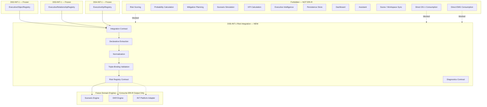
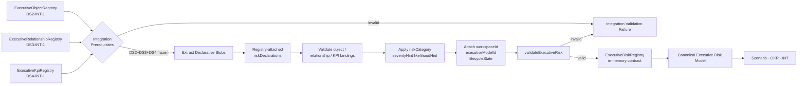
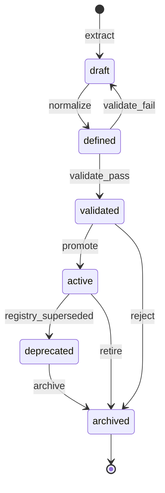
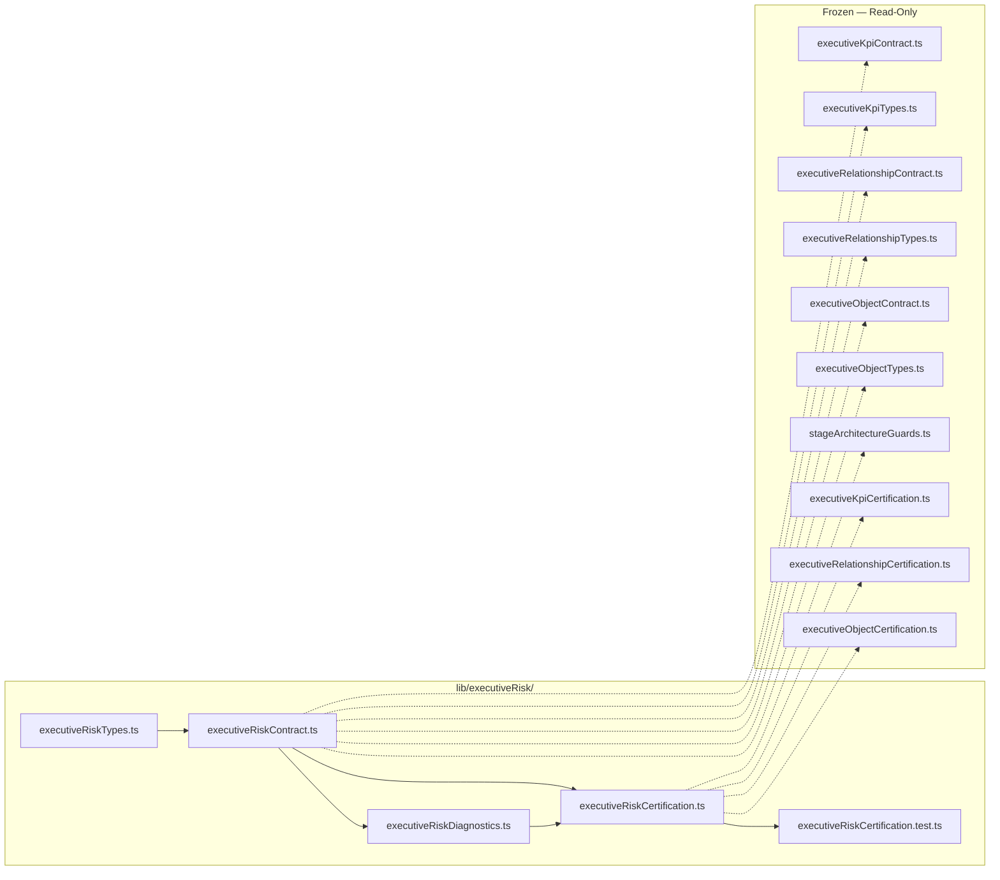
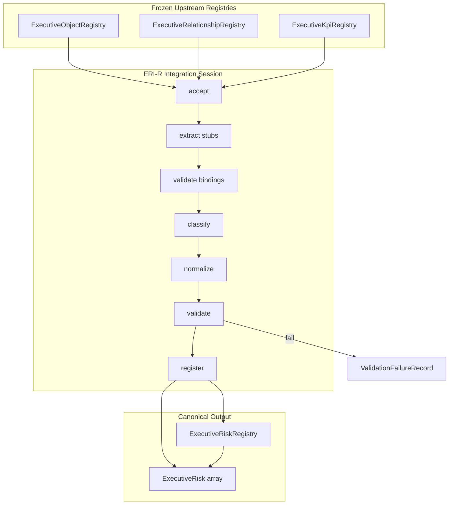

# DS5-INT-1 — Executive Risk Model Integration
## Stage-1 Understanding Report

**Project:** Nexora Type-C  
**Phase:** PHASE-7 / DS-5 Integration  
**Stage ID:** DS5-INT-1  
**Title:** Executive Risk Model Integration  
**Stage:** Stage-1 — Understand  
**Status:** UNDERSTANDING COMPLETE — **READY FOR STAGE-2 BUILD**

**Tags (proposed):** `[DS5_INT_EXECUTIVE_RISK]` `[RISK_INTEGRATION_DEFINED]` `[WORKSPACE_RISK_OWNED]` `[SCENARIO_ENGINE_READY]`

---

## 0. Executive Summary

The **Executive Risk Model Integration (ERI-R)** layer is a **library-only integration contract** that **consumes** the frozen **DS2-INT-1** `ExecutiveObjectRegistry`, **DS3-INT-1** `ExecutiveRelationshipRegistry`, and **DS4-INT-1** `ExecutiveKpiRegistry`, and **derives** the **Canonical Executive Risk Model** — the normalized risk vocabulary downstream **Scenario**, **OKR**, and **Executive Intelligence Platform** adapters use to anchor risk definitions against objects, relationships, and KPIs.

ERI-R is the **first integration layer in PHASE-7**. It transforms **declarative risk stubs** attached to registry object metadata into workspace-scoped **Executive Risk** records with stable identity, classification, severity and likelihood hints, triple-registry bindings, lifecycle, and metadata — without risk scoring, probability calculation, mitigation planning, scenario simulation, intelligence, persistence, dashboard rendering, or assistant logic.

| Layer | Role | Relationship to ERI-R |
|-------|------|---------------------|
| **DS-1 Foundation (frozen)** | Approved business definitions | **Not consumed** — no direct access |
| **EMG Stack (frozen)** | Model generation + runtime | **Not consumed** — no direct access |
| **DS2-INT-1 (frozen)** | Object integration | **Upstream input** — `ExecutiveObjectRegistry` |
| **DS3-INT-1 (frozen)** | Relationship integration | **Upstream input** — `ExecutiveRelationshipRegistry` |
| **DS4-INT-1 (frozen)** | KPI integration | **Upstream input** — `ExecutiveKpiRegistry` |
| **ERI-R (new)** | Risk integration contract | Derives canonical Executive Risks |
| **Domain engines (future)** | Scenario / OKR / INT | Consume ERI-R output — ERI-R does not invoke them |

**Legacy note:** The certified **`risk-intelligence/` pipeline** (`RiskIntelligenceRuntime`, `ObjectRiskEngine`, etc.) is a **parallel track** operating on workspace intelligence inputs. **PHASE-7 DS5-INT** is a **new executive-model integration stack** in `lib/executiveRisk/` — it does not replace or modify legacy risk modules.

**STOP triggered:** **NO**  
**Frozen module modification required:** **NO**  
**Stage-2 Build:** **APPROVED** (additive `lib/executiveRisk/` contract files only)

---

## 1. Executive Risk Integration Purpose

### What ERI-R is

| Attribute | Description |
|-----------|-------------|
| **Integration vocabulary** | Defines how triple-registry snapshots become canonical Executive Risks |
| **Definition-only output** | Produces structured risk records — not scores, probabilities, or mitigations |
| **Workspace-scoped** | Every Executive Risk belongs to exactly one workspace |
| **Triple-registry-dependent** | Reads DS2 + DS3 + DS4 registries only — never DS-1 or EMG directly |
| **Declarative extraction** | Collects pre-declared risk stubs — no inference or scoring |
| **Registry contract** | Declares in-memory risk registry shape — no persistence in Stage-2 scope |
| **Engine-ready** | Normalized risks that Scenario / OKR / INT adapters consume |

### What ERI-R is NOT

| Excluded capability | Belongs to |
|---------------------|------------|
| Object / relationship / KPI integration | DS2 / DS3 / DS4 (frozen) |
| Executive model generation | EMG stack (frozen) |
| DS-1 foundation reads | Forbidden |
| EMG direct reads | Forbidden |
| Risk scoring / probability calculation | Risk Scoring Engine (forbidden) |
| Mitigation planning | Mitigation Engine (forbidden) |
| KPI calculations / values | KPI Calculation Engine (forbidden) |
| Scenario simulations | Scenario Engine (forbidden) |
| Executive intelligence / recommendations | INT-5 platform (forbidden) |
| Dashboard rendering | MRP / Dashboard (forbidden) |
| Assistant logic | Assistant runtime (forbidden) |
| Scene mutation | Scene / workspace sync (forbidden) |
| Parsing / upload / sync | Parser / DS runtime (forbidden) |
| Durable persistence | Future persistence layer (forbidden in DS5-INT-1) |

### Distinction across the stack

| Concern | DS4-INT-1 (EKI) | ERI-R |
|---------|-----------------|-------|
| Primary artifact | `ExecutiveKpiRegistry` | `ExecutiveRiskRegistry` |
| Upstream input | DS2 + DS3 registries | DS2 + DS3 + DS4 registries |
| Classification | `kpiCategory` (8 types) | `riskCategory` (8 types) |
| Qualitative hints | `targetDefinition` (declarative) | `severityHint` + `likelihoodHint` (declarative) |
| Bindings | object + relationship | object + relationship + **KPI** |
| Calculation | Excluded | **Excluded** |

ERI-R **must not redefine** DS2, DS3, or DS4 shapes. It **projects** declarative risk stubs into a downstream canonical shape.

---

## 2. Risk Architecture Diagram



---

## 3. Risk Flow Diagram



### Integration stages (contract vocabulary — Stage-2)

| Stage | ID | Responsibility | Runtime in DS5-INT-1 |
|-------|-----|----------------|----------------------|
| **Accept** | `accept` | Verify DS2/DS3/DS4 freeze + valid triple registries | Validation only |
| **Extract** | `extract` | Collect declarative stubs from object metadata | Shape rules only |
| **Bind** | `bind` | Verify binding ids exist in upstream registries | Identity lookup only |
| **Classify** | `classify` | Apply category, severity, likelihood enums | Declarative mapping only |
| **Normalize** | `normalize` | Apply mandatory fields; default lifecycle `defined` | Contract defaults only |
| **Validate** | `validate` | Run risk + registry validators | Validation functions |
| **Register** | `register` | Produce in-memory risk registry snapshot | Example builder only |

**No stage performs scoring, probability calculation, mitigation, scenario simulation, persistence, or intelligence.**

---

## 4. Input Boundary — Triple-Registry Design

### Sole upstream artifacts

```
DS2-INT-1 → ExecutiveObjectRegistry
DS3-INT-1 → ExecutiveRelationshipRegistry
DS4-INT-1 → ExecutiveKpiRegistry
        └── integrateExecutiveRisksFromRegistries()   ← ONLY upstream inputs
```

### Declarative stub source (within object registry — no EMG import)

Because DS2-INT-1 is frozen, ERI-R defines a **registry-attached declarative envelope** read from existing object metadata extension fields — no DS2 mutation required:

```typescript
DeclaredRiskStub = Readonly<{
  executiveRiskId: string;
  displayName: string;
  riskCategory: ExecutiveRiskCategory;
  severityHint: ExecutiveRiskSeverityHint;
  likelihoodHint: ExecutiveRiskLikelihoodHint;
  objectBindings: readonly ExecutiveRiskObjectBinding[];
  relationshipBindings: readonly ExecutiveRiskRelationshipBinding[];
  kpiBindings: readonly ExecutiveRiskKpiBinding[];
  metadata?: Readonly<{ tags?: readonly string[] }>;
}>;

// Located at:
ExecutiveObject.metadata.extension.futureExtension.riskDeclarations
```

**Extraction rule:** Integration walks `objectRegistry.objects[]`, collects all `riskDeclarations` arrays, deduplicates by `executiveRiskId`, validates bindings against all three upstream registries.

**Empty declarations → valid empty risk registry.** This is not scoring or inference — it is **declarative collection** of pre-supplied stubs.

### Forbidden upstream paths

| Path | Reason |
|------|--------|
| EMG-1 `modelFamilies.risks` | Direct EMG consumption forbidden |
| DS1:1–DS1:7 contracts | DS5-INT receives input only from DS2/DS3/DS4 registries |
| `risk-intelligence/` runtime | Legacy parallel track — forbidden import |
| `workspaceRelationshipSceneSync` | Scene runtime forbidden |

---

## 5. Risk Ownership

### Authority chain

```
Workspace (authoritative owner)
    └── Executive Object Registry (DS2 — read-only input)
    └── Executive Relationship Registry (DS3 — read-only input)
    └── Executive KPI Registry (DS4 — read-only input)
              └── Integration Session (0..N per triple — in-memory)
                        └── derives ──→ Executive Risk Registry
                        └── scoped to ──→ workspaceId + executiveModelId
                        └── correlates ──→ objectRegistryId + relationshipRegistryId + kpiRegistryId
                        └── audit ──→ integration diagnostics
```

### Rules

1. **Every Executive Risk requires `executiveRiskId`, `workspaceId`, `executiveModelId`, `displayName`, `riskCategory`, `severityHint`, `likelihoodHint`.**
2. **Workspace isolation** — risks cannot cross workspace boundaries.
3. **Triple-registry input** — integration reads DS2 + DS3 + DS4; never imports DS-1 or EMG contracts.
4. **Read-only toward upstream** — integration consumes frozen registries; never mutates DS2, DS3, or DS4.
5. **Binding closure** — object, relationship, and KPI binding ids must resolve against respective upstream registries.
6. **In-memory only in DS5-INT-1** — no persistence store, no scene sync writes.
7. **Integration source declared** — `source: "phase-7-executive-risk-integration"`.
8. **Definition-only** — output is risk definitions; no numeric scores.

### Ownership contract (proposed)

| Field | Value |
|-------|-------|
| `isolationPolicy` | `"workspace-exclusive"` |
| `upstreamAuthority` | `"phase-6-executive-kpi-integration"` |
| `mutationPolicy` | `"integration-derived-immutable-snapshot"` |

---

## 6. Risk Identity

### Identity model

| Identifier | Scope | Stability | Purpose |
|------------|-------|-----------|---------|
| `executiveRiskId` | Within executive model | **Preserved from declarative stub** | Primary risk key |
| `executiveModelId` | Workspace | From object registry | Model correlation |
| `workspaceId` | Global workspace | From object registry | Isolation boundary |
| `objectRegistryId` | Integration run | From DS2 input | Upstream correlation |
| `relationshipRegistryId` | Integration run | From DS3 input | Upstream correlation |
| `kpiRegistryId` | Integration run | From DS4 input | Upstream correlation |
| `integrationSessionId` | Integration session | Generated per run | Audit trail |

### Identity rules

1. **Risk ids** are supplied by declarative stubs — integration does not invent ids via algorithms.
2. **No duplicate ids** within a single risk registry snapshot.
3. **No scene risk ids** — ERI-R does not assign scene or legacy risk-intelligence ids.
4. **Binding ids** must match upstream registry ids — not scene or runtime ids.

---

## 7. Risk Lifecycle

### Lifecycle states (contract only)

| State | Meaning | Typical entry |
|-------|---------|---------------|
| `draft` | Extracted but not yet validated | Pre-validation extract |
| `defined` | All mandatory fields present | Default after normalize |
| `validated` | Passed `validateExecutiveRisk()` | Post-validation |
| `active` | Approved for downstream engine consumption | Explicit promotion hook |
| `deprecated` | Superseded by newer registry integration | Re-integration |
| `archived` | Retained for audit only | Manual contract transition |



### Lifecycle rules

1. **Default on integration:** `defined` after normalize → `validated` after validation passes.
2. **Upstream lifecycles are separate** — risk lifecycle does not auto-sync to object, relationship, or KPI lifecycle.
3. **No runtime behavior** — transitions are contract vocabulary only.
4. **Re-integration** marks prior risks `deprecated` when content hash differs (Stage-2 validator).

---

## 8. Risk Classification

### Risk categories (contract only — 8 values)

| `riskCategory` | Purpose | Typical semantic use |
|----------------|---------|----------------------|
| `strategic` | Strategic exposure | Market shift, competitive threat |
| `operational` | Process / delivery exposure | Supply chain disruption |
| `financial` | Financial exposure | Revenue volatility, cost overrun |
| `compliance` | Regulatory exposure | Policy breach, audit finding |
| `technical` | Technology exposure | System failure, security vulnerability |
| `resource` | Resource exposure | Capacity shortage, talent gap |
| `market` | External market exposure | Demand collapse, pricing pressure |
| `custom` | Extension-classified | Catch-all with metadata justification |

**No scoring logic.** Classification uses **declarative stub values** only.

### Severity hints (contract only — 4 values)

| `severityHint` | Meaning |
|----------------|---------|
| `low` | Minimal impact if realized |
| `medium` | Moderate impact |
| `high` | Significant impact |
| `critical` | Severe / existential impact |

### Likelihood hints (contract only — 5 values)

| `likelihoodHint` | Meaning |
|------------------|---------|
| `rare` | Very unlikely to occur |
| `unlikely` | Low probability |
| `possible` | Could occur under adverse conditions |
| `likely` | Probable under current trajectory |
| `almost_certain` | Expected unless mitigated |

Severity and likelihood are **qualitative metadata for downstream engines** — ERI-R does not compute risk scores, probability values, or heat maps.

---

## 9. Executive Risk — Mandatory Fields

Every **Executive Risk** must include these fields (contract only — no runtime behavior):

| Field | Type | Responsibility |
|-------|------|----------------|
| `executiveRiskId` | string | Stable risk identity |
| `workspaceId` | string | Owning workspace |
| `executiveModelId` | string | Parent executive model |
| `displayName` | string | Human-readable risk name |
| `riskCategory` | enum (8 values) | Canonical classification |
| `severityHint` | enum (4 values) | Qualitative impact hint — not computed |
| `likelihoodHint` | enum (5 values) | Qualitative probability hint — not computed |
| `objectBindings` | array | Declarative object id bindings |
| `relationshipBindings` | array | Declarative relationship id bindings |
| `kpiBindings` | array | Declarative KPI id bindings |
| `metadata` | object | Tags, hints, extension payload |
| `lifecycleState` | enum (6 values) | Risk lifecycle position |
| `createdAt` | ISO string | Integration record creation |
| `updatedAt` | ISO string | Last integration update |
| `source` | const | `"phase-7-executive-risk-integration"` |

### Proposed supplementary fields (Stage-2 contract)

| Field | Type | Purpose |
|-------|------|---------|
| `contractVersion` | string | `"PHASE-7/DS5-INT-1"` |
| `objectRegistryId` | string | Correlates to DS2 input |
| `relationshipRegistryId` | string | Correlates to DS3 input |
| `kpiRegistryId` | string | Correlates to DS4 input |
| `integrationSessionId` | string | Links to integration run |
| `contentHash` | string | Deterministic hash for re-integration diff |
| `hostObjectId` | string \| null | Object that carried the declarative stub |

---

## 10. Risk Metadata

| Field | Type | Purpose |
|-------|------|---------|
| `tags` | string[] | Classification tags (pass-through + integration tags) |
| `domainHint` | string \| null | From parent object registry context |
| `executiveCategoryHint` | string \| null | From parent object registry context |
| `taxonomyOverride` | string \| null | Explicit category override reason |
| `extension` | object | `futureExtension` opaque payload |

No intelligence metadata, computed scores, mitigation plans, dashboard routing, or scene position fields in DS5-INT-1.

---

## 11. Risk Registry Contract

The **Executive Risk Registry** is an in-memory contract snapshot — not a persistence store or legacy risk-intelligence registry.

### Registry shape (proposed)

```typescript
ExecutiveRiskRegistry = Readonly<{
  contractVersion: string;
  registryId: string;
  workspaceId: string;
  executiveModelId: string;
  objectRegistryId: string;
  relationshipRegistryId: string;
  kpiRegistryId: string;
  integrationSessionId: string;
  risks: readonly ExecutiveRisk[];
  riskCount: number;
  registryState: "draft" | "validated" | "active";
  source: "phase-7-executive-risk-integration";
  createdAt: string;
  updatedAt: string;
}>;
```

### Lookup helpers (Stage-2)

| Function | Purpose |
|----------|---------|
| `resolveExecutiveRiskById()` | Primary key lookup |
| `listExecutiveRisksByCategory()` | Filter by `riskCategory` |
| `listExecutiveRisksForObject()` | Filter by object binding id |
| `listExecutiveRisksForKpi()` | Filter by KPI binding id |

**No persistence.** No workspace mutation. No scene mutation.

---

## 12. Binding Rules

KPI definitions bind declaratively to all three upstream registries:

| Binding Type | Shape | Validation |
|--------------|-------|------------|
| Object binding | `{ executiveObjectId, bindingRole }` | Id must exist in `ExecutiveObjectRegistry` |
| Relationship binding | `{ executiveRelationshipId, bindingRole }` | Id must exist in `ExecutiveRelationshipRegistry` |
| KPI binding | `{ executiveKpiId, bindingRole }` | Id must exist in `ExecutiveKpiRegistry` |

Binding roles: `primary` \| `secondary` \| `context` \| `custom`.

**No traversal.** No dependency calculation. No graph analysis. No risk propagation. Bindings are identity references only.

---

## 13. Risk Validation (Stage-2)

| Function | Purpose |
|----------|---------|
| `validateDeclaredRiskStub()` | Declaration shape before integration |
| `validateExecutiveRisk()` | Full risk mandatory fields |
| `validateExecutiveRiskRegistry()` | Registry consistency + binding checks |
| `validateRiskObjectBindings()` | Object id existence in DS2 registry |
| `validateRiskRelationshipBindings()` | Relationship id existence in DS3 registry |
| `validateRiskKpiBindings()` | KPI id existence in DS4 registry |
| `validateTripleRegistryIntegrationInput()` | Scope alignment across three registries |
| `validateErirTripleRegistryInputBoundary()` | Input boundary probe |
| `validateErirNoScoringIntegrity()` | No-scoring boundary probe |

---

## 14. Extension Points

| Extension | Location | Purpose |
|-----------|----------|---------|
| `metadata.extension.futureExtension` | On each `ExecutiveRisk` | Opaque downstream payload |
| `taxonomyOverride` | On metadata | Explicit category override reason |
| `riskDeclarations` | On host object `futureExtension` | Declarative stub carrier |
| `bindingRole: "custom"` | On any binding | Extension binding semantics |

Extension points are **contract vocabulary only** — no runtime interpretation in DS5-INT-1.

---

## 15. Dependency Map



**Forbidden import targets:** objectRegistryRuntime, workspaceRelationshipSceneSync, relationships/executive, risk-intelligence, kpi-intelligence, EMG modules, datasourceCertification, ScenarioGenerationRuntime, dashboardIntelligence, assistantRuntime, all `.tsx`.

**Circular dependencies:** None — ERI-R depends on DS2/DS3/DS4; upstream does not depend on ERI-R.

---

## 16. Risk Lifecycle Diagram



---

## 17. Diagnostics (Proposed — Stage-2)

| Event | When |
|-------|------|
| `RiskDeclared` | Stub extracted from object metadata |
| `RiskValidated` | Per-risk validation result |
| `RiskRegistered` | Registry snapshot produced |
| `RiskDeprecated` | Re-integration supersedes prior risk |
| `RiskArchived` | Contract hook for retirement |
| `CertificationStarted` | Certification probe |
| `CertificationPassed` | All gates pass |
| `CertificationFailed` | Gate or integration failure |

---

## 18. Architecture Smells (Pre-Build Review)

| Smell | Severity | Mitigation |
|-------|----------|------------|
| Risk stubs in object metadata extension | Low | Uses existing DS2 `futureExtension` — no DS2 mutation |
| Triple-registry scope alignment | Medium | Explicit scope validator; shared workspaceId + executiveModelId |
| Dual risk vocabularies (legacy vs ERI-R) | Low | Document parallel tracks; separate module path |
| Confusion with EMG-1 risk family | Medium | EMG import forbidden; explicit input boundary gates |
| Scoring temptation from severity/likelihood hints | Medium | MUST NOT OWN scoring; hints are qualitative only |
| Legacy `risk-intelligence/` name collision | Low | New module at `lib/executiveRisk/` |
| KPI binding optional vs required | Low | Empty binding arrays valid; identity validation when present |

**No critical smells.** **No STOP conditions triggered.**

---

## 19. Risk Analysis

| Risk | Likelihood | Impact | Mitigation |
|------|:----------:|:------:|------------|
| ERI-R becomes risk scoring engine | Medium | Critical | MUST NOT OWN scoring; declarative hints only |
| Direct EMG import for risks | Medium | Critical | Forbidden import probes; triple-registry input gate |
| Direct DS-1 consumption | Medium | Critical | DS-1 paths in forbidden patterns |
| Probability calculation creep | Medium | Critical | `probability_calculation` in MUST NOT OWN |
| Mitigation engine creep | Medium | High | `mitigation_planning` in MUST NOT OWN |
| Scene sync mutation | Medium | Critical | workspaceRelationshipSceneSync forbidden probe |
| Scenario sim during integration | Medium | Critical | Definition-only; no simulation |
| Persistence creep | Medium | High | persistence in MUST NOT OWN |
| Binding id drift from upstream registries | Low | High | Triple binding closure validators |
| Empty risk registry misread as failure | Medium | Low | Document valid empty output |
| Legacy risk pipeline conflict | Low | Medium | Parallel track documentation |
| Graph traversal via bindings | Medium | High | Identity lookup only; no traversal |

---

## 20. Expected File List

### Stage-1 (this stage)

| File | Responsibility |
|------|----------------|
| `executiveRiskTypes.ts` | Architecture type definitions — **created** |
| `executiveRiskContract.ts` | Vocabulary constants, manifest, MUST NOT OWN — **created** |
| `docs/ds5-int-1-understanding-report.md` | Architecture understanding — **this document** |

**Stage-1 scope:** types + contract vocabulary only. No integration, validation, diagnostics, or certification.

### Stage-2 (build — proposed)

| File | Responsibility |
|------|----------------|
| `executiveRiskTypes.ts` | Extend with score, diagnostic, freeze types |
| `executiveRiskContract.ts` | Validators, integration function, examples, analysis score |
| `executiveRiskDiagnostics.ts` | 8 integration lifecycle events |
| `executiveRiskCertification.ts` | Certification + analysis runner |
| `executiveRiskCertification.test.ts` | Architecture tests |
| `docs/ds5-int-1-build-report.md` | Build report |

### Stage-3 (analyze/freeze — proposed)

| File | Responsibility |
|------|----------------|
| `docs/ds5-int-1-analysis-report.md` | 22-criterion review + scores |
| `docs/ds5-int-1-freeze-report.md` | Freeze declaration |

---

## 21. Certification Strategy (Stage-2 / Stage-3)

### Prerequisites

- PHASE-1 Stage Architecture frozen
- PHASE-4 DS2-INT-1 frozen
- PHASE-5 DS3-INT-1 frozen
- PHASE-6 DS4-INT-1 frozen

### Proposed gate groups

| Group | Focus | Example gates |
|-------|-------|---------------|
| A | Version & vocabulary | Contract version, 8 categories, 4 severity hints, 5 likelihood hints, 6 lifecycle states |
| B | Manifest & boundaries | Allowlist, forbidden paths, file boundary |
| C | Prerequisites & deps | DS2/DS3/DS4 frozen, acyclic deps, no EMG/DS1 direct import |
| D | Risk validation | Mandatory fields, registry consistency, triple binding closure |
| E | Triple registry integration | Input from DS2+DS3+DS4 only; scope alignment |
| F | Regression boundary | MUST NOT OWN (≥35 exclusions), integration-only, no scoring |
| G | Diagnostics & alignment | Events operational, binding preservation |
| H | Analysis & freeze | Freeze tags, no persistence, no scene sync, ERI-R source locked |

### Proposed minimum score

`EXECUTIVE_RISK_INTEGRATION_MINIMUM_OVERALL_SCORE = 98`

### Test prerequisites (beforeEach)

1. `runDs1FoundationAnalysis()` (DS1 chain for upstream examples)
2. `runExecutiveModelRuntimeAnalysis()` (EMG chain)
3. `runExecutiveObjectIntegrationAnalysis()` (DS2-INT-1 frozen)
4. `runExecutiveRelationshipIntegrationAnalysis()` (DS3-INT-1 frozen)
5. `runExecutiveKpiIntegrationAnalysis()` (DS4-INT-1 frozen)

---

## 22. Verification Checklist

| Requirement | Design compliance |
|-------------|-------------------|
| Workspace-aware | PASS — workspaceId on risk + registry |
| Library-only | PASS — no runtime engines, no UI |
| Risk-definition only | PASS — no scoring or mitigation |
| Triple-registry-dependent | PASS — DS2 + DS3 + DS4 sole inputs |
| Intelligence-independent | PASS — excluded in MUST NOT OWN |
| Persistence-independent | PASS — in-memory registry contract |
| Dashboard-independent | PASS — forbidden path probes |
| Assistant-independent | PASS — forbidden path probes |
| No DS-1 direct consumption | PASS — forbidden |
| No EMG direct consumption | PASS — forbidden |
| No frozen module modification | PASS — additive module only |

---

## 23. Future Compatibility

| Consumer | Relationship |
|----------|--------------|
| **Scenario Engine** | Reads `ExecutiveRiskRegistry`; overlays scenario deltas on risk ids |
| **OKR Engine** | Cross-references strategic risks with OKR objectives |
| **INT Platform** | Read-only registry metadata adapter |
| **Dashboard / Assistant** | Correlate risk display names — no imports into ERI-R |

---

## 24. STOP Rule Evaluation

| STOP condition | Triggered? | Notes |
|----------------|:----------:|-------|
| Risk scoring required | **NO** | Declarative severity/likelihood hints only |
| Probability calculation required | **NO** | Scoring Engine owns calculation |
| Mitigation engine required | **NO** | Mitigation Engine owns planning |
| Scenario generation required | **NO** | Scenario Engine owns simulation |
| AI reasoning required | **NO** | INT-5 owns intelligence |
| Dashboard coupling required | **NO** | Read-only consumer pattern |
| Assistant coupling required | **NO** | Read-only consumer pattern |
| Persistence required | **NO** | Deferred to future layer |
| Direct DS-1 consumption required | **NO** | Triple registry is sufficient |
| Direct EMG consumption required | **NO** | Stubs carried via object metadata convention |

**STOP triggered:** **NO**  
**Alternative architecture required:** **NO**

---

## 25. Stage Readiness Report

| Criterion | Status |
|-----------|--------|
| Architecture purpose defined | **COMPLETE** |
| Risk identity model defined | **COMPLETE** |
| Risk lifecycle defined | **COMPLETE** |
| Risk classification defined (8 categories) | **COMPLETE** |
| Severity hints defined (4 values) | **COMPLETE** |
| Likelihood hints defined (5 values) | **COMPLETE** |
| Mandatory risk fields defined (14 + source) | **COMPLETE** |
| Registry contract defined | **COMPLETE** |
| Triple binding rules defined | **COMPLETE** |
| Validation strategy defined | **COMPLETE** |
| DS2/DS3/DS4 read-only integration defined | **COMPLETE** |
| Future engine compatibility documented | **COMPLETE** |
| Dependency map documented | **COMPLETE** |
| Risk analysis complete | **COMPLETE** |
| Certification strategy defined | **COMPLETE** |
| Forbidden capabilities excluded | **COMPLETE** |
| Frozen architecture conflicts | **NONE** |
| Architecture vocabulary files created | **COMPLETE** |
| Runtime implementation written | **NONE** (Stage-1 rule satisfied) |

### Verdict

**DS5-INT-1 Stage-1 Understanding: COMPLETE**

The Executive Risk Model Integration architecture is **safe to build** as an additive `lib/executiveRisk/` contract module consuming frozen DS2-INT-1, DS3-INT-1, and DS4-INT-1 registries only.

**Stage-2 Build: APPROVED**

No frozen modules were modified.

---

## 26. Proposed Entry Points (Stage-2)

```typescript
// Contract vocabulary — Stage-2 implementation
import {
  validateExecutiveRisk,
  validateExecutiveRiskRegistry,
  integrateExecutiveRisksFromRegistries,
} from "../frontend/app/lib/executiveRisk/executiveRiskContract.ts";

// Upstream inputs — frozen DS2 / DS3 / DS4
import { resolveExecutiveObjectRegistryWithKpiDeclarationsExample } from "../frontend/app/lib/executiveKpi/executiveKpiContract.ts";
import { resolveExecutiveRelationshipRegistryExample } from "../frontend/app/lib/executiveRelationship/executiveRelationshipContract.ts";

const result = integrateExecutiveRisksFromRegistries({
  objectRegistry: resolveExecutiveObjectRegistryWithKpiDeclarationsExample(),
  relationshipRegistry: resolveExecutiveRelationshipRegistryExample(),
  kpiRegistry: resolveExecutiveKpiRegistryExample(),
});
// result.registry — canonical Executive Risk Model
```
