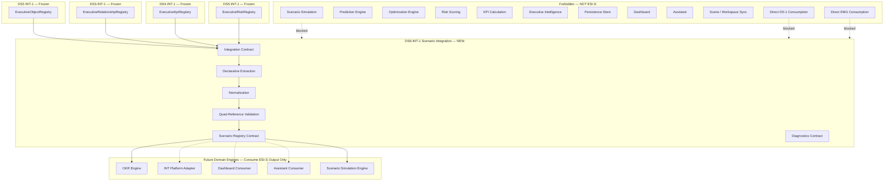
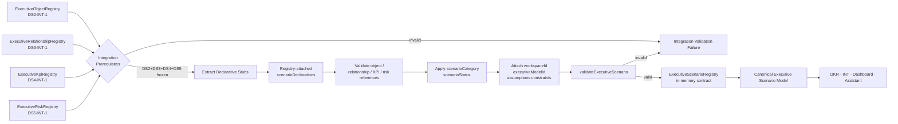
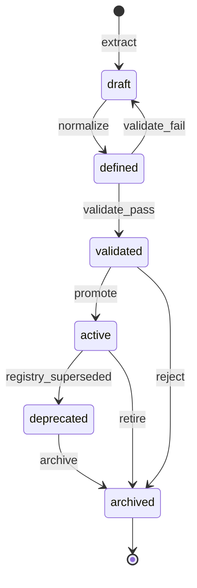
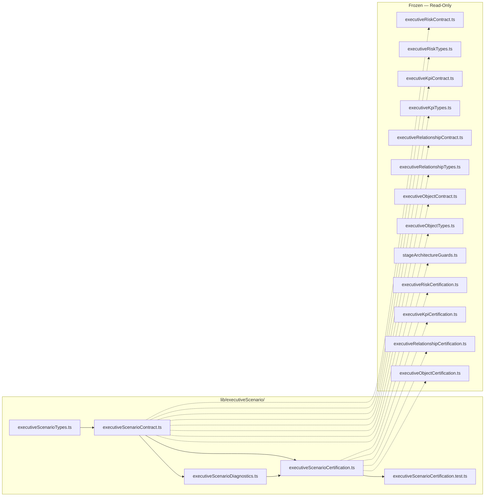
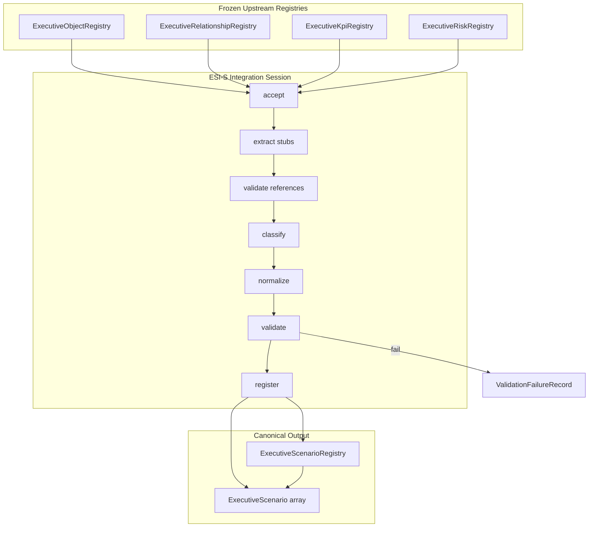

# DS6-INT-1 — Executive Scenario Model Integration
## Stage-1 Understanding Report

**Project:** Nexora Type-C  
**Phase:** PHASE-8 / DS-6 Integration  
**Stage ID:** DS6-INT-1  
**Title:** Executive Scenario Model Integration  
**Stage:** Stage-1 — Understand  
**Status:** UNDERSTANDING COMPLETE — **READY FOR STAGE-2 BUILD**

**Tags (proposed):** `[DS6_INT_EXECUTIVE_SCENARIO]` `[SCENARIO_INTEGRATION_DEFINED]` `[WORKSPACE_SCENARIO_OWNED]` `[OKR_ENGINE_READY]`

---

## 0. Executive Summary

The **Executive Scenario Model Integration (ESI-S)** layer is a **library-only integration contract** that **consumes** the frozen **DS2-INT-1** `ExecutiveObjectRegistry`, **DS3-INT-1** `ExecutiveRelationshipRegistry`, **DS4-INT-1** `ExecutiveKpiRegistry`, and **DS5-INT-1** `ExecutiveRiskRegistry`, and **derives** the **Canonical Executive Scenario Model** — the normalized scenario vocabulary downstream **OKR**, **Executive Intelligence Platform**, **Dashboard**, and **Assistant** adapters use to anchor scenario definitions against objects, relationships, KPIs, and risks.

ESI-S is the **first integration layer in PHASE-8**. It transforms **declarative scenario stubs** attached to registry object metadata into workspace-scoped **Executive Scenario** records with stable identity, classification, approval status, quad-registry references, assumptions, constraints, lifecycle, and metadata — without scenario simulation, prediction, optimization, AI reasoning, risk scoring, KPI calculation, intelligence, persistence, dashboard rendering, or assistant logic.

| Layer | Role | Relationship to ESI-S |
|-------|------|---------------------|
| **DS-1 Foundation (frozen)** | Approved business definitions | **Not consumed** — no direct access |
| **EMG Stack (frozen)** | Model generation + runtime | **Not consumed** — no direct access |
| **DS2-INT-1 (frozen)** | Object integration | **Upstream input** — `ExecutiveObjectRegistry` |
| **DS3-INT-1 (frozen)** | Relationship integration | **Upstream input** — `ExecutiveRelationshipRegistry` |
| **DS4-INT-1 (frozen)** | KPI integration | **Upstream input** — `ExecutiveKpiRegistry` |
| **DS5-INT-1 (frozen)** | Risk integration | **Upstream input** — `ExecutiveRiskRegistry` |
| **ESI-S (new)** | Scenario integration contract | Derives canonical Executive Scenarios |
| **Domain engines (future)** | OKR / INT / Simulation | Consume ESI-S output — ESI-S does not invoke them |

**Legacy note:** The certified **`scenario-intelligence/` pipeline** (`ScenarioGenerationRuntime`, `ScenarioBuilderEngine`, impact simulation engines, etc.) and **`scenario-authoring/`** / **MRP scenario workspace** modules are **parallel tracks** operating on workspace intelligence inputs. **PHASE-8 DS6-INT** is a **new executive-model integration stack** in `lib/executiveScenario/` — it does not replace or modify legacy scenario modules.

**STOP triggered:** **NO**  
**Frozen module modification required:** **NO**  
**Stage-2 Build:** **APPROVED** (additive `lib/executiveScenario/` contract files only)

---

## 1. Executive Scenario Integration Purpose

### What ESI-S is

| Attribute | Description |
|-----------|-------------|
| **Integration vocabulary** | Defines how quad-registry snapshots become canonical Executive Scenarios |
| **Definition-only output** | Produces structured scenario records — not simulations, predictions, or optimizations |
| **Workspace-scoped** | Every Executive Scenario belongs to exactly one workspace |
| **Quad-registry-dependent** | Reads DS2 + DS3 + DS4 + DS5 registries only — never DS-1 or EMG directly |
| **Declarative extraction** | Collects pre-declared scenario stubs — no inference or simulation |
| **Registry contract** | Declares in-memory scenario registry shape — no persistence in Stage-2 scope |
| **Engine-ready** | Normalized scenarios that OKR / INT / Dashboard / Assistant adapters consume |

### What ESI-S is NOT

| Excluded capability | Belongs to |
|---------------------|------------|
| Object / relationship / KPI / risk integration | DS2 / DS3 / DS4 / DS5 (frozen) |
| Executive model generation | EMG stack (frozen) |
| DS-1 foundation reads | Forbidden |
| EMG direct reads | Forbidden |
| Scenario simulation / prediction / optimization | Scenario Simulation Engine (forbidden) |
| Risk scoring / probability calculation | Risk Scoring Engine (forbidden) |
| KPI calculations / values | KPI Calculation Engine (forbidden) |
| AI reasoning / recommendations | INT-5 platform (forbidden) |
| Dashboard rendering | MRP / Dashboard (forbidden) |
| Assistant logic | Assistant runtime (forbidden) |
| Scene mutation | Scene / workspace sync (forbidden) |
| Parsing / upload / sync | Parser / DS runtime (forbidden) |
| Durable persistence | Future persistence layer (forbidden in DS6-INT-1) |

### Distinction across the stack

| Concern | DS5-INT-1 (ERI-R) | ESI-S |
|---------|-------------------|-------|
| Primary artifact | `ExecutiveRiskRegistry` | `ExecutiveScenarioRegistry` |
| Upstream input | DS2 + DS3 + DS4 registries | DS2 + DS3 + DS4 + **DS5** registries |
| Classification | `riskCategory` (8 types) | `scenarioCategory` (8 types) |
| Status dimension | severity + likelihood hints | `scenarioStatus` (5 approval states) |
| References | object + relationship + KPI bindings | object + relationship + KPI + **risk** references |
| Declarative extras | — | `assumptions` + `constraints` |
| Simulation | Excluded | **Excluded** |

ESI-S **must not redefine** DS2, DS3, DS4, or DS5 shapes. It **projects** declarative scenario stubs into a downstream canonical shape.

---

## 2. Scenario Architecture Diagram



---

## 3. Scenario Flow Diagram



### Integration stages (contract vocabulary — Stage-2)

| Stage | ID | Responsibility | Runtime in DS6-INT-1 |
|-------|-----|----------------|----------------------|
| **Accept** | `accept` | Verify DS2/DS3/DS4/DS5 freeze + valid quad registries | Validation only |
| **Extract** | `extract` | Collect declarative stubs from object metadata | Shape rules only |
| **Reference** | `reference` | Verify reference ids exist in upstream registries | Identity lookup only |
| **Classify** | `classify` | Apply category and status enums | Declarative mapping only |
| **Normalize** | `normalize` | Apply mandatory fields; default lifecycle `defined` | Contract defaults only |
| **Validate** | `validate` | Run scenario + registry validators | Validation functions |
| **Register** | `register` | Produce in-memory scenario registry snapshot | Example builder only |

**No stage performs simulation, prediction, optimization, scoring, persistence, or intelligence.**

---

## 4. Input Boundary — Quad-Registry Design

### Sole upstream artifacts

```
DS2-INT-1 → ExecutiveObjectRegistry
DS3-INT-1 → ExecutiveRelationshipRegistry
DS4-INT-1 → ExecutiveKpiRegistry
DS5-INT-1 → ExecutiveRiskRegistry
        └── integrateExecutiveScenariosFromRegistries()   ← ONLY upstream inputs
```

### Declarative stub source (within object registry — no EMG import)

Because DS2-INT-1 is frozen, ESI-S defines a **registry-attached declarative envelope** read from existing object metadata extension fields — no DS2 mutation required:

```typescript
DeclaredScenarioStub = Readonly<{
  executiveScenarioId: string;
  displayName: string;
  scenarioCategory: ExecutiveScenarioCategory;
  scenarioStatus: ExecutiveScenarioStatus;
  objectReferences: readonly ExecutiveScenarioObjectReference[];
  relationshipReferences: readonly ExecutiveScenarioRelationshipReference[];
  kpiReferences: readonly ExecutiveScenarioKpiReference[];
  riskReferences: readonly ExecutiveScenarioRiskReference[];
  assumptions: readonly ExecutiveScenarioAssumption[];
  constraints: readonly ExecutiveScenarioConstraint[];
  metadata?: Readonly<{ tags?: readonly string[] }>;
}>;

// Located at:
ExecutiveObject.metadata.extension.futureExtension.scenarioDeclarations
```

**Extraction rule:** Integration walks `objectRegistry.objects[]`, collects all `scenarioDeclarations` arrays, deduplicates by `executiveScenarioId`, validates references against all four upstream registries.

**Empty declarations → valid empty scenario registry.** This is not simulation or inference — it is **declarative collection** of pre-supplied stubs.

### Forbidden upstream paths

| Path | Reason |
|------|--------|
| EMG-1 `modelFamilies.scenarios` | Direct EMG consumption forbidden |
| DS1:1–DS1:7 contracts | DS6-INT receives input only from DS2/DS3/DS4/DS5 registries |
| `scenario-intelligence/` runtime | Legacy parallel track — forbidden import |
| `scenario-authoring/` runtime | Legacy parallel track — forbidden import |
| `mrpWorkspace/scenario` | MRP scenario workspace — forbidden import |
| `workspaceRelationshipSceneSync` | Scene runtime forbidden |

---

## 5. Scenario Ownership

### Authority chain

```
Workspace (authoritative owner)
    └── Executive Object Registry (DS2 — read-only input)
    └── Executive Relationship Registry (DS3 — read-only input)
    └── Executive KPI Registry (DS4 — read-only input)
    └── Executive Risk Registry (DS5 — read-only input)
              └── Integration Session (0..N per quad — in-memory)
                        └── derives ──→ Executive Scenario Registry
                        └── scoped to ──→ workspaceId + executiveModelId
                        └── correlates ──→ objectRegistryId + relationshipRegistryId
                                           + kpiRegistryId + riskRegistryId
                        └── audit ──→ integration diagnostics
```

### Rules

1. **Every Executive Scenario requires `executiveScenarioId`, `workspaceId`, `executiveModelId`, `displayName`, `scenarioCategory`, `scenarioStatus`.**
2. **Workspace isolation** — scenarios cannot cross workspace boundaries.
3. **Quad-registry input** — integration reads DS2 + DS3 + DS4 + DS5; never imports DS-1 or EMG contracts.
4. **Read-only toward upstream** — integration consumes frozen registries; never mutates DS2, DS3, DS4, or DS5.
5. **Reference closure** — object, relationship, KPI, and risk reference ids must resolve against respective upstream registries.
6. **No embedding** — scenarios reference registry entities by identity only; never duplicate or embed full registry objects.
7. **In-memory only in DS6-INT-1** — no persistence store, no scene sync writes.
8. **Integration source declared** — `source: "phase-8-executive-scenario-integration"`.
9. **Definition-only** — output is scenario definitions; no simulation results.

### Ownership contract (proposed)

| Field | Value |
|-------|-------|
| `isolationPolicy` | `"workspace-exclusive"` |
| `upstreamAuthority` | `"phase-7-executive-risk-integration"` |
| `mutationPolicy` | `"integration-derived-immutable-snapshot"` |

---

## 6. Scenario Identity

### Identity model

| Identifier | Scope | Stability | Purpose |
|------------|-------|-----------|---------|
| `executiveScenarioId` | Within executive model | **Preserved from declarative stub** | Primary scenario key |
| `executiveModelId` | Workspace | From object registry | Model correlation |
| `workspaceId` | Global workspace | From object registry | Isolation boundary |
| `objectRegistryId` | Integration run | From DS2 input | Upstream correlation |
| `relationshipRegistryId` | Integration run | From DS3 input | Upstream correlation |
| `kpiRegistryId` | Integration run | From DS4 input | Upstream correlation |
| `riskRegistryId` | Integration run | From DS5 input | Upstream correlation |
| `integrationSessionId` | Integration session | Generated per run | Audit trail |

### Identity rules

1. **Scenario ids** are supplied by declarative stubs — integration does not invent ids via algorithms.
2. **No duplicate ids** within a single scenario registry snapshot.
3. **No legacy scenario ids** — ESI-S does not assign scene, MRP, or legacy scenario-intelligence ids.
4. **Reference ids** must match upstream registry ids — not scene or runtime ids.

---

## 7. Scenario Lifecycle

### Lifecycle states (contract only)

| State | Meaning | Typical entry |
|-------|---------|---------------|
| `draft` | Extracted but not yet validated | Pre-validation extract |
| `defined` | All mandatory fields present | Default after normalize |
| `validated` | Passed `validateExecutiveScenario()` | Post-validation |
| `active` | Approved for downstream engine consumption | Explicit promotion hook |
| `deprecated` | Superseded by newer registry integration | Re-integration |
| `archived` | Retained for audit only | Manual contract transition |



### Scenario status (approval dimension — separate from lifecycle)

| `scenarioStatus` | Meaning |
|------------------|---------|
| `proposed` | Submitted for review — not yet approved |
| `approved` | Accepted as valid scenario definition |
| `rejected` | Declined — retained for audit |
| `active` | Currently in use for planning |
| `archived` | Retired from active planning |

**Status vs lifecycle:** `scenarioStatus` captures **approval / planning workflow**; `lifecycleState` captures **integration contract position**. Both are declarative — ESI-S does not run approval workflows or simulations.

### Lifecycle rules

1. **Default on integration:** `defined` after normalize → `validated` after validation passes.
2. **Upstream lifecycles are separate** — scenario lifecycle does not auto-sync to object, relationship, KPI, or risk lifecycle.
3. **No runtime behavior** — transitions are contract vocabulary only.
4. **Re-integration** marks prior scenarios `deprecated` when content hash differs (Stage-2 validator).

---

## 8. Scenario Classification

### Scenario categories (contract only — 8 values)

| `scenarioCategory` | Purpose | Typical semantic use |
|--------------------|---------|----------------------|
| `strategic` | Strategic planning scenarios | Market entry, portfolio shift |
| `operational` | Operational planning scenarios | Process change, capacity plan |
| `financial` | Financial planning scenarios | Budget reallocation, cost scenario |
| `organizational` | Organizational change scenarios | Restructuring, role realignment |
| `market` | External market scenarios | Demand shift, competitive response |
| `contingency` | Contingency / fallback scenarios | Business continuity, disaster response |
| `optimization` | Optimization framing scenarios | Resource optimization framing — not optimization execution |
| `custom` | Extension-classified | Catch-all with metadata justification |

**No simulation logic.** Classification uses **declarative stub values** only. The `optimization` category names a **planning class** — ESI-S does not run optimization algorithms.

---

## 9. Executive Scenario — Mandatory Fields

Every **Executive Scenario** must include these fields (contract only — no runtime behavior):

| Field | Type | Responsibility |
|-------|------|----------------|
| `executiveScenarioId` | string | Stable scenario identity |
| `workspaceId` | string | Owning workspace |
| `executiveModelId` | string | Parent executive model |
| `displayName` | string | Human-readable scenario name |
| `scenarioCategory` | enum (8 values) | Canonical classification |
| `scenarioStatus` | enum (5 values) | Approval / planning status — not computed |
| `objectReferences` | array | Declarative object id references |
| `relationshipReferences` | array | Declarative relationship id references |
| `kpiReferences` | array | Declarative KPI id references |
| `riskReferences` | array | Declarative risk id references |
| `assumptions` | array | Declarative assumption records |
| `constraints` | array | Declarative constraint records |
| `metadata` | object | Tags, hints, extension payload |
| `lifecycleState` | enum (6 values) | Scenario lifecycle position |
| `createdAt` | ISO string | Integration record creation |
| `updatedAt` | ISO string | Last integration update |

### Proposed supplementary fields (Stage-2 contract)

| Field | Type | Purpose |
|-------|------|---------|
| `contractVersion` | string | `"PHASE-8/DS6-INT-1"` |
| `objectRegistryId` | string | Correlates to DS2 input |
| `relationshipRegistryId` | string | Correlates to DS3 input |
| `kpiRegistryId` | string | Correlates to DS4 input |
| `riskRegistryId` | string | Correlates to DS5 input |
| `integrationSessionId` | string | Links to integration run |
| `contentHash` | string | Deterministic hash for re-integration diff |
| `hostObjectId` | string \| null | Object that carried the declarative stub |
| `source` | const | `"phase-8-executive-scenario-integration"` |

---

## 10. Scenario Metadata

| Field | Type | Purpose |
|-------|------|---------|
| `tags` | string[] | Classification tags (pass-through + integration tags) |
| `domainHint` | string \| null | From parent object registry context |
| `executiveCategoryHint` | string \| null | From parent object registry context |
| `taxonomyOverride` | string \| null | Explicit category override reason |
| `extension` | object | `futureExtension` opaque payload |

No intelligence metadata, simulation results, optimization outputs, dashboard routing, or scene position fields in DS6-INT-1.

---

## 11. Scenario Registry Contract

The **Executive Scenario Registry** is an in-memory contract snapshot — not a persistence store or legacy scenario-intelligence registry.

### Registry shape (proposed)

```typescript
ExecutiveScenarioRegistry = Readonly<{
  contractVersion: string;
  registryId: string;
  workspaceId: string;
  executiveModelId: string;
  objectRegistryId: string;
  relationshipRegistryId: string;
  kpiRegistryId: string;
  riskRegistryId: string;
  integrationSessionId: string;
  scenarios: readonly ExecutiveScenario[];
  scenarioCount: number;
  registryState: "draft" | "validated" | "active";
  source: "phase-8-executive-scenario-integration";
  createdAt: string;
  updatedAt: string;
}>;
```

### Lookup helpers (Stage-2)

| Function | Purpose |
|----------|---------|
| `resolveExecutiveScenarioById()` | Primary key lookup |
| `listExecutiveScenariosByCategory()` | Filter by `scenarioCategory` |
| `listExecutiveScenariosByStatus()` | Filter by `scenarioStatus` |
| `listExecutiveScenariosForObject()` | Filter by object reference id |
| `listExecutiveScenariosForRisk()` | Filter by risk reference id |

**No persistence.** No workspace mutation. No scene mutation.

---

## 12. Reference Rules

Executive Scenarios reference all four upstream registries **by identity only**:

| Reference Type | Shape | Validation |
|----------------|-------|------------|
| Object reference | `{ executiveObjectId, referenceRole }` | Id must exist in `ExecutiveObjectRegistry` |
| Relationship reference | `{ executiveRelationshipId, referenceRole }` | Id must exist in `ExecutiveRelationshipRegistry` |
| KPI reference | `{ executiveKpiId, referenceRole }` | Id must exist in `ExecutiveKpiRegistry` |
| Risk reference | `{ executiveRiskId, referenceRole }` | Id must exist in `ExecutiveRiskRegistry` |

Reference roles: `primary` \| `secondary` \| `context` \| `custom`.

### Reference integrity rules

1. **Never duplicate registry data** — scenarios store ids and roles only.
2. **Never embed registry objects** — no nested `ExecutiveObject`, `ExecutiveRisk`, etc.
3. **Never mutate referenced registries** — read-only consumption.
4. **No traversal** — no dependency calculation, graph analysis, or impact propagation.
5. **Empty reference arrays valid** — identity validation when references are present.

---

## 13. Assumptions and Constraints

Declarative text records attached to each scenario — not evaluated or simulated by ESI-S.

```typescript
ExecutiveScenarioAssumption = Readonly<{
  assumptionId: string;
  description: string;
}>;

ExecutiveScenarioConstraint = Readonly<{
  constraintId: string;
  description: string;
}>;
```

| Rule | Description |
|------|-------------|
| **Declarative only** | Assumptions and constraints are supplied by stubs — not inferred |
| **No validation engine** | ESI-S validates shape and id presence — not assumption truth |
| **Simulation deferred** | Scenario Simulation Engine evaluates assumptions in future phase |
| **Empty arrays valid** | Scenarios may have zero assumptions or constraints |

---

## 14. Scenario Validation (Stage-2 — proposed)

| Function | Purpose |
|----------|---------|
| `validateDeclaredScenarioStub()` | Declaration shape before integration |
| `validateExecutiveScenario()` | Full scenario mandatory fields |
| `validateExecutiveScenarioRegistry()` | Registry consistency + reference checks |
| `validateScenarioObjectReferences()` | Object id existence in DS2 registry |
| `validateScenarioRelationshipReferences()` | Relationship id existence in DS3 registry |
| `validateScenarioKpiReferences()` | KPI id existence in DS4 registry |
| `validateScenarioRiskReferences()` | Risk id existence in DS5 registry |
| `validateQuadRegistryIntegrationInput()` | Scope alignment across four registries |
| `validateEsisQuadRegistryInputBoundary()` | Input boundary probe |
| `validateEsisNoSimulationIntegrity()` | No-simulation boundary probe |

---

## 15. Extension Points

| Extension | Location | Purpose |
|-----------|----------|---------|
| `metadata.extension.futureExtension` | On each `ExecutiveScenario` | Opaque downstream payload |
| `taxonomyOverride` | On metadata | Explicit category override reason |
| `scenarioDeclarations` | On host object `futureExtension` | Declarative stub carrier |
| `referenceRole: "custom"` | On any reference | Extension reference semantics |

Extension points are **contract vocabulary only** — no runtime interpretation in DS6-INT-1.

---

## 16. Dependency Map



**Forbidden import targets:** objectRegistryRuntime, workspaceRelationshipSceneSync, relationships/executive, scenario-intelligence, scenario-authoring, mrpWorkspace/scenario, risk-intelligence, kpi-intelligence, EMG modules, datasourceCertification, dashboardIntelligence, assistantRuntime, all `.tsx`.

**Circular dependencies:** None — ESI-S depends on DS2/DS3/DS4/DS5; upstream does not depend on ESI-S.

---

## 17. Scenario Lifecycle Diagram



---

## 18. Diagnostics (Proposed — Stage-2)

| Event | When |
|-------|------|
| `ScenarioDeclared` | Stub extracted from object metadata |
| `ScenarioValidated` | Per-scenario validation result |
| `ScenarioRegistered` | Registry snapshot produced |
| `ScenarioDeprecated` | Re-integration supersedes prior scenario |
| `ScenarioArchived` | Contract hook for retirement |
| `CertificationStarted` | Certification probe |
| `CertificationPassed` | All gates pass |
| `CertificationFailed` | Gate or integration failure |

---

## 19. Architecture Smells (Pre-Build Review)

| Smell | Severity | Mitigation |
|-------|----------|------------|
| Scenario stubs in object metadata extension | Low | Uses existing DS2 `futureExtension` — no DS2 mutation |
| Quad-registry scope alignment | Medium | Explicit scope validator; shared workspaceId + executiveModelId |
| Dual scenario vocabularies (legacy vs ESI-S) | Low | Document parallel tracks; separate module path |
| Confusion with EMG-1 scenario family | Medium | EMG import forbidden; explicit input boundary gates |
| Simulation temptation from `optimization` category | Medium | MUST NOT OWN simulation; category is taxonomy only |
| Legacy `scenario-intelligence/` name collision | Low | New module at `lib/executiveScenario/` |
| Status vs lifecycle confusion | Low | Document separate dimensions explicitly |
| Risk reference optional vs required | Low | Empty reference arrays valid; identity validation when present |

**No critical smells.** **No STOP conditions triggered.**

---

## 20. Risk Analysis

| Risk | Likelihood | Impact | Mitigation |
|------|:----------:|:------:|------------|
| ESI-S becomes scenario simulation engine | Medium | Critical | MUST NOT OWN simulation; definition-only output |
| Direct EMG import for scenarios | Medium | Critical | Forbidden import probes; quad-registry input gate |
| Direct DS-1 consumption | Medium | Critical | DS-1 paths in forbidden patterns |
| Prediction / optimization creep | Medium | Critical | `prediction_engine`, `optimization_engine` in MUST NOT OWN |
| Scene sync mutation | Medium | Critical | workspaceRelationshipSceneSync forbidden probe |
| Risk scoring during integration | Medium | Critical | Definition-only; no scoring |
| Persistence creep | Medium | High | persistence in MUST NOT OWN |
| Reference id drift from upstream registries | Low | High | Quad reference closure validators |
| Empty scenario registry misread as failure | Medium | Low | Document valid empty output |
| Legacy scenario pipeline conflict | Low | Medium | Parallel track documentation |
| Graph traversal via references | Medium | High | Identity lookup only; no traversal |
| Embedding full registry objects | Medium | High | Reference-by-id rule enforced in validation |

---

## 21. Expected File List

### Stage-1 (this stage)

| File | Responsibility |
|------|----------------|
| `executiveScenarioTypes.ts` | Architecture type definitions — **created** |
| `executiveScenarioContract.ts` | Vocabulary constants, manifest, MUST NOT OWN — **created** |
| `docs/ds6-int-1-understanding-report.md` | Architecture understanding — **this document** |

**Stage-1 scope:** types + contract vocabulary only. No integration, validation, diagnostics, or certification.

### Stage-2 (build — proposed)

| File | Responsibility |
|------|----------------|
| `executiveScenarioTypes.ts` | Extend with score, diagnostic, freeze types |
| `executiveScenarioContract.ts` | Validators, integration function, examples, analysis score |
| `executiveScenarioDiagnostics.ts` | 8 integration lifecycle events |
| `executiveScenarioCertification.ts` | Certification + analysis runner |
| `executiveScenarioCertification.test.ts` | Architecture tests |
| `docs/ds6-int-1-build-report.md` | Build report |

### Stage-3 (analyze/freeze — proposed)

| File | Responsibility |
|------|----------------|
| `docs/ds6-int-1-analysis-report.md` | 23-criterion review + scores |
| `docs/ds6-int-1-freeze-report.md` | Freeze declaration |

---

## 22. Certification Strategy (Stage-2 / Stage-3)

### Prerequisites

- PHASE-1 Stage Architecture frozen
- PHASE-4 DS2-INT-1 frozen
- PHASE-5 DS3-INT-1 frozen
- PHASE-6 DS4-INT-1 frozen
- PHASE-7 DS5-INT-1 frozen

### Proposed gate groups

| Group | Focus | Example gates |
|-------|-------|---------------|
| A | Version & vocabulary | Contract version, 8 categories, 5 statuses, 6 lifecycle states |
| B | Manifest & boundaries | Allowlist, forbidden paths, file boundary |
| C | Prerequisites & deps | DS2/DS3/DS4/DS5 frozen, acyclic deps, no EMG/DS1 direct import |
| D | Scenario validation | Mandatory fields, registry consistency, quad reference closure |
| E | Quad registry integration | Input from DS2+DS3+DS4+DS5 only; scope alignment |
| F | Regression boundary | MUST NOT OWN (≥40 exclusions), integration-only, no simulation |
| G | Diagnostics & alignment | Events operational, reference preservation |
| H | Analysis & freeze | Freeze tags, no persistence, no scene sync, ESI-S source locked |

### Proposed minimum score

`EXECUTIVE_SCENARIO_INTEGRATION_MINIMUM_OVERALL_SCORE = 98`

### Proposed freeze tags (Stage-3)

```
[DS6_INT_1_CERTIFIED]
[EXECUTIVE_SCENARIO_MODEL_INTEGRATION_FROZEN]
[PHASE8_DS6_SCENARIO_COMPLETE]
```

### Test prerequisites (beforeEach)

1. `runDs1FoundationAnalysis()` (DS1 chain for upstream examples)
2. `runExecutiveModelRuntimeAnalysis()` (EMG chain)
3. `runExecutiveObjectIntegrationAnalysis()` (DS2-INT-1 frozen)
4. `runExecutiveRelationshipIntegrationAnalysis()` (DS3-INT-1 frozen)
5. `runExecutiveKpiIntegrationAnalysis()` (DS4-INT-1 frozen)
6. `runExecutiveRiskIntegrationAnalysis()` (DS5-INT-1 frozen)

---

## 23. Verification Checklist

| Requirement | Design compliance |
|-------------|-------------------|
| Workspace-aware | PASS — workspaceId on scenario + registry |
| Library-only | PASS — no runtime engines, no UI |
| Scenario-definition only | PASS — no simulation or prediction |
| Quad-registry-dependent | PASS — DS2 + DS3 + DS4 + DS5 sole inputs |
| Intelligence-independent | PASS — excluded in MUST NOT OWN |
| Persistence-independent | PASS — in-memory registry contract |
| Dashboard-independent | PASS — forbidden path probes |
| Assistant-independent | PASS — forbidden path probes |
| No DS-1 direct consumption | PASS — forbidden |
| No EMG direct consumption | PASS — forbidden |
| No frozen module modification | PASS — additive module only |
| Reference-by-id only | PASS — no embedding or duplication |
| No registry mutation | PASS — read-only upstream consumption |

---

## 24. Future Compatibility

| Consumer | Relationship |
|----------|--------------|
| **OKR Engine** | Reads `ExecutiveScenarioRegistry`; maps objectives to scenario ids and assumptions |
| **Executive Intelligence Platform** | Read-only registry metadata adapter |
| **Dashboard** | Correlate scenario display names — no imports into ESI-S |
| **Assistant** | Reference scenario definitions — no imports into ESI-S |
| **Scenario Simulation Engine (future)** | Reads scenario definitions + references; runs simulation externally |

ESI-S provides **definitions**. Simulation engines provide **computed outcomes**. The boundary is strict and enforced by MUST NOT OWN.

---

## 25. STOP Rule Evaluation

| STOP condition | Triggered? | Notes |
|----------------|:----------:|-------|
| Scenario simulation required | **NO** | Definition-only; Simulation Engine owns execution |
| Prediction required | **NO** | Prediction Engine owns forecasting |
| Optimization required | **NO** | Optimization Engine owns algorithms; `optimization` is taxonomy only |
| AI reasoning required | **NO** | INT-5 owns intelligence |
| Dashboard coupling required | **NO** | Read-only consumer pattern |
| Assistant coupling required | **NO** | Read-only consumer pattern |
| Persistence required | **NO** | Deferred to future layer |
| Direct DS-1 consumption required | **NO** | Quad-registry input boundary |
| Direct EMG consumption required | **NO** | Quad-registry input boundary |

**No STOP conditions triggered.** Architecture is viable without violating frozen layers.

---

## 26. Stage Readiness Report

| Criterion | Status |
|-----------|--------|
| Architecture purpose defined | **COMPLETE** |
| Identity model defined | **COMPLETE** |
| Lifecycle model defined | **COMPLETE** |
| Taxonomy defined (8 categories) | **COMPLETE** |
| Status model defined (5 statuses) | **COMPLETE** |
| Metadata contract defined | **COMPLETE** |
| Registry contract defined | **COMPLETE** |
| Reference rules defined | **COMPLETE** |
| Assumptions / constraints defined | **COMPLETE** |
| Extension points defined | **COMPLETE** |
| MUST NOT OWN documented (48 exclusions) | **COMPLETE** |
| Forbidden patterns documented | **COMPLETE** |
| Dependency map complete | **COMPLETE** |
| Risk analysis complete | **COMPLETE** |
| Certification strategy proposed | **COMPLETE** |
| Stage-1 types file created | **COMPLETE** |
| Stage-1 contract vocabulary created | **COMPLETE** |
| Frozen modules modified | **0** |
| STOP conditions | **NONE** |

### Verdict

**DS6-INT-1 Stage-1 Understanding: COMPLETE**

The Executive Scenario Model Integration architecture is **understood, documented, and ready for Stage-2 build**. All design artifacts respect frozen DS2, DS3, DS4, DS5, EMG, DS-1, Scene, Workspace, Dashboard, and Assistant boundaries.

**Proceed to Stage-2 Build** upon approval.

---

## 27. Entry Points (Stage-1)

```typescript
import {
  EXECUTIVE_SCENARIO_INTEGRATION_VERSION,
  EXECUTIVE_SCENARIO_CATEGORIES,
  EXECUTIVE_SCENARIO_STATUSES,
  EXECUTIVE_SCENARIO_LIFECYCLE_STATES,
  EXECUTIVE_SCENARIO_INTEGRATION_MUST_NOT_OWN,
  EXECUTIVE_SCENARIO_INTEGRATION_SELF_MANIFEST,
} from "../frontend/app/lib/executiveScenario/executiveScenarioContract.ts";

import type {
  ExecutiveScenario,
  ExecutiveScenarioRegistry,
  DeclaredScenarioStub,
} from "../frontend/app/lib/executiveScenario/executiveScenarioTypes.ts";
```
