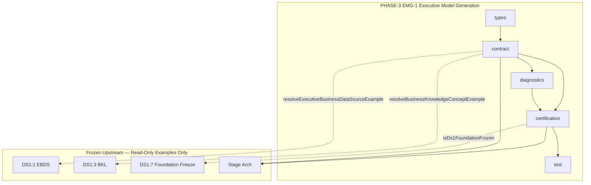

# EMG-1 — Executive Model Generation Engine
## Stage-2 Build Report

**Project:** Nexora Type-C  
**Phase:** PHASE-3 / EMG-1  
**Stage:** Stage-2 — Build  
**Status:** BUILD COMPLETE — CERTIFIED  
**Date:** 2026-06-22

**Tags:** `[EMG1_EXECUTIVE_MODEL]` `[MODEL_GENERATION_DEFINED]` `[WORKSPACE_MODEL_OWNED]` `[EMG2_READY]`

---

## 1. Objective

Implement the **Executive Model Generation Engine (EMGE)** contract layer — canonical executive model types, generation pipeline definitions, model family vocabulary, ownership and lifecycle contracts, validation shape, diagnostics, certification, and extension points.

**Definition-only.** No runtime execution, persistence, intelligence, calculations, dashboard, or assistant logic.

---

## 2. Files Created

| File | Lines | Responsibility |
|------|------:|----------------|
| `executiveModelGenerationTypes.ts` | 251 | Canonical model, family, pipeline, lifecycle, validation, score, and diagnostic event types |
| `executiveModelGenerationContract.ts` | 465 | Manifest, families, pipeline, ownership, metadata, validation, DS-1 integration probes, example resolver |
| `executiveModelGenerationDiagnostics.ts` | 81 | Eight generation lifecycle diagnostic events |
| `executiveModelGenerationCertification.ts` | 224 | 22-gate certification runner, dependency graph, forbidden import probes |
| `executiveModelGenerationCertification.test.ts` | 134 | 11 architecture and contract tests |
| `docs/emg-1-build-report.md` | — | This report |

**Total module code:** 1,155 lines across 5 TypeScript files.

**Frozen modules modified:** **0**

---

## 3. Canonical Executive Model

Every `ExecutiveModelRecord` must include ten mandatory fields:

| Field | Type | Purpose |
|-------|------|---------|
| `executiveModelId` | string | Unique model identity |
| `workspaceId` | string | Workspace ownership scope |
| `sourceFoundationId` | string | Upstream foundation reference (`PHASE-2/DS-1`) |
| `lifecycleState` | enum (8 states) | Model lifecycle position |
| `modelFamilies` | `ExecutiveModelFamilies` | Seven family arrays |
| `generationPipeline` | `ExecutiveModelGenerationPipeline` | Six declared stages + bindings |
| `metadata` | `ExecutiveModelMetadata` | Display, tags, approval, extension |
| `createdAt` | ISO string | Creation timestamp |
| `updatedAt` | ISO string | Last update timestamp |
| `generatedBy` | string | Generation actor identifier |

Additional contract fields: `contractVersion`, `source` (`phase-3-executive-model-generation`).

Example model: `emg-model-example-001` scoped to `workspace-example-001`, lifecycle `generated`, bound to frozen EBDS and BKL examples.

---

## 4. Model Families (Contract-Only)

| Family ID | Definition Type | Example Entry |
|-----------|-----------------|---------------|
| `objects` | `ExecutiveObjectDefinition` | Primary Supplier (entity) |
| `relationships` | `ExecutiveRelationshipDefinition` | flows_to supplier → outcome |
| `kpis` | `ExecutiveKpiDefinition` | On-Time Delivery Rate |
| `risks` | `ExecutiveRiskDefinition` | Supplier Concentration |
| `resources` | `ExecutiveResourceDefinition` | Warehouse Capacity |
| `constraints` | `ExecutiveConstraintDefinition` | VP Approval Threshold |
| `assumptions` | `ExecutiveAssumptionDefinition` | Stable Lead Time |

**BKL concept-to-family hints** (`BKL_CONCEPT_TO_MODEL_FAMILY_HINTS`): 9 mappings from frozen DS1:3 concept kinds to target families (e.g. `kpi_definition` → `kpis`, `business_entity` → `objects`).

No generation logic. No persistence. Definitions reference BKL artifact ids and EBDS source ids as opaque strings only.

---

## 5. Generation Pipeline (Contract-Only)

Six declared stages — no runtime execution:

```
intake → bind → normalize → compose → validate → emit
```

| Stage | Contract Status |
|-------|-----------------|
| All stages | `stageStatus: "declared"`, `pipelineStatus: "declared"` |

Pipeline includes `inputBindings`:

- `businessDataSourceIds` — EBDS correlation
- `knowledgeArtifactIds` — BKL artifact refs
- `statusSnapshotId` — optional DS1:6 observation ref (nullable)

`currentStage` tracks declared position; example resolves to `emit`.

---

## 6. Contract Layers Implemented

| # | Contract | Implementation |
|---|----------|----------------|
| 1 | Executive Model Types | `executiveModelGenerationTypes.ts` |
| 2 | Canonical Executive Model Contract | `ExecutiveModelRecord`, `validateExecutiveModelRecord()` |
| 3 | Executive Model Family Contract | `ExecutiveModelFamilies`, `EXECUTIVE_MODEL_FAMILY_IDS` |
| 4 | Generation Pipeline Contract | `ExecutiveModelGenerationPipeline`, `validatePipeline()` |
| 5 | Generation Stage Contract | `ExecutiveModelGenerationStageRecord`, six stages |
| 6 | Workspace Ownership Contract | `buildExecutiveModelOwnershipContract()`, `workspace-exclusive` policy |
| 7 | Model Metadata Contract | `ExecutiveModelMetadata`, `validateMetadata()` |
| 8 | Model Lifecycle Contract | `EXECUTIVE_MODEL_LIFECYCLE_STATES` (8 states) |
| 9 | Validation Contract Shape | `ExecutiveModelValidationResult`, issue codes |
| 10 | Extension Point Contract | `ExecutiveModelExtensionPoint` on metadata |
| 11 | Diagnostics | 8 lifecycle events |
| 12 | Certification Runner | `runExecutiveModelGenerationCertification()` |
| 13 | Certification Tests | 11 tests |

---

## 7. Dependency Graph



**Import DAG (acyclic):**

| Module | Dependencies |
|--------|--------------|
| `types` | — |
| `contract` | types, stage contract, EBDS contract (read-only), BKL contract (read-only) |
| `diagnostics` | contract |
| `certification` | contract, diagnostics, types, stage guards, DS1:7 freeze probe |
| `test` | all above |

**Circular dependencies:** NONE

---

## 8. DS-1 Integration Probes

| Probe | Function | Validation |
|-------|----------|------------|
| BKL binding | `validateEmgBklBindingIntegration()` | BKL artifact id in pipeline bindings and object family refs |
| EBDS correlation | `validateEmgEbdsCorrelationIntegration()` | EBDS id in bindings, shared workspace, `PHASE-2/DS-1` foundation id |
| Workspace isolation | `validateEmgWorkspaceIsolation()` | Model, EBDS, BKL examples scoped to `workspace-example-001` |

All probes use frozen example resolvers — no contract mutation.

---

## 9. Regression Strategy

| Tier | Gate | Evidence |
|------|------|----------|
| File boundary | B1, B2 | Manifest + 5-module allowlist |
| Forbidden probes | B3 | 11 runtime/UI paths blocked |
| DS-1 prerequisite | C1 | `isDs1FoundationFrozen()` |
| Acyclic deps | C2 | Module graph visit |
| Model validation | D1–D4 | Example record + mandatory fields + families + pipeline |
| DS-1 integration | E1–E3 | BKL, EBDS, workspace probes |
| MUST NOT OWN | F1–F3 | 18 exclusions, definition-only boundary, foundation id lock |
| Diagnostics & score | G1–G4 | Events active, threshold 98, lifecycle states, BKL hints |

---

## 10. Certification Results

| Metric | Value |
|--------|------:|
| TypeScript build | **PASS** |
| Tests | **11/11 PASS** |
| Certification gates | **22/22 PASS** |
| Forbidden import probes | **11/11 BLOCKED** |
| Circular dependencies | **NONE** |
| Frozen modules modified | **0** |

### Gate summary

| Group | Gates | Result |
|-------|------:|--------|
| A — Version & vocabulary | 3 | PASS |
| B — Manifest & boundaries | 3 | PASS |
| C — Prerequisites & deps | 2 | PASS |
| D — Model validation | 4 | PASS |
| E — DS-1 integration | 3 | PASS |
| F — Regression boundary | 3 | PASS |
| G — Diagnostics & score | 4 | PASS |

**Prerequisite:** Gate C1 requires DS-1 Foundation freeze active (`runDs1FoundationAnalysis()` or prior foundation certification). Tests invoke foundation analysis in `beforeEach`.

---

## 11. Architecture Scores

| Dimension | Score |
|-----------|------:|
| Architecture | 100 |
| Maintainability | 98 |
| Regression Safety | 99 |
| Scalability | 96 |
| Certification Readiness | 100 |
| **Overall** | **99/100** |

**Minimum required:** 98 — **MET**

---

## 12. Diagnostics Events (8)

`ExecutiveModelDraftCreated` · `GenerationStageDeclared` · `ModelFamilyDeclared` · `ModelValidated` · `ModelEmitted` · `CertificationStarted` · `CertificationPassed` · `CertificationFailed`

---

## 13. MUST NOT OWN (18 Exclusions)

`executive_intelligence` · `recommendations` · `kpi_calculations` · `risk_calculations` · `scenario_simulations` · `dashboard_rendering` · `assistant_logic` · `object_persistence` · `relationship_discovery_runtime` · `parsing` · `upload_execution` · `synchronization` · `registry_mutation` · `scene_sync` · `intelligence_reasoning` · `business_rule_execution` · `model_runtime_storage` · `ds1_contract_mutation`

---

## 14. What Was NOT Implemented (by design)

Object creation runtime · relationship discovery · KPI calculation · risk calculation · scenario generation · AI reasoning · recommendation logic · persistence · dashboard rendering · assistant logic · scene mutation · workspace mutation · data parsing · upload · synchronization · intelligence execution · business rule execution

These belong to later phases (EMG-2+ and downstream engines).

---

## 15. Entry Point

```typescript
import { runDs1FoundationAnalysis } from "../datasourceCertification/ds1FoundationCertification.ts";
import { runExecutiveModelGenerationCertification } from "./executiveModelGenerationCertification.ts";
import { resolveExecutiveModelExample } from "./executiveModelGenerationContract.ts";

runDs1FoundationAnalysis(); // prerequisite for C1 gate
const result = runExecutiveModelGenerationCertification();
// result.certified === true
// result.scoreReport.overall >= 98
// resolveExecutiveModelExample() — canonical model shape
```

---

## 16. Verdict

**EMG-1 Stage-2 Build: COMPLETE AND CERTIFIED**

Overall score **99/100**. Ready for **EMG-1 Stage-3 Analyze / Freeze**.

No frozen modules were modified. EMGE remains definition-only with no runtime behavior, persistence, or intelligence logic.
