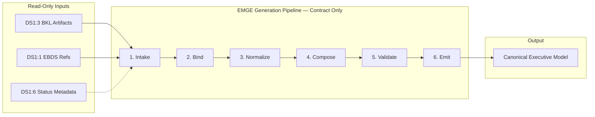
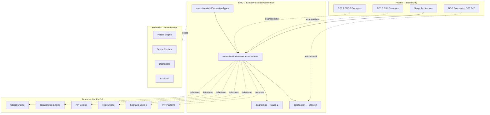

# EMG-1 — Executive Model Generation Engine
## Stage-1 Understanding Report

**Project:** Nexora Type-C  
**Phase:** PHASE-3 / EMG-1  
**Title:** Executive Model Generation Engine  
**Stage:** Stage-1 — Understand  
**Status:** UNDERSTANDING COMPLETE — **READY FOR STAGE-2 BUILD**

**Tags (proposed):** `[EMG1_EXECUTIVE_MODEL]` `[MODEL_GENERATION_DEFINED]` `[WORKSPACE_MODEL_OWNED]` `[EMG2_READY]`

---

## 0. Executive Summary

The **Executive Model Generation Engine (EMGE)** is a **library-only generation contract** that transforms **approved business definitions** from the frozen PHASE-2 DS-1 Foundation into the **Canonical Executive Model** — the semantic structure Nexora uses to describe executive objects, relationships, KPIs, risks, resources, constraints, and assumptions **before** any runtime engine executes calculations, simulations, persistence, or intelligence.

EMGE is the **first generation layer after DS-1**. It consumes read-only references from DS1:1 (Executive Business Data Source), DS1:3 (Business Knowledge Layer), and optionally DS1:6 (Data Source Status observation metadata). It emits **model definition records only** — no parsing, upload, KPI calculation, risk scoring, scenario simulation, dashboard rendering, assistant logic, object persistence, or intelligence execution.

EMGE sits **above** the frozen DS-1 Foundation and **below** future Object, Relationship, KPI, Risk, and Scenario engines that will **consume** canonical model definitions.

**STOP triggered:** **NO**  
**Frozen module modification required:** **NO**  
**Stage-2 Build:** **APPROVED** (additive `lib/executiveModel/` contract files only)

---

## 1. Executive Model Generation Purpose

### What EMGE is

| Attribute | Description |
|-----------|-------------|
| **Generation vocabulary** | Defines how approved business semantics become a canonical executive model |
| **Definition-only output** | Produces structured model records — not computed values or runtime state |
| **Workspace-scoped** | Every executive model belongs to exactly one workspace |
| **Foundation-aligned** | Reads DS-1 identifiers and BKL artifact references — never mutates frozen contracts |
| **Pipeline contract** | Declares generation stages and validation — no execution runtime in EMG-1 |
| **Engine-ready** | Canonical shapes that Object / Relationship / KPI / Risk / Scenario engines consume later |

### What EMGE is NOT

| Excluded capability | Belongs to |
|---------------------|------------|
| Executive intelligence / recommendations | INT-5 platform (forbidden) |
| KPI calculations | KPI Engine / workspace KPI runtime (forbidden) |
| Risk calculations / propagation | Risk Intelligence runtime (forbidden) |
| Scenario simulations | Scenario Intelligence runtime (forbidden) |
| Dashboard rendering | MRP / Dashboard (forbidden) |
| Assistant logic | Assistant runtime (forbidden) |
| Object persistence / scene sync | Object Registry / Scene runtime (forbidden) |
| Relationship discovery runtime | Relationship Engine runtime (forbidden) |
| Parsing / upload / sync | Parser / DS runtime (forbidden) |
| CSV → object pipeline | Legacy DS-1:1–1:7 data-to-object track (parallel — not replaced) |
| Business Knowledge semantics | DS1:3 BKL (frozen — read-only refs only) |

### Distinction from related surfaces

| Surface | Role | Relationship to EMGE |
|---------|------|------------------------|
| **PHASE-2 DS-1 Foundation (frozen)** | Business data source + knowledge + status contracts | **Upstream read-only inputs** |
| **DS1:3 BKL (frozen)** | Approved business definitions (domains, processes, KPI/risk *definitions*) | **Primary semantic input** |
| **DS1:1 EBDS (frozen)** | Business data source identity | **Correlation input** via opaque ids |
| **Legacy DS-1 object pipeline (certified)** | CSV → candidate → object → scene | **Parallel track** — EMGE does not replace it |
| **DS-3:1 Object Intelligence (certified)** | Profiles on *existing* workspace objects | **Downstream consumer** of created objects, not EMGE input |
| **Domain project assembly** | Demo/template domain graphs | **Legacy assembly** — EMGE canonical model supersedes for PHASE-3 |
| **Scenario / Risk intelligence (certified)** | Simulation and impact runtimes | **Downstream consumers** — read model definitions only |
| **ExecutiveModelingWorkspace (UI)** | Template picker for scene modeling | **Unrelated UI** — not canonical EMGE contract |

---

## 2. Architecture Position

### Architecture Diagram

```
┌─────────────────────────────────────────────────────────────────────────┐
│  Future Consumers (NOT EMG-1)                                           │
│  Object Engine · Relationship Engine · KPI Engine · Risk Engine ·       │
│  Scenario Engine · Intelligence Platform (read-only adapters)           │
└────────────────────────────┬────────────────────────────────────────────┘
                             │ consume canonical executive model definitions
                             ▼
┌─────────────────────────────────────────────────────────────────────────┐
│  EMG-1 Executive Model Generation Engine (NEW — definition generation)  │
│  Pipeline · Stages · Canonical Model · Validation · Metadata              │
└──────┬──────────────────────────────┬───────────────────────────────────┘
       │ read-only refs                │ read-only refs
       ▼                               ▼
┌──────────────────┐           ┌──────────────────┐
│ DS1:3 BKL        │           │ DS1:1 EBDS       │
│ (frozen)         │           │ DS1:6 DSS        │
│ Approved business│           │ (frozen)         │
│ definitions      │           │ Status/metadata  │
└──────────────────┘           └──────────────────┘
       ▲                               ▲
       └──────── DS-1 Foundation ──────┘
                             │
                             ▼
┌─────────────────────────────────────────────────────────────────────────┐
│  Forbidden: Parser · Upload · KPI calc · Risk calc · Scenario sim ·     │
│  Object persistence · Scene sync · Dashboard · Assistant · INT runtime  │
└─────────────────────────────────────────────────────────────────────────┘
```

EMGE is the **canonical model generation vocabulary**. DS-1 Foundation provides **approved business definitions and source identity**. Future engines **materialize and compute** from EMGE output — EMGE never executes.

---

## 3. Executive Model Ownership

### Authority chain

```
Workspace (authoritative owner)
    └── Executive Model Record (0..N per workspace)
              └── contains ──→ Canonical Executive Model (7 element families)
              └── correlates ──→ businessDataSourceIds (DS1:1, opaque)
              └── correlates ──→ knowledgeArtifactIds (DS1:3, opaque)
              └── correlates ──→ statusSnapshotId (DS1:6, optional, opaque)
              └── generationMetadata ──→ pipeline stage audit
```

### Rules

1. **Every executive model requires `workspaceId`** — no global or cross-workspace models.
2. **`executiveModelId` stable** within workspace.
3. **Workspace isolation** — models in Workspace A are invisible to Workspace B at contract level.
4. **Read-only toward DS-1** — EMGE stores opaque ids and declared bindings only; never mutates EBDS, BKL, or DSS contracts.
5. **Generation source declared** — each model declares `source: "phase-3-executive-model-generation"`.
6. **Definitions only** — canonical elements describe *what exists semantically*; engines assign runtime ids and computed values later.

---

## 4. Executive Model Lifecycle

| State | Meaning |
|-------|---------|
| `draft` | Model generation initiated; inputs declared |
| `generating` | Pipeline stages in progress (contract state only — no runtime in EMG-1) |
| `generated` | Canonical structure assembled and validated |
| `reviewed` | Human or process review recorded (metadata flag only) |
| `approved` | Approved for downstream engine consumption |
| `published` | Active canonical model for workspace |
| `superseded` | Replaced by newer model version |
| `archived` | Retired; retained for audit |

**EMG-1 defines lifecycle vocabulary and validation only.** State transitions are contract records — no workflow engine, persistence, or approval UI in EMG-1 files.

---

## 5. Executive Model Identity

### Core identity (proposed contract fields — Stage-2)

| Field | Type | Responsibility |
|-------|------|----------------|
| `executiveModelId` | string | Stable model identity within workspace |
| `workspaceId` | string | Owning workspace (required) |
| `modelVersion` | string | Semantic version of this model instance |
| `lifecycleState` | enum | Lifecycle state (see §4) |
| `canonicalModel` | object | Seven-family canonical structure (see §7) |
| `generationPipeline` | object | Stage audit + input bindings |
| `metadata` | object | Display hints, tags, extension point |
| `contractVersion` | string | `"PHASE-3/EMG-1"` |
| `source` | const | `"phase-3-executive-model-generation"` |
| `createdAt` / `updatedAt` | ISO string | Audit timestamps |

### Correlation fields (read-only DS-1 bindings)

| Field | Source | Purpose |
|-------|--------|---------|
| `businessDataSourceIds` | DS1:1 | Which business sources informed the model |
| `knowledgeArtifactIds` | DS1:3 | Which approved BKL definitions were consumed |
| `statusSnapshotId` | DS1:6 | Optional observation correlation |
| `generationRequestId` | EMGE | Idempotent generation tracking |

---

## 6. Executive Model Metadata

| Field | Type | Purpose |
|-------|------|---------|
| `displayName` | string | Executive-facing model label |
| `description` | string \| null | Business context summary |
| `executiveCategoryHint` | string \| null | Aligns with EBDS category hints |
| `domainHint` | string \| null | Business domain label from BKL |
| `tags` | string[] | Classification tags |
| `approvalRecord` | object \| null | Reviewer, timestamp — contract only |
| `extension` | object | `futureExtension` opaque payload |

No intelligence metadata, computed scores, or dashboard routing fields in EMG-1.

---

## 7. Canonical Executive Model Structure

Conceptual seven-family structure — **semantic definitions only**, no generation logic in EMG-1.

### 7.1 Executive Objects

Declarative business entities the executive model contains.

| Field | Purpose |
|-------|---------|
| `executiveObjectId` | Stable id within model |
| `displayName` | Executive label |
| `objectKind` | e.g. `entity`, `process_node`, `resource_pool`, `outcome` |
| `businessRole` | Semantic role (source, buffer, outcome, control, etc.) |
| `knowledgeArtifactRef` | Optional BKL artifact id |
| `businessDataSourceRef` | Optional EBDS id |
| `metadata` | Tags, extension |

### 7.2 Executive Relationships

Directed semantic links between executive objects.

| Field | Purpose |
|-------|---------|
| `executiveRelationshipId` | Stable id within model |
| `fromExecutiveObjectId` | Source object |
| `toExecutiveObjectId` | Target object |
| `relationshipKind` | e.g. `flows_to`, `depends_on`, `measures`, `governs` |
| `strengthHint` | Optional qualitative hint — not computed |
| `metadata` | Tags, extension |

### 7.3 Executive KPIs

KPI **definitions** — not calculated values.

| Field | Purpose |
|-------|---------|
| `executiveKpiId` | Stable id within model |
| `displayName` | KPI label |
| `definitionText` | What the KPI measures |
| `directionality` | `higher_is_better` \| `lower_is_better` \| `target_band` |
| `linkedObjectIds` | Objects this KPI relates to |
| `knowledgeArtifactRef` | Optional BKL `kpi_definition` artifact |
| `metadata` | Tags, extension |

### 7.4 Executive Risks

Risk **definitions** — not scored or propagated.

| Field | Purpose |
|-------|---------|
| `executiveRiskId` | Stable id within model |
| `displayName` | Risk label |
| `definitionText` | What the risk represents |
| `severityHint` | Optional qualitative hint — not calculated |
| `linkedObjectIds` | Objects exposed to this risk |
| `knowledgeArtifactRef` | Optional BKL `risk_definition` artifact |
| `metadata` | Tags, extension |

### 7.5 Executive Resources

Capacity, capability, or asset definitions.

| Field | Purpose |
|-------|---------|
| `executiveResourceId` | Stable id |
| `displayName` | Resource label |
| `resourceKind` | e.g. `capacity`, `capability`, `asset`, `stakeholder` |
| `linkedObjectIds` | Related objects |
| `knowledgeArtifactRef` | Optional BKL `resource` artifact |

### 7.6 Executive Constraints

Boundaries, limits, and rules the model respects.

| Field | Purpose |
|-------|---------|
| `executiveConstraintId` | Stable id |
| `displayName` | Constraint label |
| `constraintKind` | e.g. `policy`, `capacity_limit`, `regulatory`, `business_rule` |
| `constraintText` | Declarative rule statement |
| `linkedObjectIds` | Scoped objects |
| `knowledgeArtifactRef` | Optional BKL `business_rule` artifact |

### 7.7 Executive Assumptions

Explicit assumptions underlying the model.

| Field | Purpose |
|-------|---------|
| `executiveAssumptionId` | Stable id |
| `displayName` | Assumption label |
| `assumptionText` | Declarative assumption |
| `assumptionScope` | `model` \| `scenario` \| `domain` |
| `linkedElementIds` | Objects, KPIs, or risks affected |

---

## 8. Generation Pipeline

### Generation Pipeline Diagram



### Generation stages (contract vocabulary)

| Stage | ID | Responsibility | Runtime in EMG-1 |
|-------|-----|----------------|------------------|
| **Intake** | `intake` | Declare input bindings (BKL ids, EBDS ids, optional DSS ref) | Validation only |
| **Bind** | `bind` | Resolve opaque references; verify workspace alignment | Validation only |
| **Normalize** | `normalize` | Map BKL concept types to canonical element families | Shape rules only |
| **Compose** | `compose` | Assemble seven-family canonical structure | Example builder only |
| **Validate** | `validate` | Run contract validation on full model | Validation functions |
| **Emit** | `emit` | Produce `ExecutiveModelRecord` output | Example resolver only |

**No stage performs parsing, calculation, persistence, or intelligence.** Stage-2 may include `resolveExecutiveModelExample()` demonstrating a composed model from BKL example bindings — analogous to DS1:6 snapshot examples.

### BKL concept → canonical family mapping (contract hints)

| BKL Concept Type | Canonical Family |
|------------------|------------------|
| `business_entity` | Executive Object |
| `process`, `activity` | Executive Object (process_node) |
| `kpi_definition` | Executive KPI |
| `risk_definition` | Executive Risk |
| `resource`, `stakeholder` | Executive Resource |
| `business_rule` | Executive Constraint |
| `business_term` | Metadata / Assumption support |
| BKL relationships | Executive Relationship hints |

Mapping is **declarative documentation** in EMG-1 — not a runtime translation engine.

---

## 9. Executive Model Outputs

| Output | Type | Consumer |
|--------|------|----------|
| `ExecutiveModelRecord` | Full model + lifecycle + metadata | All downstream engines |
| `CanonicalExecutiveModel` | Seven-family structure | Object / Relationship / KPI / Risk / Scenario engines |
| `ExecutiveModelGenerationReport` | Validation result + stage audit | Certification / orchestration |
| `ExecutiveModelOwnershipContract` | Workspace isolation proof | Foundation integration gates |

Outputs are **immutable contract records** — engines copy or reference; EMGE does not push to registries.

---

## 10. Read-Only DS-1 Foundation Integration

| DS Layer | Integration | EMGE behavior |
|----------|-------------|---------------|
| **DS1:1 EBDS** | `businessDataSourceIds[]` on model | Opaque correlation; no EBDS contract import for mutation |
| **DS1:2 Adapter** | Optional `adapterLinkIds[]` in metadata | Read-only bridge reference |
| **DS1:3 BKL** | `knowledgeArtifactIds[]` primary input | Bind stage validates ids exist in examples |
| **DS1:4 IDSC** | Not direct input | Future orchestrator may trigger generation |
| **DS1:5 MWI** | Not direct input | Wizard may declare generation intent later |
| **DS1:6 DSS** | Optional `statusSnapshotId` | Observation correlation only |
| **DS1:7 Foundation Cert** | Prerequisite freeze check | C-gate: `isDs1FoundationFrozen()` |

**Rule:** EMGE imports **example resolvers and freeze checks only** from DS-1 — never frozen contract mutation.

---

## 11. Future Compatibility

| Future consumer | EMGE provides | Compatibility mechanism |
|-----------------|---------------|-------------------------|
| **Object Engine** | `ExecutiveObject[]` definitions | Stable `executiveObjectId`; engine assigns runtime object ids |
| **Relationship Engine** | `ExecutiveRelationship[]` definitions | Directed edges with semantic kinds |
| **KPI Engine** | `ExecutiveKpi[]` definitions | Directionality + links; engine computes values |
| **Risk Engine** | `ExecutiveRisk[]` definitions | Definitions + links; engine scores and propagates |
| **Scenario Engine** | Assumptions + constraints + object refs | Scenario overlays reference model ids |
| **Intelligence Platform** | Model metadata + canonical structure | Read-only adapters; no INT import in EMGE |

Engines **must not** modify EMGE frozen files. Additive canonical fields require EMG contract version bump.

---

## 12. Dependency Map



### Dependency Matrix

| From | To | Relationship |
|------|-----|--------------|
| EMGE types | — | Root |
| EMGE contract | types, stage guards, BKL/EBDS example resolvers (read-only) | Internal + read-only |
| EMGE certification | contract, DS1:7 freeze check | Internal + freeze probe |
| Object Engine (future) | EMGE canonical objects | Consumer |
| Legacy object pipeline | Independent | Parallel — not replaced |
| Domain project assembly | Legacy | EMGE canonical model is PHASE-3 authority |

---

## 13. MUST NOT OWN

```
executive_intelligence, recommendations, kpi_calculations, risk_calculations,
scenario_simulations, dashboard_rendering, assistant_logic, object_persistence,
relationship_discovery_runtime, parsing, upload_execution, synchronization,
registry_mutation, scene_sync, intelligence_reasoning, business_rule_execution,
model_runtime_storage, ds1_contract_mutation
```

EMGE **generates model definitions only**.

---

## 14. Risk Analysis

| Risk | Likelihood | Impact | Mitigation |
|------|:----------:|:------:|------------|
| EMGE confused with legacy DS-1 CSV→object pipeline | High | High | Clear naming; separate `lib/executiveModel/` path; docs distinguish PHASE-2 vs legacy DS-1 |
| EMGE duplicates domain project assembly | Medium | Medium | Canonical model is workspace-scoped generation; domain templates remain legacy |
| Intelligence logic embedded in generation | Medium | Critical | MUST NOT OWN + forbidden INT imports |
| KPI/risk *calculation* creep | Medium | Critical | Definitions only; `*Hint` fields qualitative; engines own computation |
| Object persistence in EMGE | Medium | Critical | No objectRegistry/scene imports; forbidden probes |
| BKL semantic duplication | Medium | High | EMGE references BKL ids; does not redefine BKL vocabulary |
| Cross-workspace model leak | Low | Critical | Required `workspaceId`; ownership contract |
| DS-1 foundation mutation | Low | Critical | Read-only refs; freeze gate on DS1:7 |
| Dashboard coupling via metadata | Low | High | No dashboard paths in manifest |

**No critical unmitigated risks.**

---

## 15. Architecture Smells (pre-build)

| Smell | Severity | Stage-2 mitigation |
|-------|----------|-------------------|
| Seven-family model size | Low | Types file + nested readonly types |
| BKL mapping complexity | Low | Static mapping table in contract |
| Parallel legacy DS-1 naming | Medium | PHASE-3 / EMG prefix in all tags and source constants |
| Generation pipeline without runtime | Low | By design — contract stages only |

---

## 16. STOP Rule Evaluation

| Proposed need | Required? | Verdict |
|---------------|-----------|---------|
| Intelligence execution | No | Definitions only |
| KPI calculation | No | KPI *definitions* in canonical model |
| Risk calculation | No | Risk *definitions* only |
| Scenario simulation | No | Assumptions for future Scenario Engine |
| Dashboard coupling | No | Forbidden |
| Assistant coupling | No | Forbidden |
| Runtime persistence | No | Emit contract records; engines persist |

**STOP: NOT TRIGGERED**

**Alternative if runtime were required:** A separate **Executive Model Runtime (EMG-2+)** would persist and dispatch models; EMG-1 would remain the frozen generation contract.

---

## 17. Expected File List

### Stage-1 (this stage)

| File | Status |
|------|--------|
| `docs/emg-1-understanding-report.md` | **This report** |

### Stage-2 (build — not yet implemented)

| File | Responsibility |
|------|----------------|
| `executiveModelGenerationTypes.ts` | Canonical model, pipeline, lifecycle, certification types |
| `executiveModelGenerationContract.ts` | Manifest, validation, mapping hints, examples |
| `executiveModelGenerationDiagnostics.ts` | Generation lifecycle events |
| `executiveModelGenerationCertification.ts` | Certification + analysis runner |
| `executiveModelGenerationCertification.test.ts` | Architecture and boundary tests |
| `docs/emg-1-build-report.md` | Build evidence |

### Stage-3 (analyze — not yet implemented)

| File | Responsibility |
|------|----------------|
| `docs/emg-1-analysis-report.md` | Senior review |
| `docs/emg-1-freeze-report.md` | Freeze declaration |

**Frozen modules modified across all stages:** **0**

---

## 18. Certification Strategy

### Proposed gates (Stage-2 build + Stage-3 analysis)

| Group | Gates | Focus |
|-------|------:|-------|
| A — Version & vocabulary | 3 | Contract version, 7 canonical families, 6 pipeline stages |
| B — Manifest & boundaries | 3 | Allowlist, forbidden probes, module paths |
| C — Prerequisites | 2 | DS1:7 foundation frozen, acyclic deps |
| D — Model validation | 4 | Example validates; mandatory identity fields; ownership; lifecycle |
| E — Integration | 3 | BKL binding; EBDS correlation; workspace isolation |
| F — Regression | 3 | MUST NOT OWN; no intelligence imports; architecture-only |
| G — Diagnostics & score | 2 | Events active; minimum score 95 |
| H — Analysis (Stage-3) | 5 | Freeze tags; generation boundary; engine paths blocked |
| **Total** | **25** | Target overall ≥ 98 |

### Proposed freeze tags (Stage-3)

```typescript
export const EXECUTIVE_MODEL_GENERATION_FREEZE_TAGS = [
  "[EMG1_CERTIFIED]",
  "[EXECUTIVE_MODEL_GENERATION_FROZEN]",
  "[PHASE3_EMG1_COMPLETE]",
];
```

### Prerequisites

- `[DS1_FOUNDATION_FROZEN]` (DS1:7)
- `[STAGE_ARCHITECTURE_FROZEN]`
- `[INT5_COMPLETE]` (boundary probe only)

---

## 19. Stage Readiness Report

### Prerequisites

| Prerequisite | Status |
|--------------|--------|
| DS-1 Foundation frozen (DS1:1–DS1:7) | ✅ |
| Stage Architecture frozen | ✅ |
| INT-5 frozen | ✅ |
| Canonical element families defined | ✅ |
| Pipeline stages defined | ✅ |
| DS-1 read-only integration mapped | ✅ |
| Future engine compatibility declared | ✅ |
| STOP rule evaluated | ✅ |
| No frozen module mutation in Stage-1 | ✅ |
| No code written in Stage-1 | ✅ |

### Readiness scores

| Dimension | Score | Notes |
|-----------|------:|-------|
| Architecture Understanding | 97 | Clear generation layer; distinct from legacy DS-1 pipeline |
| Dependency Clarity | 98 | DS-1 read-only; engines downstream |
| Canonical Model Design | 96 | Seven families cover executive modeling scope |
| Pipeline Design | 96 | Six stages; contract-only |
| Future Compatibility | 97 | All five engine families + INT declared |
| Risk Mitigation | 96 | Legacy naming collision flagged |
| Certification Strategy | 97 | 25 gates proposed |
| Stage-2 Readiness | **97** | Approved for build |
| **Overall Understanding** | **97/100** | Exceeds 95 minimum |

### Verdict

**EMG-1 Stage-1 Understanding: COMPLETE**

The Executive Model Generation Engine architecture is **library-only**, **workspace-aware**, **intelligence-independent**, **runtime-independent**, **dashboard-independent**, and **assistant-independent**.

**Stage-2 Build approved** — implement `lib/executiveModel/` per Expected File List.

No frozen modules were modified. No code was written.

---

## 20. Approval Gate

| Decision | Recommendation |
|----------|----------------|
| Proceed to Stage-2 Build? | **YES** |
| Seven-family canonical model? | **YES** |
| Six-stage generation pipeline? | **YES** |
| DS-1 read-only integration? | **YES** |
| Any frozen layer modification? | **NO** |

**Awaiting approval to begin EMG-1 Stage-2 Build.**
