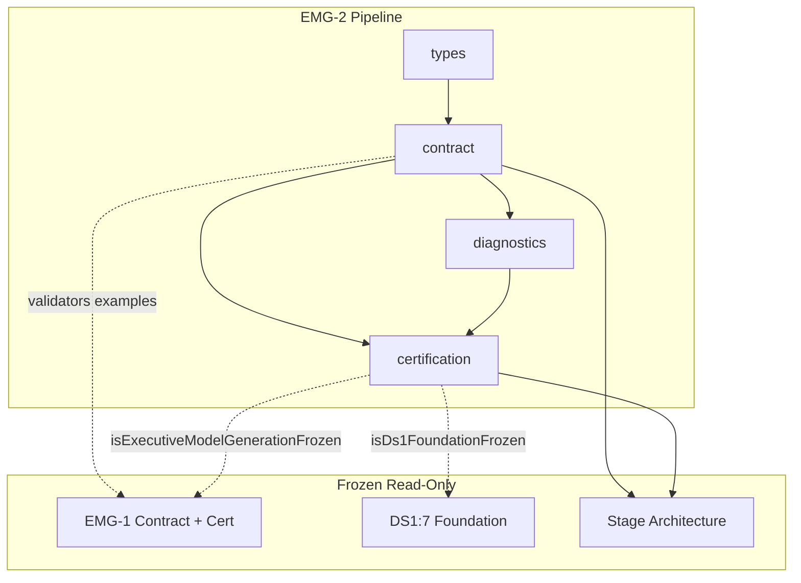

# EMG-2 — Executive Model Generation Pipeline
## Stage-2 Build Report

**Project:** Nexora Type-C  
**Phase:** PHASE-3 / EMG-2  
**Stage:** Stage-2 — Build  
**Status:** BUILD COMPLETE — CERTIFIED  
**Date:** 2026-06-22

**Tags:** `[EMG2_PIPELINE_ORCHESTRATION]` `[MODEL_GENERATION_PIPELINE_DEFINED]` `[WORKSPACE_PIPELINE_OWNED]` `[EMG3_READY]`

---

## 1. Objective

Implement the **Executive Model Generation Pipeline (EMGP)** orchestration contract — execution session types, pipeline stage definitions, checkpoint contracts, validation summary, failure model, retry policy shape, diagnostics, certification, and extension points.

**Orchestration-only.** No runtime execution, persistence, intelligence, calculations, dashboard, or assistant logic.

---

## 2. Files Created

| File | Lines | Responsibility |
|------|------:|----------------|
| `executiveModelPipelineTypes.ts` | 195 | Session, stage, checkpoint, failure, retry, validation, score, diagnostic types |
| `executiveModelPipelineContract.ts` | 474 | Manifest, stages, transitions, alignment map, validators, example session |
| `executiveModelPipelineDiagnostics.ts` | 81 | 10 pipeline lifecycle diagnostic events |
| `executiveModelPipelineCertification.ts` | 223 | 23-gate certification runner |
| `executiveModelPipelineCertification.test.ts` | 152 | 13 architecture and contract tests |
| `docs/emg-2-build-report.md` | — | This report |

**Total module code:** 1,125 lines across 5 TypeScript files.

**Frozen modules modified:** **0** (EMG-1 and DS-1 untouched)

---

## 3. Pipeline Session Model

Every `PipelineExecutionSession` includes eleven mandatory fields:

| Field | Type | Purpose |
|-------|------|---------|
| `executionSessionId` | string | Stable run identity |
| `workspaceId` | string | Workspace ownership |
| `executiveModelId` | string | Target model |
| `pipelineState` | enum | `active` \| `completed` \| `failed` \| `cancelled` |
| `currentStage` | enum | One of eight execution stages |
| `checkpoints` | array | Ordered checkpoint records |
| `validationSummary` | object | EMG-1 delegated validation result |
| `diagnostics` | array | Session-level diagnostic entries |
| `metadata` | object | Run metadata + extension point |
| `createdAt` | ISO string | Session start |
| `completedAt` | ISO string \| null | Session end |

Supplementary fields: `contractVersion`, `sourceFoundationId`, `stages`, `failureRecord`, `retryPolicy`, `emittedModelRef`, `source`.

Example session: `emgp-session-example-001` → `completed` with five checkpoints.

---

## 4. Pipeline Stage Model

| Stage | Terminal | Checkpoint |
|-------|----------|------------|
| `initialize` | No | — |
| `load_foundation` | No | `foundation_loaded` |
| `bind_business_knowledge` | No | `knowledge_bound` |
| `compose_model` | No | `model_composed` |
| `validate_model` | No | `validation_passed` |
| `emit_model` | No | `model_emitted` |
| `completed` | Yes | — |
| `failed` | Yes | — |

Success-path transitions validated by `validatePipelineStageTransition()` and gate F3.

---

## 5. Checkpoint Model

| Checkpoint Kind | Emitted After Stage |
|-----------------|---------------------|
| `foundation_loaded` | `load_foundation` |
| `knowledge_bound` | `bind_business_knowledge` |
| `model_composed` | `compose_model` |
| `validation_passed` | `validate_model` |
| `model_emitted` | `emit_model` |

Checkpoints must be monotonically ordered (`validateCheckpoints()`).

---

## 6. Failure Model

| Failure Kind | Retry eligible (policy) |
|--------------|-------------------------|
| `recoverable` | Yes |
| `non_recoverable` | No |
| `validation_failure` | No |
| `dependency_failure` | Yes |
| `cancelled` | No |

**Retry policy shape only** — `DEFAULT_PIPELINE_RETRY_POLICY.maxAttempts = 1` (no retry engine).

---

## 7. EMG-1 Alignment Matrix

| EMG-2 Stage | EMG-1 Stage | Gate |
|-------------|-------------|------|
| `initialize` | `intake` | E1, G4 |
| `load_foundation` | `bind` (foundation) | E1 |
| `bind_business_knowledge` | `bind` (knowledge) | E1 |
| `compose_model` | `normalize` + `compose` | G3 |
| `validate_model` | `validate` | E2 |
| `emit_model` | `emit` | E1 |
| `completed` / `failed` | — | EMG-2 terminal only |

Alignment documented in `EMG1_PIPELINE_ALIGNMENT_MAP` and `EMG1_COMPOSE_ALIGNMENT_STAGES`. EMG-1 files not modified.

---

## 8. Dependency Graph



**Import DAG:** types → contract → diagnostics → certification → test (acyclic).

---

## 9. Architecture Summary

EMGP is an **orchestration contract layer** that:

1. Defines execution session vocabulary with workspace ownership
2. Declares eight pipeline stages and five checkpoints
3. Documents stage transition rules (forward-only success path)
4. Delegates model validation to frozen EMG-1 (`validationSummary.delegatedTo`)
5. Integrates read-only with DS-1 foundation probes (via EMG-1 integration validators)
6. Excludes persistence, retry engine, KPI/risk calc, and intelligence via MUST NOT OWN

No stage executes business logic. Example session demonstrates a completed run shape only.

---

## 10. Regression Analysis

| Tier | Gate | Evidence |
|------|------|----------|
| File boundary | B1, B2 | Manifest + 5-module allowlist |
| Forbidden probes | B3 | 11 runtime/UI paths blocked |
| DS-1 prerequisite | C1 | `isDs1FoundationFrozen()` |
| EMG-1 prerequisite | C2 | `isExecutiveModelGenerationFrozen()` |
| Acyclic deps | C3 | Module graph visit |
| Orchestration boundary | F1, F2 | 21 exclusions; no retry engine |
| EMG-1 non-mutation | — | Read-only imports only |

---

## 11. Certification Results

| Metric | Value |
|--------|------:|
| TypeScript build | **PASS** |
| Tests | **13/13 PASS** |
| Certification gates | **23/23 PASS** |
| Forbidden import probes | **11/11 BLOCKED** |
| Circular dependencies | **NONE** |
| Frozen modules modified | **0** |

### Gate summary

| Group | Gates | Result |
|-------|------:|--------|
| A — Version & vocabulary | 3 | PASS |
| B — Manifest & boundaries | 3 | PASS |
| C — Prerequisites & deps | 3 | PASS |
| D — Session validation | 4 | PASS |
| E — EMG-1 / DS-1 integration | 3 | PASS |
| F — Regression boundary | 3 | PASS |
| G — Diagnostics & alignment | 4 | PASS |

**Prerequisites:** Tests invoke `runDs1FoundationAnalysis()` and `runExecutiveModelGenerationAnalysis()` in `beforeEach`.

---

## 12. Architecture Scores

| Dimension | Score |
|-----------|------:|
| Architecture | 100 |
| Maintainability | 98 |
| Regression Safety | 99 |
| Scalability | 96 |
| Certification Readiness | 100 |
| **Overall** | **99/100** |

**Minimum required:** 98 — **MET**

---

## 13. Diagnostics Events (10)

`PipelineSessionCreated` · `PipelineStageDeclared` · `PipelineStageTransitioned` · `CheckpointRecorded` · `ValidationSummaryDeclared` · `PipelineFailed` · `PipelineCompleted` · `CertificationStarted` · `CertificationPassed` · `CertificationFailed`

---

## 14. What Was NOT Implemented (by design)

Runtime execution · persistence · retry engine · object creation · relationship discovery · KPI calculation · risk calculation · scenario simulation · AI reasoning · dashboard · assistant · scene/workspace mutation · parsing · upload · synchronization

---

## 15. Entry Point

```typescript
import { runDs1FoundationAnalysis } from "../datasourceCertification/ds1FoundationCertification.ts";
import { runExecutiveModelGenerationAnalysis } from "../executiveModel/executiveModelGenerationCertification.ts";
import { runExecutiveModelPipelineCertification } from "./executiveModelPipelineCertification.ts";
import { resolvePipelineExecutionSessionExample } from "./executiveModelPipelineContract.ts";

runDs1FoundationAnalysis();
runExecutiveModelGenerationAnalysis();
const result = runExecutiveModelPipelineCertification();
// result.certified === true
// result.scoreReport.overall >= 98
```

---

## 16. Verdict

**EMG-2 Stage-2 Build: COMPLETE AND CERTIFIED**

Overall score **99/100**. Ready for **EMG-2 Stage-3 Analyze / Freeze**.

No frozen modules were modified. EMGP remains orchestration-only with no runtime behavior, persistence, or intelligence logic.
