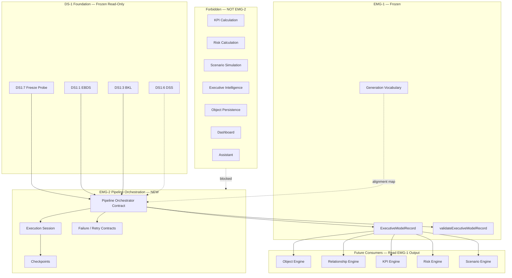
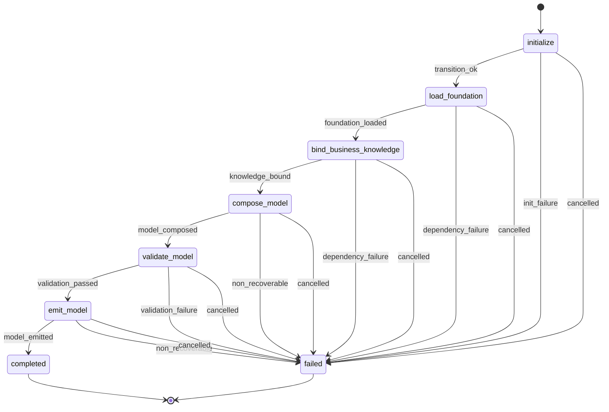
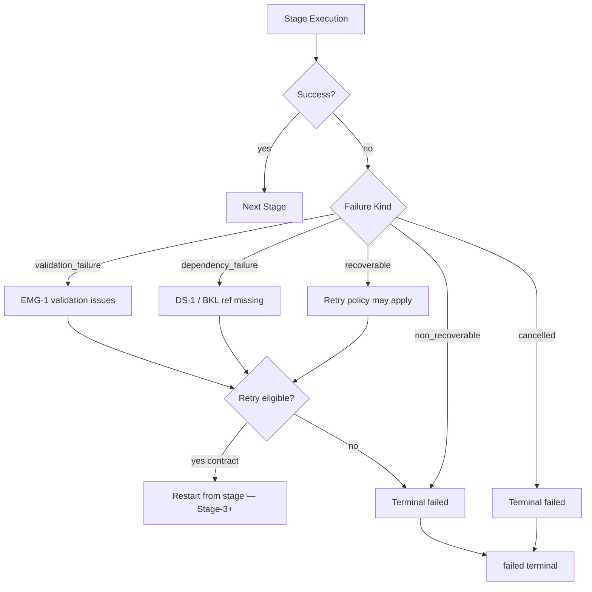
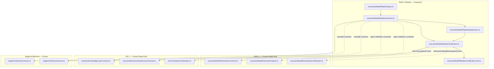

# EMG-2 — Executive Model Generation Pipeline
## Stage-1 Understanding Report

**Project:** Nexora Type-C  
**Phase:** PHASE-3 / EMG-2  
**Title:** Executive Model Generation Pipeline  
**Stage:** Stage-1 — Understand  
**Status:** UNDERSTANDING COMPLETE — **READY FOR STAGE-2 BUILD**

**Tags (proposed):** `[EMG2_PIPELINE_ORCHESTRATION]` `[MODEL_GENERATION_PIPELINE_DEFINED]` `[WORKSPACE_PIPELINE_OWNED]` `[EMG3_READY]`

---

## 0. Executive Summary

The **Executive Model Generation Pipeline (EMGP)** is a **library-only orchestration contract** that coordinates the transformation of **approved DS-1 Foundation definitions** into a **Canonical Executive Model** (`ExecutiveModelRecord`) using the **frozen EMG-1** vocabulary.

EMGP sits **above** frozen DS-1 Foundation and **below** future Object, Relationship, KPI, Risk, and Scenario engines. It **orchestrates stage execution and session state** — it does not perform business intelligence, KPI calculation, risk calculation, scenario simulation, persistence, dashboard rendering, or assistant logic.

| Layer | Role | Execution |
|-------|------|-----------|
| **DS-1 Foundation (frozen)** | Approved business definitions + source identity | Observation / contract only |
| **EMG-1 (frozen)** | Canonical model vocabulary + declared generation pipeline | Definition only — no orchestration |
| **EMG-2 (new)** | Pipeline orchestration, session, checkpoints, failure contracts | Orchestration contract — Stage-2 adds in-memory coordinator |
| **Future engines** | Materialize objects, compute KPIs/risks, simulate scenarios | Downstream consumers |

**STOP triggered:** **NO**  
**Frozen module modification required:** **NO**  
**Stage-2 Build:** **APPROVED** (additive `lib/executiveModelPipeline/` contract files only)

---

## 1. Executive Pipeline Purpose

### What EMGP is

| Attribute | Description |
|-----------|-------------|
| **Orchestration vocabulary** | Defines how a generation run progresses through stages |
| **Session-scoped** | Every run is an `ExecutionSession` bound to one workspace and one target model |
| **Foundation-coordinated** | Loads DS-1 inputs read-only; never mutates frozen contracts |
| **EMG-1-aligned** | Emits `ExecutiveModelRecord` validated by frozen EMG-1 validators |
| **Checkpoint-audited** | Records five named checkpoints for traceability |
| **Failure-aware** | Classifies failures and defines retry *policy shape* — no retry engine in EMG-2 |
| **Engine-ready output** | Produces the same canonical model downstream engines consume |

### What EMGP is NOT

| Excluded capability | Belongs to |
|---------------------|------------|
| Canonical model type definitions | EMG-1 (frozen — import read-only) |
| KPI calculations | KPI Engine (forbidden) |
| Risk calculations / propagation | Risk Intelligence runtime (forbidden) |
| Scenario simulations | Scenario Intelligence runtime (forbidden) |
| Executive intelligence / recommendations | INT-5 platform (forbidden) |
| Object creation / persistence | Object Registry / Scene runtime (forbidden) |
| Relationship discovery | Relationship Engine runtime (forbidden) |
| Parsing / upload / sync | Parser / DS runtime (forbidden) |
| Dashboard rendering | MRP / Dashboard (forbidden) |
| Assistant logic | Assistant runtime (forbidden) |
| Durable persistence | Future persistence layer (forbidden in EMG-2) |

### Distinction from EMG-1

| Concern | EMG-1 (frozen) | EMG-2 (new) |
|---------|----------------|-------------|
| Canonical model shape | **Owns** `ExecutiveModelRecord`, seven families | **Consumes** — validates output against EMG-1 |
| Generation pipeline vocabulary | **Owns** intake→emit *declared* stages | **Owns** initialize→failed *execution* stages |
| Stage status | `stageStatus: "declared"` | `stageStatus: "pending" \| "running" \| "completed" \| "failed" \| "skipped"` |
| Execution session | Not defined | **Owns** session, checkpoints, diagnostics |
| Failure / retry | Not defined | **Owns** failure classification + retry policy *contract* |
| Orchestration | None | **Owns** stage transition rules |

EMG-2 **does not redefine** EMG-1 model families, lifecycle states, or validation issue codes. It **references** them.

---

## 2. Pipeline Architecture Diagram



---

## 3. Pipeline Flow Diagram



### EMG-2 execution stages

| Stage | ID | Responsibility | Checkpoint emitted |
|-------|-----|----------------|-------------------|
| **Initialize** | `initialize` | Create session; verify workspace + model id; verify prerequisites | — |
| **Load Foundation** | `load_foundation` | Resolve EBDS refs + optional DSS snapshot; verify DS-1 freeze | Foundation Loaded |
| **Bind Business Knowledge** | `bind_business_knowledge` | Resolve BKL artifact refs; verify workspace alignment | Knowledge Bound |
| **Compose Model** | `compose_model` | Assemble seven-family structure from bound inputs | Model Composed |
| **Validate Model** | `validate_model` | Delegate to EMG-1 `validateExecutiveModelRecord()` | Validation Passed |
| **Emit Model** | `emit_model` | Produce final `ExecutiveModelRecord`; set lifecycle `generated` | Model Emitted |
| **Completed** | `completed` | Terminal success; session closed | — |
| **Failed** | `failed` | Terminal failure; session closed with failure record | — |

### EMG-1 ↔ EMG-2 stage alignment map

| EMG-2 execution stage | EMG-1 declared stage | Notes |
|----------------------|----------------------|-------|
| `initialize` | `intake` | Session replaces static intake declaration |
| `load_foundation` | `bind` (foundation slice) | EBDS + DSS correlation |
| `bind_business_knowledge` | `bind` (knowledge slice) | BKL artifact binding |
| `compose_model` | `normalize` + `compose` | Normalization rules applied during compose |
| `validate_model` | `validate` | Direct EMG-1 validator delegation |
| `emit_model` | `emit` | Output record emission |
| `completed` / `failed` | — | EMG-2 terminal states only |

Alignment is **documented in contract** — EMG-2 does not mutate EMG-1 stage enums.

---

## 4. Pipeline Ownership

### Authority chain

```
Workspace (authoritative owner)
    └── Execution Session (0..N concurrent per workspace — contract limit TBD in Stage-2)
              └── targets ──→ executiveModelId
              └── scoped to ──→ workspaceId
              └── reads ──→ DS-1 opaque ids (read-only)
              └── emits ──→ ExecutiveModelRecord (EMG-1 shape)
              └── audit ──→ checkpoints + diagnostics
```

### Rules

1. **Every session requires `workspaceId` and `executiveModelId`** — no orphan sessions.
2. **`executionSessionId` stable** for the duration of one run.
3. **Workspace isolation** — sessions cannot cross workspace boundaries.
4. **Read-only toward DS-1 and EMG-1** — orchestrator stores refs and delegates validation; never mutates frozen contracts.
5. **Orchestration source declared** — `source: "phase-3-executive-model-pipeline"`.
6. **In-memory only in EMG-2** — session state lives in library memory; no persistence store.

---

## 5. Execution Session

Every pipeline execution must include these mandatory fields:

| Field | Type | Responsibility |
|-------|------|----------------|
| `executionSessionId` | string | Stable run identity |
| `workspaceId` | string | Owning workspace (required) |
| `executiveModelId` | string | Target model being generated |
| `pipelineState` | enum | `active` \| `completed` \| `failed` \| `cancelled` |
| `currentStage` | enum | One of eight execution stages |
| `checkpoints` | array | Ordered checkpoint records |
| `validationSummary` | object | Aggregated validation result from validate stage |
| `diagnostics` | array | Pipeline lifecycle diagnostic entries |
| `metadata` | object | Run metadata + extension point |
| `createdAt` | ISO string | Session start |
| `completedAt` | ISO string \| null | Session end (null while active) |

### Proposed supplementary session fields (Stage-2 contract)

| Field | Type | Purpose |
|-------|------|---------|
| `contractVersion` | string | `"PHASE-3/EMG-2"` |
| `sourceFoundationId` | string | `"PHASE-2/DS-1"` (aligned with EMG-1) |
| `source` | const | `"phase-3-executive-model-pipeline"` |
| `inputBindings` | object | EBDS ids, BKL ids, optional DSS ref — same shape as EMG-1 |
| `failureRecord` | object \| null | Populated on terminal failure |
| `retryPolicy` | object | Declared retry policy — contract only |
| `emg1PipelineAlignment` | object | Maps current EMG-2 stage to EMG-1 declared stage |

---

## 6. Pipeline Lifecycle

| Session `pipelineState` | Meaning |
|-------------------------|---------|
| `active` | Run in progress; `currentStage` not terminal |
| `completed` | Run succeeded; `currentStage === "completed"` |
| `failed` | Run failed; `currentStage === "failed"` |
| `cancelled` | Run cancelled before completion |

**Distinct from EMG-1 model lifecycle** (`draft` → `published`). EMGP manages **run lifecycle**; EMG-1 manages **model lifecycle** on the emitted record.

On successful `emit_model`, the orchestrator sets the output model's `lifecycleState` to `generated` per EMG-1 convention.

---

## 7. Stage Transition Rules

| From | To (success) | To (failure) | Guard |
|------|--------------|--------------|-------|
| `initialize` | `load_foundation` | `failed` | workspace + model id valid; DS-1 frozen |
| `load_foundation` | `bind_business_knowledge` | `failed` | Foundation Loaded checkpoint |
| `bind_business_knowledge` | `compose_model` | `failed` | Knowledge Bound checkpoint |
| `compose_model` | `validate_model` | `failed` | Model Composed checkpoint |
| `validate_model` | `emit_model` | `failed` | Validation Passed checkpoint |
| `emit_model` | `completed` | `failed` | Model Emitted checkpoint |
| any active stage | `failed` (cancelled) | — | `failureKind: "cancelled"` |

**Rules:**

- Transitions are **forward-only** except cancellation → `failed`.
- Each success transition **must** emit the corresponding checkpoint (where defined).
- `validate_model` **must** call EMG-1 validation — EMG-2 does not duplicate validation logic.
- Terminal stages (`completed`, `failed`) accept no further transitions.

---

## 8. Checkpoint Model


### Checkpoint contracts (definition only)

| Checkpoint ID | Emitted after stage | Evidence stored |
|---------------|---------------------|-----------------|
| `foundation_loaded` | `load_foundation` | EBDS ids resolved; optional DSS ref; DS-1 freeze confirmed |
| `knowledge_bound` | `bind_business_knowledge` | BKL artifact ids bound; workspace alignment verified |
| `model_composed` | `compose_model` | Seven-family structure assembled (in-session draft) |
| `validation_passed` | `validate_model` | EMG-1 validation result `valid: true` |
| `model_emitted` | `emit_model` | Final `ExecutiveModelRecord` hash/id reference |

### Checkpoint record shape (proposed)

| Field | Type | Purpose |
|-------|------|---------|
| `checkpointId` | string | Stable checkpoint identity within session |
| `checkpointKind` | enum | One of five kinds above |
| `reachedAt` | ISO string | Timestamp |
| `stageAtCheckpoint` | enum | EMG-2 stage when reached |
| `evidence` | string | Human-readable audit note |
| `source` | const | `"phase-3-executive-model-pipeline"` |

No runtime persistence of checkpoints in EMG-2 — records live on the session object.

---

## 9. Failure Model



### Failure kinds (contract enum)

| Kind | Meaning | Typical cause | Retry eligible (policy) |
|------|---------|---------------|-------------------------|
| `recoverable` | Transient orchestration fault | Timing, incomplete binding | Yes — from last checkpoint |
| `non_recoverable` | Structural fault | Compose invariant violated | No |
| `validation_failure` | EMG-1 validation failed | Model record invalid | No — fix inputs |
| `dependency_failure` | Upstream ref unavailable | Missing BKL/EBDS id | Yes — after dependency resolves |
| `cancelled` | User/system cancellation | Explicit cancel signal | No |

### Failure record shape (proposed)

| Field | Type | Purpose |
|-------|------|---------|
| `failureKind` | enum | One of five kinds |
| `failedAtStage` | enum | Stage where failure occurred |
| `message` | string | Diagnostic message |
| `validationIssues` | array \| null | EMG-1 issues when `validation_failure` |
| `failedAt` | ISO string | Timestamp |
| `source` | const | `"phase-3-executive-model-pipeline"` |

**No retry engine in EMG-2.** Retry policy defines *whether* and *from which checkpoint* a future orchestrator may restart — execution of retry belongs to EMG-3+ or external coordinator.

---

## 10. Retry Model (Contract Only)

| Policy field | Type | Purpose |
|--------------|------|---------|
| `maxAttempts` | number | Maximum retry count (default: 1 — no retry in EMG-2 build) |
| `retryFromCheckpoint` | enum \| null | Checkpoint to restart from |
| `retryEligibleFailureKinds` | array | Subset of failure kinds |
| `backoffHintMs` | number \| null | Advisory delay — not executed in EMG-2 |

**EMG-2 Stage-2:** policy constants documented and validated — no scheduler, no timer, no retry loop.

---

## 11. Validation Boundaries

| Boundary | Owner | EMGP behavior |
|----------|-------|---------------|
| Session field presence | EMG-2 | `validateExecutionSession()` |
| Stage transition legality | EMG-2 | `validateStageTransition()` |
| Checkpoint ordering | EMG-2 | Checkpoints monotonic by stage order |
| Canonical model shape | **EMG-1** | Delegate `validateExecutiveModelRecord()` |
| DS-1 foundation freeze | **DS1:7** | `isDs1FoundationFrozen()` prerequisite |
| Workspace isolation | EMG-2 + EMG-1 probes | Reuse EMG-1 integration validators read-only |
| Input binding shape | EMG-1 | Reuse `ExecutiveModelInputBindings` type import |

**Rule:** EMG-2 **must not duplicate** EMG-1 model validation rules. It adds orchestration-layer validation only.

---

## 12. Execution Metadata

| Field | Type | Purpose |
|-------|------|---------|
| `displayName` | string | Run label for diagnostics |
| `triggerSource` | string | e.g. `"manual"`, `"orchestrator"`, `"certification-probe"` |
| `emg1ContractVersion` | string | Frozen EMG-1 version referenced |
| `tags` | string[] | Classification |
| `extension` | object | `futureExtension` opaque payload |

No dashboard routing, assistant thread ids, or intelligence correlation fields.

---

## 13. Read-Only Integration

### DS-1 Foundation

| DS Layer | Integration | EMGP behavior |
|----------|-------------|---------------|
| **DS1:1 EBDS** | `businessDataSourceIds` in session bindings | Read via example resolver / id validation |
| **DS1:3 BKL** | `knowledgeArtifactIds` in session bindings | Read via example resolver / id validation |
| **DS1:6 DSS** | Optional `statusSnapshotId` | Observation correlation only |
| **DS1:7 Foundation** | Prerequisite | `isDs1FoundationFrozen()` before `initialize` completes |

### EMG-1 Canonical Executive Model

| EMG-1 export | EMGP usage |
|--------------|------------|
| `ExecutiveModelRecord` | Output type for `emit_model` |
| `validateExecutiveModelRecord()` | Called in `validate_model` stage |
| `resolveExecutiveModelExample()` | Stage-2 certification probe only |
| `EXECUTIVE_MODEL_SOURCE_FOUNDATION_ID` | Session foundation id lock |
| `BKL_CONCEPT_TO_MODEL_FAMILY_HINTS` | Compose stage mapping reference |
| `isExecutiveModelGenerationFrozen()` | Prerequisite gate |

**Import rule:** EMG-2 imports EMG-1 **types, validators, constants, freeze probes, and example resolvers** — never modifies EMG-1 files.

---

## 14. Future Compatibility

| Future consumer | EMGP provides | Compatibility |
|-----------------|---------------|---------------|
| **Object Engine** | Emitted `ExecutiveModelRecord.modelFamilies.objects` | Stable ids from EMG-1 |
| **Relationship Engine** | Emitted relationships family | Directed semantic edges |
| **KPI Engine** | KPI definitions only | Engine owns calculation |
| **Risk Engine** | Risk definitions only | Engine owns scoring |
| **Scenario Engine** | Assumptions + constraints | Overlays reference model ids |
| **Intelligence Platform** | Session metadata + emitted model | Read-only adapter — no INT import |
| **Dashboard** | Published model lifecycle (via EMG-1 record) | Reads emitted record — no dashboard import |
| **Assistant** | Session diagnostics | Correlates metadata — no assistant import |
| **EMG-3+ Retry Runtime** | Retry policy contract | Executes policy defined here |

---

## 15. Dependency Map



**Forbidden import targets:** objectRegistryRuntime, RiskIntelligenceRuntime, ScenarioGenerationRuntime, workspaceSceneSync, ParserEngine, dashboardIntelligence, assistantRuntime, all `.tsx`.

**Circular dependencies:** None — EMG-2 depends on EMG-1; EMG-1 does not depend on EMG-2.

---

## 16. Diagnostics (Proposed — Stage-2)

| Event | When |
|-------|------|
| `PipelineSessionStarted` | Session created |
| `PipelineStageEntered` | Stage transition forward |
| `PipelineCheckpointReached` | Checkpoint emitted |
| `PipelineValidationDelegated` | validate_model calls EMG-1 |
| `PipelineModelEmitted` | emit_model produces record |
| `PipelineSessionCompleted` | Terminal success |
| `PipelineSessionFailed` | Terminal failure |
| `PipelineCertificationStarted` | Certification probe |
| `PipelineCertificationPassed` | All gates pass |
| `PipelineCertificationFailed` | Gate failure |

---

## 17. Extension Points

| Extension | Location | Purpose |
|-----------|----------|---------|
| `metadata.extension.futureExtension` | Session metadata | Opaque orchestrator payload |
| `retryPolicy` | Session | Future retry runtime configuration |
| `emg1PipelineAlignment` | Session | Version-safe stage mapping overrides |

No extension may introduce KPI values, risk scores, or intelligence outputs.

---

## 18. Architecture Smells (Pre-Build Review)

| Smell | Severity | Mitigation |
|-------|----------|------------|
| Stage name divergence EMG-1 vs EMG-2 | Low | Document alignment map; do not merge enums |
| Compose stage could creep into KPI calc | Medium | MUST NOT OWN + validation boundary |
| Session state without persistence | Low | Explicit in-memory contract; EMG-3+ owns durability |
| Duplicate validation logic | Medium | Mandatory EMG-1 delegation in validate_model |
| Orchestrator file growth | Low | Split types / contract / diagnostics / certification |

**No critical smells.** **No STOP conditions triggered.**

---

## 19. Risk Analysis

| Risk | Likelihood | Impact | Mitigation |
|------|:----------:|:------:|------------|
| EMGP becomes KPI/risk calculator | Medium | Critical | MUST NOT OWN; compose produces definitions only |
| EMGP mutates EMG-1 or DS-1 | Low | Critical | Read-only imports; file boundary gates |
| Validation duplicated from EMG-1 | Medium | High | Single delegation point in validate_model |
| Pipeline persistence creep | Medium | High | MUST NOT OWN persistence; in-memory session |
| Stage transition bugs | Medium | Medium | Explicit transition table + certification gates |
| Cross-workspace session leak | Low | High | workspaceId guards on every transition |
| Retry engine implemented early | Low | Medium | Contract-only retry policy in EMG-2 |
| Intelligence coupling | Low | Critical | Forbidden import probes |

---

## 20. Expected File List (Stage-2)

| File | Stage | Responsibility |
|------|-------|----------------|
| `executiveModelPipelineTypes.ts` | Stage-2 | Session, stage, checkpoint, failure, retry, diagnostic types |
| `executiveModelPipelineContract.ts` | Stage-2 | Manifest, stages, transitions, validators, MUST NOT OWN, example session |
| `executiveModelPipelineDiagnostics.ts` | Stage-2 | Pipeline lifecycle events |
| `executiveModelPipelineCertification.ts` | Stage-2 | Certification + analysis runner |
| `executiveModelPipelineCertification.test.ts` | Stage-2 | Architecture tests |
| `docs/emg-2-build-report.md` | Stage-2 | Build report |
| `docs/emg-2-analysis-report.md` | Stage-3 | Analysis report |
| `docs/emg-2-freeze-report.md` | Stage-3 | Freeze report |

**Stage-1 deliverable:** this understanding report only — **no code**.

---

## 21. Certification Strategy (Stage-2 / Stage-3)

### Prerequisites

- PHASE-1 Stage Architecture frozen
- PHASE-2 DS-1 Foundation frozen (`isDs1FoundationFrozen()`)
- PHASE-3 EMG-1 frozen (`isExecutiveModelGenerationFrozen()`)

### Proposed gate groups

| Group | Gates | Validation |
|-------|------:|------------|
| A — Version & stages | 3 | Contract version; 8 stages; 5 checkpoints |
| B — Manifest & boundaries | 3 | Allowlist; forbidden probes |
| C — Prerequisites | 3 | DS-1 frozen; EMG-1 frozen; acyclic deps |
| D — Session validation | 4 | Mandatory fields; example session validates |
| E — EMG-1 integration | 3 | Validation delegation; output shape; foundation id |
| F — Regression | 3 | MUST NOT OWN; orchestration-only boundary |
| G — Diagnostics & score | 3 | Events active; minimum score 98 |
| H — Analysis (Stage-3) | 5 | Freeze tags; transition integrity; no retry engine |

**Target:** ≥ 27 gates, overall score ≥ 98.

### Regression probes (minimum)

- objectRegistryRuntime
- RiskIntelligenceRuntime
- ScenarioGenerationRuntime
- workspaceSceneSync
- ParserEngine
- dashboardIntelligence
- assistantRuntimeAdapter
- RelationshipRenderer.tsx

---

## 22. Verification Checklist

| Requirement | Design verdict |
|-------------|----------------|
| Workspace-aware | **PASS** — session scoped to workspaceId |
| Library-only | **PASS** — no UI, no stores |
| Orchestration-only | **PASS** — coordinates stages; delegates validation |
| Intelligence-independent | **PASS** — no INT imports |
| Persistence-independent | **PASS** — in-memory session |
| Dashboard-independent | **PASS** — no dashboard fields |
| Assistant-independent | **PASS** — no assistant fields |
| No KPI calculation | **PASS** — definitions only via EMG-1 |
| No risk calculation | **PASS** — definitions only via EMG-1 |
| No scenario simulation | **PASS** — excluded |
| No EMG-1 mutation | **PASS** — read-only consumption |
| No DS-1 mutation | **PASS** — read-only consumption |

---

## 23. MUST NOT OWN

`executive_intelligence` · `recommendations` · `kpi_calculations` · `risk_calculations` · `scenario_simulations` · `dashboard_rendering` · `assistant_logic` · `persistence` · `object_creation_runtime` · `relationship_discovery` · `parsing` · `upload_execution` · `synchronization` · `registry_mutation` · `scene_sync` · `intelligence_reasoning` · `business_rule_execution` · `model_runtime_storage` · `ds1_contract_mutation` · `emg1_contract_mutation`

---

## 24. Stage Readiness Report

| Criterion | Status |
|-----------|--------|
| Architecture defined | **COMPLETE** |
| EMG-1 alignment documented | **COMPLETE** |
| DS-1 integration path clear | **COMPLETE** |
| Stage transition rules defined | **COMPLETE** |
| Checkpoint model defined | **COMPLETE** |
| Failure / retry contracts defined | **COMPLETE** |
| STOP conditions evaluated | **NONE TRIGGERED** |
| Frozen module changes required | **NONE** |
| Stage-2 file list approved | **READY** |
| Certification strategy defined | **READY** |

### Stage-2 Build scope (approved)

1. Pipeline types (session, stages, checkpoints, failures)
2. Pipeline contract (transitions, validators, alignment map)
3. Diagnostics (10 events)
4. Certification runner (≥27 gates)
5. Certification tests
6. Build report

### Explicitly deferred (EMG-3+)

- Retry execution engine
- Durable session persistence
- Live DS-1 registry lookups (beyond example resolvers)
- Object / relationship materialization
- Dashboard / assistant integration adapters

---

## 25. Verdict

**EMG-2 Stage-1 Understanding: COMPLETE**

The Executive Model Generation Pipeline architecture is **orchestration-only**, **workspace-scoped**, and **fully compatible** with frozen DS-1 Foundation and EMG-1 contracts. No architectural conflicts discovered. No STOP conditions triggered.

**Ready for EMG-2 Stage-2 Build** upon approval.

No code written. No frozen modules modified.
