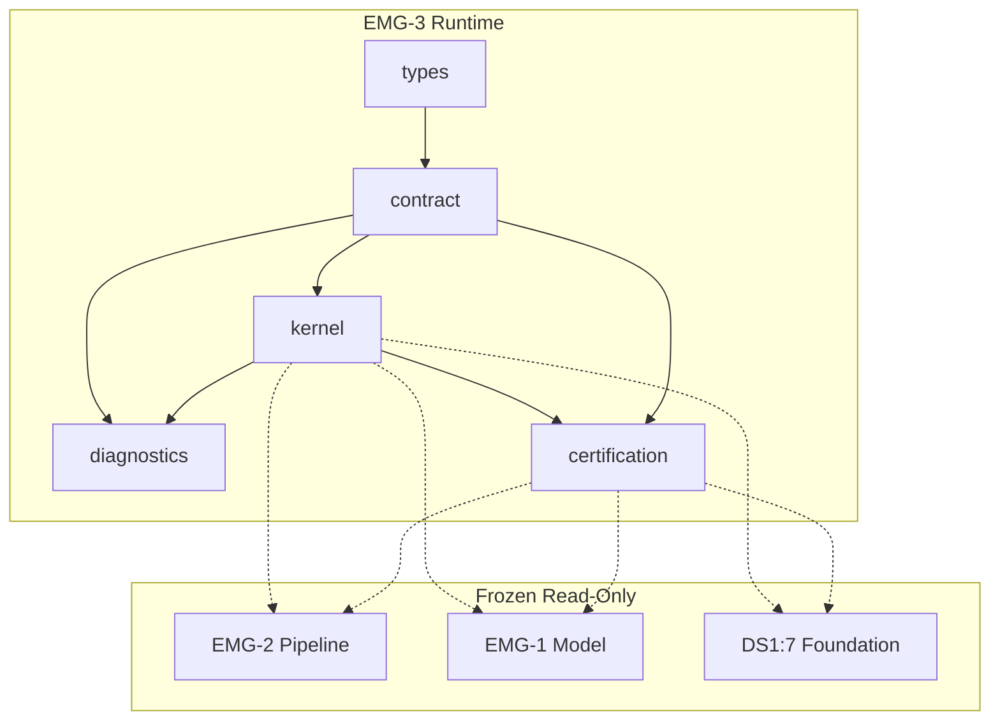

# EMG-3 — Executive Model Pipeline Runtime
## Stage-2 Build Report

**Project:** Nexora Type-C  
**Phase:** PHASE-3 / EMG-3  
**Stage:** Stage-2 — Build  
**Status:** BUILD COMPLETE — CERTIFIED  
**Date:** 2026-06-22

**Tags:** `[EMG3_PIPELINE_RUNTIME]` `[MODEL_GENERATION_RUNTIME_DEFINED]` `[WORKSPACE_RUNTIME_OWNED]` `[DOMAIN_ENGINE_READY]`

---

## 1. Objective

Implement the **Executive Model Pipeline Runtime (EMGR)** generic execution kernel — executes frozen EMG-2 pipeline stages synchronously and emits EMG-1 compatible structural `ExecutiveModelRecord` output.

**Kernel-only.** No domain engine logic, persistence, intelligence, calculations, dashboard, or assistant.

---

## 2. Files Created

| File | Lines | Responsibility |
|------|------:|----------------|
| `executiveModelRuntimeTypes.ts` | 198 | Runtime session, context, stage outcome, cancellation, diagnostic types |
| `executiveModelRuntimeContract.ts` | 404 | Manifest, states, validators, structural emission rules, integration probes |
| `executiveModelRuntimeDiagnostics.ts` | 81 | 10 runtime lifecycle diagnostic events |
| `executiveModelRuntimeKernel.ts` | 536 | Controller, stage executor, in-memory session execution |
| `executiveModelRuntimeCertification.ts` | 232 | 24-gate certification runner |
| `executiveModelRuntimeCertification.test.ts` | 161 | 13 architecture and kernel tests |
| `docs/emg-3-build-report.md` | — | This report |

**Total module code:** 1,612 lines across 6 TypeScript files.

**Frozen modules modified:** **0**

---

## 3. Runtime Session Model

Twelve mandatory fields on `RuntimeSession`:

| Field | Purpose |
|-------|---------|
| `runtimeSessionId` | Runtime run identity |
| `executionSessionId` | Link to EMG-2 pipeline session |
| `workspaceId` | Workspace ownership |
| `executiveModelId` | Target model |
| `runtimeState` | `idle` \| `running` \| `completed` \| `failed` \| `cancelled` |
| `currentStage` | Active pipeline stage |
| `executionContext` | In-memory bindings + draft buffer |
| `checkpoints` | Runtime checkpoint records |
| `diagnostics` | Session-level diagnostic entries |
| `metadata` | Run metadata + extension |
| `createdAt` | Session start |
| `completedAt` | Session end |

---

## 4. Runtime State Model

| State | Meaning |
|-------|---------|
| `idle` | Pre-start (contract example) |
| `running` | Stage dispatch in progress |
| `completed` | All stages succeeded; model emitted |
| `failed` | Stage error; failure record attached |
| `cancelled` | Cooperative cancel acknowledged |

---

## 5. Stage Executor Model

Six generic executable stages (no domain processing):

```
initialize → load_foundation → bind_business_knowledge → compose_model
  → validate_model → emit_model → completed
```

Each handler returns `RuntimeStageOutcome` with success/failure kind and optional checkpoint. Transitions enforced via frozen EMG-2 `validatePipelineStageTransition()`.

---

## 6. Execution Context Model

Approved context slices only:

- `workspaceId`, `executionSessionId`, `executiveModelId`
- `foundationReferences` (DS-1 opaque ids)
- `knowledgeBindings` (BKL artifact ids)
- `pipelineSessionRef`, `boundSemanticRefs`
- `draftModel`, `validationSummary`, `emittedModelRef`
- `cancellationState`, `lastError`

No persistence, dashboard state, or assistant state.

---

## 7. Checkpoint Runtime Model

| Checkpoint | Stage |
|------------|-------|
| `foundation_loaded` | `load_foundation` |
| `knowledge_bound` | `bind_business_knowledge` |
| `model_composed` | `compose_model` |
| `validation_passed` | `validate_model` |
| `model_emitted` | `emit_model` |

Runtime probe records all five checkpoints on successful run.

---

## 8. Cancellation Model

Cooperative cancellation via `requestRuntimeCancellation()`:

- Sets `cancellationState: "requested"` on active session
- Checked **between stages** only
- Maps to `failureKind: "cancelled"` and `runtimeState: "cancelled"`
- No background workers or queues

---

## 9. Structural Model Emission Rules

The kernel may emit `ExecutiveModelRecord` that:

- Passes `validateExecutiveModelRecord()` (EMG-1)
- Has `lifecycleState: "generated"`
- Uses `source: "phase-3-executive-model-generation"`
- Contains **definition-only** seven-family structure from bound refs

The kernel must **not**:

- Calculate KPI values or risk scores
- Discover relationships
- Simulate scenarios
- Call intelligence engines
- Persist output

Composition uses frozen EMG-1 example structure adapted to session ids — structural assembly only.

---

## 10. Dependency Graph



**Import DAG:** types → contract → diagnostics → kernel → certification → test (acyclic).

---

## 11. Architecture Summary

EMGR is a **synchronous in-memory execution kernel** that:

1. Verifies DS-1, EMG-1, EMG-2 freeze prerequisites at `initialize`
2. Loads foundation refs and binds BKL artifacts read-only
3. Composes structural draft model from bound references
4. Validates via EMG-1 `validateExecutiveModelRecord()`
5. Emits canonical model on `emit_model`
6. Records runtime checkpoints and diagnostics

No domain engine imports. No persistence writes.

---

## 12. Regression Analysis

| Tier | Gate | Evidence |
|------|------|----------|
| File boundary | B1, B2 | Manifest + 6-module allowlist |
| Forbidden probes | B3 | 11 runtime/UI paths blocked |
| Prerequisites | C1–C3 | DS-1, EMG-1, EMG-2 frozen |
| Kernel boundary | F1, F2 | 24 exclusions; no object gen/KPI calc |
| Structural emission | E2, E4 | EMG-1 validator pass on emitted model |
| Context boundary | D3 | Approved slices only |
| Runtime probe | E3, F3 | Live kernel run with 5 checkpoints |

---

## 13. Certification Results

| Metric | Value |
|--------|------:|
| TypeScript build | **PASS** |
| Tests | **13/13 PASS** |
| Certification gates | **24/24 PASS** |
| Forbidden import probes | **11/11 BLOCKED** |
| Circular dependencies | **NONE** |
| Frozen modules modified | **0** |

### Gate summary

| Group | Gates | Result |
|-------|------:|--------|
| A — Version & stages | 3 | PASS |
| B — Manifest & boundaries | 3 | PASS |
| C — Prerequisites & deps | 4 | PASS |
| D — Session validation | 4 | PASS |
| E — Integration & probe | 4 | PASS |
| F — Regression boundary | 3 | PASS |
| G — Diagnostics & score | 3 | PASS |

**Prerequisites:** Tests invoke `runDs1FoundationAnalysis()`, `runExecutiveModelGenerationAnalysis()`, and `runExecutiveModelPipelineAnalysis()` in `beforeEach`.

---

## 14. Architecture Scores

| Dimension | Score |
|-----------|------:|
| Architecture | 100 |
| Maintainability | 98 |
| Regression Safety | 99 |
| Scalability | 96 |
| Certification Readiness | 100 |
| **Overall** | **99/100** |

**Minimum required:** 98 — **MET**

---

## 15. Diagnostics Events (10)

`RuntimeSessionCreated` · `RuntimeStageStarted` · `RuntimeStageCompleted` · `RuntimeCheckpointRecorded` · `RuntimeCancelled` · `RuntimeFailed` · `RuntimeModelEmitted` · `CertificationStarted` · `CertificationPassed` · `CertificationFailed`

---

## 16. Entry Point

```typescript
import { runDs1FoundationAnalysis } from "../datasourceCertification/ds1FoundationCertification.ts";
import { runExecutiveModelGenerationAnalysis } from "../executiveModel/executiveModelGenerationCertification.ts";
import { runExecutiveModelPipelineAnalysis } from "../executiveModelPipeline/executiveModelPipelineCertification.ts";
import { runExecutiveModelRuntime } from "./executiveModelRuntimeKernel.ts";
import { resolveRuntimeExecutionInputExample } from "./executiveModelRuntimeContract.ts";

runDs1FoundationAnalysis();
runExecutiveModelGenerationAnalysis();
runExecutiveModelPipelineAnalysis();
const result = runExecutiveModelRuntime(resolveRuntimeExecutionInputExample());
// result.success === true
// result.emittedModel passes EMG-1 validation
```

---

## 17. Verdict

**EMG-3 Stage-2 Build: COMPLETE AND CERTIFIED**

Overall score **99/100**. Ready for **EMG-3 Stage-3 Analyze / Freeze**.

No frozen modules were modified. EMGR remains a generic runtime kernel with structural model emission only.
