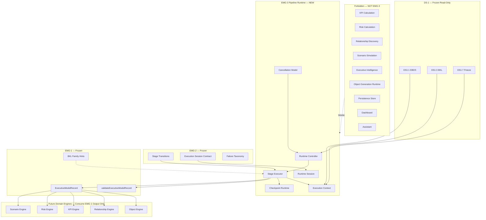
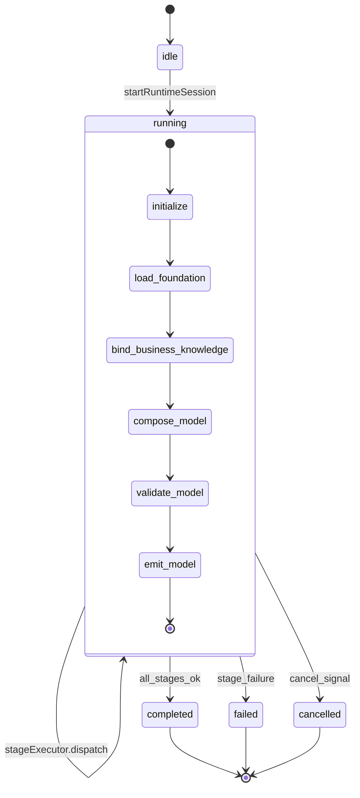
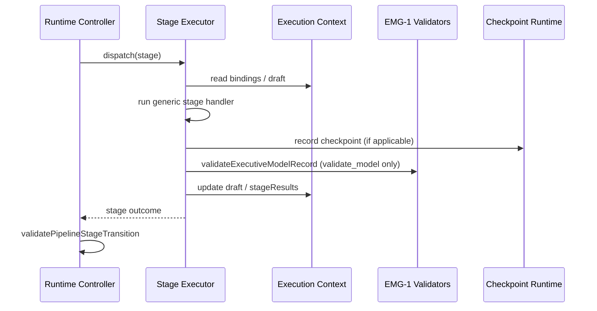
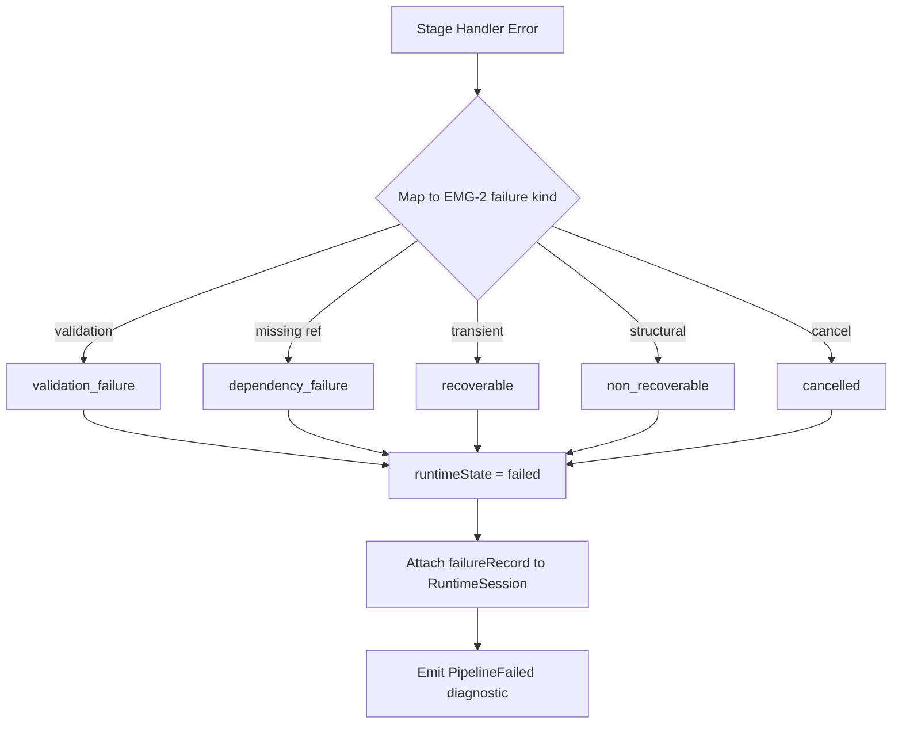
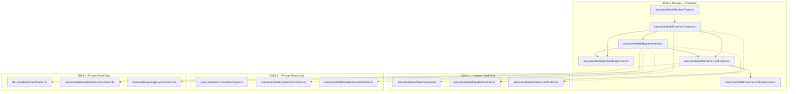
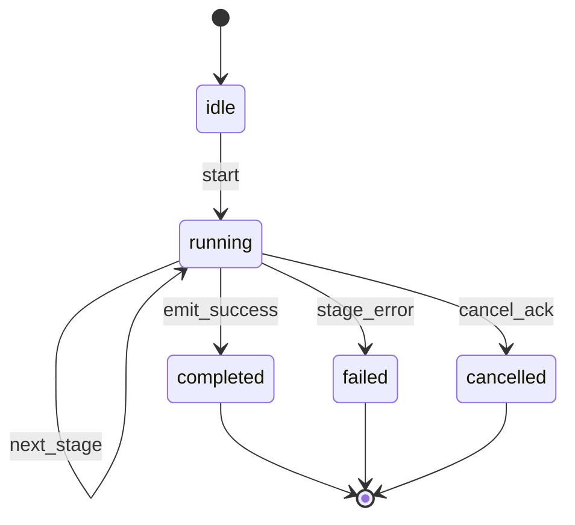

# EMG-3 — Executive Model Pipeline Runtime
## Stage-1 Understanding Report

**Project:** Nexora Type-C  
**Phase:** PHASE-3 / EMG-3  
**Title:** Executive Model Pipeline Runtime  
**Stage:** Stage-1 — Understand  
**Status:** UNDERSTANDING COMPLETE — **READY FOR STAGE-2 BUILD**

**Tags (proposed):** `[EMG3_PIPELINE_RUNTIME]` `[MODEL_GENERATION_RUNTIME_DEFINED]` `[WORKSPACE_RUNTIME_OWNED]` `[DOMAIN_ENGINE_READY]`

---

## 0. Executive Summary

The **Executive Model Pipeline Runtime (EMGR)** is a **library-only execution kernel** that **executes** the orchestration pipeline defined by frozen **EMG-2** and **emits** a Canonical Executive Model (`ExecutiveModelRecord`) defined by frozen **EMG-1**.

EMGR is the **first execution layer** in the PHASE-3 Executive Model Generation stack. It runs declared pipeline stages, maintains in-memory execution context, records checkpoint runtime events, supports cooperative cancellation, and produces a validated model output — without business intelligence, domain engine logic, persistence, dashboard rendering, or assistant coupling.

| Layer | Role | Execution |
|-------|------|-----------|
| **DS-1 Foundation (frozen)** | Approved business definitions + source identity | Read-only inputs |
| **EMG-1 (frozen)** | Canonical model vocabulary + validators | Output shape + validation delegation |
| **EMG-2 (frozen)** | Pipeline orchestration contract | Stage order, transitions, checkpoints, failure taxonomy |
| **EMG-3 (new)** | Generic pipeline execution kernel | In-memory stage execution |
| **Domain engines (future)** | Object / Relationship / KPI / Risk / Scenario | Consume emitted EMG-1 model — EMGR does not invoke them |

**STOP triggered:** **NO**  
**Frozen module modification required:** **NO**  
**Stage-2 Build:** **APPROVED** (additive `lib/executiveModelRuntime/` contract + kernel files only)

---

## 1. Runtime Purpose

### What EMGR is

| Attribute | Description |
|-----------|-------------|
| **Execution kernel** | Runs the six executable EMG-2 stages in order |
| **Session-scoped** | Every run is a `RuntimeSession` bound to workspace + model + linked EMG-2 session |
| **Context-bearing** | Maintains `ExecutionContext` across stage transitions |
| **Checkpoint-emitting** | Records runtime checkpoint evidence as stages complete |
| **Model-emitting** | Produces `ExecutiveModelRecord` on successful `emit_model` |
| **Cancellation-aware** | Cooperative cancel signal checked between stages |
| **Domain-agnostic** | Does not know Object, Relationship, KPI, Risk, or Scenario engines |

### What EMGR is NOT

| Excluded capability | Belongs to |
|---------------------|------------|
| Pipeline stage vocabulary / transitions | EMG-2 (frozen) |
| Canonical model type definitions | EMG-1 (frozen) |
| KPI calculations / values | KPI Engine (forbidden) |
| Risk calculations / propagation | Risk Intelligence runtime (forbidden) |
| Scenario simulations | Scenario Intelligence runtime (forbidden) |
| Relationship discovery | Relationship Engine runtime (forbidden) |
| Object creation / scene persistence | Object Registry / Scene runtime (forbidden) |
| Executive intelligence / recommendations | INT-5 platform (forbidden) |
| Durable persistence | Future persistence layer (forbidden in EMG-3) |
| Dashboard / assistant logic | MRP / Dashboard / Assistant (forbidden) |
| Parsing / upload / sync | Parser / DS runtime (forbidden) |

### Distinction across EMG stack

| Concern | EMG-1 | EMG-2 | EMG-3 |
|---------|-------|-------|-------|
| Model shape | **Owns** | Consumes | Emits |
| Pipeline vocabulary | Declared stages | Execution stages + transitions | **Executes** six stages |
| Session | — | `ExecutionSession` (contract) | `RuntimeSession` (live execution) |
| Stage status | `"declared"` | Contract enum | `"pending"` → `"running"` → `"completed"` / `"failed"` |
| Validation | **Owns** validator | Delegates in summary | **Invokes** EMG-1 validator at `validate_model` |
| Failure / retry | — | Failure taxonomy + policy shape | Propagates failures; retry deferred to EMG-4+ |
| Intelligence / domain | — | — | **Forbidden** |

EMGR **must not redefine** EMG-1 model families or EMG-2 stage enums. It **consumes** both read-only.

---

## 2. Runtime Architecture Diagram



---

## 3. Runtime Flow Diagram



### Executable stages (EMG-3 runs these only)

| Stage | Runtime handler responsibility | Checkpoint |
|-------|-------------------------------|------------|
| `initialize` | Verify prerequisites; link EMG-2 session; seed context | — |
| `load_foundation` | Resolve EBDS refs + optional DSS ref read-only | `foundation_loaded` |
| `bind_business_knowledge` | Resolve BKL artifact refs; verify workspace alignment | `knowledge_bound` |
| `compose_model` | Assemble seven-family draft using EMG-1 types + BKL hints | `model_composed` |
| `validate_model` | Invoke `validateExecutiveModelRecord()` | `validation_passed` |
| `emit_model` | Freeze draft into `ExecutiveModelRecord`; lifecycle `generated` | `model_emitted` |

Terminal EMG-2 stages `completed` and `failed` are **runtime outcomes**, not dispatched handlers.

### What `compose_model` does (and does not do)

**Does:** Structural assembly of EMG-1 definition records from bound DS-1 opaque refs using frozen `BKL_CONCEPT_TO_MODEL_FAMILY_HINTS` — definitions only, no computed values.

**Does not:** Invoke Object Engine, discover relationships, calculate KPIs, score risks, or simulate scenarios.

---

## 4. Runtime Ownership

### Authority chain

```
Workspace (authoritative owner)
    └── Runtime Session (0..N concurrent per workspace — in-memory)
              └── links ──→ executionSessionId (EMG-2 contract session)
              └── targets ──→ executiveModelId
              └── scoped to ──→ workspaceId
              └── maintains ──→ ExecutionContext (in-flight draft)
              └── emits ──→ ExecutiveModelRecord (EMG-1 shape)
              └── audit ──→ runtime checkpoints + diagnostics
```

### Rules

1. **Every runtime session requires `runtimeSessionId`, `executionSessionId`, `workspaceId`, `executiveModelId`.**
2. **Workspace isolation** — runtime sessions cannot cross workspace boundaries.
3. **Read-only toward DS-1, EMG-1, EMG-2** — runtime reads frozen contracts; never mutates them.
4. **In-memory only in EMG-3** — no persistence store, no registry writes.
5. **Runtime source declared** — `source: "phase-3-executive-model-runtime"`.
6. **Domain-engine independent** — runtime output is EMG-1 model only; domain engines consume later.

---

## 5. Runtime Session

Every runtime session must include twelve mandatory fields:

| Field | Type | Responsibility |
|-------|------|----------------|
| `runtimeSessionId` | string | Stable runtime run identity |
| `executionSessionId` | string | Link to EMG-2 `PipelineExecutionSession` |
| `workspaceId` | string | Owning workspace |
| `executiveModelId` | string | Target model |
| `runtimeState` | enum | `idle` \| `running` \| `completed` \| `failed` \| `cancelled` |
| `currentStage` | enum | Active EMG-2 executable stage |
| `executionContext` | object | In-flight bindings + draft model buffer |
| `checkpoints` | array | Runtime checkpoint records |
| `diagnostics` | array | Runtime lifecycle entries |
| `metadata` | object | Run metadata + extension point |
| `createdAt` | ISO string | Session start |
| `completedAt` | ISO string \| null | Session end |

### Proposed supplementary fields (Stage-2 contract)

| Field | Type | Purpose |
|-------|------|---------|
| `contractVersion` | string | `"PHASE-3/EMG-3"` |
| `sourceFoundationId` | string | `"PHASE-2/DS-1"` |
| `emg1ContractVersion` | string | Frozen EMG-1 version referenced |
| `emg2ContractVersion` | string | Frozen EMG-2 version referenced |
| `emittedModel` | `ExecutiveModelRecord` \| null | Output on success |
| `failureRecord` | object \| null | EMG-2 failure shape on terminal failure |
| `cancellationToken` | object | Cooperative cancel state |
| `source` | const | `"phase-3-executive-model-runtime"` |

---

## 6. Runtime Controller

The **Runtime Controller** is the top-level coordinator (contract + in-memory kernel in Stage-2):

| Responsibility | Description |
|----------------|-------------|
| Session lifecycle | Create, start, complete, fail, cancel runtime sessions |
| Prerequisite gates | Verify `isDs1FoundationFrozen()`, `isExecutiveModelGenerationFrozen()`, `isExecutiveModelPipelineFrozen()` |
| Stage dispatch | Invoke Stage Executor for current stage |
| Transition enforcement | Delegate legality to EMG-2 `validatePipelineStageTransition()` |
| Failure propagation | Map stage errors to EMG-2 failure kinds |
| Output handoff | Attach emitted `ExecutiveModelRecord` to session on success |

The controller **does not** embed domain logic — it delegates stage work to generic stage handlers.

---

## 7. Execution Context

`ExecutionContext` holds mutable in-memory state for a single runtime session:

| Context slice | Contents |
|---------------|----------|
| `inputBindings` | EBDS ids, BKL ids, optional DSS ref — from EMG-2 session |
| `foundationSnapshot` | Read-only resolved foundation refs (opaque ids + workspace proof) |
| `knowledgeBindings` | Resolved BKL artifact refs |
| `draftModel` | Partial `ExecutiveModelRecord` assembly buffer |
| `stageResults` | Per-stage outcome records |
| `cancelRequested` | Boolean cooperative cancel flag |
| `lastError` | Most recent stage error message |

Context is **ephemeral** — destroyed when session completes. No disk or registry persistence.

---

## 8. Stage Execution Model



### Stage handler contract (proposed)

Each handler returns a **stage outcome** — not domain data:

| Outcome field | Purpose |
|---------------|---------|
| `stage` | Stage executed |
| `success` | Boolean |
| `failureKind` | EMG-2 failure kind on error |
| `message` | Diagnostic message |
| `checkpointKind` | Checkpoint emitted (if any) |

Handlers are **pluggable by stage id** but **generic in scope** — no Object/Relationship/KPI/Risk/Scenario imports.

---

## 9. Checkpoint Runtime Model

Runtime checkpoints mirror EMG-2 checkpoint kinds with **execution evidence**:

| Checkpoint Kind | Runtime evidence stored |
|-----------------|------------------------|
| `foundation_loaded` | Resolved EBDS ids; DS-1 freeze confirmed at runtime start |
| `knowledge_bound` | Resolved BKL artifact ids; workspace alignment verified |
| `model_composed` | Draft model family counts; no domain engine ids |
| `validation_passed` | EMG-1 validation result snapshot |
| `model_emitted` | Emitted `executiveModelId` + contract version |

Checkpoint records extend EMG-2 shape with `runtimeSessionId` and `handlerDurationMs` (advisory, in-memory).

---

## 10. Cancellation Model

Cooperative cancellation — no forced thread interruption:

| State | Meaning |
|-------|---------|
| `none` | No cancel requested |
| `requested` | Cancel signal set; checked between stages |
| `acknowledged` | Controller stopped dispatch; session → `cancelled` |

**Rules:**

- Cancel checked **between stages**, not mid-handler (Stage-2 simplification).
- Cancel maps to EMG-2 `failureKind: "cancelled"`.
- Cancel does not mutate DS-1, EMG-1, or EMG-2 contracts.

---

## 11. Failure Propagation



Runtime **propagates** failures using EMG-2 taxonomy. Retry execution belongs to **EMG-4+** — not EMG-3.

---

## 12. Read-Only Integration

### DS-1 Foundation

| Layer | Runtime usage |
|-------|---------------|
| DS1:1 EBDS | Read business data source refs in `load_foundation` |
| DS1:3 BKL | Read knowledge artifact refs in `bind_business_knowledge` |
| DS1:6 DSS | Optional observation ref correlation |
| DS1:7 | Prerequisite freeze probe before session start |

### EMG-1

| Export | Runtime usage |
|--------|---------------|
| `ExecutiveModelRecord` | Output type |
| `validateExecutiveModelRecord()` | Called at `validate_model` |
| `BKL_CONCEPT_TO_MODEL_FAMILY_HINTS` | Compose stage family routing |
| `resolveExecutiveModelExample()` | Certification probe only |
| `isExecutiveModelGenerationFrozen()` | Prerequisite gate |

### EMG-2

| Export | Runtime usage |
|--------|---------------|
| `PipelineExecutionSession` | Linked via `executionSessionId` |
| `validatePipelineStageTransition()` | Transition enforcement |
| `validatePipelineExecutionSession()` | Session shape validation |
| `PIPELINE_STAGE_TRANSITIONS` | Dispatch order reference |
| `PIPELINE_FAILURE_KINDS` | Failure propagation taxonomy |
| `isExecutiveModelPipelineFrozen()` | Prerequisite gate |

**Import rule:** EMG-3 imports types, validators, constants, freeze probes, and example resolvers — never mutates frozen files.

---

## 13. Future Compatibility

| Future consumer | EMGR provides | Compatibility |
|-----------------|---------------|---------------|
| **Object Engine** | Emitted `modelFamilies.objects` definitions | Reads EMG-1 ids — EMGR does not create runtime objects |
| **Relationship Engine** | Emitted relationship definitions | EMGR assembles declarative edges only |
| **KPI Engine** | KPI definitions (no values) | Engine owns calculation |
| **Risk Engine** | Risk definitions (no scores) | Engine owns scoring |
| **Scenario Engine** | Assumptions + constraints | Overlays reference model ids |
| **Intelligence Platform** | Session metadata + emitted model | Read-only adapter |
| **Dashboard / Assistant** | Runtime diagnostics | No coupling imports |
| **EMG-4 Retry Runtime** | Failed session + EMG-2 retry policy | Restarts from checkpoint externally |

---

## 14. Dependency Map



**Forbidden import targets:** objectRegistryRuntime, RelationshipRenderer, RiskIntelligenceRuntime, ScenarioGenerationRuntime, workspaceSceneSync, ParserEngine, dashboardIntelligence, assistantRuntime, all `.tsx`.

**Circular dependencies:** None — EMG-3 depends on EMG-2 and EMG-1; neither depends on EMG-3.

---

## 15. Runtime State Diagram



| `runtimeState` | `currentStage` typical value |
|----------------|------------------------------|
| `idle` | — (pre-start) |
| `running` | One of six executable stages |
| `completed` | `emit_model` completed; outcome terminal |
| `failed` | Stage where failure occurred |
| `cancelled` | Stage where cancel acknowledged |

---

## 16. Diagnostics (Proposed — Stage-2)

| Event | When |
|-------|------|
| `RuntimeSessionCreated` | Runtime session allocated |
| `RuntimeSessionStarted` | Controller begins dispatch |
| `RuntimeStageStarted` | Stage handler entered |
| `RuntimeStageCompleted` | Stage handler succeeded |
| `RuntimeStageFailed` | Stage handler failed |
| `RuntimeCheckpointRecorded` | Checkpoint runtime evidence stored |
| `RuntimeModelValidated` | EMG-1 validation invoked |
| `RuntimeModelEmitted` | `ExecutiveModelRecord` attached |
| `RuntimeSessionCancelled` | Cancel acknowledged |
| `RuntimeSessionCompleted` | Terminal success |
| `RuntimeCertificationStarted` | Certification probe |
| `RuntimeCertificationPassed` | All gates pass |
| `RuntimeCertificationFailed` | Gate failure |

---

## 17. Extension Points

| Extension | Location | Purpose |
|-----------|----------|---------|
| `metadata.extension.futureExtension` | Runtime session metadata | Opaque runtime payload |
| `executionContext.extension` | Execution context | Stage-2 optional handler config |
| Stage handler registry | Runtime kernel | EMG-4+ may register alternate generic handlers — not domain handlers |

No extension may introduce KPI values, risk scores, relationship discovery, or intelligence outputs.

---

## 18. Architecture Smells (Pre-Build Review)

| Smell | Severity | Mitigation |
|-------|----------|------------|
| `compose_model` could creep into domain logic | Medium | MUST NOT OWN; compose uses EMG-1 definition types only |
| Two session concepts (EMG-2 vs EMG-3) | Low | Explicit `executionSessionId` link; distinct types |
| In-memory context without persistence | Low | Documented boundary; persistence is EMG-4+ |
| Stage handler registry over-engineering | Low | Fixed six handlers in Stage-2; registry is contract hook only |
| Duplicate validation from EMG-1 | Medium | Single call site at `validate_model` |

**No critical smells.** **No STOP conditions triggered.**

---

## 19. Risk Analysis

| Risk | Likelihood | Impact | Mitigation |
|------|:----------:|:------:|------------|
| Runtime becomes Object Engine | Medium | Critical | MUST NOT OWN object_generation; domain-engine independent gate |
| Runtime calculates KPIs/risks during compose | Medium | Critical | Definition-only assembly; no numeric fields |
| Runtime mutates EMG-1/EMG-2/DS-1 | Low | Critical | Read-only imports; file boundary gates |
| Persistence creep | Medium | High | persistence in MUST NOT OWN; in-memory context only |
| Relationship discovery in compose | Medium | Critical | relationship_discovery excluded |
| Intelligence coupling | Low | Critical | Forbidden import probes |
| Stage transition bypass | Low | Medium | EMG-2 transition validator delegation |
| Cross-workspace context leak | Low | High | workspaceId on session + context guards |

---

## 20. Expected File List (Stage-2)

| File | Stage | Responsibility |
|------|-------|----------------|
| `executiveModelRuntimeTypes.ts` | Stage-2 | Runtime session, context, stage outcome, cancel, diagnostic types |
| `executiveModelRuntimeContract.ts` | Stage-2 | Manifest, states, handlers contract, MUST NOT OWN, validators |
| `executiveModelRuntimeDiagnostics.ts` | Stage-2 | 13 runtime lifecycle events |
| `executiveModelRuntimeKernel.ts` | Stage-2 | In-memory controller + stage dispatch (generic handlers) |
| `executiveModelRuntimeCertification.ts` | Stage-2 | Certification + analysis runner |
| `executiveModelRuntimeCertification.test.ts` | Stage-2 | Architecture tests |
| `docs/emg-3-build-report.md` | Stage-2 | Build report |
| `docs/emg-3-analysis-report.md` | Stage-3 | Analysis report |
| `docs/emg-3-freeze-report.md` | Stage-3 | Freeze report |

**Stage-1 deliverable:** this understanding report only — **no code**.

---

## 21. Certification Strategy (Stage-2 / Stage-3)

### Prerequisites

- PHASE-1 Stage Architecture frozen
- PHASE-2 DS-1 Foundation frozen
- PHASE-3 EMG-1 frozen
- PHASE-3 EMG-2 frozen

### Proposed gate groups

| Group | Gates | Validation |
|-------|------:|------------|
| A — Version & executable stages | 3 | Contract version; six executable stages |
| B — Manifest & boundaries | 3 | Allowlist; forbidden probes |
| C — Prerequisites | 4 | DS-1, EMG-1, EMG-2 frozen; acyclic deps |
| D — Runtime session validation | 4 | Mandatory fields; example session |
| E — EMG-2 / EMG-1 integration | 4 | Transition delegation; validation invocation; alignment |
| F — Regression | 3 | MUST NOT OWN; kernel-only boundary; domain-engine independent |
| G — Diagnostics & score | 3 | Events active; minimum score 98 |
| H — Analysis (Stage-3) | 5 | Freeze tags; no persistence; no domain engine imports |

**Target:** ≥ 29 gates, overall score ≥ 98.

---

## 22. Verification Checklist

| Requirement | Design verdict |
|-------------|----------------|
| Workspace-aware | **PASS** — session + context scoped to workspaceId |
| Library-only | **PASS** — no UI, no stores |
| Runtime-kernel only | **PASS** — executes stages; no domain engines |
| Intelligence-independent | **PASS** — no INT imports |
| Persistence-independent | **PASS** — in-memory context |
| Dashboard-independent | **PASS** — no dashboard fields |
| Assistant-independent | **PASS** — no assistant fields |
| Domain-engine independent | **PASS** — emits EMG-1 model only |
| No KPI/risk/scenario calculation | **PASS** — definitions only |
| No EMG-1/EMG-2/DS-1 mutation | **PASS** — read-only consumption |

---

## 23. MUST NOT OWN

`object_generation` · `relationship_generation` · `kpi_generation` · `risk_generation` · `scenario_generation` · `executive_intelligence` · `recommendations` · `dashboard_rendering` · `assistant_logic` · `persistence` · `upload_execution` · `parsing` · `synchronization` · `registry_mutation` · `scene_sync` · `intelligence_reasoning` · `relationship_discovery` · `kpi_calculations` · `risk_calculations` · `scenario_simulations` · `ds1_contract_mutation` · `emg1_contract_mutation` · `emg2_contract_mutation`

---

## 24. Stage Readiness Report

| Criterion | Status |
|-----------|--------|
| Architecture defined | **COMPLETE** |
| EMG-1 / EMG-2 alignment documented | **COMPLETE** |
| DS-1 integration path clear | **COMPLETE** |
| Runtime session model defined | **COMPLETE** |
| Controller / executor / context defined | **COMPLETE** |
| Checkpoint + cancellation models defined | **COMPLETE** |
| Failure propagation defined | **COMPLETE** |
| STOP conditions evaluated | **NONE TRIGGERED** |
| Frozen module changes required | **NONE** |
| Stage-2 file list approved | **READY** |
| Certification strategy defined | **READY** |

### Stage-2 Build scope (approved)

1. Runtime types (session, context, stage outcome, cancellation)
2. Runtime contract (states, handler shapes, validators, MUST NOT OWN)
3. In-memory kernel (controller + six generic stage handlers)
4. Diagnostics (13 events)
5. Certification runner (≥29 gates)
6. Certification tests
7. Build report

### Explicitly deferred (EMG-4+)

- Durable session persistence
- Retry engine execution (EMG-2 policy shape only)
- Live DS-1 registry lookups beyond example resolvers
- Domain engine invocation (Object / Relationship / KPI / Risk / Scenario)
- Dashboard / assistant integration adapters

---

## 25. Verdict

**EMG-3 Stage-1 Understanding: COMPLETE**

The Executive Model Pipeline Runtime architecture is **kernel-only**, **workspace-scoped**, and **fully compatible** with frozen DS-1 Foundation, EMG-1, and EMG-2 contracts. The runtime executes generic pipeline stages and emits EMG-1 canonical models without domain engine knowledge.

No architectural conflicts discovered. No STOP conditions triggered.

**Ready for EMG-3 Stage-2 Build** upon approval.

No code written. No frozen modules modified.
