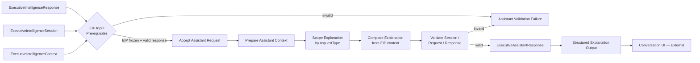
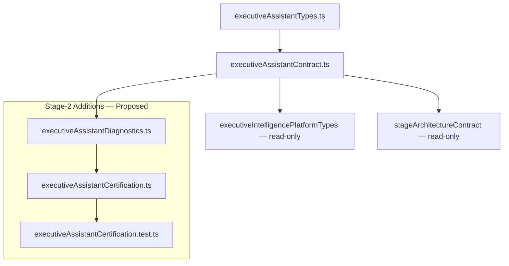
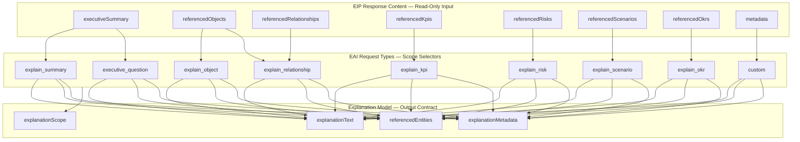
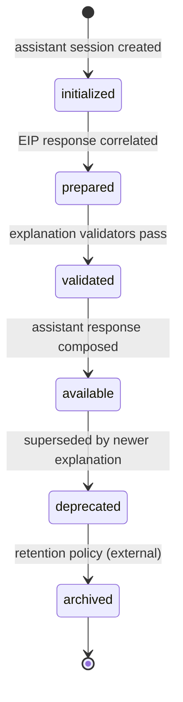

# EAI-1 — Executive Assistant Intelligence
## Stage-1 Understanding Report

**Project:** Nexora Type-C  
**Phase:** PHASE-12 / Executive Assistant Intelligence  
**Stage ID:** EAI-1  
**Title:** Executive Assistant Intelligence  
**Stage:** Stage-1 — Understand  
**Status:** UNDERSTANDING COMPLETE — **READY FOR STAGE-2 BUILD**

**Tags (proposed):** `[EAI_EXECUTIVE_ASSISTANT]` `[ASSISTANT_INTELLIGENCE_DEFINED]` `[WORKSPACE_ASSISTANT_OWNED]` `[CONVERSATION_ADAPTER_READY]`

---

## 0. Executive Summary

The **Executive Assistant Intelligence (EAI)** layer is a **library-only conversational explanation contract** that **consumes** the frozen **PHASE-10 EIP-1** `ExecutiveIntelligenceResponse`, `ExecutiveIntelligenceSession`, and `ExecutiveIntelligenceContext` and **derives** structured **Explanation Responses** for downstream **conversation UI adapters**.

EAI is the **first conversational layer in PHASE-12**. It defines assistant sessions, requests, responses, context, nine explanation request types, explanation model, conversation metadata, validation vocabulary, diagnostics, and extension points — without AI reasoning, LLM inference, recommendation generation, KPI calculation, risk scoring, scenario simulation, OKR progress, persistence, dashboard rendering, UI implementation, or registry access.

| Layer | Role | Relationship to EAI |
|-------|------|---------------------|
| **DS-1 Foundation (frozen)** | Approved business definitions | **Not consumed** — no direct access |
| **EMG Stack (frozen)** | Model generation + runtime | **Not consumed** — no direct access |
| **DS2–OKR-INT-1 (frozen)** | Executive integration stack | **Not consumed** — EIP is sole upstream |
| **EIP-1 (frozen)** | Intelligence orchestration | **Upstream input** — response + session + context read-only |
| **EDI-1 (frozen)** | Dashboard presentation | **Parallel consumer** — EAI does not import EDI |
| **EAI (new)** | Conversational explanation contract | Explains EIP output in structured conversation form |
| **Conversation UI (future)** | Chat/voice rendering | Reads EAI output — EAI does not invoke UI |

**Legacy note:** The certified **`assistantIntelligence/`** and **`assistant/assistantRuntimeAdapter`** pipelines are a **parallel track** operating on workspace intelligence inputs. **PHASE-12 EAI-1** is a **new executive-model conversational stack** in `lib/executiveAssistant/` — it does not replace or modify legacy assistant modules.

**STOP triggered:** **NO**  
**Frozen module modification required:** **NO**  
**Stage-2 Build:** **APPROVED** (additive `lib/executiveAssistant/` contract files only)

---

## 1. Assistant Purpose

### What EAI is

| Attribute | Description |
|-----------|-------------|
| **Conversational vocabulary** | Defines how EIP intelligence responses become structured explanation contracts |
| **EIP-only consumer** | Reads frozen EIP output — never registries, DS-1, EMG, or EDI |
| **Workspace-scoped** | Every assistant session belongs to exactly one workspace |
| **Explanation definition only** | Produces explanation text + identity references — not LLM output or chat UI |
| **Reference projection** | Projects EIP identity references into explanation-scoped reference slots |
| **Conversation-adapter-ready** | Normalized explanation responses that chat/voice UI adapters consume externally |

### What EAI is NOT

| Excluded capability | Belongs to |
|---------------------|------------|
| Hex registry integration | DS2–OKR (frozen) |
| Intelligence orchestration | EIP-1 (frozen) |
| Dashboard layout composition | EDI-1 (frozen) |
| Executive model generation | EMG stack (frozen) |
| DS-1 foundation reads | Forbidden |
| EMG direct reads | Forbidden |
| Direct registry reads | Forbidden — EIP is sole input boundary |
| KPI calculation / value tracking | KPI Calculation Engine (forbidden) |
| Risk scoring / probability | Risk Scoring Engine (forbidden) |
| Scenario simulation / prediction | Scenario Simulation Engine (forbidden) |
| OKR progress / achievement | Progress Engine (forbidden) |
| AI reasoning / LLM inference | External AI runtime (forbidden) |
| Recommendation generation | Recommendation Engine (forbidden) |
| Dashboard rendering | EDI / MRP layer (forbidden) |
| Chat UI / voice UI implementation | Conversation UI layer (forbidden) |
| Business entity ownership | Frozen registries + EIP remain authoritative |
| Durable persistence | Future persistence layer (forbidden in EAI-1) |

### Distinction across the stack

| Concern | EIP-1 (frozen) | EDI-1 (frozen) | EAI |
|---------|----------------|----------------|-----|
| Primary artifact | `ExecutiveIntelligenceResponse` | `ExecutiveDashboardResponse` | `ExecutiveAssistantResponse` |
| Upstream input | DS2–OKR hex registries | EIP response + session + context | **EIP response + session + context** |
| Primary operation | Read-only orchestration + correlation | Presentation layout composition | **Conversational explanation composition** |
| Output | Intelligence summary + identity refs | Section/widget layout definitions | Explanation text + identity refs |
| Text semantics | `executiveSummary` — declarative correlation | Section titles + widget labels | `explanationText` — declarative explanation from EIP |
| AI / LLM | Excluded | Excluded | **Excluded** |
| UI rendering | Excluded | Excluded | **Excluded** |

EAI **must not redefine** EIP shapes. It **explains** EIP response content in conversational contract form — it **never creates** intelligence.

**Critical distinction:** EAI `explanationText` is **declarative composition** from EIP `executiveSummary` and scoped reference metadata — **not** LLM-generated prose. External AI runtimes may consume EAI output later; EAI-1 does not invoke them.

---

## 2. Assistant Architecture Diagram

```mermaid
flowchart TB
  subgraph forbidden [Forbidden — NOT EAI]
    DS1[Direct DS-1 Consumption]
    EMG[Direct EMG Consumption]
    REG[Direct Registry Access]
    CALC[KPI Calculation]
    SCORE[Risk Scoring]
    SIM[Scenario Simulation]
    PROG[OKR Progress]
    AI[AI Reasoning / LLM]
    REC[Recommendation Engine]
    PERSIST[Persistence Store]
    DASH[Dashboard Rendering]
    CHAT[Chat UI / Voice UI]
    SCENE[Scene / Workspace Sync]
    LEGACY[Legacy assistantIntelligence Runtime]
  end

  subgraph downstream [Future Consumers — Read EAI Output Only]
    CONV[Conversation UI Adapter]
    EXTAI[External AI Runtime]
  end

  subgraph eai [EAI-1 Executive Assistant Intelligence — NEW]
    EXPL[Explanation Composition Contract]
    SESS[Assistant Session]
    REQ[Assistant Request]
    RES[Assistant Response]
    CTX[Assistant Context]
    EXPM[Explanation Model]
    VAL[Validation Vocabulary]
    DIAG[Diagnostics Contract]
  end

  subgraph eip [EIP-1 — Frozen]
    EIPRESP[ExecutiveIntelligenceResponse]
    EIPSESS[ExecutiveIntelligenceSession]
    EIPCTX[ExecutiveIntelligenceContext]
  end

  subgraph edi [EDI-1 — Frozen — Parallel]
    EDIRES[ExecutiveDashboardResponse]
  end

  EIPRESP --> EXPL
  EIPSESS --> SESS
  EIPCTX --> CTX
  EXPL --> EXPM --> RES
  RES --> CONV
  EXTAI -.->|external only| RES

  forbidden -.->|blocked| eai
  DS1 -.->|blocked| eai
  EMG -.->|blocked| eai
  REG -.->|blocked| eai
  LEGACY -.->|blocked| eai
  EDIRES -.->|not imported| eai
```



---

## 3. Conversation Flow Diagram



### Explanation stages (contract vocabulary — Stage-2)

| Stage | ID | Responsibility | Runtime in EAI-1 |
|-------|-----|----------------|------------------|
| **Accept** | `accept` | Verify EIP freeze + valid intelligence response + assistant request shape | Validation only |
| **Prepare** | `prepare` | Build assistant context from EIP session/response correlation | Context assembly only |
| **Scope** | `scope` | Map `requestType` to EIP reference scope for explanation | Identity scoping only |
| **Compose** | `compose` | Assemble `explanationText` + reference arrays from EIP content | Declarative composition only |
| **Validate** | `validate` | Run session / request / response validators | Validation functions |
| **Respond** | `respond` | Produce assistant session + response snapshot | Example builder only |

**No stage performs calculation, simulation, scoring, AI inference, LLM calls, persistence, rendering, or registry access.**

---

## 4. Dependency Map



| Module | Imports From | Class | Forbidden Targets |
|--------|--------------|-------|-------------------|
| `executiveAssistantTypes.ts` | EIP types (type-only) | internal + type-only | — |
| `executiveAssistantContract.ts` | types, EIP validators/examples (read-only), stage contract | internal + type-only | DS-1, EMG, DS2–OKR, EDI, engines, runtime, UI, legacy assistant |
| `executiveAssistantDiagnostics.ts` (Stage-2) | contract constants | internal | — |
| `executiveAssistantCertification.ts` (Stage-2) | contract, diagnostics, types, stage guards, EIP cert | internal + external read-only | All product runtimes |

**Circular dependencies:** NONE (projected acyclic DAG)

### Input boundary (frozen design)

```
ExecutiveIntelligenceResponse
  + ExecutiveIntelligenceSession
  + ExecutiveIntelligenceContext
  → composeExecutiveAssistantExplanationFromIntelligence()
  → ExecutiveAssistantSession + Request + Response + Context
```

**Never consumed:**

| Module | Status |
|--------|--------|
| DS-1 Foundation | Forbidden |
| EMG Stack | Forbidden |
| DS2–OKR Registries | Forbidden — EIP is sole gateway |
| EDI-1 Dashboard | Forbidden — parallel consumer of EIP |
| Legacy `assistantIntelligence/` | Forbidden — boundary probes only |

---

## 5. Explanation Model Diagram



### Explanation model shape (contract vocabulary)

| Field | Purpose | Source |
|-------|---------|--------|
| `explanationId` | Stable explanation identity | EAI composition |
| `explanationScope` | One of nine request types | Assistant request |
| `explanationText` | Declarative explanation from EIP content | EIP `executiveSummary` + scoped refs |
| `referencedEntities` | Identity references projected from EIP | EIP `referenced*` arrays |
| `explanationMetadata` | Tags, hints, conversation context | EIP metadata passthrough + EAI tags |
| `sourceTopic` | Selected topic id (optional) | Conversation state correlation |

**Explanation text is declarative composition — not LLM output, not calculated values, not recommendations.**

---

## 6. Lifecycle Diagram



| State | Meaning |
|-------|---------|
| `initialized` | Assistant session record created; EIP correlation pending |
| `prepared` | Assistant context assembled from EIP session/response |
| `validated` | Session, request, and explanation pass validation |
| `available` | Assistant response ready for conversation UI consumption |
| `deprecated` | Superseded explanation version; still readable |
| `archived` | Retained for audit; not active |

Lifecycle vocabulary mirrors EIP-1 and EDI-1 for cross-layer consistency. EAI does not implement retention policies — states are contract labels only.

---

## 7. Assistant Session Contract

| Field | Purpose |
|-------|---------|
| `assistantSessionId` | Stable assistant session identity |
| `workspaceId` | Owning workspace |
| `executiveModelId` | Parent executive model |
| `intelligenceSessionId` | Correlated EIP session |
| `intelligenceResponseId` | Correlated EIP response |
| `intelligenceRequestId` | Correlated EIP request |
| `conversationId` | Conversation thread correlation |
| `requestTypesUsed` | Explanation request types active in session |
| `explanationCount` | Total explanations composed |
| `sessionSummary` | Declarative summary of composed explanations |
| `metadata` | Tags, hints, extension payload |
| `lifecycleState` | One of six lifecycle values |
| `createdAt` / `updatedAt` | Timestamps |
| `source` | `phase-12-executive-assistant-intelligence` |

Supplementary: `contractVersion`.

---

## 8. Assistant Request Contract

Nine contract-only request types:

```
explain_summary · explain_object · explain_relationship · explain_kpi ·
explain_risk · explain_scenario · explain_okr · executive_question · custom
```

| Field | Purpose |
|-------|---------|
| `requestId` | Stable request identity |
| `assistantSessionId` | Parent assistant session |
| `workspaceId` | Workspace scope |
| `executiveModelId` | Model scope |
| `intelligenceResponseId` | Target EIP response to explain |
| `requestType` | One of nine explanation request types |
| `targetReferenceId` | Optional scoped entity id from EIP references |
| `metadata` | Tags, hints, extension payload |
| `lifecycleState` | One of six lifecycle values |
| `createdAt` / `updatedAt` | Timestamps |
| `source` | `phase-12-executive-assistant-intelligence` |

### Request type → EIP scope mapping

| Request type | EIP reference source | Explanation focus |
|--------------|---------------------|-------------------|
| `explain_summary` | `executiveSummary` | Full intelligence summary explanation |
| `explain_object` | `referencedObjects` | Object identity explanation |
| `explain_relationship` | `referencedRelationships` | Relationship identity explanation |
| `explain_kpi` | `referencedKpis` | KPI identity explanation (no values) |
| `explain_risk` | `referencedRisks` | Risk identity explanation (no scores) |
| `explain_scenario` | `referencedScenarios` | Scenario identity explanation (no simulation) |
| `explain_okr` | `referencedOkrs` | OKR identity explanation (no progress) |
| `executive_question` | `executiveSummary` + refs | Scoped question context from EIP text |
| `custom` | `metadata.extension` | Custom explanation scope |

**Request types define explanation scope only — not reasoning engine behavior.**

---

## 9. Assistant Response Contract

| Field | Purpose |
|-------|---------|
| `responseId` | Stable response identity |
| `requestId` | Parent request correlation |
| `assistantSessionId` | Parent session correlation |
| `workspaceId` | Workspace scope |
| `executiveModelId` | Model scope |
| `intelligenceResponseId` | Source EIP response correlation |
| `explanation` | Explanation model (text + refs + metadata) |
| `metadata` | Response-level tags and extension |
| `lifecycleState` | One of six lifecycle values |
| `createdAt` / `updatedAt` | Timestamps |
| `source` | `phase-12-executive-assistant-intelligence` |

### Response rule (frozen design)

| Allowed | Forbidden |
|---------|-----------|
| `explanationText` — declarative from EIP | Generated business entities |
| Identity references from EIP | Calculated KPI/risk values |
| Explanation metadata | Recommendations |
| | Simulations |
| | LLM-generated advice |
| | Embedded registry objects |

---

## 10. Assistant Context Contract

| Field | Purpose |
|-------|---------|
| `contextId` | Stable context identity |
| `assistantSessionId` | Parent session correlation |
| `workspaceId` | Workspace scope |
| `executiveModelId` | Model scope |
| `intelligenceSessionId` | EIP session correlation |
| `intelligenceResponseId` | EIP response correlation |
| `conversationState` | Session-local conversation preferences |
| `metadata` | Tags, hints, extension payload |
| `createdAt` / `updatedAt` | Timestamps |
| `source` | `phase-12-executive-assistant-intelligence` |

### Conversation state (session-local only)

| Field | Allowed content | Forbidden content |
|-------|-----------------|-------------------|
| `conversationId` | Thread correlation id | Registry records |
| `historyMetadata` | Declarative turn labels (not full transcript cache) | Business entities |
| `selectedTopic` | Request type or reference id | Calculated values |
| `userPreferences` | Key → string preference map | Intelligence cache payloads |
| `explanationContext` | Active explanation scope label | Embedded registry objects |

**Conversation state holds metadata references only — not registry cache, business entity ownership, or executive intelligence cache.**

---

## 11. Conversation Metadata

| Field | Purpose |
|-------|---------|
| `tags` | Classification tags (e.g. `[EAI_EXECUTIVE_ASSISTANT]`) |
| `domainHint` | Domain scope hint for conversation UI |
| `executiveCategoryHint` | Executive category hint from EIP passthrough |
| `conversationHint` | Tone/format hint for UI adapter (not LLM prompt) |
| `taxonomyOverride` | Optional taxonomy override |
| `extension.futureExtension` | Additive extension payload |

Metadata is **declarative** — EAI does not interpret hints as LLM prompts or rendering instructions.

---

## 12. Workspace Ownership

### Authority chain

```
Workspace → Executive Model → EIP Orchestration (frozen) → EAI Explanation → Conversation UI (external)
```

| Principle | Implementation |
|-----------|----------------|
| Workspace exclusivity | All assistant sessions scoped by `workspaceId` |
| EIP authority | EIP responses remain authoritative — EAI never owns intelligence content |
| Explanation-only | `mutationPolicy: read-only-explanation-snapshot` |
| Upstream correlation | `upstreamAuthority: phase-10-executive-intelligence-platform` |
| No registry access | All entity ids projected from EIP references only |

EAI **never mutates** workspace stores, scene state, EIP artifacts, EDI artifacts, or upstream registries.

---

## 13. Extension Points

| Extension | Location | Purpose |
|-----------|----------|---------|
| `metadata.extension.futureExtension` | Session, request, response, context, explanation | Future explanation profiles |
| `requestType: custom` | Request contract | Custom explanation scopes |
| `conversationHint` on metadata | Metadata contract | UI adapter conversation hints |
| Explanation stage hooks | Stage-2 contract | Additional scoping stages without runtime |
| `targetReferenceId` on request | Request contract | Scoped entity explanation |

All extensions are **additive contract fields** — no runtime behavior in Stage-1.

---

## 14. Diagnostics (Proposed — Stage-2)

| Event | Trigger |
|-------|---------|
| `AssistantSessionCreated` | Assistant session initialized |
| `AssistantRequestAccepted` | Explanation request validated against EIP |
| `AssistantContextPrepared` | Assistant context assembled from EIP |
| `ExplanationScoped` | Request type mapped to EIP reference scope |
| `ExplanationComposed` | Explanation text and references assembled |
| `ExplanationValidated` | Explanation model passes validation |
| `AssistantResponseReady` | Assistant response available |
| `CertificationStarted` | Certification probe begins |
| `CertificationPassed` / `CertificationFailed` | Certification outcome |

---

## 15. Validation (Proposed — Stage-2)

| Validator | Scope |
|-----------|-------|
| `validateExecutiveAssistantSession` | Mandatory session fields + EIP correlation ids |
| `validateExecutiveAssistantRequest` | Request shape + requestType enum |
| `validateExecutiveAssistantResponse` | Response shape + explanation model |
| `validateExecutiveAssistantContext` | Context shape + conversation state |
| `validateExplanationModel` | Explanation text + reference arrays |
| `validateEipIntelligenceInputCorrelation` | EIP response/session/context delegation |
| `validateExplanationReferenceProjection` | Explanation refs exist in source EIP response |
| `validateConversationStateIntegrity` | No forbidden cache/ownership fields |
| `validateEaiEipInputBoundary` | Forbidden import boundary probe |

---

## 16. MUST NOT OWN (Proposed)

| Exclusion | Rationale |
|-----------|-----------|
| `ai_reasoning` | AI belongs to external runtime |
| `llm_inference` | LLM belongs to external runtime |
| `recommendation_engine` | Recommendations belong to external engine |
| `recommendation_generation` | Same |
| `kpi_calculations` | KPI values belong to calculation engine |
| `risk_scoring` | Risk scores belong to scoring engine |
| `scenario_simulation` | Simulation belongs to scenario engine |
| `okr_progress` | Progress belongs to OKR progress engine |
| `intelligence_orchestration` | Belongs to EIP (frozen) |
| `dashboard_rendering` | Belongs to EDI / UI layer |
| `registry_access` | Registries accessed only via EIP |
| `registry_caching` | Session-local EIP correlation only |
| `intelligence_cache` | Explanation snapshot only |
| `business_entity_ownership` | EIP + registries remain authoritative |
| `persistence` | External store only |
| `ui_implementation` | Conversation UI scope |
| `assistant_runtime` | Legacy parallel track |
| `legacy_assistant_modules` | Parallel track blocked |
| `ds1_direct_consumption` | Forbidden |
| `emg_direct_consumption` | Forbidden |
| `object_registry_direct_consumption` | Forbidden |
| `relationship_registry_direct_consumption` | Forbidden |
| `kpi_registry_direct_consumption` | Forbidden |
| `risk_registry_direct_consumption` | Forbidden |
| `scenario_registry_direct_consumption` | Forbidden |
| `okr_registry_direct_consumption` | Forbidden |

---

## 17. Risk Analysis

| Risk | Likelihood | Impact | Mitigation |
|------|:----------:|:------:|------------|
| EAI bypasses EIP and reads registries directly | Medium | Critical | EIP-only input boundary; forbidden DS2–OKR imports |
| EAI becomes LLM/AI reasoning engine | Medium | Critical | MUST NOT OWN; no LLM imports; declarative text only |
| EAI generates recommendations | Medium | Critical | Response rule; `recommendation_generation` excluded |
| Explanation text becomes calculated KPI/risk output | Medium | Critical | Reference ids only; no value fields |
| Legacy assistantIntelligence collision | Low | Medium | Legacy modules in forbidden patterns |
| Conversation state stores registry cache | Medium | High | H8-style gate; typed conversation state |
| Cross-workspace explanation leak | Low | High | Workspace guards on all artifacts |
| EAI imports EDI dashboard layout | Low | Medium | Parallel EIP consumers; no EDI import |
| UI/chat component imports into EAI | Medium | High | Forbidden `.tsx` paths in certification |
| Intelligence orchestration creep | Medium | Critical | `intelligence_orchestration` in MUST NOT OWN |

**No critical unmitigated risks.** Architecture viable without violating frozen layers.

---

## 18. Expected File List

### Stage-1 (complete)

| File | Status |
|------|--------|
| `executiveAssistantTypes.ts` | **DEFERRED** — design captured in this report; Stage-2 implementation |
| `executiveAssistantContract.ts` | **DEFERRED** — design captured in this report; Stage-2 implementation |
| `docs/executive-assistant-understanding-report.md` | **CREATED** |

### Stage-2 (proposed)

| File | Responsibility |
|------|----------------|
| `executiveAssistantTypes.ts` | Session, request, response, context, explanation, score types |
| `executiveAssistantContract.ts` | Manifest, validators, explanation composition function, examples |
| `executiveAssistantDiagnostics.ts` | Lifecycle diagnostic events |
| `executiveAssistantCertification.ts` | Certification + explanation probe runner |
| `executiveAssistantCertification.test.ts` | Architecture and EIP-boundary tests |
| `docs/executive-assistant-build-report.md` | Build evidence report |

### Stage-3 (proposed)

| File | Responsibility |
|------|----------------|
| Analysis gates H1–H10 | Architecture health, EIP boundary, explanation integrity |
| Freeze tags | `[EAI_1_CERTIFIED]` `[EXECUTIVE_ASSISTANT_INTELLIGENCE_FROZEN]` `[PHASE12_EAI_COMPLETE]` |
| `docs/executive-assistant-analysis-report.md` | Senior architecture review |
| `docs/executive-assistant-freeze-report.md` | Freeze declaration |

**Frozen modules modified across all stages:** **0**

---

## 19. Certification Strategy

### Proposed gate groups (Stage-2 build)

| Group | Gates | Focus |
|-------|------:|-------|
| A | 6 | Version, 9 request types, 6 lifecycle states, 6 explanation stages, mandatory field counts |
| B | 3 | Manifest, allowlist, forbidden paths |
| C | 8 | EIP frozen, acyclic deps, no EMG/DS1/DS2–OKR, legacy assistant blocked |
| D | 4 | Session / request / response / context validation |
| E | 8 | EIP input boundary, explanation composition probe, empty scope |
| F | 8 | MUST NOT OWN, no AI/LLM/calculation, reference projection, legacy blocked |
| G | 4 | Diagnostics, minimum score, EIP correlation preservation, source lock |
| **Build total** | **41** | |

### Proposed analysis gates (Stage-3)

| Gate | Title |
|------|-------|
| H1 | Architecture Health |
| H2 | Dependency Integrity |
| H3 | EIP Input Boundary Integrity |
| H4 | Explanation-Only Integrity |
| H5 | Request Type Integrity |
| H6 | Explanation Model Integrity |
| H7 | Conversation Flow Integrity |
| H8 | Conversation State Safety |
| H9 | Legacy Assistant Isolation |
| H10 | Future Conversation UI Compatibility |

### Proposed minimum score

`EXECUTIVE_ASSISTANT_MINIMUM_OVERALL_SCORE = 99`

### Proposed freeze tags (Stage-3)

```
[EAI_1_CERTIFIED]
[EXECUTIVE_ASSISTANT_INTELLIGENCE_FROZEN]
[PHASE12_EAI_COMPLETE]
```

### Test prerequisites (beforeEach)

1. `runDs1FoundationAnalysis()` through `runExecutiveModelRuntimeAnalysis()` (upstream chain)
2. `runExecutiveObjectIntegrationAnalysis()` through `runExecutiveOkrIntegrationAnalysis()` (DS2–OKR frozen)
3. `runExecutiveIntelligencePlatformAnalysis()` (EIP frozen — **required for EAI certification**)

---

## 20. STOP Rule Evaluation

| Trigger condition | Required? | Assessment |
|-------------------|:---------:|------------|
| Direct registry access | Would violate EIP gateway | **NOT REQUIRED** — EIP-only input |
| Business calculations | Would violate explanation-only rule | **NOT REQUIRED** — explanation refs are declarative |
| AI reasoning / LLM | Would violate contract scope | **NOT REQUIRED** — declarative composition; external LLM separate |
| Recommendation generation | Would violate MUST NOT OWN | **NOT REQUIRED** — explanation only |
| UI implementation | Would violate library-only rule | **NOT REQUIRED** — conversation UI external |
| Persistence | Would violate in-memory contract | **NOT REQUIRED** — snapshot only |

**STOP triggered:** **NO**

No architectural conflict discovered. Design proceeds without frozen module modification.

---

## 21. Stage Readiness Report

### Verification checklist

| Requirement | Result | Evidence |
|-------------|--------|----------|
| Workspace-aware | PASS | All artifacts scoped by `workspaceId` |
| Library-only | PASS | No runtime, LLM, or UI in scope |
| Conversation-only | PASS | Explanation model; no calculations or recommendations |
| EIP-dependent | PASS | Sole upstream input is EIP response + session + context |
| UI-independent | PASS | Conversation UI consumes EAI output externally |
| Persistence-independent | PASS | In-memory explanation snapshot only |
| Frozen modules unmodified | PASS | Design is additive only |
| No direct registry access | PASS | EIP gateway enforced |
| No AI / LLM / calculation / rendering | PASS | MUST NOT OWN documented |
| EAI does not replace EIP | PASS | Read-only explanation of EIP content |

### Readiness verdict

| Stage | Status |
|-------|--------|
| Stage-1 Understand | **COMPLETE** |
| Stage-2 Build | **APPROVED** |
| Stage-3 Analyze + Freeze | Pending Stage-2 |

### Architecture verdict

**EAI-1 Stage-1 Understanding: COMPLETE — READY FOR STAGE-2 BUILD**

The Executive Assistant Intelligence layer is designed as a **conversational explanation contract** that consumes frozen EIP output and produces structured explanation responses for external conversation UI adapters. It explains intelligence but never creates intelligence. It never owns business logic, registry data, AI reasoning, rendering, or persistence.

**Overall design quality:** Architecture aligns with Nexora frozen-layer conventions. EIP gateway is the sole input boundary. EDI remains a parallel presentation consumer — EAI does not import EDI. No STOP conditions triggered.
