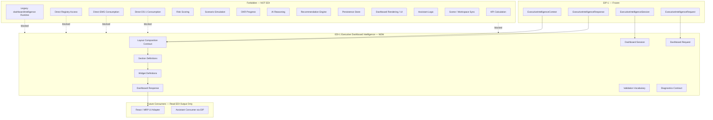
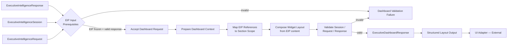
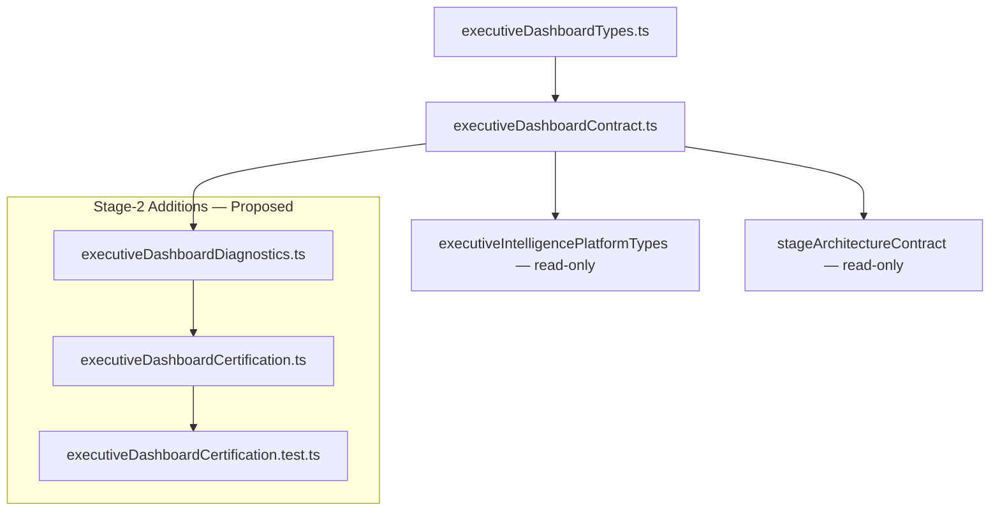
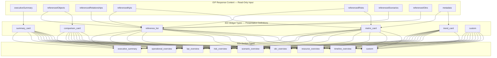
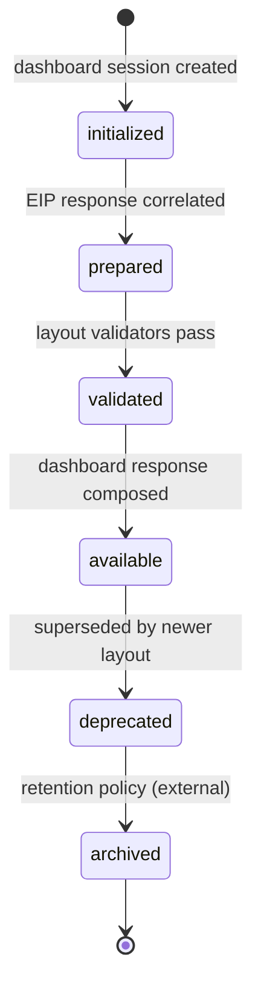

# EDI-1 — Executive Dashboard Intelligence
## Stage-1 Understanding Report

**Project:** Nexora Type-C  
**Phase:** PHASE-11 / Executive Dashboard Intelligence  
**Stage ID:** EDI-1  
**Title:** Executive Dashboard Intelligence  
**Stage:** Stage-1 — Understand  
**Status:** UNDERSTANDING COMPLETE — **READY FOR STAGE-2 BUILD**

**Tags (proposed):** `[EDI_EXECUTIVE_DASHBOARD]` `[DASHBOARD_INTELLIGENCE_DEFINED]` `[WORKSPACE_DASHBOARD_OWNED]` `[UI_ADAPTER_READY]`

---

## 0. Executive Summary

The **Executive Dashboard Intelligence (EDI)** layer is a **library-only presentation contract** that **consumes** the frozen **PHASE-10 EIP-1** `ExecutiveIntelligenceResponse` (and correlated session, request, and context artifacts) and **derives** structured **Dashboard Layout Definitions** — sections, widgets, metadata, and lifecycle vocabulary — for downstream **UI adapters** to render.

EDI is the **first presentation layer in PHASE-11**. It defines dashboard sessions, requests, responses, context, nine section categories, six widget types, validation vocabulary, diagnostics, and extension points — without KPI calculation, risk scoring, scenario simulation, OKR progress tracking, AI reasoning, recommendation generation, persistence, dashboard rendering, UI implementation, or assistant logic.

| Layer | Role | Relationship to EDI |
|-------|------|---------------------|
| **DS-1 Foundation (frozen)** | Approved business definitions | **Not consumed** — no direct access |
| **EMG Stack (frozen)** | Model generation + runtime | **Not consumed** — no direct access |
| **DS2–OKR-INT-1 (frozen)** | Executive integration stack | **Not consumed** — EIP is sole upstream |
| **EIP-1 (frozen)** | Intelligence orchestration | **Upstream input** — `ExecutiveIntelligenceResponse` read-only |
| **EDI (new)** | Dashboard presentation contract | Maps EIP output to section/widget layout |
| **UI / MRP (future)** | Visual rendering | Reads EDI output — EDI does not invoke them |

**Legacy note:** The certified **`dashboardIntelligence/` pipeline** (`singleIntelligenceSourceGateway`, `intelligenceContextContract`, `consumerDiagnosticsContract`, etc.) is a **parallel track** operating on workspace intelligence inputs. **PHASE-11 EDI-1** is a **new executive-model presentation stack** in `lib/executiveDashboard/` — it does not replace or modify legacy dashboard intelligence modules.

**STOP triggered:** **NO**  
**Frozen module modification required:** **NO**  
**Stage-2 Build:** **APPROVED** (additive `lib/executiveDashboard/` contract files only)

---

## 1. Dashboard Purpose

### What EDI is

| Attribute | Description |
|-----------|-------------|
| **Presentation vocabulary** | Defines how EIP intelligence responses become structured dashboard layout contracts |
| **EIP-only consumer** | Reads frozen EIP output — never registries, DS-1, or EMG |
| **Workspace-scoped** | Every dashboard session belongs to exactly one workspace |
| **Layout definition only** | Produces section and widget contracts — not pixels, components, or DOM |
| **Reference projection** | Projects EIP identity references into section-scoped widget slots |
| **UI-adapter-ready** | Normalized dashboard responses that React/MRP adapters consume externally |

### What EDI is NOT

| Excluded capability | Belongs to |
|---------------------|------------|
| Hex registry integration | DS2–OKR (frozen) |
| Intelligence orchestration | EIP-1 (frozen) |
| Executive model generation | EMG stack (frozen) |
| DS-1 foundation reads | Forbidden |
| EMG direct reads | Forbidden |
| Direct registry reads | Forbidden — EIP is sole input boundary |
| KPI calculation / value tracking | KPI Calculation Engine (forbidden) |
| Risk scoring / probability | Risk Scoring Engine (forbidden) |
| Scenario simulation / prediction | Scenario Simulation Engine (forbidden) |
| OKR progress / achievement | Progress Engine (forbidden) |
| AI reasoning / LLM inference | External AI runtime (forbidden) |
| Recommendation generation | Recommendation Engine (forbidden) |
| Dashboard rendering / UI components | MRP / React layer (forbidden) |
| Assistant logic | Assistant runtime (forbidden) |
| Business entity ownership | Frozen registries + EIP remain authoritative |
| Durable persistence | Future persistence layer (forbidden in EDI-1) |

### Distinction across the stack

| Concern | EIP-1 (frozen) | EDI |
|---------|----------------|-----|
| Primary artifact | `ExecutiveIntelligenceResponse` | `ExecutiveDashboardResponse` |
| Upstream input | DS2–OKR hex registries | **EIP response + session only** |
| Primary operation | Read-only orchestration + correlation | **Presentation layout composition** |
| Output | Intelligence summary + identity refs | Section/widget layout definitions |
| Summary semantics | `executiveSummary` — declarative correlation text | Section headlines + widget labels from EIP text |
| Calculations / AI | Excluded | **Excluded** |
| Rendering | Excluded | **Excluded** |

EDI **must not redefine** EIP shapes. It **projects** EIP response content into presentation layout slots.

---

## 2. Dashboard Architecture Diagram



---

## 3. Dashboard Flow Diagram



### Presentation stages (contract vocabulary — Stage-2)

| Stage | ID | Responsibility | Runtime in EDI-1 |
|-------|-----|----------------|------------------|
| **Accept** | `accept` | Verify EIP freeze + valid intelligence response + dashboard request shape | Validation only |
| **Prepare** | `prepare` | Build dashboard context from EIP session/response correlation | Context assembly only |
| **Map** | `map` | Assign EIP reference arrays to section scopes by `sectionType` | Identity projection only |
| **Compose** | `compose` | Assemble widget definitions from EIP summary text and references | Layout composition only |
| **Validate** | `validate` | Run session / request / response validators | Validation functions |
| **Respond** | `respond` | Produce dashboard session + response snapshot | Example builder only |

**No stage performs calculation, simulation, scoring, AI inference, persistence, rendering, or assistant logic.**

---

## 4. Dependency Map



| Module | Imports From | Class | Forbidden Targets |
|--------|--------------|-------|-------------------|
| `executiveDashboardTypes.ts` | — | internal | — |
| `executiveDashboardContract.ts` | types, EIP types (read-only), stage contract | internal + type-only | DS-1, EMG, DS2–OKR, engines, runtime, UI, legacy dashboardIntelligence |
| `executiveDashboardDiagnostics.ts` (Stage-2) | contract constants | internal | — |
| `executiveDashboardCertification.ts` (Stage-2) | contract, diagnostics, EIP cert | internal + external read-only | All product runtimes |

**Circular dependencies:** NONE (projected acyclic DAG)

### Input boundary (frozen design)

```
ExecutiveIntelligenceResponse
  + ExecutiveIntelligenceSession (correlation)
  + ExecutiveIntelligenceRequest (correlation)
  + ExecutiveIntelligenceContext (correlation)
  → composeExecutiveDashboardFromIntelligence()
  → ExecutiveDashboardSession + ExecutiveDashboardResponse
```

**Never consumed:**

| Module | Status |
|--------|--------|
| DS-1 Foundation | Forbidden |
| EMG Stack | Forbidden |
| DS2–OKR Registries | Forbidden — EIP is sole gateway |
| Legacy `dashboardIntelligence/` | Forbidden — boundary probes only |

---

## 5. Widget Diagram



### Widget type definitions (contract vocabulary)

| Widget | Purpose | EIP source fields | Computes values? |
|--------|---------|-------------------|:----------------:|
| `summary_card` | Headline + excerpt from intelligence summary | `executiveSummary` | **No** |
| `metric_card` | Declarative label + reference id slot | EIP metadata hints + reference id | **No** |
| `comparison_card` | Two reference groups side-by-side | Two EIP reference arrays | **No** |
| `trend_card` | Declarative trend label + reference id | EIP metadata hints | **No** — label only, no trend calculation |
| `reference_list` | Ordered identity reference list | EIP `referenced*` arrays | **No** |
| `custom` | Extension widget slot | `metadata.extension` | **No** |

**Widgets are layout slots, not rendered components.** UI adapters map widget contracts to visual elements externally.

---

## 6. Lifecycle Diagram



| State | Meaning |
|-------|---------|
| `initialized` | Dashboard session record created; EIP correlation pending |
| `prepared` | Dashboard context assembled from EIP session/response |
| `validated` | Session, request, and widget layout pass validation |
| `available` | Dashboard response ready for UI adapter consumption |
| `deprecated` | Superseded layout version; still readable |
| `archived` | Retained for audit; not active |

Lifecycle vocabulary mirrors EIP-1 for cross-layer consistency. EDI does not implement retention policies — states are contract labels only.

---

## 7. Dashboard Session Contract

| Field | Purpose |
|-------|---------|
| `dashboardSessionId` | Stable dashboard session identity |
| `workspaceId` | Owning workspace |
| `executiveModelId` | Parent executive model |
| `intelligenceSessionId` | Correlated EIP session |
| `intelligenceResponseId` | Correlated EIP response |
| `intelligenceRequestId` | Correlated EIP request |
| `sectionTypes` | Active section categories for this session |
| `widgetCount` | Total widget definitions composed |
| `layoutSummary` | Declarative summary of composed layout |
| `metadata` | Tags, hints, extension payload |
| `lifecycleState` | One of six lifecycle values |
| `createdAt` / `updatedAt` | Timestamps |
| `source` | `phase-11-executive-dashboard-intelligence` |

Supplementary: `contractVersion`.

---

## 8. Dashboard Request Contract

| Field | Purpose |
|-------|---------|
| `requestId` | Stable request identity |
| `dashboardSessionId` | Parent dashboard session |
| `workspaceId` | Workspace scope |
| `executiveModelId` | Model scope |
| `intelligenceResponseId` | Target EIP response to project |
| `requestedSections` | Section types to compose (subset of nine) |
| `requestedWidgetTypes` | Widget types allowed in composition |
| `metadata` | Tags, hints, extension payload |
| `lifecycleState` | One of six lifecycle values |
| `createdAt` / `updatedAt` | Timestamps |
| `source` | `phase-11-executive-dashboard-intelligence` |

### Section request mapping

| Section type | EIP reference source | Widget defaults |
|--------------|---------------------|-----------------|
| `executive_summary` | `executiveSummary` | `summary_card` |
| `operational_overview` | `referencedObjects`, `referencedRelationships` | `reference_list`, `summary_card` |
| `kpi_overview` | `referencedKpis` | `reference_list`, `metric_card` |
| `risk_overview` | `referencedRisks` | `reference_list`, `metric_card` |
| `scenario_overview` | `referencedScenarios` | `reference_list`, `summary_card` |
| `okr_overview` | `referencedOkrs` | `reference_list`, `comparison_card` |
| `resource_overview` | `referencedObjects` (resource role) | `reference_list` |
| `timeline_overview` | EIP timestamps + metadata hints | `trend_card`, `summary_card` |
| `custom` | `metadata.extension` | `custom` |

**Section mapping projects EIP references — it does not fetch registry records or compute values.**

---

## 9. Dashboard Response Contract

| Field | Purpose |
|-------|---------|
| `responseId` | Stable response identity |
| `requestId` | Parent request correlation |
| `dashboardSessionId` | Parent session correlation |
| `workspaceId` | Workspace scope |
| `executiveModelId` | Model scope |
| `intelligenceResponseId` | Source EIP response correlation |
| `sections` | Ordered array of section definitions |
| `metadata` | Tags, hints, extension payload |
| `lifecycleState` | One of six lifecycle values |
| `createdAt` / `updatedAt` | Timestamps |
| `source` | `phase-11-executive-dashboard-intelligence` |

### Section definition shape

| Field | Purpose |
|-------|---------|
| `sectionId` | Stable section identity |
| `sectionType` | One of nine section categories |
| `sectionTitle` | Declarative title derived from EIP summary/metadata |
| `widgets` | Ordered widget definitions for this section |
| `metadata` | Section-scoped tags and extension |

### Widget definition shape

| Field | Purpose |
|-------|---------|
| `widgetId` | Stable widget identity |
| `widgetType` | One of six widget types |
| `widgetTitle` | Declarative label |
| `contentSource` | EIP field reference (`executiveSummary`, `referencedKpis`, etc.) |
| `referenceIds` | Projected identity ids from EIP response |
| `displayHint` | Presentation hint for UI adapter (not rendering) |
| `metadata` | Widget-scoped extension |

**No computed metrics. No embedded registry objects. Identity references and declarative text only.**

---

## 10. Dashboard Context Contract

| Field | Purpose |
|-------|---------|
| `contextId` | Stable context identity |
| `dashboardSessionId` | Parent session correlation |
| `workspaceId` | Workspace scope |
| `executiveModelId` | Model scope |
| `intelligenceSessionId` | EIP session correlation |
| `intelligenceResponseId` | EIP response correlation |
| `activeSections` | Section types in current composition scope |
| `metadata` | Tags, hints, extension payload |
| `createdAt` / `updatedAt` | Timestamps |
| `source` | `phase-11-executive-dashboard-intelligence` |

Context captures the **presentation scope** for a dashboard session — not rendered output.

---

## 11. Dashboard Sections (Frozen Vocabulary)

```
executive_summary · operational_overview · kpi_overview · risk_overview ·
scenario_overview · okr_overview · resource_overview · timeline_overview · custom
```

| Count | Category |
|------:|----------|
| 9 | Section types |

---

## 12. Dashboard Widgets (Frozen Vocabulary)

```
summary_card · metric_card · comparison_card · trend_card · reference_list · custom
```

| Count | Category |
|------:|----------|
| 6 | Widget types |

---

## 13. Metadata Contract

| Field | Purpose |
|-------|---------|
| `tags` | Classification tags (e.g. `[EDI_EXECUTIVE_DASHBOARD]`) |
| `domainHint` | Domain scope hint for UI adapter |
| `executiveCategoryHint` | Executive category hint from EIP passthrough |
| `presentationHint` | Layout density / priority hint for UI adapter |
| `taxonomyOverride` | Optional taxonomy override |
| `extension.futureExtension` | Additive extension payload |

Metadata is **declarative** — EDI does not interpret hints as rendering instructions.

---

## 14. Workspace Ownership

### Authority chain

```
Workspace → Executive Model → EIP Orchestration (frozen) → EDI Presentation → UI Adapter (external)
```

| Principle | Implementation |
|-----------|----------------|
| Workspace exclusivity | All dashboard sessions scoped by `workspaceId` |
| EIP authority | EIP responses remain authoritative — EDI never owns intelligence content |
| Presentation-only | `mutationPolicy: read-only-presentation-snapshot` |
| Upstream correlation | `upstreamAuthority: phase-10-executive-intelligence-platform` |
| No registry access | All entity ids projected from EIP references only |

EDI **never mutates** workspace stores, scene state, EIP artifacts, or upstream registries.

---

## 15. Extension Points

| Extension | Location | Purpose |
|-----------|----------|---------|
| `metadata.extension.futureExtension` | Session, request, response, section, widget | Future layout profiles |
| `sectionType: custom` | Section contract | Custom section scopes |
| `widgetType: custom` | Widget contract | Custom widget slots |
| Presentation stage hooks | Stage-2 contract | Additional mapping stages without runtime |
| `displayHint` on widgets | Widget definition | UI adapter presentation hints |

All extensions are **additive contract fields** — no runtime behavior in Stage-1.

---

## 16. Diagnostics (Proposed — Stage-2)

| Event | Trigger |
|-------|---------|
| `DashboardSessionInitialized` | Dashboard session created |
| `ContextPrepared` | Dashboard context assembled from EIP |
| `RequestAccepted` | Dashboard request validated against EIP response |
| `LayoutComposed` | Section/widget layout assembled |
| `SessionValidated` | Full session validation passes |
| `CertificationStarted` | Certification probe begins |
| `CertificationPassed` / `CertificationFailed` | Certification outcome |

---

## 17. Validation (Proposed — Stage-2)

| Validator | Scope |
|-----------|-------|
| `validateExecutiveDashboardSession` | Mandatory session fields + EIP correlation ids |
| `validateExecutiveDashboardRequest` | Request shape + section/widget enum |
| `validateExecutiveDashboardResponse` | Response shape + section/widget arrays |
| `validateExecutiveDashboardContext` | Context shape + EIP correlation |
| `validateEipIntelligenceInputBoundary` | EIP response/session freeze + shape delegation |
| `validateWidgetReferenceProjection` | Widget `referenceIds` exist in source EIP response |
| `validateSectionTypeMapping` | Section types map to valid EIP reference sources |
| `validateDashboardNoRegistryAccess` | Forbidden import boundary probe |

---

## 18. MUST NOT OWN (Proposed)

| Exclusion | Rationale |
|-----------|-----------|
| `kpi_calculations` | KPI values belong to calculation engine |
| `risk_scoring` | Risk scores belong to scoring engine |
| `scenario_simulation` | Simulation belongs to scenario engine |
| `okr_progress` | Progress belongs to OKR progress engine |
| `recommendation_generation` | Recommendations belong to external engine |
| `ai_reasoning` | AI belongs to external runtime |
| `intelligence_orchestration` | Belongs to EIP (frozen) |
| `registry_access` | Registries accessed only via EIP |
| `ds1_direct_consumption` | Forbidden |
| `emg_direct_consumption` | Forbidden |
| `business_entity_ownership` | EIP + registries remain authoritative |
| `registry_duplication` | Identity references only |
| `registry_caching` | Session-local EIP correlation only |
| `persistence` | External store only |
| `dashboard_rendering` | UI adapter scope |
| `ui_implementation` | React/MRP scope |
| `assistant_logic` | Assistant runtime scope |
| `workspace_mutation` | Workspace frozen |
| `scene_sync` | Scene frozen |
| `legacy_dashboard_modules` | Parallel track blocked |

---

## 19. Risk Analysis

| Risk | Likelihood | Impact | Mitigation |
|------|:----------:|:------:|------------|
| EDI bypasses EIP and reads registries directly | Medium | Critical | EIP-only input boundary; forbidden DS2–OKR imports |
| EDI becomes KPI/risk calculation layer | Medium | Critical | MUST NOT OWN; metric_card = label slot only |
| EDI becomes AI/recommendation engine | Medium | Critical | No reasoning fields; forbidden AI patterns |
| Dashboard rendering creep into contract | Medium | Critical | Widget = definition only; UI adapter external |
| Registry embedding in widget content | Medium | High | Identity reference projection only |
| Legacy dashboardIntelligence collision | Low | Medium | Legacy modules in forbidden patterns |
| Cross-workspace layout leak | Low | High | Workspace guards on all artifacts |
| Trend card becomes trend calculation | Medium | High | Declarative label only; no time-series logic |
| Metric card displays computed KPI values | Medium | High | Reference id + hint only; no value fields |
| EIP mutation during layout composition | Medium | Critical | Read-only EIP consumption |
| Persistence creep into dashboard session | Medium | High | In-memory snapshot only |
| UI component imports into EDI | Medium | High | Forbidden `.tsx` paths in certification |

**No critical unmitigated risks.** Architecture viable without violating frozen layers.

---

## 20. Expected File List

### Stage-1 (complete)

| File | Status |
|------|--------|
| `executiveDashboardTypes.ts` | **DEFERRED** — design captured in this report; Stage-2 implementation |
| `executiveDashboardContract.ts` | **DEFERRED** — design captured in this report; Stage-2 implementation |
| `docs/executive-dashboard-understanding-report.md` | **CREATED** |

### Stage-2 (proposed)

| File | Responsibility |
|------|----------------|
| `executiveDashboardTypes.ts` | Session, request, response, context, section, widget, score types |
| `executiveDashboardContract.ts` | Manifest, validators, layout composition function, examples |
| `executiveDashboardDiagnostics.ts` | Lifecycle diagnostic events |
| `executiveDashboardCertification.ts` | Certification + layout probe runner |
| `executiveDashboardCertification.test.ts` | Architecture and EIP-boundary tests |
| `docs/executive-dashboard-build-report.md` | Build evidence report |

### Stage-3 (proposed)

| File | Responsibility |
|------|----------------|
| Analysis gates H1–H10 | Architecture health, EIP boundary, presentation integrity |
| Freeze tags | `[EDI_1_CERTIFIED]` `[EXECUTIVE_DASHBOARD_INTELLIGENCE_FROZEN]` `[PHASE11_EDI_COMPLETE]` |
| `docs/executive-dashboard-analysis-report.md` | Senior architecture review |
| `docs/executive-dashboard-freeze-report.md` | Freeze declaration |

**Frozen modules modified across all stages:** **0**

---

## 21. Certification Strategy

### Proposed gate groups (Stage-2 build)

| Group | Gates | Focus |
|-------|------:|-------|
| A | 6 | Version, 9 section types, 6 widget types, 6 lifecycle states, mandatory field counts |
| B | 3 | Manifest, allowlist, forbidden paths |
| C | 8 | EIP frozen, acyclic deps, no EMG/DS1/DS2–OKR, legacy dashboardIntelligence blocked |
| D | 4 | Session / request / response / context validation |
| E | 8 | EIP input boundary, layout composition probe, empty section scope |
| F | 8 | MUST NOT OWN, no calculation/AI/rendering, reference projection, legacy blocked |
| G | 4 | Diagnostics, minimum score, EIP correlation preservation, source lock |
| **Build total** | **41** | |

### Proposed analysis gates (Stage-3)

| Gate | Title |
|------|-------|
| H1 | Architecture Health |
| H2 | Dependency Integrity |
| H3 | EIP Boundary Integrity |
| H4 | Presentation Integrity |
| H5 | Request Integrity |
| H6 | Response Integrity |
| H7 | Widget Reference Projection Integrity |
| H8 | Workspace Isolation |
| H9 | No Business Entity Ownership |
| H10 | Future Compatibility |

### Proposed minimum score

`EXECUTIVE_DASHBOARD_MINIMUM_OVERALL_SCORE = 99`

### Proposed freeze tags (Stage-3)

```
[EDI_1_CERTIFIED]
[EXECUTIVE_DASHBOARD_INTELLIGENCE_FROZEN]
[PHASE11_EDI_COMPLETE]
```

### Test prerequisites (beforeEach)

1. `runDs1FoundationAnalysis()` (upstream chain for examples)
2. `runExecutiveModelRuntimeAnalysis()` (EMG chain)
3. `runExecutiveObjectIntegrationAnalysis()` through `runExecutiveOkrIntegrationAnalysis()` (DS2–OKR frozen)
4. `runExecutiveIntelligencePlatformAnalysis()` (EIP frozen — **required for EDI certification**)

---

## 22. STOP Rule Evaluation

| Trigger condition | Required? | Assessment |
|-------------------|:---------:|------------|
| Direct registry access | Would violate EIP gateway | **NOT REQUIRED** — EIP-only input |
| Business calculations | Would violate presentation-only rule | **NOT REQUIRED** — widget slots are declarative |
| AI reasoning | Would violate EIP/EDI boundary | **NOT REQUIRED** — no reasoning fields |
| Recommendation generation | Would violate MUST NOT OWN | **NOT REQUIRED** — layout only |
| UI implementation | Would violate library-only rule | **NOT REQUIRED** — UI adapter external |
| Persistence | Would violate in-memory contract | **NOT REQUIRED** — snapshot only |

**STOP triggered:** **NO**

No architectural conflict discovered. Design proceeds without frozen module modification.

---

## 23. Stage Readiness Report

### Verification checklist

| Requirement | Result | Evidence |
|-------------|--------|----------|
| Workspace-aware | PASS | All artifacts scoped by `workspaceId` |
| Library-only | PASS | No runtime, rendering, or UI in scope |
| Presentation-only | PASS | Section/widget definitions; no calculations |
| EIP-dependent | PASS | Sole upstream input is EIP response |
| UI-independent | PASS | UI adapter consumes EDI output externally |
| Persistence-independent | PASS | In-memory layout snapshot only |
| Frozen modules unmodified | PASS | Design is additive only |
| No direct registry access | PASS | EIP gateway enforced |
| No AI / calculation / rendering | PASS | MUST NOT OWN documented |

### Readiness verdict

| Stage | Status |
|-------|--------|
| Stage-1 Understand | **COMPLETE** |
| Stage-2 Build | **APPROVED** |
| Stage-3 Analyze + Freeze | Pending Stage-2 |

### Architecture verdict

**EDI-1 Stage-1 Understanding: COMPLETE — READY FOR STAGE-2 BUILD**

The Executive Dashboard Intelligence layer is designed as a **presentation contract** that consumes frozen EIP output and produces section/widget layout definitions for external UI adapters. It never owns business logic, executive intelligence, registry data, calculations, AI reasoning, rendering, or persistence.

**Overall design quality:** Architecture aligns with Nexora frozen-layer conventions. EIP gateway is the sole input boundary. No STOP conditions triggered.
