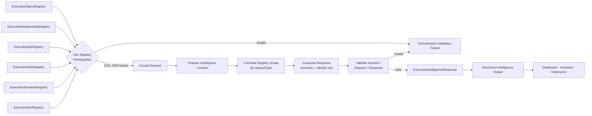
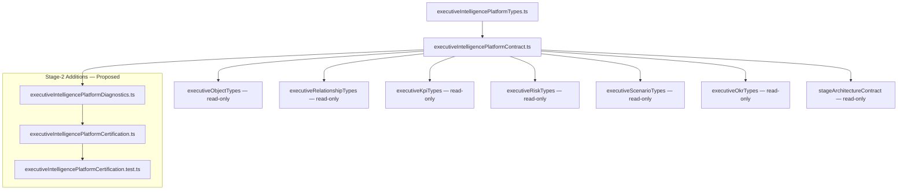
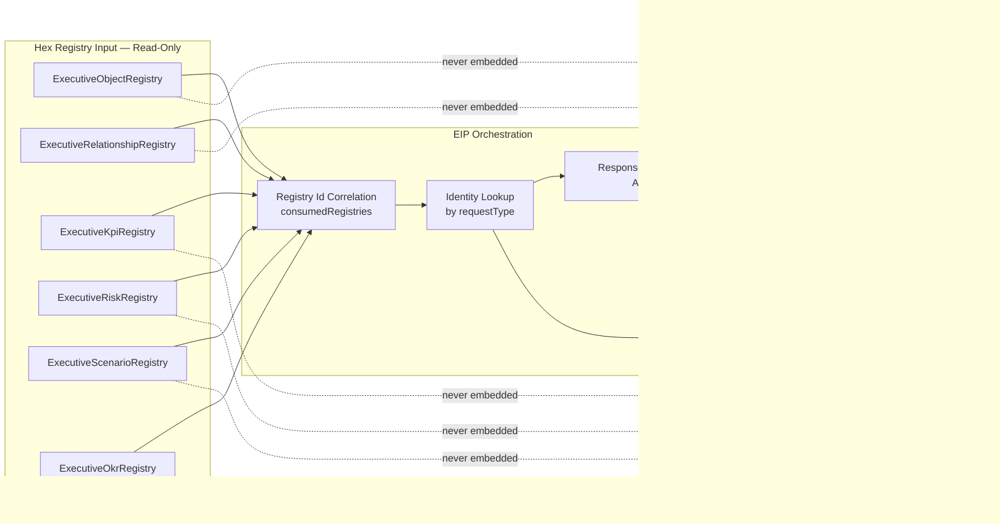
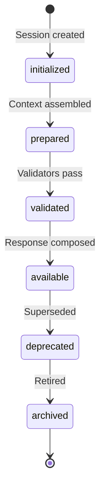

# EIP-1 — Executive Intelligence Platform
## Stage-1 Understanding Report

**Project:** Nexora Type-C  
**Phase:** PHASE-10 / Executive Intelligence Platform  
**Stage ID:** EIP-1  
**Title:** Executive Intelligence Platform  
**Stage:** Stage-1 — Understand  
**Status:** UNDERSTANDING COMPLETE — **READY FOR STAGE-2 BUILD**

**Tags (proposed):** `[EIP_EXECUTIVE_INTELLIGENCE_PLATFORM]` `[INTELLIGENCE_PLATFORM_DEFINED]` `[WORKSPACE_INTELLIGENCE_OWNED]` `[DASHBOARD_CONSUMER_READY]`

---

## 0. Executive Summary

The **Executive Intelligence Platform (EIP)** is a **library-only read-only orchestration layer** that **consumes** the complete frozen **Executive Semantic Platform** — **DS2-INT-1** `ExecutiveObjectRegistry`, **DS3-INT-1** `ExecutiveRelationshipRegistry`, **DS4-INT-1** `ExecutiveKpiRegistry`, **DS5-INT-1** `ExecutiveRiskRegistry`, **DS6-INT-1** `ExecutiveScenarioRegistry`, and **OKR-INT-1** `ExecutiveOkrRegistry` — and **produces** structured **Executive Intelligence Responses** for downstream **Dashboard**, **Assistant**, and future domain consumers.

EIP is the **first orchestration layer in PHASE-10**. It defines intelligence sessions, requests, responses, context, lifecycle, registry consumption, validation vocabulary, diagnostics, and extension points — without KPI calculation, risk scoring, scenario simulation, OKR progress tracking, AI reasoning, recommendation generation, forecasting, persistence, dashboard rendering, or assistant logic.

| Layer | Role | Relationship to EIP |
|-------|------|---------------------|
| **DS-1 Foundation (frozen)** | Approved business definitions | **Not consumed** — no direct access |
| **EMG Stack (frozen)** | Model generation + runtime | **Not consumed** — no direct access |
| **DS2–DS6 + OKR-INT-1 (frozen)** | Executive integration stack | **Upstream input** — hex registries read-only |
| **EIP (new)** | Intelligence orchestration contract | Correlates registry metadata into intelligence responses |
| **Dashboard / Assistant (future)** | Presentation consumers | Read EIP output — EIP does not invoke them |

**Legacy note:** The certified **INT-5 legacy pipeline** (`executiveIntelligencePlatformCertificationRunner`, end-to-end scenarios, regression suite, architecture freeze) is a **parallel track** operating on workspace intelligence inputs. **PHASE-10 EIP-1** is a **new executive-model orchestration stack** in `lib/executiveIntelligencePlatform/executiveIntelligencePlatformTypes.ts` and `executiveIntelligencePlatformContract.ts` — it does not replace or modify legacy INT-5 modules.

**STOP triggered:** **NO**  
**Frozen module modification required:** **NO**  
**Stage-2 Build:** **APPROVED** (additive contract files only)

---

## 1. Executive Intelligence Platform Purpose

### What EIP is

| Attribute | Description |
|-----------|-------------|
| **Orchestration vocabulary** | Defines how hex-registry snapshots become structured intelligence responses |
| **Read-only consumer** | Reads frozen registries — never duplicates, mutates, embeds, or replaces them |
| **Workspace-scoped** | Every intelligence session belongs to exactly one workspace |
| **Hex-registry-dependent** | Reads DS2 + DS3 + DS4 + DS5 + DS6 + OKR registries only |
| **Definition-only output** | Produces session, request, response, and context contracts — not computed scores or AI advice |
| **Correlation layer** | Assembles declarative `executiveSummary` text and identity references from registry metadata |
| **Consumer-ready** | Normalized intelligence responses that Dashboard and Assistant adapters consume |

### What EIP is NOT

| Excluded capability | Belongs to |
|---------------------|------------|
| Object / relationship / KPI / risk / scenario / OKR integration | DS2–OKR (frozen) |
| Executive model generation | EMG stack (frozen) |
| DS-1 foundation reads | Forbidden |
| EMG direct reads | Forbidden |
| KPI calculation / value tracking | KPI Calculation Engine (forbidden) |
| Risk scoring / probability | Risk Scoring Engine (forbidden) |
| Scenario simulation / prediction | Scenario Simulation Engine (forbidden) |
| OKR progress / achievement | Progress Engine (forbidden) |
| AI reasoning / LLM inference | External AI runtime (forbidden) |
| Recommendation generation | Recommendation Engine (forbidden) |
| Strategy optimization / forecasting | Strategy Engine (forbidden) |
| Dashboard rendering | Dashboard (forbidden) |
| Assistant logic | Assistant runtime (forbidden) |
| Business entity ownership | Frozen registries remain authoritative |
| Durable persistence | Future persistence layer (forbidden in EIP-1) |

### Distinction across the stack

| Concern | OKR-INT-1 (EOIKR) | EIP |
|---------|-------------------|-----|
| Primary artifact | `ExecutiveOkrRegistry` | `ExecutiveIntelligenceSession` + `ExecutiveIntelligenceResponse` |
| Upstream input | DS2–DS6 registries | DS2–DS6 + **OKR** registries |
| Primary operation | Declarative extraction + normalization | **Read-only orchestration + correlation** |
| Output | Objective + Key Result definitions | Intelligence response with registry references |
| Summary semantics | `targetDescription` on key results | `executiveSummary` — declarative correlation text |
| Progress / AI | Excluded | **Excluded** |

EIP **must not redefine** DS2–OKR shapes. It **orchestrates read-only correlation** across frozen registry snapshots.

---

## 2. Executive Intelligence Architecture Diagram

```mermaid
flowchart TB
  subgraph forbidden [Forbidden — NOT EIP]
    CALC[KPI Calculation]
    SCORE[Risk Scoring]
    SIM[Scenario Simulation]
    PROG[OKR Progress]
    AI[AI Reasoning]
    REC[Recommendation Engine]
    FCST[Forecasting]
    PERSIST[Persistence Store]
    DASH[Dashboard Rendering]
    ASST[Assistant Logic]
    SCENE[Scene / Workspace Sync]
    DS1[Direct DS-1 Consumption]
    EMG[Direct EMG Consumption]
    LEGACY[Legacy INT-5 Runtime]
  end

  subgraph downstream [Future Consumers — Read EIP Output Only]
    DASHC[Dashboard Consumer]
    ASSTC[Assistant Consumer]
    EXT[External AI Adapter]
  end

  subgraph eip [EIP-1 Executive Intelligence Platform — NEW]
    ORCH[Orchestration Contract]
    CTX[Intelligence Context]
    REQ[Request Contract]
    RES[Response Contract]
    VAL[Validation Vocabulary]
    DIAG[Diagnostics Contract]
  end

  subgraph okr [OKR-INT-1 — Frozen]
    OKREG[ExecutiveOkrRegistry]
  end

  subgraph ds6 [DS6-INT-1 — Frozen]
    SREG[ExecutiveScenarioRegistry]
  end

  subgraph ds5 [DS5-INT-1 — Frozen]
    XREG[ExecutiveRiskRegistry]
  end

  subgraph ds4 [DS4-INT-1 — Frozen]
    KREG[ExecutiveKpiRegistry]
  end

  subgraph ds3 [DS3-INT-1 — Frozen]
    RREG[ExecutiveRelationshipRegistry]
  end

  subgraph ds2 [DS2-INT-1 — Frozen]
    OREG[ExecutiveObjectRegistry]
  end

  OREG --> ORCH
  RREG --> ORCH
  KREG --> ORCH
  XREG --> ORCH
  SREG --> ORCH
  OKREG --> ORCH
  ORCH --> CTX --> REQ --> RES
  RES --> DASHC & ASSTC
  EXT -.->|external only| RES

  forbidden -.->|blocked| eip
  DS1 -.->|blocked| eip
  EMG -.->|blocked| eip
  LEGACY -.->|blocked| eip
```



---

## 3. Platform Flow Diagram



### Orchestration stages (contract vocabulary — Stage-2)

| Stage | ID | Responsibility | Runtime in EIP-1 |
|-------|-----|----------------|------------------|
| **Accept** | `accept` | Verify DS2–OKR freeze + valid hex registries + request shape | Validation only |
| **Prepare** | `prepare` | Build intelligence context from consumed registry ids | Context assembly only |
| **Correlate** | `correlate` | Map `requestType` to registry lookup scope | Identity lookup only |
| **Compose** | `compose` | Assemble `executiveSummary` + reference arrays from registry metadata | Declarative correlation only |
| **Validate** | `validate` | Run session / request / response validators | Validation functions |
| **Respond** | `respond` | Produce intelligence session + response snapshot | Example builder only |

**No stage performs calculation, simulation, scoring, AI inference, persistence, or dashboard/assistant logic.**

---

## 4. Dependency Map



| Module | Imports From | Class | Forbidden Targets |
|--------|--------------|-------|-------------------|
| `executiveIntelligencePlatformTypes.ts` | — | internal | — |
| `executiveIntelligencePlatformContract.ts` | types, stage contract | internal + type-only | DS-1, EMG, engines, runtime, UI, legacy INT-5 |
| `executiveIntelligencePlatformDiagnostics.ts` (Stage-2) | contract constants | internal | — |
| `executiveIntelligencePlatformCertification.ts` (Stage-2) | contract, diagnostics, DS2–OKR cert | internal + external read-only | All product runtimes |

**Circular dependencies:** NONE (projected acyclic DAG)

---

## 5. Registry Consumption Diagram



### Registry consumption rules

| Rule | Enforcement |
|------|-------------|
| Read-only access | Hex registries passed as input; no mutation functions |
| Identity references only | Response carries `{ id, referenceRole }` tuples — not full records |
| No duplication | EIP never copies registry arrays into its own authoritative store |
| No embedding | Response never embeds upstream registry payloads |
| No replacement | Frozen registries remain source of truth |
| Registry id correlation | `consumedRegistries` stores six registry ids for traceability |

```typescript
ExecutiveIntelligenceConsumedRegistries = Readonly<{
  objectRegistryId: string;
  relationshipRegistryId: string;
  kpiRegistryId: string;
  riskRegistryId: string;
  scenarioRegistryId: string;
  okrRegistryId: string;
}>;
```

---

## 6. Intelligence Lifecycle Diagram



| State | Meaning |
|-------|---------|
| `initialized` | Intelligence session record created with request metadata |
| `prepared` | Intelligence context assembled from consumed registry ids |
| `validated` | Session, request, and response pass contract validators |
| `available` | Intelligence response ready for downstream consumers |
| `deprecated` | Session superseded by newer intelligence run |
| `archived` | Session retired from active consumption |

**No execution semantics.** Lifecycle states are contract vocabulary only.

---

## 7. Intelligence Session Contract

Every **Executive Intelligence Session** includes eleven mandatory fields:

| Field | Purpose |
|-------|---------|
| `intelligenceSessionId` | Stable session identity |
| `workspaceId` | Owning workspace |
| `executiveModelId` | Parent executive model |
| `requestId` | Correlated request identity |
| `requestType` | One of six request categories |
| `consumedRegistries` | Hex registry id correlation |
| `responseSummary` | Declarative summary of composed response |
| `metadata` | Tags, hints, extension payload |
| `lifecycleState` | One of six lifecycle values |
| `createdAt` | Session record creation |
| `updatedAt` | Last session update |

Supplementary: `contractVersion`, `source`.

---

## 8. Intelligence Request Contract

Six request categories — **taxonomy only**, no reasoning engine:

```
summary · explanation · comparison · recommendation_context · executive_overview · custom
```

| Request Type | Orchestration Scope (declarative) |
|--------------|-----------------------------------|
| `summary` | Correlate primary entities across registries into concise summary |
| `explanation` | Correlate entity metadata into descriptive narrative |
| `comparison` | Correlate two or more registry entities by identity |
| `recommendation_context` | Assemble contextual reference set — **not** generated advice |
| `executive_overview` | Correlate workspace-wide registry scope into overview |
| `custom` | Extension hook for future request profiles |

**`recommendation_context` produces contextual references only.** It does not generate recommendations.

---

## 9. Intelligence Response Contract

Every **Executive Intelligence Response** includes mandatory reference arrays:

| Field | Purpose |
|-------|---------|
| `responseId` | Stable response identity |
| `requestId` | Parent request correlation |
| `executiveSummary` | Declarative correlation text from registry metadata |
| `referencedObjects` | Identity references to DS2 objects |
| `referencedRelationships` | Identity references to DS3 relationships |
| `referencedKpis` | Identity references to DS4 KPIs |
| `referencedRisks` | Identity references to DS5 risks |
| `referencedScenarios` | Identity references to DS6 scenarios |
| `referencedOkrs` | Identity references to OKR objectives/key results |
| `metadata` | Tags, hints, extension payload |

**No generated advice. No AI output. No calculations.**

`executiveSummary` is assembled from registry `displayName`, category, and declarative fields — orchestration correlation, not inference.

---

## 10. Intelligence Context Contract

| Field | Purpose |
|-------|---------|
| `contextId` | Stable context identity |
| `intelligenceSessionId` | Parent session correlation |
| `workspaceId` | Workspace scope |
| `executiveModelId` | Model scope |
| `consumedRegistries` | Hex registry id correlation |
| `requestType` | Active request category |
| `metadata` | Tags, hints, extension payload |
| `createdAt` / `updatedAt` | Timestamps |

Context captures the **orchestration scope** for a session — not computed intelligence.

---

## 11. Workspace Ownership

### Authority chain

```
Workspace → Executive Model → Hex Registries (frozen) → EIP Orchestration → Intelligence Response
```

| Principle | Implementation |
|-----------|----------------|
| Workspace exclusivity | All sessions scoped by `workspaceId` |
| Registry authority | DS2–OKR registries remain authoritative — EIP never owns business entities |
| Read-only orchestration | `mutationPolicy: read-only-orchestration-snapshot` |
| Upstream correlation | `upstreamAuthority: phase-9-executive-okr-integration` |

EIP **never mutates** workspace stores, scene state, or upstream registries.

---

## 12. Extension Points

| Extension | Location | Purpose |
|-----------|----------|---------|
| `metadata.extension.futureExtension` | Session, request, response, context | Future orchestration profiles |
| `requestType: custom` | Request contract | Custom correlation scopes |
| `referenceRole: custom` | All reference arrays | Custom reference semantics |
| Orchestration stage hooks | Stage-2 contract | Additional correlation stages without runtime |

All extensions are **additive contract fields** — no runtime behavior in Stage-1.

---

## 13. Diagnostics (Proposed — Stage-2)

| Event | Trigger |
|-------|---------|
| `SessionInitialized` | Intelligence session created |
| `ContextPrepared` | Intelligence context assembled |
| `RequestAccepted` | Request validated against hex registries |
| `ResponseComposed` | Response references and summary assembled |
| `SessionValidated` | Full session validation passes |
| `CertificationStarted` | Certification probe begins |
| `CertificationPassed` / `CertificationFailed` | Certification outcome |

---

## 14. Validation (Proposed — Stage-2)

| Validator | Scope |
|-----------|-------|
| `validateExecutiveIntelligenceSession` | Eleven mandatory session fields |
| `validateExecutiveIntelligenceRequest` | Request shape + requestType enum |
| `validateExecutiveIntelligenceResponse` | Response shape + reference arrays |
| `validateExecutiveIntelligenceContext` | Context shape + registry correlation |
| `validateHexRegistryIntegrationInput` | DS2–OKR registry input delegation |
| `validateResponseObjectReferences` | Object ids exist in object registry |
| `validateResponseRelationshipReferences` | Relationship ids exist in relationship registry |
| `validateResponseKpiReferences` | KPI ids exist in KPI registry |
| `validateResponseRiskReferences` | Risk ids exist in risk registry |
| `validateResponseScenarioReferences` | Scenario ids exist in scenario registry |
| `validateResponseOkrReferences` | OKR ids exist in OKR registry |

---

## 15. Future Consumers

| Consumer | Relationship |
|----------|--------------|
| **Dashboard** | Reads `ExecutiveIntelligenceResponse`; renders summary and references — no imports into EIP |
| **Assistant** | Consumes intelligence responses externally — no imports into EIP |
| **External AI Adapter** | May consume response references as context — EIP does not invoke AI |
| **Progress Engine** | Reads OKR/KPI registries directly — EIP does not calculate progress |
| **Strategy Optimizer** | Reads objectives externally — EIP does not optimize |

EIP provides **orchestrated intelligence structure**. Domain engines provide **computed outcomes** externally.

---

## 16. Risk Analysis

| Risk | Likelihood | Impact | Mitigation |
|------|:----------:|:------:|------------|
| EIP becomes AI reasoning engine | Medium | Critical | MUST NOT OWN + forbidden AI patterns; no LLM imports |
| EIP becomes recommendation generator | Medium | Critical | `recommendation_context` = references only; no advice fields |
| Direct DS-1/EMG consumption bypasses registries | Medium | Critical | Hex-registry-only input boundary |
| Registry duplication as source of truth | Medium | Critical | Identity references only; no embedding rule |
| Registry mutation during orchestration | Medium | Critical | Read-only consumption; workspace_mutation excluded |
| KPI calculation creep | Medium | Critical | MUST NOT OWN; calculation engines external |
| Progress tracking creep | Medium | Critical | `okr_progress` excluded |
| Scenario simulation creep | Medium | Critical | `scenario_simulation` excluded |
| Dashboard coupling | Medium | High | Forbidden dashboard paths; consumer-only pattern |
| Assistant coupling | Medium | High | Forbidden assistant paths |
| Legacy INT-5 collision | Low | Medium | Legacy modules in forbidden patterns |
| Cross-workspace intelligence leak | Low | High | Workspace guards on all artifacts |
| `executiveSummary` becomes AI output | Medium | High | Declarative correlation from registry metadata only |

**No critical unmitigated risks.** Architecture viable without violating frozen layers.

---

## 17. Expected File List

### Stage-1 (complete)

| File | Status |
|------|--------|
| `executiveIntelligencePlatformTypes.ts` | **CREATED** |
| `executiveIntelligencePlatformContract.ts` | **CREATED** |
| `docs/executive-intelligence-platform-understanding-report.md` | **CREATED** |

### Stage-2 (proposed)

| File | Responsibility |
|------|----------------|
| `executiveIntelligencePlatformDiagnostics.ts` | Lifecycle diagnostic events |
| `executiveIntelligencePlatformCertification.ts` | Certification + orchestration probe runner |
| `executiveIntelligencePlatformCertification.test.ts` | Architecture and integration tests |
| `docs/executive-intelligence-platform-build-report.md` | Build evidence report |

### Stage-3 (proposed)

| File | Responsibility |
|------|----------------|
| Analysis gates H1–H9 | Architecture health, dependency, registry boundary, session integrity |
| Freeze tags | `[EIP_1_CERTIFIED]` `[EXECUTIVE_INTELLIGENCE_PLATFORM_FROZEN]` `[PHASE10_EIP_COMPLETE]` |
| `docs/executive-intelligence-platform-analysis-report.md` | Senior architecture review |
| `docs/executive-intelligence-platform-freeze-report.md` | Freeze declaration |

**Frozen modules modified across all stages:** **0**

---

## 18. Certification Strategy

### Proposed gate groups (Stage-2 build)

| Group | Gates | Focus |
|-------|------:|-------|
| A | 5 | Version, 6 request types, 6 lifecycle states, mandatory field counts |
| B | 3 | Manifest, allowlist, forbidden paths |
| C | 9 | DS2–OKR frozen, acyclic deps, no EMG/DS1, legacy INT-5 blocked |
| D | 5 | Session / request / response validation |
| E | 8 | Hex registry input boundary, orchestration probe, empty scope |
| F | 8 | MUST NOT OWN, no calculation/AI, reference integrity, legacy blocked |
| G | 4 | Diagnostics, minimum score, reference preservation, read-only rule |
| **Build total** | **42** | |

### Proposed analysis gates (Stage-3)

| Gate | Title |
|------|-------|
| H1 | Architecture Health |
| H2 | Dependency Integrity |
| H3 | Registry Boundary Integrity |
| H4 | Session Integrity |
| H5 | Response Integrity |
| H6 | Identity Reference Integrity |
| H7 | Workspace Isolation |
| H8 | Empty Scope Validation |
| H9 | Future Compatibility |

### Proposed minimum score

`EXECUTIVE_INTELLIGENCE_PLATFORM_MINIMUM_OVERALL_SCORE = 99`

### Proposed freeze tags (Stage-3)

```
[EIP_1_CERTIFIED]
[EXECUTIVE_INTELLIGENCE_PLATFORM_FROZEN]
[PHASE10_EIP_COMPLETE]
```

### Test prerequisites (beforeEach)

1. `runDs1FoundationAnalysis()` (DS1 chain for upstream examples)
2. `runExecutiveModelRuntimeAnalysis()` (EMG chain)
3. `runExecutiveObjectIntegrationAnalysis()` through `runExecutiveOkrIntegrationAnalysis()` (DS2–OKR frozen)

---

## 19. STOP Rule Evaluation

| STOP condition | Triggered? | Notes |
|----------------|:----------:|-------|
| AI reasoning required | **NO** | Response contract is declarative correlation only |
| Recommendation generation required | **NO** | `recommendation_context` = reference assembly only |
| KPI calculation required | **NO** | Calculation engines external |
| Risk scoring required | **NO** | Scoring engines external |
| Scenario simulation required | **NO** | Simulation engines external |
| Dashboard coupling required | **NO** | Read-only consumer pattern |
| Assistant coupling required | **NO** | Read-only consumer pattern |
| Persistence required | **NO** | Deferred to future layer |
| Direct DS-1 consumption required | **NO** | Hex-registry input boundary |
| Direct EMG consumption required | **NO** | Hex-registry input boundary |

**No STOP conditions triggered.** Architecture is viable without violating frozen layers.

---

## 20. Verification Checklist

| Requirement | Design compliance |
|-------------|-------------------|
| Workspace-aware | PASS — workspaceId on session, request, response, context |
| Library-only | PASS — no runtime engines, no UI |
| Registry-consumer only | PASS — hex registries read-only; no duplication |
| Intelligence-definition only | PASS — no AI, calculation, or scoring |
| Dashboard-independent | PASS — forbidden path probes |
| Assistant-independent | PASS — forbidden path probes |
| Persistence-independent | PASS — orchestration snapshot contract |
| No DS-1 direct consumption | PASS — forbidden |
| No EMG direct consumption | PASS — forbidden |
| No frozen module modification | PASS — additive module only |
| Objectives strategy-only (upstream) | PASS — EIP reads OKR; does not redefine |
| Reference-by-id only | PASS — no embedding or duplication |
| Business entity authority preserved | PASS — registries remain authoritative |

---

## 21. Stage Readiness Report

| Criterion | Status |
|-----------|--------|
| Platform architecture purpose defined | **COMPLETE** |
| Intelligence session model defined | **COMPLETE** |
| Intelligence request model defined | **COMPLETE** |
| Intelligence response model defined | **COMPLETE** |
| Intelligence context model defined | **COMPLETE** |
| Platform lifecycle defined (6 states) | **COMPLETE** |
| Request categories defined (6 types) | **COMPLETE** |
| Registry consumption model defined | **COMPLETE** |
| Orchestration model defined (6 stages) | **COMPLETE** |
| Metadata contract defined | **COMPLETE** |
| Extension points defined | **COMPLETE** |
| MUST NOT OWN documented (58 exclusions) | **COMPLETE** |
| Forbidden patterns documented | **COMPLETE** |
| Dependency map complete | **COMPLETE** |
| Risk analysis complete | **COMPLETE** |
| Certification strategy proposed | **COMPLETE** |
| Stage-1 types file created | **COMPLETE** |
| Stage-1 contract vocabulary created | **COMPLETE** |
| Frozen modules modified | **0** |
| STOP conditions | **NONE** |

### Verdict

**EIP-1 Stage-1 Understanding: COMPLETE**

The Executive Intelligence Platform architecture is **understood, documented, and ready for Stage-2 build**. All design artifacts respect frozen DS2–OKR, EMG, DS-1, Scene, Workspace, Dashboard, Assistant, Executive Gateway, Time Context, and legacy INT-5 boundaries.

**Next stage:** EIP-1 Stage-2 Build — implement orchestration contract, validators, diagnostics, certification, and tests in allowed files only.

---

## 22. Entry Points (Stage-2 Preview)

```typescript
// Stage-2 proposed — not implemented in Stage-1
import { orchestrateExecutiveIntelligenceFromRegistries } from "./executiveIntelligencePlatformContract.ts";

orchestrateExecutiveIntelligenceFromRegistries({
  objectRegistry,
  relationshipRegistry,
  kpiRegistry,
  riskRegistry,
  scenarioRegistry,
  okrRegistry,
  requestType: "executive_overview",
  intelligenceSessionId: "eip-session-example-001",
});
```

Stage-1 delivers **types and contract vocabulary only**. No orchestration runtime.
