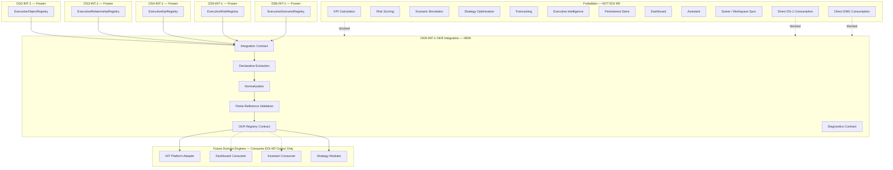
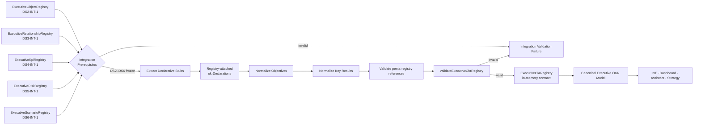
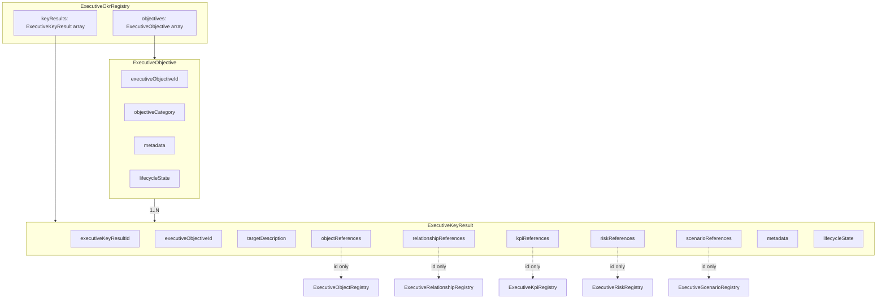
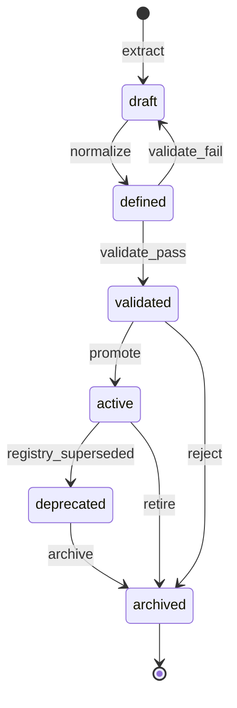
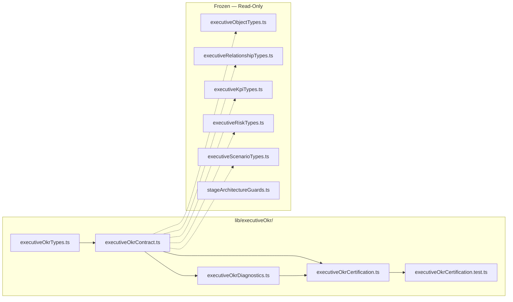

# OKR-INT-1 — Executive OKR Integration
## Stage-1 Understanding Report

**Project:** Nexora Type-C  
**Phase:** PHASE-9 / OKR Integration  
**Stage ID:** OKR-INT-1  
**Title:** Executive OKR Integration  
**Stage:** Stage-1 — Understand  
**Status:** UNDERSTANDING COMPLETE — **READY FOR STAGE-2 BUILD**

**Tags (proposed):** `[OKR_INT_EXECUTIVE_OKR]` `[OKR_INTEGRATION_DEFINED]` `[WORKSPACE_OKR_OWNED]` `[INT_PLATFORM_READY]`

---

## 0. Executive Summary

The **Executive OKR Integration (EOI-KR)** layer is a **library-only integration contract** that **consumes** the frozen **DS2-INT-1** `ExecutiveObjectRegistry`, **DS3-INT-1** `ExecutiveRelationshipRegistry`, **DS4-INT-1** `ExecutiveKpiRegistry`, **DS5-INT-1** `ExecutiveRiskRegistry`, and **DS6-INT-1** `ExecutiveScenarioRegistry`, and **derives** the **Canonical Executive OKR Model** — the normalized objective and key-result vocabulary downstream **Executive Intelligence Platform**, **Dashboard**, **Assistant**, and **Strategy** adapters use to anchor OKR definitions against the full executive integration stack.

EOI-KR is the **first integration layer in PHASE-9**. It transforms **declarative OKR stubs** attached to registry object metadata into workspace-scoped **Executive Objective** and **Executive Key Result** records with stable identity, classification, penta-registry references on key results, declarative target descriptions, lifecycle, and metadata — without KPI calculation, risk scoring, scenario simulation, strategy optimization, forecasting, AI reasoning, persistence, dashboard rendering, or assistant logic.

| Layer | Role | Relationship to EOI-KR |
|-------|------|------------------------|
| **DS-1 Foundation (frozen)** | Approved business definitions | **Not consumed** — no direct access |
| **EMG Stack (frozen)** | Model generation + runtime | **Not consumed** — no direct access |
| **DS2-INT-1 (frozen)** | Object integration | **Upstream input** — `ExecutiveObjectRegistry` |
| **DS3-INT-1 (frozen)** | Relationship integration | **Upstream input** — `ExecutiveRelationshipRegistry` |
| **DS4-INT-1 (frozen)** | KPI integration | **Upstream input** — `ExecutiveKpiRegistry` |
| **DS5-INT-1 (frozen)** | Risk integration | **Upstream input** — `ExecutiveRiskRegistry` |
| **DS6-INT-1 (frozen)** | Scenario integration | **Upstream input** — `ExecutiveScenarioRegistry` |
| **EOI-KR (new)** | OKR integration contract | Derives canonical Executive OKRs |
| **Domain engines (future)** | INT / Dashboard / Strategy | Consume EOI-KR output — EOI-KR does not invoke them |

**Legacy note:** The certified **`okr/` workspace pipeline** (`workspaceOkrContract`, `workspaceOkrProgressEngine`, `okrDashboardIntegrationRuntime`, etc.) is a **parallel track** operating on workspace intelligence inputs. **PHASE-9 OKR-INT** is a **new executive-model integration stack** in `lib/executiveOkr/` — it does not replace or modify legacy OKR modules.

**STOP triggered:** **NO**  
**Frozen module modification required:** **NO**  
**Stage-2 Build:** **APPROVED** (additive `lib/executiveOkr/` contract files only)

---

## 1. Executive OKR Integration Purpose

### What EOI-KR is

| Attribute | Description |
|-----------|-------------|
| **Integration vocabulary** | Defines how penta-registry snapshots become canonical Executive Objectives and Key Results |
| **Definition-only output** | Produces structured OKR records — not progress scores, KPI values, or simulations |
| **Workspace-scoped** | Every Objective and Key Result belongs to exactly one workspace |
| **Penta-registry-dependent** | Reads DS2 + DS3 + DS4 + DS5 + DS6 registries only — never DS-1 or EMG directly |
| **Declarative extraction** | Collects pre-declared OKR stubs — no inference or progress calculation |
| **Registry contract** | Declares in-memory OKR registry shape — no persistence in Stage-2 scope |
| **Engine-ready** | Normalized OKRs that INT / Dashboard / Assistant / Strategy adapters consume |

### What EOI-KR is NOT

| Excluded capability | Belongs to |
|---------------------|------------|
| Object / relationship / KPI / risk / scenario integration | DS2–DS6 (frozen) |
| Executive model generation | EMG stack (frozen) |
| DS-1 foundation reads | Forbidden |
| EMG direct reads | Forbidden |
| KPI calculation / value tracking | KPI Calculation Engine (forbidden) |
| Risk scoring / probability | Risk Scoring Engine (forbidden) |
| Scenario simulation / prediction | Scenario Simulation Engine (forbidden) |
| Strategy optimization / forecasting | Strategy Engine (forbidden) |
| AI reasoning / recommendations | INT-5 platform (forbidden) |
| Dashboard rendering | MRP / Dashboard (forbidden) |
| Assistant logic | Assistant runtime (forbidden) |
| Scene mutation | Scene / workspace sync (forbidden) |
| Durable persistence | Future persistence layer (forbidden in OKR-INT-1) |

### Distinction across the stack

| Concern | DS6-INT-1 (ESI-S) | EOI-KR |
|---------|-------------------|--------|
| Primary artifact | `ExecutiveScenarioRegistry` | `ExecutiveOkrRegistry` |
| Upstream input | DS2 + DS3 + DS4 + DS5 registries | DS2 + DS3 + DS4 + DS5 + **DS6** registries |
| Primary entities | Single `ExecutiveScenario` | **Objective + Key Result** pair |
| Classification | `scenarioCategory` (8 types) | `objectiveCategory` (8 types) |
| References | On scenario record | On **Key Result** records only |
| Target semantics | assumptions + constraints | `targetDescription` (declarative text) |
| Progress / achievement | Excluded | **Excluded** |

EOI-KR **must not redefine** DS2–DS6 shapes. It **projects** declarative OKR stubs into a downstream canonical shape.

---

## 2. OKR Architecture Diagram



---

## 3. OKR Flow Diagram



### Integration stages (contract vocabulary — Stage-2)

| Stage | ID | Responsibility | Runtime in OKR-INT-1 |
|-------|-----|----------------|----------------------|
| **Accept** | `accept` | Verify DS2–DS6 freeze + valid penta registries | Validation only |
| **Extract** | `extract` | Collect declarative stubs from object metadata | Shape rules only |
| **Normalize** | `normalize` | Build Objective + Key Result records | Contract defaults only |
| **Reference** | `reference` | Verify reference ids exist in upstream registries | Identity lookup only |
| **Validate** | `validate` | Run objective, key result, and registry validators | Validation functions |
| **Register** | `register` | Produce in-memory OKR registry snapshot | Example builder only |

**No stage performs KPI calculation, progress scoring, simulation, forecasting, persistence, or intelligence.**

---

## 4. Input Boundary — Penta-Registry Design

### Sole upstream artifacts

```
DS2-INT-1 → ExecutiveObjectRegistry
DS3-INT-1 → ExecutiveRelationshipRegistry
DS4-INT-1 → ExecutiveKpiRegistry
DS5-INT-1 → ExecutiveRiskRegistry
DS6-INT-1 → ExecutiveScenarioRegistry
        └── integrateExecutiveOkrsFromRegistries()   ← ONLY upstream inputs
```

### Declarative stub source (within object registry — no EMG import)

Because DS2-INT-1 is frozen, EOI-KR defines a **registry-attached declarative envelope** read from existing object metadata extension fields — no DS2 mutation required:

```typescript
DeclaredObjectiveStub = Readonly<{
  executiveObjectiveId: string;
  displayName: string;
  objectiveCategory: ExecutiveObjectiveCategory;
  keyResults: readonly DeclaredKeyResultStub[];
  metadata?: Readonly<{ tags?: readonly string[] }>;
}>;

DeclaredKeyResultStub = Readonly<{
  executiveKeyResultId: string;
  displayName: string;
  targetDescription: string;
  objectReferences: readonly ExecutiveOkrObjectReference[];
  relationshipReferences: readonly ExecutiveOkrRelationshipReference[];
  kpiReferences: readonly ExecutiveOkrKpiReference[];
  riskReferences: readonly ExecutiveOkrRiskReference[];
  scenarioReferences: readonly ExecutiveOkrScenarioReference[];
  metadata?: Readonly<{ tags?: readonly string[] }>;
}>;

// Located at:
ExecutiveObject.metadata.extension.futureExtension.okrDeclarations
```

**Extraction rule:** Integration walks `objectRegistry.objects[]`, collects all `okrDeclarations` arrays, deduplicates by `executiveObjectiveId`, validates key result parent linkage and penta-registry references against all five upstream registries.

**Empty declarations → valid empty OKR registry.** This is not progress calculation or inference — it is **declarative collection** of pre-supplied stubs.

---

## 5. OKR Ownership

### Authority chain

```
Workspace (authoritative owner)
    └── Executive Object Registry (DS2 — read-only input)
    └── Executive Relationship Registry (DS3 — read-only input)
    └── Executive KPI Registry (DS4 — read-only input)
    └── Executive Risk Registry (DS5 — read-only input)
    └── Executive Scenario Registry (DS6 — read-only input)
              └── Integration Session (0..N per penta — in-memory)
                        └── derives ──→ Executive OKR Registry
                        └── scoped to ──→ workspaceId + executiveModelId
                        └── correlates ──→ five upstream registry ids
                        └── audit ──→ integration diagnostics
```

### Rules

1. **Every Executive Objective requires `executiveObjectiveId`, `workspaceId`, `executiveModelId`, `displayName`, `objectiveCategory`.**
2. **Every Executive Key Result requires `executiveKeyResultId`, `executiveObjectiveId`, `displayName`, `targetDescription`, and five reference arrays.**
3. **Workspace isolation** — objectives and key results cannot cross workspace boundaries.
4. **Penta-registry input** — integration reads DS2 + DS3 + DS4 + DS5 + DS6; never imports DS-1 or EMG contracts.
5. **Read-only toward upstream** — integration consumes frozen registries; never mutates DS2–DS6.
6. **Reference closure** — key result reference ids must resolve against respective upstream registries.
7. **No embedding** — OKRs reference registry entities by identity only; never duplicate or embed full registry objects.
8. **In-memory only in OKR-INT-1** — no persistence store, no scene sync writes.
9. **Integration source declared** — `source: "phase-9-executive-okr-integration"`.
10. **Definition-only** — `targetDescription` is declarative text; EOI-KR does not compute achievement or progress.

### Ownership contract (proposed)

| Field | Value |
|-------|-------|
| `isolationPolicy` | `"workspace-exclusive"` |
| `upstreamAuthority` | `"phase-8-executive-scenario-integration"` |
| `mutationPolicy` | `"integration-derived-immutable-snapshot"` |

---

## 6. Objective–Key Result Model Diagram



**Model rule:** Objectives carry **classification and metadata**; Key Results carry **target descriptions and all penta-registry references**. Objectives do not embed key result data — the registry maintains parallel arrays linked by `executiveObjectiveId`.

---

## 7. OKR Identity

### Identity model

| Identifier | Scope | Stability | Purpose |
|------------|-------|-----------|---------|
| `executiveObjectiveId` | Within executive model | **Preserved from declarative stub** | Primary objective key |
| `executiveKeyResultId` | Within executive model | **Preserved from declarative stub** | Primary key result key |
| `executiveModelId` | Workspace | From object registry | Model correlation |
| `workspaceId` | Global workspace | From object registry | Isolation boundary |
| Five registry ids | Integration run | From DS2–DS6 inputs | Upstream correlation |
| `integrationSessionId` | Integration session | Generated per run | Audit trail |

### Identity rules

1. **Objective and key result ids** are supplied by declarative stubs — integration does not invent ids via algorithms.
2. **No duplicate objective ids** within a single OKR registry snapshot.
3. **No duplicate key result ids** within a single OKR registry snapshot.
4. **Key result parent linkage** — every `executiveKeyResultId` must reference a valid `executiveObjectiveId` in the same registry.
5. **No legacy OKR ids** — EOI-KR does not assign workspace OKR engine or legacy module ids.

---

## 8. OKR Lifecycle

### Lifecycle states (contract only — shared by Objective and Key Result)

| State | Meaning | Typical entry |
|-------|---------|---------------|
| `draft` | Extracted but not yet validated | Pre-validation extract |
| `defined` | All mandatory fields present | Default after normalize |
| `validated` | Passed validation | Post-validation |
| `active` | Approved for downstream engine consumption | Explicit promotion hook |
| `deprecated` | Superseded by newer registry integration | Re-integration |
| `archived` | Retained for audit only | Manual contract transition |



### Lifecycle rules

1. **Default on integration:** `defined` after normalize → `validated` after validation passes.
2. **Independent lifecycles** — objective and key result lifecycle do not auto-sync to upstream registry lifecycles.
3. **No runtime behavior** — transitions are contract vocabulary only.
4. **Re-integration** marks prior records `deprecated` when content hash differs (Stage-2 validator).

---

## 9. OKR Classification

### Objective categories (contract only — 8 values)

| `objectiveCategory` | Purpose | Typical semantic use |
|---------------------|---------|----------------------|
| `strategic` | Strategic objectives | Long-horizon organizational goals |
| `operational` | Operational objectives | Process and delivery goals |
| `financial` | Financial objectives | Revenue, cost, margin goals |
| `organizational` | Organizational objectives | Structure, culture, capability goals |
| `transformation` | Transformation objectives | Change program goals |
| `innovation` | Innovation objectives | Product and R&D goals |
| `compliance` | Compliance objectives | Regulatory and policy goals |
| `custom` | Extension-classified | Catch-all with metadata justification |

**No progress calculation.** Classification uses **declarative stub values** only.

---

## 10. Executive Objective — Mandatory Fields

| Field | Type | Responsibility |
|-------|------|----------------|
| `executiveObjectiveId` | string | Stable objective identity |
| `workspaceId` | string | Owning workspace |
| `executiveModelId` | string | Parent executive model |
| `displayName` | string | Human-readable objective name |
| `objectiveCategory` | enum (8 values) | Canonical classification |
| `metadata` | object | Tags, hints, extension payload |
| `lifecycleState` | enum (6 values) | Objective lifecycle position |
| `createdAt` | ISO string | Integration record creation |
| `updatedAt` | ISO string | Last integration update |

---

## 11. Executive Key Result — Mandatory Fields

| Field | Type | Responsibility |
|-------|------|----------------|
| `executiveKeyResultId` | string | Stable key result identity |
| `executiveObjectiveId` | string | Parent objective id |
| `displayName` | string | Human-readable key result name |
| `targetDescription` | string | Declarative target text — not computed |
| `objectReferences` | array | Declarative object id references |
| `relationshipReferences` | array | Declarative relationship id references |
| `kpiReferences` | array | Declarative KPI id references |
| `riskReferences` | array | Declarative risk id references |
| `scenarioReferences` | array | Declarative scenario id references |
| `metadata` | object | Tags, hints, extension payload |
| `lifecycleState` | enum (6 values) | Key result lifecycle position |
| `createdAt` | ISO string | Integration record creation |
| `updatedAt` | ISO string | Last integration update |

**`targetDescription` rule:** Declarative human-readable target statement (e.g., "Achieve 95% on-time delivery by Q4"). EOI-KR validates presence and shape — it does **not** evaluate achievement, parse numeric targets, or compute progress.

---

## 12. OKR Registry Contract

```typescript
ExecutiveOkrRegistry = Readonly<{
  contractVersion: string;
  registryId: string;
  workspaceId: string;
  executiveModelId: string;
  objectRegistryId: string;
  relationshipRegistryId: string;
  kpiRegistryId: string;
  riskRegistryId: string;
  scenarioRegistryId: string;
  integrationSessionId: string;
  objectives: readonly ExecutiveObjective[];
  keyResults: readonly ExecutiveKeyResult[];
  objectiveCount: number;
  keyResultCount: number;
  registryState: "draft" | "validated" | "active";
  source: "phase-9-executive-okr-integration";
  createdAt: string;
  updatedAt: string;
}>;
```

### Lookup helpers (Stage-2)

| Function | Purpose |
|----------|---------|
| `resolveExecutiveObjectiveById()` | Primary objective lookup |
| `resolveExecutiveKeyResultById()` | Primary key result lookup |
| `listKeyResultsForObjective()` | Filter key results by parent objective id |
| `listExecutiveObjectivesByCategory()` | Filter objectives by category |
| `listKeyResultsForKpi()` | Filter key results referencing a KPI id |

**No persistence.** No workspace mutation. No scene mutation.

---

## 13. Reference Rules

Key Results reference all five upstream registries **by identity only**:

| Reference Type | Shape | Validation |
|----------------|-------|------------|
| Object reference | `{ executiveObjectId, referenceRole }` | Id must exist in `ExecutiveObjectRegistry` |
| Relationship reference | `{ executiveRelationshipId, referenceRole }` | Id must exist in `ExecutiveRelationshipRegistry` |
| KPI reference | `{ executiveKpiId, referenceRole }` | Id must exist in `ExecutiveKpiRegistry` |
| Risk reference | `{ executiveRiskId, referenceRole }` | Id must exist in `ExecutiveRiskRegistry` |
| Scenario reference | `{ executiveScenarioId, referenceRole }` | Id must exist in `ExecutiveScenarioRegistry` |

Reference roles: `primary` \| `secondary` \| `context` \| `custom`.

**Objectives carry no registry references** — references live on Key Results where measurable outcomes anchor to the executive stack.

---

## 14. OKR Validation (Stage-2 — proposed)

| Function | Purpose |
|----------|---------|
| `validateDeclaredObjectiveStub()` | Declaration shape before integration |
| `validateDeclaredKeyResultStub()` | Key result declaration shape |
| `validateExecutiveObjective()` | Full objective mandatory fields |
| `validateExecutiveKeyResult()` | Full key result mandatory fields |
| `validateExecutiveOkrRegistry()` | Registry consistency + reference checks |
| `validateKeyResultObjectReferences()` | Object id existence in DS2 registry |
| `validateKeyResultRelationshipReferences()` | Relationship id existence in DS3 registry |
| `validateKeyResultKpiReferences()` | KPI id existence in DS4 registry |
| `validateKeyResultRiskReferences()` | Risk id existence in DS5 registry |
| `validateKeyResultScenarioReferences()` | Scenario id existence in DS6 registry |
| `validatePentaRegistryIntegrationInput()` | Scope alignment across five registries |
| `validateEoikrPentaRegistryInputBoundary()` | Input boundary probe |
| `validateEoikrNoCalculationIntegrity()` | No-calculation boundary probe |

---

## 15. Extension Points

| Extension | Location | Purpose |
|-----------|----------|---------|
| `metadata.extension.futureExtension` | On Objective and Key Result | Opaque downstream payload |
| `taxonomyOverride` | On metadata | Explicit category override reason |
| `okrDeclarations` | On host object `futureExtension` | Declarative stub carrier |
| `referenceRole: "custom"` | On any reference | Extension reference semantics |

Extension points are **contract vocabulary only** — no runtime interpretation in OKR-INT-1.

---

## 16. Dependency Map



**Forbidden import targets:** objectRegistryRuntime, workspaceRelationshipSceneSync, relationships/executive, scenario-intelligence, okr/workspaceOkr, dashboardIntelligence, assistantRuntime, EMG modules, datasourceCertification, all `.tsx`.

**Circular dependencies:** None — EOI-KR depends on DS2–DS6; upstream does not depend on EOI-KR.

---

## 17. Risk Analysis

| Risk | Likelihood | Impact | Mitigation |
|------|:----------:|:------:|------------|
| EOI-KR becomes KPI calculation engine | Medium | Critical | MUST NOT OWN + no-calculation gates |
| Direct DS-1/EMG consumption bypasses DS2–DS6 | Medium | Critical | Forbidden import probes; penta-registry input gate |
| Progress / achievement scoring creep | Medium | Critical | `progress_calculation`, `achievement_scoring` excluded |
| Scenario simulation during integration | Medium | Critical | Definition-only; simulation excluded |
| Legacy OKR module collision | Medium | Medium | New module at `lib/executiveOkr/`; legacy blocked |
| targetDescription treated as computed KPI | Medium | High | Document declarative-only; no parsing gate |
| Orphan key results without parent objective | Medium | High | Parent linkage validator |
| Cross-workspace OKR leak | Low | High | Workspace guards on registry |
| Embedding full registry objects | Medium | High | Reference-by-id rule enforced |
| Empty OKR registry misread as failure | Medium | Low | Document valid empty output |

**No critical smells.** **No STOP conditions triggered.**

---

## 18. Expected File List

### Stage-1 (this stage)

| File | Responsibility |
|------|----------------|
| `executiveOkrTypes.ts` | Architecture type definitions — **created** |
| `executiveOkrContract.ts` | Vocabulary constants, manifest, MUST NOT OWN — **created** |
| `docs/okr-int-1-understanding-report.md` | Architecture understanding — **this document** |

**Stage-1 scope:** types + contract vocabulary only. No integration, validation, diagnostics, or certification.

### Stage-2 (build — proposed)

| File | Responsibility |
|------|----------------|
| `executiveOkrTypes.ts` | Extend with score, diagnostic, freeze types |
| `executiveOkrContract.ts` | Validators, integration function, examples |
| `executiveOkrDiagnostics.ts` | 8 integration lifecycle events |
| `executiveOkrCertification.ts` | Certification + analysis runner |
| `executiveOkrCertification.test.ts` | Architecture tests |
| `docs/okr-int-1-build-report.md` | Build report |

### Stage-3 (analyze/freeze — proposed)

| File | Responsibility |
|------|----------------|
| `docs/okr-int-1-analysis-report.md` | 23-criterion review + scores |
| `docs/okr-int-1-freeze-report.md` | Freeze declaration |

---

## 19. Certification Strategy (Stage-2 / Stage-3)

### Prerequisites

- PHASE-1 Stage Architecture frozen
- PHASE-4 DS2-INT-1 frozen
- PHASE-5 DS3-INT-1 frozen
- PHASE-6 DS4-INT-1 frozen
- PHASE-7 DS5-INT-1 frozen
- PHASE-8 DS6-INT-1 frozen

### Proposed gate groups

| Group | Focus | Example gates |
|-------|-------|---------------|
| A | Version & vocabulary | Contract version, 8 categories, 6 lifecycle states, mandatory field counts |
| B | Manifest & boundaries | Allowlist, forbidden paths, file boundary |
| C | Prerequisites & deps | DS2–DS6 frozen, acyclic deps, no EMG/DS1 direct import |
| D | OKR validation | Objective + key result mandatory fields, parent linkage |
| E | Penta registry integration | Input from DS2–DS6 only; scope alignment |
| F | Regression boundary | MUST NOT OWN (≥45 exclusions), integration-only, no calculation |
| G | Diagnostics & alignment | Events operational, reference preservation |
| H | Analysis & freeze | Freeze tags, no persistence, EOI-KR source locked |

### Proposed minimum score

`EXECUTIVE_OKR_INTEGRATION_MINIMUM_OVERALL_SCORE = 98`

### Proposed freeze tags (Stage-3)

```
[OKR_INT_1_CERTIFIED]
[EXECUTIVE_OKR_INTEGRATION_FROZEN]
[PHASE9_OKR_COMPLETE]
```

### Test prerequisites (beforeEach)

1. `runDs1FoundationAnalysis()` (DS1 chain for upstream examples)
2. `runExecutiveModelRuntimeAnalysis()` (EMG chain)
3. `runExecutiveObjectIntegrationAnalysis()` through `runExecutiveScenarioIntegrationAnalysis()` (DS2–DS6 frozen)

---

## 20. Verification Checklist

| Requirement | Design compliance |
|-------------|-------------------|
| Workspace-aware | PASS — workspaceId on objective, key result, and registry |
| Library-only | PASS — no runtime engines, no UI |
| Definition-only | PASS — no calculation, scoring, or simulation |
| Penta-registry-dependent | PASS — DS2 + DS3 + DS4 + DS5 + DS6 sole inputs |
| Intelligence-independent | PASS — excluded in MUST NOT OWN |
| Persistence-independent | PASS — in-memory registry contract |
| Dashboard-independent | PASS — forbidden path probes |
| Assistant-independent | PASS — forbidden path probes |
| No DS-1 direct consumption | PASS — forbidden |
| No EMG direct consumption | PASS — forbidden |
| No frozen module modification | PASS — additive module only |
| Reference-by-id only | PASS — no embedding or duplication |

---

## 21. Future Compatibility

| Consumer | Relationship |
|----------|--------------|
| **Executive Intelligence Platform** | Reads `ExecutiveOkrRegistry`; correlates objectives with executive stack |
| **Dashboard** | Display objective/key result names — no imports into EOI-KR |
| **Assistant** | Reference OKR definitions — no imports into EOI-KR |
| **Strategy Modules** | Cross-reference strategic objectives and key result targets |

EOI-KR provides **definitions**. Progress engines, KPI calculators, and intelligence adapters provide **computed outcomes** externally.

---

## 22. STOP Rule Evaluation

| STOP condition | Triggered? | Notes |
|----------------|:----------:|-------|
| KPI calculations required | **NO** | `targetDescription` is declarative text only |
| Risk scoring required | **NO** | Scoring Engine owns calculation |
| Scenario simulation required | **NO** | Simulation Engine owns execution |
| Prediction required | **NO** | Prediction Engine owns forecasting |
| AI reasoning required | **NO** | INT-5 owns intelligence |
| Dashboard coupling required | **NO** | Read-only consumer pattern |
| Assistant coupling required | **NO** | Read-only consumer pattern |
| Persistence required | **NO** | Deferred to future layer |
| Direct DS-1 consumption required | **NO** | Penta-registry input boundary |
| Direct EMG consumption required | **NO** | Penta-registry input boundary |

**No STOP conditions triggered.** Architecture is viable without violating frozen layers.

---

## 23. Stage Readiness Report

| Criterion | Status |
|-----------|--------|
| OKR architecture purpose defined | **COMPLETE** |
| Objective identity model defined | **COMPLETE** |
| Key Result identity model defined | **COMPLETE** |
| Objective–Key Result model defined | **COMPLETE** |
| Lifecycle model defined | **COMPLETE** |
| Taxonomy defined (8 categories) | **COMPLETE** |
| Metadata contract defined | **COMPLETE** |
| Registry contract defined | **COMPLETE** |
| Reference rules defined | **COMPLETE** |
| Extension points defined | **COMPLETE** |
| MUST NOT OWN documented (51 exclusions) | **COMPLETE** |
| Forbidden patterns documented | **COMPLETE** |
| Dependency map complete | **COMPLETE** |
| Risk analysis complete | **COMPLETE** |
| Certification strategy proposed | **COMPLETE** |
| Stage-1 types file created | **COMPLETE** |
| Stage-1 contract vocabulary created | **COMPLETE** |
| Frozen modules modified | **0** |
| STOP conditions | **NONE** |

### Verdict

**OKR-INT-1 Stage-1 Understanding: COMPLETE**

The Executive OKR Integration architecture is **understood, documented, and ready for Stage-2 build**. All design artifacts respect frozen DS2–DS6, EMG, DS-1, Scene, Workspace, Dashboard, and Assistant boundaries.

**Proceed to Stage-2 Build** upon approval.

---

## 24. Entry Points (Stage-1)

```typescript
import {
  EXECUTIVE_OKR_INTEGRATION_VERSION,
  EXECUTIVE_OBJECTIVE_CATEGORIES,
  EXECUTIVE_OKR_LIFECYCLE_STATES,
  EXECUTIVE_OKR_INTEGRATION_MUST_NOT_OWN,
  EXECUTIVE_OKR_INTEGRATION_SELF_MANIFEST,
} from "../frontend/app/lib/executiveOkr/executiveOkrContract.ts";

import type {
  ExecutiveObjective,
  ExecutiveKeyResult,
  ExecutiveOkrRegistry,
  DeclaredObjectiveStub,
} from "../frontend/app/lib/executiveOkr/executiveOkrTypes.ts";
```
